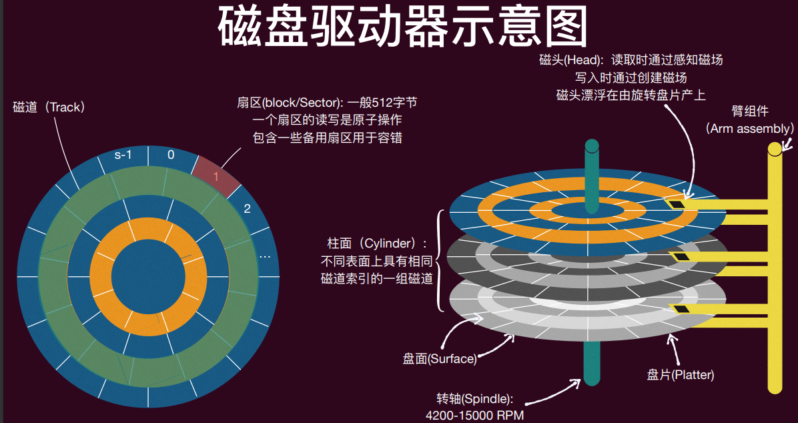

# 13. 设备管理

## 13.1 基本概念

1、通用I/O总线和多个外围总线用于连接设备

2、I/O 设备

- 块设备：以固定大小的块存储信息；传输单位为整个块
- 字符设备：传递或接受字符流；不可寻址，没有任何寻址操作

3、设备结构和接口：

- 设备由两个主要部分组成：硬件接口和内部结构。
- 硬件接口包括状态寄存器、命令寄存器和数据寄存器，用于与CPU进行交互。

4、CPU 与设备的通信方式

- **端口映射I/O**：使用专用的I/O指令（如x86架构中的`in`和`out`指令）进行通信，每个控制寄存器被分配一个I/O端口号。

- **内存映射I/O**：

  - 将控制寄存器映射到内存空间，通过内存地址进行访问。

  - 内存映射时需要注意缓存问题，以防止读取设备状态时缓存干扰。

5、设备状态的获取方式

- **轮询**：操作系统定期检查设备的状态寄存器，开销低但可能浪费CPU周期

- **中断**：设备在需要服务时生成中断，不会浪费CPU周期，但开销较高

6、数据传输控制方式

- **程序控制I/O**：

  - 由CPU直接控制，通过`in/out`或`load/store`指令传输数据。

  - 优点是硬件简单，易于编程，但消耗大量CPU周期。

- **直接内存访问（DMA）**：控制器可以直接访问内存和总线，在内存和设备之间传输数据，减少CPU的负担。

7、专用处理器和GPU加速

- **专用处理器**：

  - 例如，DMA控制器负责内存复制操作，GPU负责图形处理。

  - 专用处理器针对特定任务进行了优化，性能更高但不具备通用性。

- **GPU计算**：

  - GPU设计用于并行计算，最初用于图形处理，后来扩展到通用计算。

  - 例如，光线追踪和数组加法问题可以通过GPU并行加速。

## 13.2 硬件抽象

1、**硬件抽象**：

- 操作系统创建分层的存储视图，允许底层实现容易更改。
- 设备驱动程序负责管理I/O设备的代码，内核中的错误通常来源于设备驱动程序。

2、**设备抽象**：

- 设备驱动程序通常分为上半部分和下半部分。
- 上半部分处理系统调用，启动I/O操作；下半部分作为中断例程运行，处理输入或输出。

## 13.3 硬盘

### 磁盘

1、磁盘结构

2、地址模式
（1）传统上，磁盘地址采用C/H/S（Cylinder/Head/Sector）模式。
（2）现代磁盘使用逻辑块地址（LBA），以线性方式对扇区进行编号，从0开始。

#### 磁盘读写的步骤

1、磁头移动到适当的磁道： 寻道（seek）、稳定（settle）

2、启用适当的磁头

3、等待扇区出现在磁头下：旋转延迟（rotational latency）

4、读取/写入扇区：传输时间

磁盘访问时间：$T_{I/O} = T_{seek} + T_{rotation} + T_{transfer}$

磁盘传输速率：$R_{I/O}=\frac{Size_{transfer}}{T_{I/O}}$​

#### 缓存和优化

磁道偏移（Track Skew）：确保在跨越磁道边界时能够正确处理顺序读取

- 从一个磁道切换到另一个磁道时，磁盘需要时间重新定位磁头
- 如果没有这样的偏移，磁头会被移动到下一个磁道，但所需的下一个数据块已经旋转到磁头后面了（得重新转一圈才能读到）

多区域（Multi-Zoned） 磁盘驱动器： 外部磁道比内部磁道有更多的扇区

- 磁盘被组织成多个区域，每个区域是表面上一组连续的磁道
- 每个区域的每条磁道的扇区数相同

缓存（磁道缓冲区）：一些小容量的内存（8 到 16 MB），用于存储从磁盘读取或写入到磁盘的数据

- 读取扇区时，会读取该磁道上的所有扇区
- 写入时，有两种写入策略：当数据被放入缓存时（写回，write back）或数据实际写入磁盘后（直写，write through）才确认写入
- 缓冲区在磁盘的逻辑板上

#### 磁头调度

1. **先到先服务（FCFS）**：
   - 按照请求到达的顺序处理。
   - 优点是公平，但可能导致较长的寻道时间 。

2. **最短寻道时间优先（SSTF）**：
   - 优先处理与当前磁头位置最近的请求，最小化寻道时间。
   - 可能导致“饥饿”问题，即某些请求长时间得不到处理 。

3. **电梯算法（扫描算法 SCAN）**：
   - 磁头像电梯一样从磁盘一端移动到另一端，再反向移动，依次处理请求。
   - 改进版包括F-SCAN和C-SCAN，分别用于冻结队列和只单向扫描 。

4. **Shortest Positioning Time First (SPTF)**
   - 同时考虑寻道时间和旋转时间
   - 假设当前磁头位置在第30扇区（内轨），有两个请求需要处理：一个在第16扇区（中间），另一个在第8扇区（外轨）。
     - 如果寻道时间远高于旋转延迟，最短寻道时间优先（SSTF）会是一个好的选择，此时处理第16扇区的请求。
     - 但如果寻道速度比旋转快得多，那么处理第8扇区的请求会更优，因为这样总的定位时间（包括旋转延迟）更短。

2、**固态硬盘（SSD）**：

- SSD使用NAND闪存存储器，没有运动部件，消除了寻道和旋转延迟。
- SSD的控制器使用闪存转换层（FTL）和写时复制技术来管理数据，提高性能和耐用性。