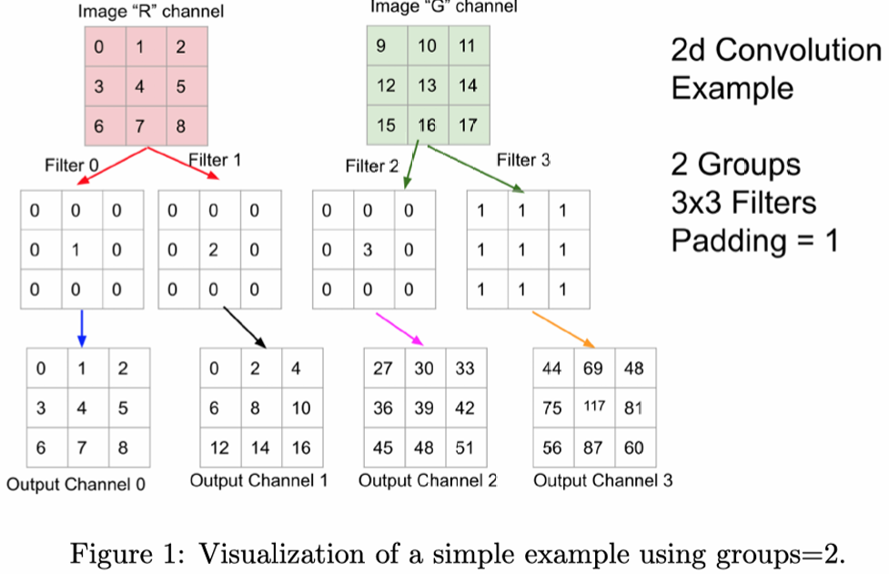
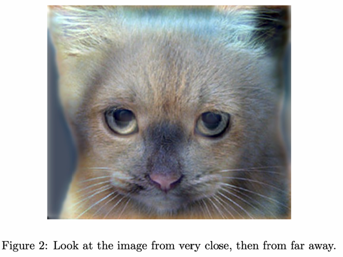
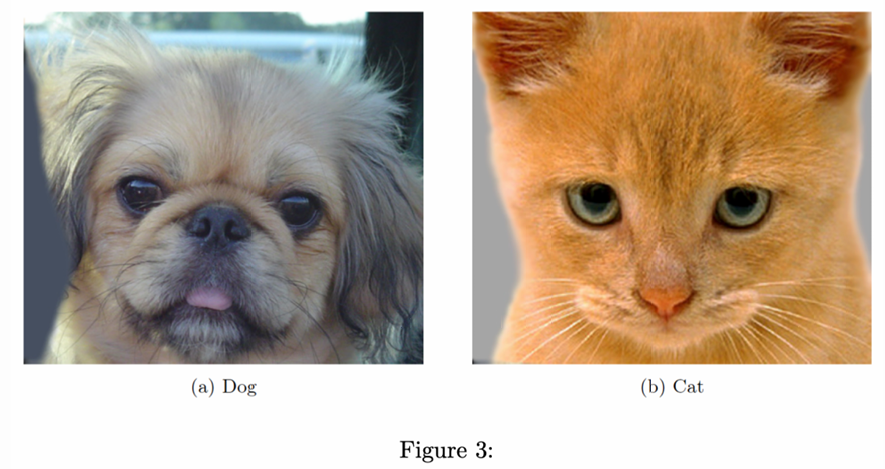
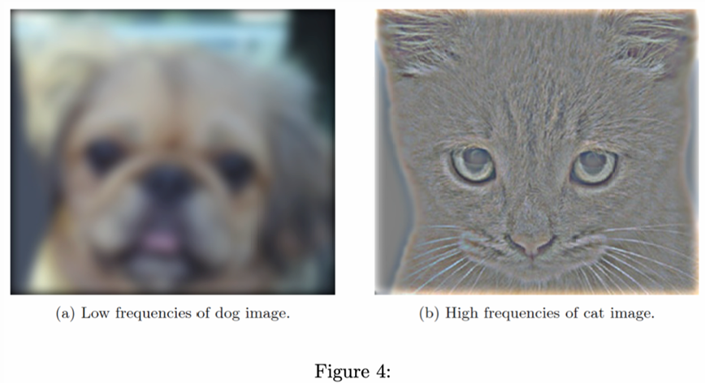
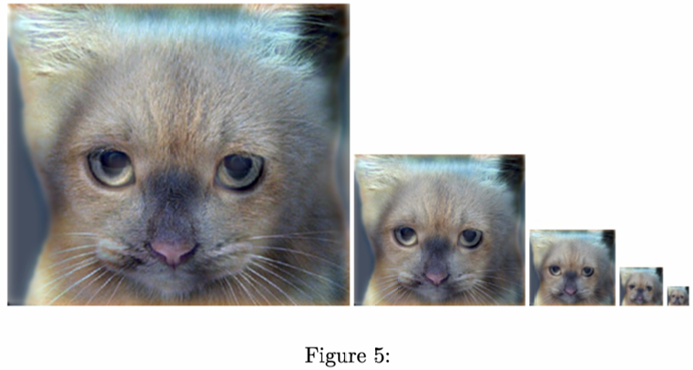

# 计算机视觉作业 1

## 提交要求

### 格式

1. 项目材料包括模板：proj1.zip。

2. 请使用提供的proj1_report.pptx模板撰写报告（回答所有问题），并将幻灯片转换为PDF格式提交。报告应包含您的姓名、学号和电子邮件地址。
3. 您应提供一个README文件来描述如何运行代码。
4. 将您的proj1_report.pdf、proj1_code和README.md打包成一个zip文件，以您的学号命名，如[学号].zip。
5. 注意，不应引入额外的Python包。不要在代码中使用绝对路径。像起始代码那样使用相对路径。

###  提交方式

1. 提交至指定链接 https://docs.qq.com/form/page/DVkxPa0ZZR01WRnN。
2. 截止时间：2025 年 4 月 20 日 23:59，逾期不候。

### 关于抄袭

严禁抄袭！我们对抄袭行为零容忍，将处以零分处罚。您可以参考他人的材料，但请做好引用标注，以便区分哪些部分实际上是您自己的成果。

### 评分标准  

我们主要根据您的代码和报告来评估您的提交。高效的实现、优雅的代码风格、简洁而有逻辑的报告都是获得高分的重要因素。

## 环境设置

1. 安装Anaconda。

2. 下载并解压项目起始代码。
  3. 使用适当的命令创建conda环境。在Windows上，打开已安装的"Conda prompt"来运行命令。在MacOS和Linux上，您可以直接使用终端窗口运行命令。根据您的操作系统（linux、mac或win）修改命令：`conda env create -f proj1_env_<OS>.yml`
4. 这将创建一个名为"cv_proj1"的环境。使用Windows命令 `activate cv_proj1` 或MacOS/Linux命令`conda activate cv_proj1`或`source activate cv_proj1`来激活它。
5. 在repo文件夹内运行pip install -e .来安装项目包。这对每个项目可能不是必需的，但在设置可能具有pip需求的新conda环境时是良好的实践。
6. 使用jupyter notebook `./proj1_code/proj1.ipynb`运行笔记本。
7. 实现所有函数后，通过在repo文件夹内运行`pytest proj1_unit_tests`来确保所有完整性检查都通过。
8. 完成项目后，为代码部分生成zip文件夹。

## 第 1 部分

### 1.1 高斯核

高斯滤波器用于模糊图像。您将首先实现create `Gaussian_kernel_1D()`，该函数根据两个参数创建1D高斯向量：核大小（1D向量的长度）和σ，高斯的标准差。该向量应包含在每个坐标处评估1D高斯概率密度函数的值。1D高斯定义为：
$$
p(x;\mu,\sigma^2)=\frac{1}{\sqrt{2\pi}\sigma}\exp{(-\frac{1}{2\sigma^2}(x-\mu)^2)}
$$
接下来，您将实现create `Gaussian_kernel_2D()`，它根据一个自由参数创建2维高斯核，截止频率，控制图像中保留多少低频。选择合适的截止频率值是项目后期创建混合图像的重要步骤。我们建议您通过将两个1D高斯的外积创建2D高斯核来实现create Gaussian_kernel_2D()，这已经在create Gaussian_kernel_1D()中实现。这是可能的，因为2D高斯滤波器是可分离的。多元高斯函数定义为：
$$
p(x;\mu,\Sigma)=\frac{1}{(2\pi)^{n/2}\det(\Sigma)^{1/2}}\exp{(-\frac{1}{2}(x-\mu)^\top\Sigma^{-1}(x-\mu))}
$$
其中$n$等于$x$的维度，$\mu$是平均坐标（高斯峰值所在位置），$\Sigma$是协方差矩阵。

您将使用截止频率的值来定义高斯核的大小、均值和方差。具体来说，核$G$的大小应为$(k; k)$，其中$k = 4 \times$截止频率 + 1，在$\mu = [2k]$处有峰值，标准差$\sigma =$截止频率，且值之和为1，即$\sum_{ij} G_{ij} = 1$。如果您的核之和不为1，您可以通过将每个值除以核的和来进行归一化处理。

### 1.2 图像滤波

图像滤波（或卷积）是基本的图像处理工具。参见Szeliski的第3.2章和讲座材料以了解图像滤波（特别是线性滤波）。您将编写自己的函数从头实现图像滤波。更具体地说，您将实现my_conv2d_numpy()，它模仿OpenCV库中的filter2D()函数。如part1.py中所指定，您的滤波算法必须：(1)支持灰度和彩色图像，(2)支持任意形状的滤波器，只要两个维度都是奇数（例如7×9滤波器，但不是4×5滤波器），(3)用零填充输入图像，以及(4)返回与输入图像相同分辨率的滤波图像。我们提供了一个iPython笔记本proj1.ipynb和一些单元测试（在笔记本中调用）来帮助您调试图像滤波算法。请注意，对my_conv2d_numpy()的单个调用有5分钟的时间限制，因此如果超时，请尝试优化您的实现。

在实现上述目标后，您可能会注意到滤波操作引入了黑色伪影（因为滤波窗口超出了图像边缘）。因此，您需要实现一个优化版本来解决这个问题。请自行研究和分析，并在报告中记录您的解决方案和讨论。

### 1.3 混合图像

混合图像是一个图像的低通滤波版本与另一个图像的高通滤波版本的和。如上所述，截止频率控制在一个图像中保留多少高频，在另一个图像中保留多少低频。在cutoff_frequencies.txt中，我们为每对图像提供了一个默认值7（第i行的值对应于第i对图像的截止频率值）。您应该用您发现对每对图像效果最好的值替换这些值。论文中建议使用两个截止频率（每个图像一个），您可以自由尝试。在起始代码中，通过改变用于构建混合图像的高斯滤波器的标准差来控制截止频率。您将首先根据part1.py中的起始代码实现create_hybrid_image()。您的函数将调用my_conv2d_numpy()，使用从create_Gaussian_kernel()生成的核来创建低频和高频图像，然后将它们组合成混合图像。

### 1.4 更多混合图像对

除了项目文件中已经提供的图像对（狗和猫等），还有许多其他图像可以组合创建混合图像。在本节中，您需要从日常生活或互联网中至少找到一对这样的图像来创建您自己的自定义混合图像。在您的报告中，请分析您认为哪些因素导致了不同图像对产生的结果差异。

## 第 2 部分

### 2.1 数据加载器

您现在将使用PyTorch再次实现创建混合图像。part2_datasets.py中的HybridImageDataset类将使用具有相应截止频率的图像对创建元组（您应该通过第一部分实验找到）。图像路径将从data/使用make_dataset()加载，截止频率将从cutoff_frequencies.txt使用get_cutoff_frequencies()加载。此外，您将实现__len__()，它返回图像对的数量，和__getitem__()，它返回第i个元组。有关数据加载和处理的更多信息，请参阅本教程。

### 2.2 模型

接下来，您将实现part2_models.py中的HybridImageModel类。与使用您实现的my_conv2d_numpy()从一对图像中获取低频和高频不同，low_pass()应使用torch.nn.functional中的2D卷积运算符对给定图像应用低通滤波器。

您必须实现get_kernel()，它为每对图像调用您从part1.py中的create_Gaussian_kernel()函数，使用cutoff_frequencies.txt中指定的截止频率，并将其重塑为PyTorch的适当维度。然后，类似于part1.py中的create_hybrid_image()，forward()将调用get_kernel()和low_pass()来创建低频和高频图像，并将它们组合成混合图像。有关使用PyTorch定义神经网络的更多信息，请参阅本教程。

您将比较第一部分和第二部分的混合图像实现的运行时间。

## 第 3 部分

您现在将使用与low_pass()中使用的相同torch.nn.functional中的2D卷积运算符在part3.py中实现my_conv2d_pytorch()。

在我们继续之前，这里有两个快速定义，我们在描述卷积时会经常使用：

1. 步幅（Stride）：当步幅为1时，我们每次将滤波器移动一个像素。当步幅为2（或不太常见的3或更多，尽管在实践中很少见）时，滤波器在我们滑动它们时每次跳转2个像素。
2. 填充（Padding）：当图像与核进行卷积时添加到图像中的像素量。填充可以帮助防止图像在卷积操作期间缩小。

与part1.py中的my_conv2d_numpy()不同，您的输出形状不一定必须与输入图像相同。相反，给定形状为$(1,d_{1},h_{1},w_{1})$的输入图像和形状为$(N,\frac{d_{1}}g,k,k)$的核，您的输出将是形状$(1,d_2,h_{2,}w_2)$，其中$g$是组数，$d_2=N,h_2=\frac{h_1-k+2\times p}s+1$和$w_2=\frac{w_1-k+2\times p}s+1$，$p$和$s$分别是填充和步幅。

思考为什么输出宽度$w_2$和输出高度$h_{2}$的方程是正确的 - 尝试画出一个$5\times5$的网格，看看在步幅为1时可以在网格内放置多少个$3\times3$的正方形。步幅为2时呢？您的发现是否符合方程所述？

我们通过一个简单示例展示了组参数值的效果，输入图像形状为(1, 2, 3, 3)，核形状为(4, 1, 3, 3)：

## 数据

我们为您提供了5对对齐的图像，可以合理地合并成混合图像。对齐非常重要，因为它影响感知分组（详见论文）。我们鼓励您创建其他示例（例如表情变化、不同对象之间的变形、随时间变化等）。

For the example shown below:

The two original images look like this:

The low-pass (blurred) and high-pass version of these images look like this (Figure 4):

The high frequency image in Figure 4b is actually zero-mean with negative values, so it is visualized by adding 0.5. In the resulting visualization, bright values are positive and dark values are negative.

Adding the high and low frequencies together (Figures 4b and 4a, respectively) gives you the image in Figure 2. If you’re having trouble seeing the multiple interpretations of the image, a useful way to visualize the effect is by progressively downsampling the hybrid image, as done in Figure 5. The starter code provides a function, vis_image_scales_numpy() in utils.py, which can be used to save and display such visualizations.

## 可能有用的NumPy函数

np.pad()，它可以为您进行多种图像填充，np.clip()，它"剪裁"数组中超出指定范围的任何值，np.sum()和np.multiply()，这使得在滤波器和图像窗口之间进行卷积（点积）变得高效。NumPy的文档可以在这里找到，或者通过Google搜索相关函数。

## 禁止使用的函数

（您可以用于测试，但不能在最终代码中使用）。任何直接为您处理滤波操作或创建2D高斯核的函数都是禁止的。如果您觉得这是在绕过工作，那么很可能是不允许的。

## 第 4 部分：频率压缩和图像滤波

### 1. 问题陈述

在这一部分中，您将探索使用傅里叶变换和低通滤波进行基于频率的压缩。您需要：

1. 实现具有不同保留比例（保留不同比例的低频）的基于频率的压缩。
2. 使用PSNR（峰值信噪比）评估重建图像的质量。

您可以使用numpy.fft，如numpy.fft.fft2、numpy.fft.ifft2和numpy.fft.fftshift。此外，常见的numpy操作包括np.log10、np.clip、np.abs、np.mean、np.square和np.sqrt等。

### 2. 背景

**频率压缩：**
 频率压缩涉及减少图像中高频信息的数量，这对应于细节和噪声。通过仅保留低频分量，我们可以在保留图像整体结构的同时实现数据压缩。

**低通滤波：**
 低通滤波器只允许低频通过，同时衰减或去除高频。

**评估指标：PSNR**
 PSNR（峰值信噪比）是广泛用于测量重建图像与原始图像相比质量的指标。它根据像素强度量化原始图像和重建图像之间的差异。较高的PSNR值表示更好的重建质量。然而，PSNR并不总是与人类对图像质量的感知完美相关，因为它只考虑像素级差异。
$$
\mathrm{PSNR}=10\cdot\log_{10}\left(\frac{\mathrm{MAX}^2}{\mathrm{MSE}}\right)
$$
其中：

- MAX = 最大像素值（例如，8位图像为255，16位图像为65535）。
- MSE = 原始图像和重建图像之间的均方误差。

### 3. 任务描述

**任务1：基于频率的压缩**

1. 使用2D傅里叶变换和低通滤波实现频率压缩。
2. 保留不同比例的低频（保留比例）：[0.1, 0.3, 0.5, 0.7]。
3. 使用逆傅里叶变换重建压缩图像。
4. 计算并报告每个保留比例的PSNR。

**任务2（讨论）：如何在保持质量的同时降低保留比例？**
 这是一个讨论问题。批判性地思考策略，以减少保留比例（即保留更少的频率分量），同时保持相似的视觉质量或实现相似的PSNR（峰值信噪比）。目标是提供想法，而不是完整的实现。