# 实验三 CNN网络实现

## 实验任务一： 图像卷积

### 互相关运算

如图中所示，考虑一个3x3矩阵作为输入张量，卷积核定义为一个2x2矩阵。

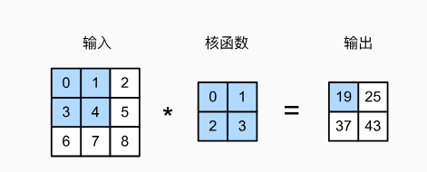

在二维互相关运算中，卷积窗口从输入张量的左上角开始，从左到右、从上到下滑动。 当卷积窗口滑动到新一个位置时，包含在该窗口中的部分张量与卷积核张量进行按元素相乘， 得到的张量再求和得到一个单一的标量值，由此我们得出了这一位置的输出张量值。 在如上例子中，输出张量的四个元素由二维互相关运算得到，这个输出高度为2、宽度为2

具体计算过程如下所示

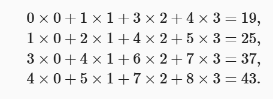

注意，输出大小略小于输入大小。这是因为卷积核的宽度和高度大于1， 而卷积核只与图像中 每个大小完全适合的位置进行互相关运算。给出如下计算公式计算输出矩阵的大小。

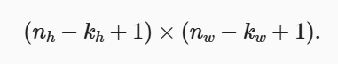

在之前图中例子中，输入为3x3张量，卷积核为2x2张量，那么输出张量形状则为(3-2+1)x (3-2+1)

接下来，我们在corr2d函数中实现如上过程，该函数接受输入张量X和卷积核张量K， 并返回输出张量Y

```python
import torch
from torch import nn

def corr2d(X, K):  #@save
    """计算二维互相关运算"""
    h, w = K.shape
    Y = torch.zeros((X.shape[0] - h + 1, X.shape[1] - w + 1))
    for i in range(Y.shape[0]):
        for j in range(Y.shape[1]):
            Y[i, j] = (X[i:i + h, j:j + w] * K).sum()
    return Y
```

测试

```python
X = torch.tensor([[0.0, 1.0, 2.0], [3.0, 4.0, 5.0], [6.0, 7.0, 8.0]])
K = torch.tensor([[0.0, 1.0], [2.0, 3.0]])
corr2d(X, K)
```

输出

```python
tensor([[19., 25.],
        [37., 43.]])
```

卷积层对输入和卷积核权重进行互相关运算，并在添加标量偏置之后产生输出。 所以， 卷积层中的两个被训练的参数是卷积核权重和标量偏置。 就像我们之前随机初始化全连接 层一样，在训练基于卷积层的模型时，我们也随机初始化卷积核权重。

基于上面定义的corr2d函数实现二维卷积层。在__init__构造函数中，将weight 和bias声明为两个模型参数。前向传播函数调用corr2d函数并添加偏置。

```python
class Conv2D(nn.Module):
    def __init__(self, kernel_size):
        super().__init__()
        self.weight = nn.Parameter(torch.rand(kernel_size))
        self.bias = nn.Parameter(torch.zeros(1))

    def forward(self, x):
        return corr2d(x, self.weight) + self.bias
```

### 填充和步幅

本节我们将介绍填充（padding）和步幅（stride）。假设以下情景： 有时，在应用了连续的卷积之后，我们最终得到的输出远小于输入大小。 这是由于卷积核的宽度和高度通常大于 所导致的。比如，一个240x240 像素的图像，经过10层 5x5的卷积后，将减少到200x200 像素。如此一来，原始图像的边界丢失了许多有用信息。 而填充是解决此问题最有效的方法； 有时，我们可能希望大幅降低图像的宽度和高度。例如， 如果我们发现原始的输入分辨率十分冗余。步幅则可以在这类情况下提供帮助。

#### 填充

如上所述，在应用多层卷积时，我们常常丢失边缘像素。 由于我们通常使用小卷积核， 因此对于任何单个卷积，我们可能只会丢失几个像素。 但随着我们应用许多连续卷积层， 累积丢失的像素数就多了。 解决这个问题的简单方法即为填充（padding）： 在输入图像的边界填充元素（通常填充元素是 0）。 例如，在下图中，我们将3x3输入填充到5x5，那么它的输出就增加为4x4 。 阴影部分是第一个输出元素以及用于输出计算的输入和核张量元素：0x0+0x1+0x2+0x3=0 。

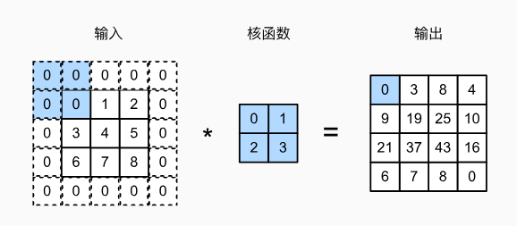

假设我们原张量形状为nxn，卷积核为kxk，我们在原张量的基础上填充A行，在原张量基础上 填充B列，那么在进行互相关运算后，得到的输出形状为(n+A-k+1)x(n+B-K+1), 在图中的例子中，输出初始是3x3，我们在填充了两行（上下各一行）以及两列，那么新的张量 为5x5， 通过运算后，得到形状为(5-2+1)x(5-2+1)

在下面的例子中，我们创建一个高度和宽度为3的二维卷积层，并在所有侧边填充1个像素。 给定高度和宽度为8的输入，则输出的高度和宽度也是8。

```python
import torch
from torch import nn


# 为了方便起见，我们定义了一个计算卷积层的函数。
# 此函数初始化卷积层权重，并对输入和输出提高和缩减相应的维数
def comp_conv2d(conv2d, X):
    # 这里的（1，1）表示批量大小和通道数都是1
    X = X.reshape((1, 1) + X.shape)
    Y = conv2d(X)
    # 省略前两个维度：批量大小和通道
    return Y.reshape(Y.shape[2:])

# 请注意，这里每边都填充了1行或1列，因此总共添加了2行或2列
conv2d = nn.Conv2d(1, 1, kernel_size=3, padding=1)
X = torch.rand(size=(8, 8))
comp_conv2d(conv2d, X).shape
```

输出是：

```python
torch.Size([8, 8])
```

#### 步幅

在计算互相关时，卷积窗口从输入张量的左上角开始，向下、向右滑动。 在前面的例子中 ，我们默认每次滑动一个元素。 但是，有时候为了高效计算或是缩减采样次数， 卷积窗口可以跳过中间位置，每次滑动多个元素。

我们将每次滑动元素的数量称为步幅（stride）。到目前为止，我们只使用过高度或 宽度为1 的步幅，那么如何使用较大的步幅呢？ 下图是垂直步幅为3 ，水平步幅为2 的二维互相关运算。 着色部分是输出元素以及用于输出计算的输入和内核张量元素：

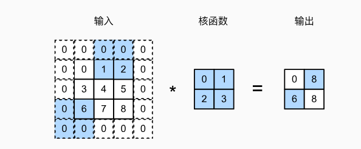

在这里给出输出形状的新计算公式：

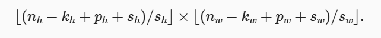

其中除法运算均向下取整。以图中举例，初始为3x3，填充2行2列，在水平方向步长为2 ，在竖直方向步长为3，那么有在水平方向有(3-2+2+2)/2=2(注意向下取整)，在竖直 方向(3-2+2+3)/3=2,最后输出为2x2

```python
conv2d = nn.Conv2d(1, 1, kernel_size=3, padding=1, stride=2)
comp_conv2d(conv2d, X).shape
```

输出：

```python
torch.Size([4, 4])

conv2d = nn.Conv2d(1, 1, kernel_size=(3, 5), padding=(0, 1), stride=(3, 4))
comp_conv2d(conv2d, X).shape
```

输出：

```python
torch.Size([2, 2])
```

### 多输入输出通道

彩色图像具有标准的RGB通道来代表红、绿和蓝。 但是到目前为止，我们仅展示了单个输入 和单个输出通道的简化例子。 这使得我们可以将输入、卷积核和输出看作二维张量。

当我们添加通道时，我们的输入和隐藏的表示都变成了三维张量。例如，每个RGB输入图像 具有3 x h x w 的形状。我们将这个大小为3的轴称为通道（channel）维度。 本节将更深入地研究具有多输入和多输出通道的卷积核。

#### 多输入通道

当输入包含多个通道时，需要构造一个与输入数据具有 相同输入通道数的卷积核，以便与输入数据进行互相关运算。

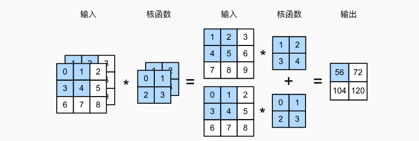

如图中所示，现在输入形状为2x3x3，即有两个通道，卷积核形状为2x2x2。 图中加深部分计算过程为：(1x1+2x2+4x3+5x4)+(0x0+1x1+3x2+4x3)=56

```python
import torch
from torch import nn

def corr2d(X, K):  #@save
    """计算二维互相关运算"""
    h, w = K.shape
    Y = torch.zeros((X.shape[0] - h + 1, X.shape[1] - w + 1))
    for i in range(Y.shape[0]):
        for j in range(Y.shape[1]):
            Y[i, j] = (X[i:i + h, j:j + w] * K).sum()
    return Y

import torch

def corr2d_multi_in(X, K):
    # 先遍历“X”和“K”的第0个维度（通道维度），再把它们加在一起
    return sum(corr2d(x, k) for x, k in zip(X, K))
```

构造与图中相同输入与卷积核

```python
X = torch.tensor([[[0.0, 1.0, 2.0], [3.0, 4.0, 5.0], [6.0, 7.0, 8.0]],
               [[1.0, 2.0, 3.0], [4.0, 5.0, 6.0], [7.0, 8.0, 9.0]]])
K = torch.tensor([[[0.0, 1.0], [2.0, 3.0]], [[1.0, 2.0], [3.0, 4.0]]])

corr2d_multi_in(X, K)
```

输出：

```python
tensor([[ 56.,  72.],
        [104., 120.]])
```

#### 多输出通道

到目前为止，不论有多少输入通道，我们还只有一个输出通道。在最流行的神经网络架构中 ，随着神经网络层数的加深， 我们常会增加输出通道的维数， 通过减少空间分辨率以获得更大的通道深度。

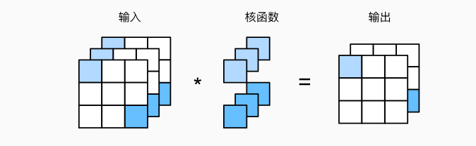

举例来说，如上图所示，输入形状为3x3x3，卷积核为3x1x1x2， 卷积核第一个维度表示3个输入通道,(注意，在实际应用中各个维度代表的含义根据例子 来决定)， 最后一个维度表示2个输出通道，输出形状为2x3x3

如下所示，我们实现一个计算多个通道的输出的互相关函数。

```python
def corr2d_multi_in_out(X, K):
    # 迭代“K”的第0个维度，每次都对输入“X”执行互相关运算。
    # 最后将所有结果都叠加在一起
    return torch.stack([corr2d_multi_in(X, k) for k in K], 0)

K = torch.stack((K, K + 1, K + 2), 0)
K.shape 
```

结果如下，在这里我们的输出通道放在第0维：

```python
torch.Size([3, 2, 2, 2])
```

下面，我们对输入张量X与卷积核张量K执行互相关运算。现在的输出包含3 个通道，

```python
X = torch.tensor([[[0.0, 1.0, 2.0], [3.0, 4.0, 5.0], [6.0, 7.0, 8.0]],
               [[1.0, 2.0, 3.0], [4.0, 5.0, 6.0], [7.0, 8.0, 9.0]]])
corr2d_multi_in_out(X, K)
tensor([[[ 56.,  72.],
         [104., 120.]],

        [[ 76., 100.],
         [148., 172.]],

        [[ 96., 128.],
         [192., 224.]]])
```

### 汇聚层

通常当我们处理图像时，我们希望逐渐降低隐藏表示的空间分辨率、聚集信息， 这样随着我们在神经网络中层叠的上升，每个神经元对其敏感的感受野（输入）就越大。

本节将介绍汇聚（pooling）层，它具有双重目的： 降低卷积层对位置的敏感性，同时降低对空间降采样表示的敏感性。

#### 最大汇聚层和平均汇聚层

与卷积层类似，汇聚层运算符由一个固定形状的窗口组成，该窗口根据其步幅大小在输入的 所有区域上滑动，为固定形状窗口（有时称为汇聚窗口）遍历的每个位置计算一个输出。 然而，不同于卷积层中的输入与卷积核之间的互相关计算，汇聚层不包含参数。 相反，池运算是确定性的，我们通常计算汇聚窗口中所有元素的最大值或平均值。 这些操作分别称为最大汇聚层（maximum pooling）和平均汇聚层（average pooling）。

在这两种情况下，与互相关运算符一样， 汇聚窗口从输入张量的左上角开始，从左往右、从上往下的在输入张量内滑动。 在汇聚窗口到达的每个位置，它计算该窗口中输入子张量的最大值或平均值。 计算最大值或平均值是取决于使用了最大汇聚层还是平均汇聚层。

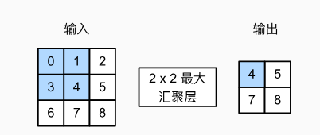

图中的输出张量的高度为2，宽度为2 。这四个元素为每个汇聚窗口中的最大值：

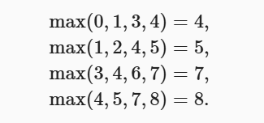

在下面的代码中的pool2d函数，我们实现汇聚层的前向传播。 然而，这里我们没有卷积核，输出为输入中每个区域的最大值或平均值。

```python
import torch
from torch import nn

def pool2d(X, pool_size, mode='max'):
    p_h, p_w = pool_size
    Y = torch.zeros((X.shape[0] - p_h + 1, X.shape[1] - p_w + 1))
    for i in range(Y.shape[0]):
        for j in range(Y.shape[1]):
            if mode == 'max':
                Y[i, j] = X[i: i + p_h, j: j + p_w].max()
            elif mode == 'avg':
                Y[i, j] = X[i: i + p_h, j: j + p_w].mean()
    return Y
```

构造输入：

```python
X = torch.tensor([[0.0, 1.0, 2.0], [3.0, 4.0, 5.0], [6.0, 7.0, 8.0]])
pool2d(X, (2, 2))
```

输出为：

```python
tensor([[4., 5.],
        [7., 8.]])
```

此外，我们还可以验证平均汇聚层。

```python
pool2d(X, (2, 2), 'avg')
tensor([[2., 3.],
        [5., 6.]])
```

#### 汇聚层填充与步幅

与卷积层一样，汇聚层也可以改变输出形状。和以前一样， 我们可以通过填充和步幅以获得所需的输出形状。 下面，我们用深度学习框架中内置的二维最大汇聚层， 来演示汇聚层中填充和步幅的使用。 我们首先构造了一个输入张量X，它有四个维度，其中样本数和通道数都是1。

```python
X = torch.arange(16, dtype=torch.float32).reshape((1, 1, 4, 4))
X
tensor([[[[ 0.,  1.,  2.,  3.],
          [ 4.,  5.,  6.,  7.],
          [ 8.,  9., 10., 11.],
          [12., 13., 14., 15.]]]])
```

默认情况下，深度学习框架中的步幅与汇聚窗口的大小相同。 因此，如果我们使用形状为(3, 3)的汇聚窗口， 那么默认情况下，我们得到的步幅形状为(3, 3)。

```python
pool2d = nn.MaxPool2d(3)
pool2d(X)

tensor([[[[10.]]]])
```

#### 多个通道

在处理多通道输入数据时，汇聚层在每个输入通道上单独运算， 而不是像卷积层一样在通道上对输入进行汇总。 这意味着汇聚层的输出通道数与输入通道数相同。 下面，我们将在通道维度上连结张量X和X + 1，以构建具有2个通道的输入。

```python
X = torch.cat((X, X + 1), 1)
X

tensor([[[[ 0.,  1.,  2.,  3.],
          [ 4.,  5.,  6.,  7.],
          [ 8.,  9., 10., 11.],
          [12., 13., 14., 15.]],

         [[ 1.,  2.,  3.,  4.],
          [ 5.,  6.,  7.,  8.],
          [ 9., 10., 11., 12.],
          [13., 14., 15., 16.]]]])
```

如下所示，汇聚后输出通道的数量仍然是2。

```python
pool2d = nn.MaxPool2d(3, padding=1, stride=2)
pool2d(X)

tensor([[[[ 5.,  7.],
          [13., 15.]],

         [[ 6.,  8.],
          [14., 16.]]]])
```


### 练习 图像中目标的边缘检测

如下是卷积层的一个简单应用：通过找到像素变化的位置，来检测图像中不同颜色的边缘。 首先，我们构造一个 6x8像素的黑白图像。中间四列为黑色（0），其余像素为白色（1）。

```python
import torch
from torch import nn
X = torch.ones((6, 8))
X[:, 2:6] = 0
X

tensor([[1., 1., 0., 0., 0., 0., 1., 1.],
        [1., 1., 0., 0., 0., 0., 1., 1.],
        [1., 1., 0., 0., 0., 0., 1., 1.],
        [1., 1., 0., 0., 0., 0., 1., 1.],
        [1., 1., 0., 0., 0., 0., 1., 1.],
        [1., 1., 0., 0., 0., 0., 1., 1.]])
```

接下来，我们构造一个高度为1、宽度为2的卷积核K。当进行互相关运算时， 如果水平相邻的两元素相同，则输出为零，否则输出为非零。

```python
K = torch.tensor([[1.0, -1.0]])

def corr2d(X, K):  #@save
    """计算二维互相关运算"""
    h, w = K.shape
    Y = torch.zeros((X.shape[0] - h + 1, X.shape[1] - w + 1))
    for i in range(Y.shape[0]):
        for j in range(Y.shape[1]):
            Y[i, j] = (X[i:i + h, j:j + w] * K).sum()
    return Y
Y = corr2d(X, K)
Y
```

输出为：

```
tensor([[ 0.,  1.,  0.,  0.,  0., -1.,  0.],
        [ 0.,  1.,  0.,  0.,  0., -1.,  0.],
        [ 0.,  1.,  0.,  0.,  0., -1.,  0.],
        [ 0.,  1.,  0.,  0.,  0., -1.,  0.],
        [ 0.,  1.,  0.,  0.,  0., -1.,  0.],
        [ 0.,  1.,  0.,  0.,  0., -1.,  0.]])
```

现在我们将输入的二维图像转置，再进行如上的互相关运算。 其输出如下，之前检测到的垂直边缘消失了。 不出所料，这个卷积核K只可以检测垂直边缘，无法检测水平边缘。

```
corr2d(X.t(), K)
```

输出：

~~~python
tensor([[0., 0., 0., 0., 0.],
        [0., 0., 0., 0., 0.],
        [0., 0., 0., 0., 0.],
        [0., 0., 0., 0., 0.],
        [0., 0., 0., 0., 0.],
        [0., 0., 0., 0., 0.],
        [0., 0., 0., 0., 0.],
        [0., 0., 0., 0., 0.]])
````
1.请使用Conv2D类,补全训练部分代码，
使得训练得到的卷积核参数接近torch.tensor([[1.0, -1.0]])
```bash
class Conv2D(nn.Module):
    def __init__(self, kernel_size):
        super().__init__()
        self.weight = nn.Parameter(torch.rand(kernel_size))
        self.bias = nn.Parameter(torch.zeros(1))

    def forward(self, x):
        return corr2d(x, self.weight) + self.bias

# 构造一个二维卷积层，它具有1个输出通道和形状为（1，2）的卷积核
conv2d = nn.Conv2d(1,1, kernel_size=(1, 2), bias=False)

# 这个二维卷积层使用四维输入和输出格式（批量大小、通道、高度、宽度），
# 其中批量大小和通道数都为1
X = X.reshape((1, 1, 6, 8))#
Y = Y.reshape((1, 1, 6, 7))#标签

#训练补全部分(自定义损失函数，训练epoch，学习率等)
#TODO：for循环epoch次
#TODO：前向传播
#TODO：计算损失
#TODO: 清除梯度
#TODO: 反向传播
#TODO: 更新参数

conv2d.weight.data.reshape((1, 2))
#要求此输出接近torch.tensor([[1.0, -1.0]])，
# 如tensor([[ 0.9997, -0.9810]])
~~~

# 实验任务二：使用CNN来进行图像分类

## CIFAR-10 数据集

本次实验使用CIFAR-10 数据集来进行实验。 CIFAR-10 数据集包含 60,000 张 32×32 像素的彩色图像， 分为 10 个类别，每个类别有 6,000 张图像。 具体类别包括飞机、汽车、鸟、猫、鹿、狗、青蛙、马、船和卡车。 数据集被分为训练集和测试集， 其中训练集包含 50,000 张图像，测试集包含 10,000 张图像。

### 1. CNN图像分类任务

本次任务要求补全代码中空缺部分，包括实现一个CNN类，以及训练过程代码

数据集下载链接：https://box.nju.edu.cn/f/d59d5d910d754c3091f5/

```python
import torchvision.transforms as transforms
from torchvision import datasets
import torchvision
import torch.nn.functional as F
import torch
import torch.nn as nn
import torch.optim as optim

import matplotlib.pyplot as plt
import numpy as np
from PIL import Image
import os
```

导入CIFAR-10数据集：

```python
transform = transforms.Compose([
    transforms.ToTensor(),
    transforms.Normalize((0.5, 0.5, 0.5), (0.5, 0.5, 0.5))
])

# 下载并加载训练集
trainset = torchvision.datasets.CIFAR10(
    root='./data',
    train=True,
    download=True,
    transform=transform
)

# 创建数据加载器
trainloader = torch.utils.data.DataLoader(
    trainset,
    batch_size=32,
    shuffle=True
)
testset = torchvision.datasets.CIFAR10(
    root='./data',
    train=False,
    download=True,
    transform=transform
)

testloader = torch.utils.data.DataLoader(
    testset,
    batch_size=32,
    shuffle=False
)
```

定义CNN网络：

```python
class SimpleCNN(nn.Module):
    def __init__(self):
        super(SimpleCNN, self).__init__()
        #TODO: 实现模型结构
        #TODO 实现self.conv1:卷积层
        #TODO 实现self.conv2:卷积层
        #TODO 实现self.pool: MaxPool2d
        #TODO 实现self.fc1: 线性层
        #TODO 实现self.fc2：线性层
        #TODO 实现 self.dropout: Dropout层

    def forward(self, x):
        x = self.pool(F.relu(self.conv1(x)))
        x = self.pool(F.relu(self.conv2(x)))
        x = x.view(-1, 64 * 8 * 8)
        x = F.relu(self.fc1(x))
        x = self.dropout(x)
        x = self.fc2(x)

        return x
```

训练函数：

```python
def train(model, train_loader, test_loader, device):
    num_epochs = 15
    criterion = nn.CrossEntropyLoss()
    optimizer = optim.Adam(model.parameters(), lr=0.001)

    for epoch in range(num_epochs):
        model.train()
        running_loss = 0.0
        for i, (inputs, labels) in enumerate(train_loader):
            inputs, labels = inputs.to(device), labels.to(device)
            #TODO:实现训练部分，完成反向传播过程
            #TODO: optimizer梯度清除
            #TODO: 模型输入
            #TODO: 计算损失
            #TODO: 反向传播
            #TODO: 更新参数

            running_loss += loss.item()
            if i % 100 == 99:  # 每100个batch打印一次损失
                print(
                    f'Epoch [{epoch + 1}/{num_epochs}], Step [{i + 1}/{len(train_loader)}], Loss: {running_loss / 100:.4f}')
                running_loss = 0.0

        # 每个epoch结束后在测试集上评估模型
        model.eval()
        correct = 0
        total = 0
        with torch.no_grad():
            for inputs, labels in test_loader:
                inputs, labels = inputs.to(device), labels.to(device)
                outputs = model(inputs)
                _, predicted = torch.max(outputs.data, 1)
                total += labels.size(0)
                correct += (predicted == labels).sum().item()

        print(f'Test Accuracy: {100 * correct / total:.2f}%')
        
device = torch.device("cuda" if torch.cuda.is_available() else "cpu")
#创建模型
model = SimpleCNN().to(device)
train(model, trainloader, testloader, device)

def denormalize(tensor):
    # 输入是归一化后的张量 [C, H, W]
    # 反归一化：(tensor * std) + mean
    # 原始归一化参数：mean=0.5, std=0.5
    return tensor * 0.5 + 0.5

data_iter = iter(trainloader)
images, labels = next(data_iter)  # 获取第一个batch

# 反归一化并转换为numpy
img = denormalize(images[0]).numpy()  # 取batch中的第一张
img = np.transpose(img, (1, 2, 0))    # 从(C, H, W)转为(H, W, C)

# 显示图像
plt.imshow(img)
plt.title(f"Label: {trainset.classes[labels[0]]}")
plt.axis('off')
plt.show()
```

### 2. 在MNIST数据集上实现CNN：

TODO: 在实验二中我们实现了在MNIST数据集上进行分类， 使用本节的CNN又该如何实现，结合本节内容以及实验二内容尝试实现

### 3. 卷积神经网络（LeNet）

本节将介绍LeNet，它是最早发布的卷积神经网络之一， 因其在计算机视觉任务中的高效性能而受到广泛关注。 这个模型是由AT&T贝尔实验室的研究员Yann LeCun在1989年提出的（并以其命名）， 目的是识别图像 (LeCun et al., 1998)中的手写数字。 当时，Yann LeCun发表了第一篇通过反向传播成功训练卷积神经网络的研究， 这项工作代表了十多年来神经网络研究开发的成果。

我们对原始模型做了一点小改动，去掉了最后一层的高斯激活。除此之外，这个网络与最初的LeNet-5一致。

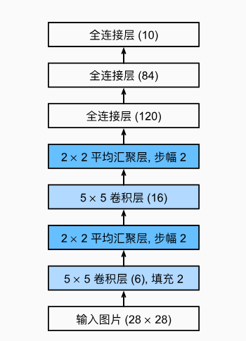

以下是通过实例化一个Sequential来实现LeNet代码.

```python
import torch
from torch import nn
from d2l import torch as d2l

net = nn.Sequential(
    nn.Conv2d(1, 6, kernel_size=5, padding=2), nn.Sigmoid(),
    nn.AvgPool2d(kernel_size=2, stride=2),
    nn.Conv2d(6, 16, kernel_size=5), nn.Sigmoid(),
    nn.AvgPool2d(kernel_size=2, stride=2),
    nn.Flatten(),
    nn.Linear(16 * 5 * 5, 120), nn.Sigmoid(),
    nn.Linear(120, 84), nn.Sigmoid(),
    nn.Linear(84, 10))
```

下面，我们将一个大小为28x28 的单通道（黑白）图像通过LeNet。 通过在每一层打印输出的形状，我们可以检查模型，以确保其操作与我们期望的图中一致

```python
X = torch.rand(size=(1, 1, 28, 28), dtype=torch.float32)
for layer in net:
    X = layer(X)
    print(layer.__class__.__name__,'output shape: \t',X.shape)
```

输出为：

```python
Conv2d output shape:         torch.Size([1, 6, 28, 28])
Sigmoid output shape:        torch.Size([1, 6, 28, 28])
AvgPool2d output shape:      torch.Size([1, 6, 14, 14])
Conv2d output shape:         torch.Size([1, 16, 10, 10])
Sigmoid output shape:        torch.Size([1, 16, 10, 10])
AvgPool2d output shape:      torch.Size([1, 16, 5, 5])
Flatten output shape:        torch.Size([1, 400])
Linear output shape:         torch.Size([1, 120])
Sigmoid output shape:        torch.Size([1, 120])
Linear output shape:         torch.Size([1, 84])
Sigmoid output shape:        torch.Size([1, 84])
Linear output shape:         torch.Size([1, 10])
```

TODO: 结合图片中所给出的LeNet以及给出的nn.Sequential，将前文给出的net结构以类的方式实现，并实现在 MNIST数据集上的分类

### 4. 批量规范化

训练深层神经网络是十分困难的，特别是在较短的时间内使他们收敛更加棘手。 本节将介绍批量规范化（batch normalization） (Ioffe and Szegedy, 2015)， 这是一种流行且有效的技术，可持续加速深层网络的收敛速度。

为什么需要批量规范化层呢？让我们来回顾一下训练神经网络时出现的一些实际挑战。

首先，数据预处理的方式通常会对最终结果产生巨大影响。
使用真实数据时，我们的第一步是标准化输入特征，使其平均值为0，方差为1。 直观地说，这种标准化可以很好地与我们的优化器配合使用，因为它可以将参数的量级进行统一。

第二，对于典型的多层感知机或卷积神经网络。当我们训练时，中间层中的变量（ 例如，多层感知机中的仿射变换输出） 可能具有更广的变化范围：不论是沿着从输入到输出的层，跨同一层中的单元， 或是随着时间的推移，模型参数的随着训练更新变幻莫测。 批量规范化的发明者非正式地假设， 这些变量分布中的这种偏移可能会阻碍网络的收敛。 直观地说，我们可能会猜想，如果一个层的可变值是另一层的100倍，这可能需要对学习率进行补偿调整。

第三，更深层的网络很复杂，容易过拟合。 这意味着正则化变得更加重要。

批量规范化应用于单个可选层（也可以应用到所有层），其原理如下：在每次训练迭代中， 我们首先规范化输入，即通过减去其均值并除以其标准差，其中两者均基于当前小批量处理。 接下来，我们应用比例系数和比例偏移。 正是由于这个基于批量统计的标准化，才有了批量规范化的名称。

请注意，如果我们尝试使用大小为1的小批量应用批量规范化，我们将无法学到任何东西。 这是因为在减去均值之后，每个隐藏单元将为0。 所以， 只有使用足够大的小批量，批量规范化这种方法才是有效且稳定的。 请注意，在应用批量规范化时，批量大小的选择可能比没有批量规范化时更重要。

从形式上来说如图所示：

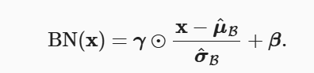

通过对数据减去均值再除以方差获得，由于单位方差（与其他一些魔法数）是一个主观的选择， 因此我们通常包含拉伸参数（scale）γ 和偏移参数（shift）β ，它们的形状与x 相同。 请注意，γ和β 是需要与其他模型参数一起学习的参数。 同时γ和β可以安装如下给出

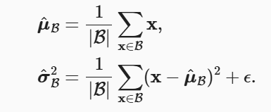

#### 批量规范化层

回想一下，批量规范化和其他层之间的一个关键区别是，由于批量规范化在完整的小批量上运行， 因此我们不能像以前在引入其他层时那样忽略批量大小。 我们在下面讨论这两种情况：全连接层和卷积层，他们的批量规范化实现略有不同。

##### 全连接层

通常，我们将批量规范化层置于全连接层中的仿射变换和激活函数之间。 使用批量规范化的全连接层的输出的计算详情如下

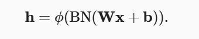

##### 卷积层

同样，对于卷积层，我们可以在卷积层之后和非线性激活函数之前应用批量规范化。 当卷积有多个输出通道时，我们需要对这些通道的“每个”输出执行批量规范化， 每个通道都有自己的拉伸（scale）和偏移（shift）参数，这两个参数都是标量。

##### 预测过程中的批量规范化

正如我们前面提到的，批量规范化在训练模式和预测模式下的行为通常不同。 首先，将训练好的模型用于预测时，我们不再需要样本均值中的噪声以及在微批次上估计每个小批次产生的 样本方差了。 其次，例如，我们可能需要使用我们的模型对逐个样本进行预测。 一种常用的方法是通过移动平均估算整个训练数据集的样本均值和方差，并在预测时使用它们得到确定的输出。 可见，和暂退法一样，批量规范化层在训练模式和预测模式下的计算结果也是不一样的。

#### 从零实现

```python
import torch
from torch import nn
from d2l import torch as d2l


def batch_norm(X, gamma, beta, moving_mean, moving_var, eps, momentum):
    # 通过is_grad_enabled来判断当前模式是训练模式还是预测模式
    if not torch.is_grad_enabled():
        # 如果是在预测模式下，直接使用传入的移动平均所得的均值和方差
        X_hat = (X - moving_mean) / torch.sqrt(moving_var + eps)
    else:
        assert len(X.shape) in (2, 4)
        if len(X.shape) == 2:
            # 使用全连接层的情况，计算特征维上的均值和方差
            mean = X.mean(dim=0)
            var = ((X - mean) ** 2).mean(dim=0)
        else:
            # 使用二维卷积层的情况，计算通道维上（axis=1）的均值和方差。
            # 这里我们需要保持X的形状以便后面可以做广播运算
            mean = X.mean(dim=(0, 2, 3), keepdim=True)
            var = ((X - mean) ** 2).mean(dim=(0, 2, 3), keepdim=True)
        # 训练模式下，用当前的均值和方差做标准化
        X_hat = (X - mean) / torch.sqrt(var + eps)
        # 更新移动平均的均值和方差
        moving_mean = momentum * moving_mean + (1.0 - momentum) * mean
        moving_var = momentum * moving_var + (1.0 - momentum) * var
    Y = gamma * X_hat + beta  # 缩放和移位
    return Y, moving_mean.data, moving_var.data

class BatchNorm(nn.Module):
    # num_features：完全连接层的输出数量或卷积层的输出通道数。
    # num_dims：2表示完全连接层，4表示卷积层
    def __init__(self, num_features, num_dims):
        super().__init__()
        if num_dims == 2:
            shape = (1, num_features)
        else:
            shape = (1, num_features, 1, 1)
        # 参与求梯度和迭代的拉伸和偏移参数，分别初始化成1和0
        self.gamma = nn.Parameter(torch.ones(shape))
        self.beta = nn.Parameter(torch.zeros(shape))
        # 非模型参数的变量初始化为0和1
        self.moving_mean = torch.zeros(shape)
        self.moving_var = torch.ones(shape)

    def forward(self, X):
        # 如果X不在内存上，将moving_mean和moving_var
        # 复制到X所在显存上
        if self.moving_mean.device != X.device:
            self.moving_mean = self.moving_mean.to(X.device)
            self.moving_var = self.moving_var.to(X.device)
        # 保存更新过的moving_mean和moving_var
        Y, self.moving_mean, self.moving_var = batch_norm(
            X, self.gamma, self.beta, self.moving_mean,
            self.moving_var, eps=1e-5, momentum=0.9)
        return Y
```

为了更好理解如何应用BatchNorm，下面我们将其应用于LeNet模型 回想一下，批量规范化是在卷积层或全连接层之后、相应的激活函数之前应用的.

```python
net = nn.Sequential(
    nn.Conv2d(1, 6, kernel_size=5), BatchNorm(6, num_dims=4), nn.Sigmoid(),
    nn.AvgPool2d(kernel_size=2, stride=2),
    nn.Conv2d(6, 16, kernel_size=5), BatchNorm(16, num_dims=4), nn.Sigmoid(),
    nn.AvgPool2d(kernel_size=2, stride=2), nn.Flatten(),
    nn.Linear(16*4*4, 120), BatchNorm(120, num_dims=2), nn.Sigmoid(),
    nn.Linear(120, 84), BatchNorm(84, num_dims=2), nn.Sigmoid(),
    nn.Linear(84, 10))
```

#### 简单实现

除了使用我们刚刚定义的BatchNorm，我们也可以直接使用深度学习框架中定义的BatchNorm。 该代码看起来几乎与我们上面的代码相同。

```python
net = nn.Sequential(
    nn.Conv2d(1, 6, kernel_size=5), nn.BatchNorm2d(6), nn.Sigmoid(),
    nn.AvgPool2d(kernel_size=2, stride=2),
    nn.Conv2d(6, 16, kernel_size=5), nn.BatchNorm2d(16), nn.Sigmoid(),
    nn.AvgPool2d(kernel_size=2, stride=2), nn.Flatten(),
    nn.Linear(256, 120), nn.BatchNorm1d(120), nn.Sigmoid(),
    nn.Linear(120, 84), nn.BatchNorm1d(84), nn.Sigmoid(),
    nn.Linear(84, 10))
```

TODO: 使用上述定义的包含BatchNorm的LeNet网络， 实现在MNIST数据集上的图像分类(直接使用nn.Sequential或者自定义类均可)