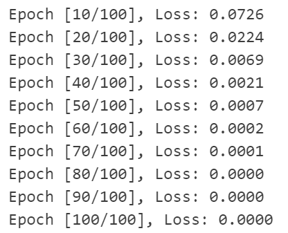
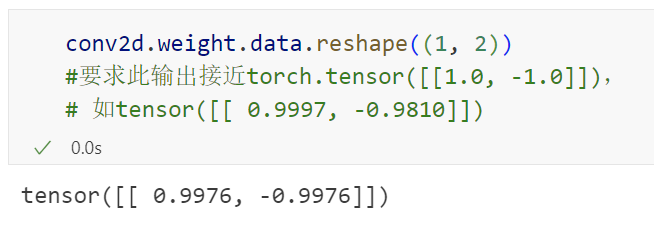
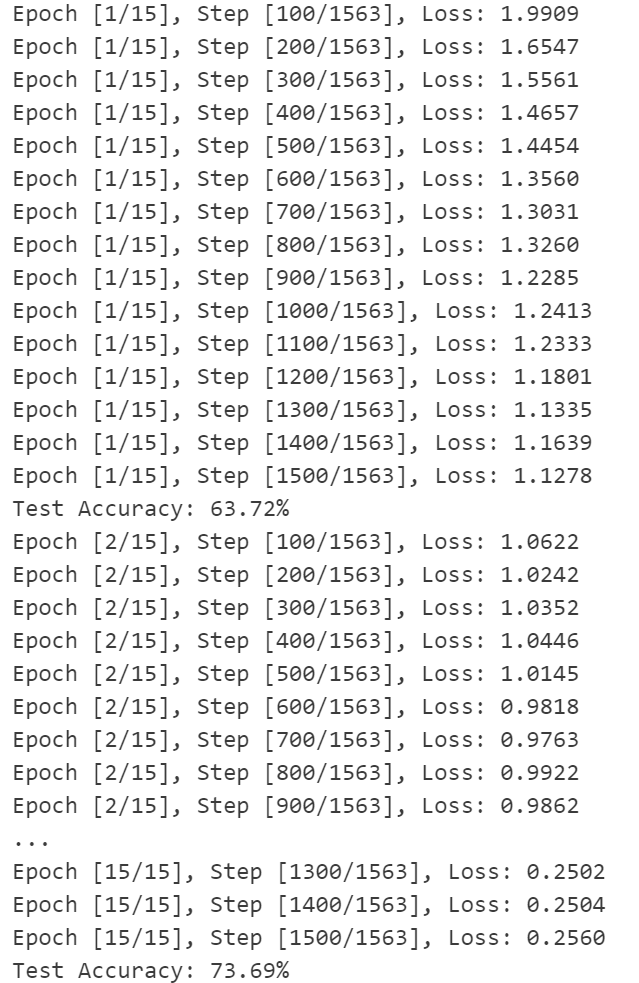
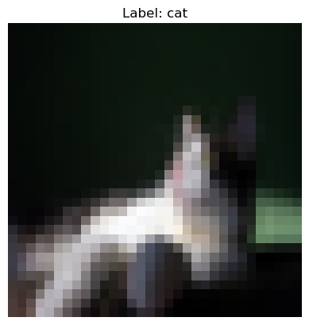
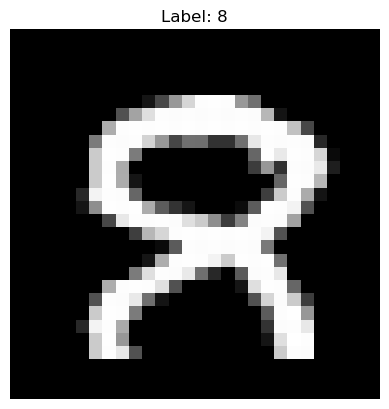
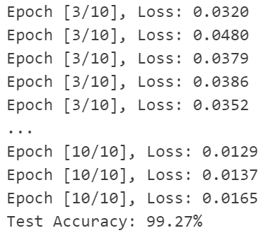
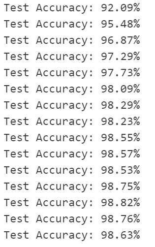
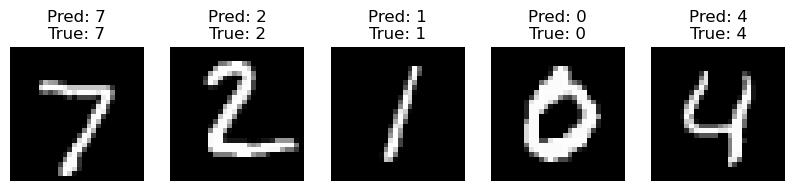
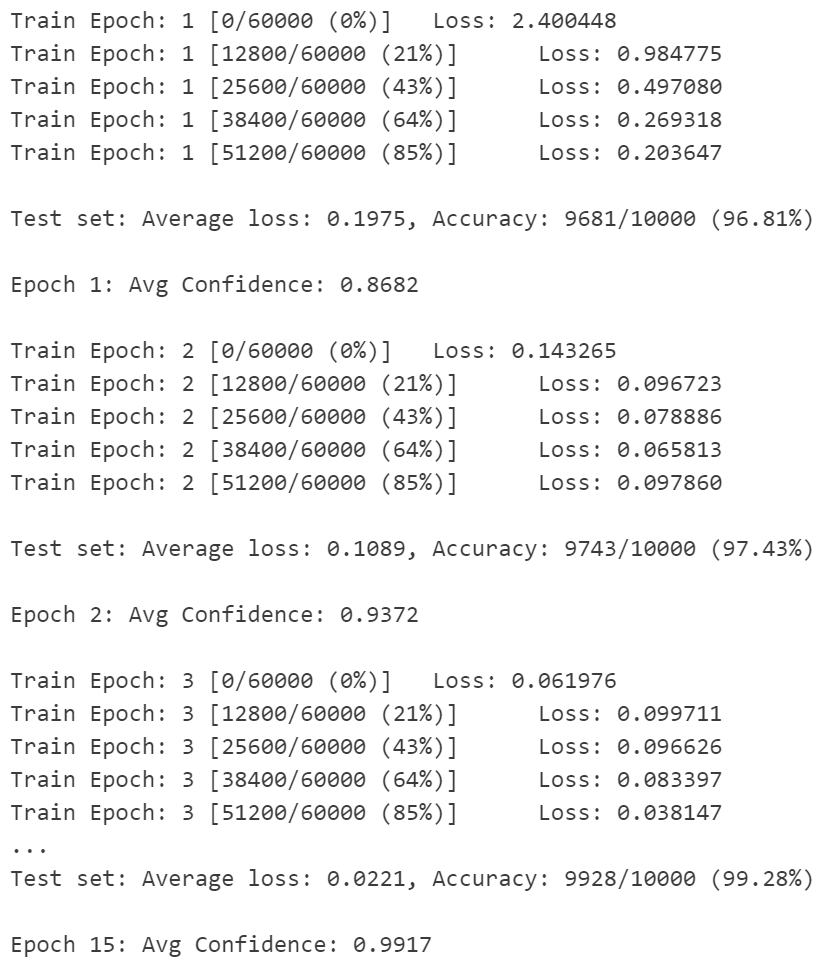
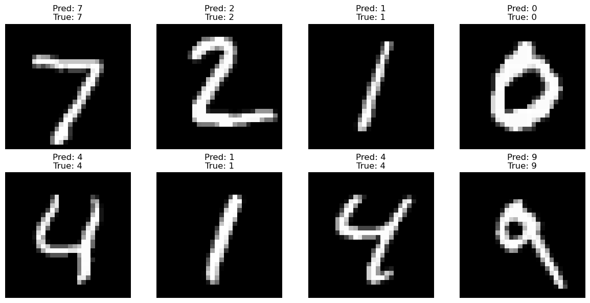

# 实验三 卷积神经网络

## 1. 实验任务一： 图像卷积

**练习：图像中目标的边缘检测**

```python
# 构造一个二维卷积层，它具有1个输出通道和形状为（1，2）的卷积核
conv2d = nn.Conv2d(1,1, kernel_size=(1, 2), bias=False)

# 这个二维卷积层使用四维输入和输出格式（批量大小、通道、高度、宽度），
# 其中批量大小和通道数都为1
X = X.reshape((1, 1, 6, 8))
Y = Y.reshape((1, 1, 6, 7))

#训练补全部分(自定义损失函数，训练epoch，学习率等)
loss_fn = nn.MSELoss()

optimizer = torch.optim.SGD(conv2d.parameters(), lr=0.2)

epochs = 100
for epoch in range(epochs):
    Y_hat = conv2d(X)
    loss = loss_fn(Y_hat, Y)
    
    optimizer.zero_grad()
    loss.backward()
    optimizer.step()

    if (epoch + 1) % 10 == 0:
        print(f'Epoch [{epoch+1}/{epochs}], Loss: {loss.item():.4f}')
```

|  |  |
| ------------------------------------------------------------ | ------------------------------------------------------------ |


## 2. 实验任务二：使用 CNN 来进行图像分类

### 2.1 在 CIFAR 数据集上实现 CNN

**定义 CNN 网络：**

```python
class SimpleCNN(nn.Module):
    def __init__(self):
        super(SimpleCNN, self).__init__()
        self.conv1 = nn.Conv2d(3, 32, 3, padding=1)  # 输入通道3，输出通道32，3x3卷积，填充1
        self.conv2 = nn.Conv2d(32, 64, 3, padding=1) # 输入通道32，输出通道64，3x3卷积，填充1
        self.pool = nn.MaxPool2d(2, 2)              # 2x2最大池化，步长2
        self.fc1 = nn.Linear(64 * 8 * 8, 512)       # 全连接层，输入64 * 8 * 8=4096，输出512
        self.fc2 = nn.Linear(512, 10)               # 全连接层，输入512，输出10（对应10类）
        self.dropout = nn.Dropout(0.5)              # Dropout层，丢弃概率0.5

    def forward(self, x):
        x = self.pool(F.relu(self.conv1(x)))
        x = self.pool(F.relu(self.conv2(x)))
        x = x.view(-1, 64 * 8 * 8)
        x = F.relu(self.fc1(x))
        x = self.dropout(x)
        x = self.fc2(x)
        
        return x
```

**进行训练：**

```python
def train(model, train_loader, test_loader, device):
    num_epochs = 15
    criterion = nn.CrossEntropyLoss()
    optimizer = optim.Adam(model.parameters(), lr=0.001)

    for epoch in range(num_epochs):
        model.train()
        running_loss = 0.0
        for i, (inputs, labels) in enumerate(train_loader):
            inputs, labels = inputs.to(device), labels.to(device)
            
            optimizer.zero_grad()
            outputs = model(inputs)
            loss = criterion(outputs, labels)
            loss.backward()
            optimizer.step()

            running_loss += loss.item()
            if i % 100 == 99:  # 每100个batch打印一次损失
                print(
                    f'Epoch [{epoch + 1}/{num_epochs}], Step [{i + 1}/{len(train_loader)}], Loss: {running_loss / 100:.4f}')
                running_loss = 0.0

        # 每个epoch结束后在测试集上评估模型
        model.eval()
        correct = 0
        total = 0
        with torch.no_grad():
            for inputs, labels in test_loader:
                inputs, labels = inputs.to(device), labels.to(device)
                outputs = model(inputs)
                _, predicted = torch.max(outputs.data, 1)
                total += labels.size(0)
                correct += (predicted == labels).sum().item()

        print(f'Test Accuracy: {100 * correct / total:.2f}%')
```

|  |  |
| ------------------------------------------------------------ | ------------------------------------------------------------ |

### 2.2 在 MNIST 数据集上实现 CNN

```python
import torchvision.transforms as transforms
from torchvision import datasets
import torchvision
import torch.nn.functional as F
import torch
import torch.nn as nn
import torch.optim as optim

import matplotlib.pyplot as plt
import numpy as np
from PIL import Image
import os

transform_mnist = transforms.Compose([
    transforms.ToTensor(),
    transforms.Normalize((0.1307,), (0.3081,))
])

trainset_mnist = datasets.MNIST(
    root='./data',
    train=True,
    download=True,
    transform=transform_mnist
)

testset_mnist = datasets.MNIST(
    root='./data',
    train=False,
    download=True,
    transform=transform_mnist
)

trainloader_mnist = torch.utils.data.DataLoader(
    trainset_mnist, 
    batch_size=64,
    shuffle=True
)

testloader_mnist = torch.utils.data.DataLoader(
    testset_mnist,
    batch_size=1000,
    shuffle=False
)

class MNIST_CNN(nn.Module):
    def __init__(self):
        super(MNIST_CNN, self).__init__()
        self.conv1 = nn.Conv2d(1, 32, 3, padding=1)
        self.conv2 = nn.Conv2d(32, 64, 3, padding=1)
        self.pool = nn.MaxPool2d(2, 2)
        self.fc1 = nn.Linear(64 * 7 * 7, 512)
        self.fc2 = nn.Linear(512, 10)
        self.dropout = nn.Dropout(0.5)

    def forward(self, x):
        x = self.pool(F.relu(self.conv1(x)))
        x = self.pool(F.relu(self.conv2(x))) 
        x = x.view(-1, 64 * 7 * 7)
        x = F.relu(self.fc1(x))
        x = self.dropout(x)
        x = self.fc2(x)
        return x

def train_mnist(model, train_loader, test_loader, device):
    model = model.to(device)
    criterion = nn.CrossEntropyLoss()
    optimizer = optim.Adam(model.parameters(), lr=0.001) 
    
    # 更少的epoch即可收敛（MNIST较简单）
    for epoch in range(10):  
        model.train()
        running_loss = 0.0
        for i, (inputs, labels) in enumerate(train_loader):
            inputs = inputs.to(device)
            labels = labels.to(device)
            
            optimizer.zero_grad()
            outputs = model(inputs)
            loss = criterion(outputs, labels)
            loss.backward()
            optimizer.step()

            running_loss += loss.item()
            if i % 100 == 99:
                print(f'Epoch [{epoch+1}/10], Loss: {running_loss/100:.4f}')
                running_loss = 0.0

        # 测试集验证（参考CIFAR实验）
        model.eval()
        correct = 0
        total = 0
        with torch.no_grad():
            for inputs, labels in test_loader:
                inputs, labels = inputs.to(device), labels.to(device)
                outputs = model(inputs)
                _, predicted = torch.max(outputs.data, 1)
                total += labels.size(0)
                correct += (predicted == labels).sum().item()
        print(f'Test Accuracy: {100*correct/total:.2f}%')

def denormalize_mnist(tensor):
    return tensor * 0.3081 + 0.1307

data_iter = iter(trainloader_mnist)
images, labels = next(data_iter)

img = denormalize_mnist(images[0].cpu()).numpy()
plt.imshow(img[0], cmap='gray')
plt.title(f"Label: {labels[0].item()}")
plt.axis('off')
plt.show()

device = torch.device("cuda" if torch.cuda.is_available() else "cpu")
model_mnist = MNIST_CNN().to(device)
train_mnist(model_mnist, trainloader_mnist, testloader_mnist, device)
```

|  |  |
| ------------------------------------------------------------ | ------------------------------------------------------------ |

### 2.3 卷积神经网络（LeNet）

```python
import torch
import torch.nn as nn
import torch.nn.functional as F
from torchvision import datasets, transforms
import matplotlib.pyplot as plt

transform = transforms.Compose([
    transforms.ToTensor(),
    transforms.Normalize((0.1307,), (0.3081,))
])

train_dataset = datasets.MNIST(
    root='./data', 
    train=True,
    download=True,
    transform=transform
)

test_dataset = datasets.MNIST(
    root='./data',
    train=False,
    transform=transform
)

train_loader = torch.utils.data.DataLoader(
    train_dataset, 
    batch_size=64, 
    shuffle=True
)

test_loader = torch.utils.data.DataLoader(
    test_dataset,
    batch_size=1000,
    shuffle=False
)

class LeNet(nn.Module):
    def __init__(self):
        super(LeNet, self).__init__()
        self.conv1 = nn.Conv2d(1, 6, kernel_size=5, padding=2)
        self.sigmoid = nn.Sigmoid()
        self.avgpool = nn.AvgPool2d(kernel_size=2, stride=2)
        self.conv2 = nn.Conv2d(6, 16, kernel_size=5)
        self.flatten = nn.Flatten()
        self.fc1 = nn.Linear(16 * 5 * 5, 120)
        self.fc2 = nn.Linear(120, 84)
        self.fc3 = nn.Linear(84, 10)

    def forward(self, x):
        x = self.avgpool(self.sigmoid(self.conv1(x)))
        x = self.avgpool(self.sigmoid(self.conv2(x)))   
        x = self.flatten(x) 
        x = self.sigmoid(self.fc1(x))                 
        x = self.sigmoid(self.fc2(x))
        x = self.fc3(x)
        return x
    
def train(model, device, train_loader, optimizer, epoch):
    model.train()
    for batch_idx, (data, target) in enumerate(train_loader):
        data, target = data.to(device), target.to(device)
        optimizer.zero_grad()
        output = model(data)
        loss = F.cross_entropy(output, target)
        loss.backward()
        optimizer.step()

def test(model, device, test_loader):
    model.eval()
    correct = 0
    with torch.no_grad():
        for data, target in test_loader:
            data, target = data.to(device), target.to(device)
            output = model(data)
            pred = output.argmax(dim=1) 
            correct += pred.eq(target).sum().item()
    accuracy = 100. * correct / len(test_loader.dataset)
    print(f'Test Accuracy: {accuracy:.2f}%')

device = torch.device("cuda" if torch.cuda.is_available() else "cpu")
model = LeNet().to(device)
optimizer = optim.Adam(model.parameters(), lr=0.001)

# 训练15个epoch
for epoch in range(1, 16):
    train(model, device, train_loader, optimizer, epoch)
    test(model, device, test_loader)

data_iter = iter(test_loader)
images, labels = next(data_iter)

def denormalize(tensor):
    return tensor * 0.3081 + 0.1307

model.eval()
with torch.no_grad():
    outputs = model(images.to(device))
    preds = outputs.argmax(dim=1)

plt.figure(figsize=(10,5))
for i in range(5):
    plt.subplot(1,5,i+1)
    plt.imshow(denormalize(images[i]).squeeze(), cmap='gray')
    plt.title(f"Pred: {preds[i].item()}\nTrue: {labels[i]}")
    plt.axis('off')
plt.show()
```

|  |  |
| ------------------------------------------------------------ | ------------------------------------------------------------ |

### 2.4 批量规范化

```python
import torch
import torch.nn as nn
import torch.optim as optim
from torchvision import datasets, transforms
import matplotlib.pyplot as plt

transform = transforms.Compose([
    transforms.ToTensor(),
    transforms.Normalize((0.1307,), (0.3081,))
])

train_dataset = datasets.MNIST(
    root='./data',
    train=True,
    download=True,
    transform=transform
)

test_dataset = datasets.MNIST(
    root='./data',
    train=False,
    transform=transforms.Compose([
        transforms.ToTensor(),
        transforms.Normalize((0.1307,), (0.3081,))
    ])
)

train_loader = torch.utils.data.DataLoader(
    train_dataset,
    batch_size=128,
    shuffle=True,
    num_workers=2
)

test_loader = torch.utils.data.DataLoader(
    test_dataset,
    batch_size=1000,
    shuffle=False
)

class LeNetBN(nn.Module):
    def __init__(self):
        super(LeNetBN, self).__init__()
        self.features = nn.Sequential(
            nn.Conv2d(1, 6, kernel_size=5), 
            nn.BatchNorm2d(6),
            nn.Sigmoid(),
            nn.AvgPool2d(kernel_size=2, stride=2),
            
            nn.Conv2d(6, 16, kernel_size=5),
            nn.BatchNorm2d(16),
            nn.Sigmoid(),
            nn.AvgPool2d(kernel_size=2, stride=2),
        )
        
        self.classifier = nn.Sequential(
            nn.Linear(16 * 4 * 4, 120),
            nn.BatchNorm1d(120),
            nn.Sigmoid(),
            
            nn.Linear(120, 84),
            nn.BatchNorm1d(84),
            nn.Sigmoid(),
            
            nn.Linear(84, 10)
        )

    def forward(self, x):
        x = self.features(x)
        x = torch.flatten(x, 1)
        x = self.classifier(x)
        return x

def train(model, device, train_loader, optimizer, epoch):
    model.train()
    total_loss = 0
    for batch_idx, (data, target) in enumerate(train_loader):
        data, target = data.to(device), target.to(device)
        optimizer.zero_grad()
        output = model(data)
        loss = nn.functional.cross_entropy(output, target)
        loss.backward()
        optimizer.step()
        
        total_loss += loss.item()
        if batch_idx % 100 == 0:
            print(f'Train Epoch: {epoch} [{batch_idx * len(data)}/{len(train_loader.dataset)}'
                  f' ({100. * batch_idx / len(train_loader):.0f}%)]\tLoss: {loss.item():.6f}')
    
    return total_loss / len(train_loader)

def test(model, device, test_loader):
    model.eval()
    test_loss = 0
    correct = 0
    confidences = []
    with torch.no_grad():
        for data, target in test_loader:
            data, target = data.to(device), target.to(device)
            output = model(data)
            test_loss += nn.functional.cross_entropy(output, target, reduction='sum').item()
            pred = output.argmax(dim=1, keepdim=True)
            correct += pred.eq(target.view_as(pred)).sum().item()
            
            prob = nn.functional.softmax(output, dim=1)
            confidences.extend(prob.max(dim=1)[0].cpu().numpy())

    test_loss /= len(test_loader.dataset)
    accuracy = 100. * correct / len(test_loader.dataset)
    
    print(f'\nTest set: Average loss: {test_loss:.4f}, '
          f'Accuracy: {correct}/{len(test_loader.dataset)} ({accuracy:.2f}%)\n')
    return accuracy, sum(confidences)/len(confidences)

device = torch.device("cuda" if torch.cuda.is_available() else "cpu")
model = LeNetBN().to(device)
optimizer = optim.AdamW(model.parameters(), lr=0.001, weight_decay=1e-4)
scheduler = optim.lr_scheduler.ReduceLROnPlateau(optimizer, 'max', factor=0.5, patience=2)

best_acc = 0
for epoch in range(1, 16):
    train_loss = train(model, device, train_loader, optimizer, epoch)
    test_acc, avg_conf = test(model, device, test_loader)
    scheduler.step(test_acc)
    
    if test_acc > best_acc:
        best_acc = test_acc
        torch.save(model.state_dict(), "best_lenet_mnist.pth")
    
    print(f"Epoch {epoch}: Avg Confidence: {avg_conf:.4f}\n")

def denormalize(tensor):
    return tensor * 0.3081 + 0.1307

model.load_state_dict(torch.load("best_lenet_mnist.pth"))
model.eval()

test_images, test_labels = next(iter(test_loader))
with torch.no_grad():
    outputs = model(test_images.to(device))
    preds = outputs.argmax(dim=1)

plt.figure(figsize=(12,6))
for i in range(8):
    plt.subplot(2,4,i+1)
    img = denormalize(test_images[i]).squeeze().numpy()
    plt.imshow(img, cmap='gray')
    plt.title(f'Pred: {preds[i].item()}\nTrue: {test_labels[i]}')
    plt.axis('off')
plt.tight_layout()
plt.show()
```

|  |  |
| ------------------------------------------------------------ | ------------------------------------------------------------ |
