# 实验四：词嵌入和循环神经网络

## 1. 词嵌入

### 1.1 探索词嵌入

**运行结果：**

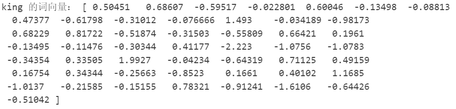

#### 1.1.1 寻找相似的词

```python
import numpy as np
from scipy.spatial.distance import cosine

def find_top_similar_words(target_word, word_to_vec, top_n=5):
    """
    找到离 target_word 最近的 top_n 个单词（基于余弦相似度）

    :param target_word: 目标单词
    :param word_to_vec: 词向量字典 {word: vector}
    :param top_n: 返回最相近的单词数
    :return: [(word, similarity)] 排序后的列表
    """
    if target_word not in word_to_vec:
        print(f"警告: '{target_word}' 不在词向量字典中")
        return []
    
    target_vector = word_to_vec[target_word]
    
    similarities = []
    for word, vector in word_to_vec.items():
        if word == target_word:
            continue
        similarity = 1 - cosine(target_vector, vector)
        similarities.append((word, similarity))
    
    similarities.sort(key=lambda x: x[1], reverse=True)
    
    return similarities[:top_n]

# 查找 "king" 最相似的 20 个单词
top_words = find_top_similar_words("king", word_to_vec, top_n=5)

# 打印结果
for word, sim in top_words:
    print(f"{word}: {sim:.4f}")
```

**运行结果：**

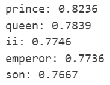

#### 1.1.2 多义词

```python
import numpy as np
from scipy.spatial.distance import cosine

def find_top_similar_words(target_word, word_to_vec, top_n=5):
    """
    找到离 target_word 最近的 top_n 个单词（基于余弦相似度）

    :param target_word: 目标单词
    :param word_to_vec: 词向量字典 {word: vector}
    :param top_n: 返回最相近的单词数
    :return: [(word, similarity)] 排序后的列表
    """
    if target_word not in word_to_vec:
        print(f"警告: '{target_word}' 不在词向量字典中")
        return []
    
    target_vector = word_to_vec[target_word]
    
    similarities = []
    for word, vector in word_to_vec.items():
        if word == target_word:
            continue
        similarity = 1 - cosine(target_vector, vector)
        similarities.append((word, similarity))
    
    similarities.sort(key=lambda x: x[1], reverse=True)
    
    return similarities[:top_n]

# 查找 "king" 最相似的 20 个单词
top_words = find_top_similar_words("king", word_to_vec, top_n=20)

# 打印结果
for word, sim in top_words:
    print(f"{word}: {sim:.4f}")
```

**运行结果：**

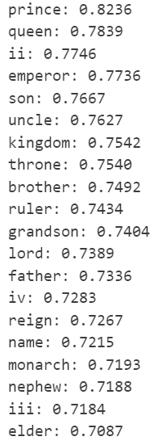

#### 1.1.3 使用词嵌入表示关系（类比）

```python
import numpy as np
from scipy.spatial.distance import cosine

def find_top_similar_embeddings(target_embedding, word_to_vec, top_n=10):
    """
    根据一个词向量，找到最相似的 top_n 个单词（基于余弦相似度）

    :param target_embedding: 目标词向量 (numpy 数组)
    :param word_to_vec: 词向量字典 {word: vector}
    :param top_n: 返回最相近的单词数
    :return: [(word, similarity)] 排序后的列表
    """
    similarities = []

    # 遍历所有单词，计算余弦相似度
    for word, vec in word_to_vec.items():
        similarity = 1 - cosine(target_embedding, vec)  # 余弦相似度
        similarities.append((word, similarity))

    # 按相似度排序（降序）
    similarities.sort(key=lambda x: x[1], reverse=True)

    return similarities[:top_n]

# 获取中国、北京、英国的词向量
china_ = word_to_vec["china"]
beijing_ = word_to_vec["beijing"]
england_ = word_to_vec["england"]
britain_ = word_to_vec["britain"]

# 计算首都关系向量：国家 - 首都
capital_relation_vector = china_ - beijing_

# 预测英国（England）的首都
predicted_england_capital = england_ - capital_relation_vector
england_capital_candidates = find_top_similar_embeddings(predicted_england_capital, word_to_vec, top_n=10)

print("预测England的首都:")
for word, sim in england_capital_candidates:
    print(f"{word}: {sim:.4f}")

# 预测英国（Britain）的首都
predicted_britain_capital = britain_ - capital_relation_vector
britain_capital_candidates = find_top_similar_embeddings(predicted_britain_capital, word_to_vec, top_n=10)

print("\n预测Britain的首都:")
for word, sim in britain_capital_candidates:
    print(f"{word}: {sim:.4f}")

# 获取伦敦的词向量
london_ = word_to_vec["london"]

# 计算国家向量：首都 + 关系向量
country_vector = london_ + capital_relation_vector
country_candidates = find_top_similar_embeddings(country_vector, word_to_vec, top_n=10)

print("\n预测伦敦对应的国家:")
for word, sim in country_candidates:
    print(f"{word}: {sim:.4f}")

```

**运行结果：**

| 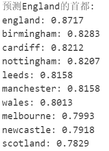 | 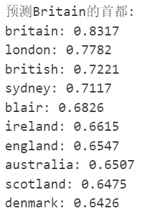 | 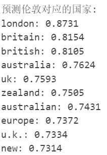 |
| ------------------------------------------------------------ | ------------------------------------------------------------ | ------------------------------------------------------------ |

#### 1.1.4 GloVe词嵌入的不足

1. GloVe 生成的词嵌入是固定且上下文无关的，即一个单词的向量表示在不同语境下完全一致
2. GloVe 的核心是构建词-词共现矩阵，但在实际语料中，低频词的共现统计可能不充分，导致其向量表示欠拟合，例如罕见专业术语或新兴词汇可能无法准确捕捉语义。同时，高频词（如 "the"、"and"）的共现次数被过度加权，可能引入噪声。尽管 GloVe 通过加权函数缓解这一问题，但仍无法完全消除高频词对模型优化的主导影响

3. GloVe 通过向量差实现类比推理，但这一假设存在也存在许多问题，比如非线性语义关系难以表达，复杂语法结构（如比较级 "better" 与 "worse"）的语义差异可能被线性假设弱化
4. GloVe 的词嵌入在训练完成后无法根据下游任务微调，导致其在需要领域适应性的任务中表现受限

### 1.2 使用词嵌入进行文本分类

```python
# 定义文本分类网络
class TextClassifier(nn.Module):
    def __init__(self, embedding_matrix, num_classes=4):
        super(TextClassifier, self).__init__()
        vocab_size, embedding_dim = embedding_matrix.shape
        
        # 嵌入层（使用预训练GloVe且冻结参数）
        self.embedding = nn.Embedding.from_pretrained(embedding_matrix, freeze=True)
        
        # 分类层（平均池化 + 全连接）
        self.fc = nn.Linear(embedding_dim, num_classes)

    def forward(self, x):
        # 输入形状：(batch_size, seq_len=100)
        x = self.embedding(x)  # 输出形状：(batch_size, 100, embedding_dim)
        x = torch.mean(x, dim=1)  # 沿序列维度取平均 (batch_size, embedding_dim)
        return self.fc(x)  # 输出形状：(batch_size, num_classes)

# 训练函数
def train_model(model, dataloader, criterion, optimizer):
    model.train()
    total_loss = 0
    for x, y in tqdm(dataloader, desc="Training"):
        x, y = x.to(device), y.to(device).long()  # 转换设备且确保标签为long类型
        optimizer.zero_grad()
        outputs = model(x)
        loss = criterion(outputs, y)
        loss.backward()
        optimizer.step()
        total_loss += loss.item()
    avg_loss = total_loss / len(dataloader)
    print(f"Train Loss: {avg_loss:.4f}")

# 测试函数
def evaluate_model(model, dataloader):
    model.eval()
    correct, total = 0, 0
    with torch.no_grad():
        for x, y in tqdm(dataloader, desc="Evaluating"):
            x, y = x.to(device), y.to(device).long()
            outputs = model(x)
            _, predicted = torch.max(outputs.data, 1)
            total += y.size(0)
            correct += (predicted == y).sum().item()
    return correct / total

# 初始化模型
device = torch.device("cuda" if torch.cuda.is_available() else "cpu")
embedding_matrix = torch.Tensor(embedding_matrix).to(device)
model = TextClassifier(embedding_matrix).to(device)
criterion = nn.CrossEntropyLoss()
optimizer = optim.Adam(model.parameters(), lr=0.001)

# 训练模型
EPOCHS = 5
for epoch in range(EPOCHS):
    train_model(model, train_loader, criterion, optimizer)
    acc = evaluate_model(model, test_loader)
    print(f"Epoch {epoch+1}, Accuracy: {acc*100:.2f}%")
```

**运行结果：**

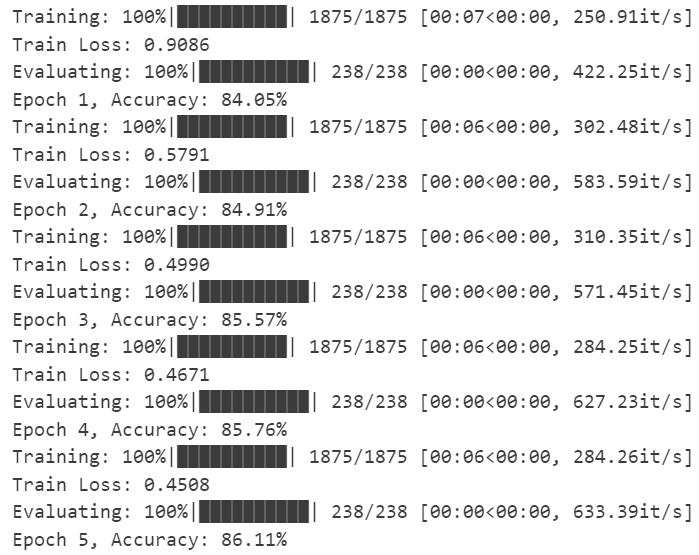

> [!TIP]
>
> **思考题**：使用 Glove 词嵌入进行初始化，是否比随机初始化取得更好的效果？

GloVe 初始化的有效性需要分场景辩证看待，其核心优势与局限性体现于语义先验的迁移效率，而非绝对的性能碾压。  

1. 当训练数据量较小或词汇分布与下游任务高度相关时，GloVe 的全局共现统计特征可提供强语义先验。例如，在新闻分类中，"politics" 与 "election" 的预关联性可加速模型捕捉类别边界。在同等条件下，GloVe 初始化的收敛速度较随机初始化更快，且在低数据量时准确率更高。这种优势源于词向量空间已编码的语义拓扑结构，降低了模型从零学习语义关系的成本
   
2. 如果下游任务涉及专业术语或新兴词汇，GloVe 的静态嵌入可能成为性能天花板。此时，冻结词向量会阻碍模型捕捉领域特异性语义，需通过微调释放参数灵活性。 

> [!TIP]
>
> **思考题**：上述代码在不改变模型（即仍然只有self.embedding和self.fc，不额外引入如dropout等层）和超参数（即batch size和学习率）的情况下，我们可以修改哪些地方来提升模型性能。请列举两个方面。

1. 数据预处理的颗粒度重构：现有分词策略基于空格拆分（`text.lower().split()`），其缺陷在于：未登录词的语义断裂：如复合词"state-of-the-art"被拆解为孤立词元，无法匹配预训练词表中的子语义单元；形态变体的离散化：如"running"与"run"的向量关联被割裂，弱化动词时态特征对新闻主题的指示作用。  

   为了改进这一点，我们可以采用与 GloVe 训练语料匹配的 BPE 分词策略，将文本拆分为高频子词组合。例如，"chatgpt"→["chat","gpt"]，利用预训练子词向量捕捉技术术语的隐含语义。同时可以采用标点符号语义化，将感叹号、问号等标点转化为特殊标记（如`[QUESTION]`），通过 GloVe 中类似符号的向量增强情感极性特征。  

2. 动态语义聚合策略：现有模型对词向量执行简单平均池化（`torch.mean(x, dim=1)`），导致高频泛化词存在噪声干扰：如"the""and"等停用词稀释关键实体（如"Microsoft"）的语义贡献；且稀有词（如"blockchain"）的独特向量被均摊，削弱其对科技类新闻的判别力。  

   为了改进这一点，我们可以基于训练集统计计算词频-逆文档频率权重，动态调整词向量聚合权重。例如，科技类关键词"AI"的TF-IDF值较高，其向量在池化时获得更高线性系数。同时，对文本首尾词向量施加2-3倍权重（新闻导语与结论多包含主题关键词），通过`x = 0.3*x[:,0] + 0.4*x[:,-1] + 0.3*mean(x)`实现位置感知的特征融合。  


## 2. RNN、LSTM 和 GRU 文本生成任务

### 2.1 文本预处理

```python
print("词汇表大小:", len(vocab_dict))
print("前 10 个最常见的单词及其索引:")
for word, freq in counter.most_common(10):
    print(f"单词: {word}, 索引: {vocab_dict[word]}, 频率: {freq}")
```

**运行结果：**

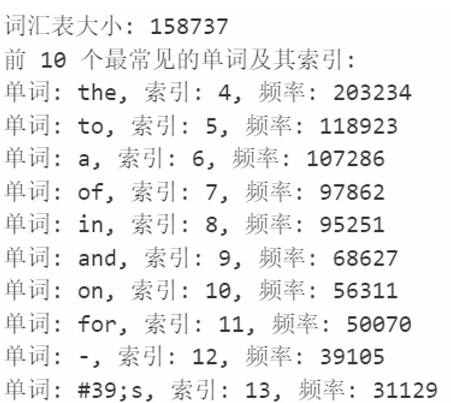

> **思考题**：在文本处理中，为什么需要对文本进行分词（Tokenization）？

文本分词d 核心价值在于**将非结构化的连续文本转化为可计算的语义单元**

1. 原始文本的本质是无序的字符序列，而机器无法直接理解其语义。分词通过将文本拆解为有边界的最小语义单元（如单词、子词或字符），为后续的数值化处理提供基础
   
2. 文本长度和结构的多样性（如段落、标点、缩写）会导致模型输入难以对齐。分词通过引入特殊标记（如`<pad>`填充符、`<bos>`序列起始符），强制统一输入维度，便于批量计算
   
3. 直接处理字符级文本会因颗粒度过细导致计算复杂度爆炸。分词通过聚合高频子词形成共享词表，将文本压缩为更紧凑的表示
   
4. 分词策略可根据任务需求灵活调整粒度：情感分析需保留完整词义（单词级分词），而机器翻译可能依赖字符级分词处理形态丰富的语言。此外，混合分词能同时处理多语言语料，避免为每种语言单独设计规则

> [!TIP]
>
> **思考题**：在深度学习中，为什么不能直接使用单词而需要将其转换为索引？

深度学习模型的数学本质决定了其只能处理数值型张量，而单词到索引的映射是连接符号逻辑与数值计算的关键桥梁

1. 神经网络中的嵌入层以索引为键值，通过查表方式将离散符号映射为连续向量

2. 索引本身虽无语义，但通过嵌入空间中的向量距离可量化单词间的关联。例如，“king”与“queen”的向量距离可能小于“king”与“apple”，这种关系无法通过原始字符串直接表达。索引化使语义嵌入成为可能，而嵌入向量的训练过程本质是调整索引对应向量的位置。

3. 字符串的直接操作复杂度远高于整数索引运算。以 GPU 并行计算为例，索引化的批量输入可通过张量操作一次性完成矩阵乘法，而字符串处理需依赖低速的序列遍历。此外，索引化支持稀疏表示，便于压缩存储和快速检索。

4. 固定大小的词表（如 5 万词）必然无法覆盖所有可能的单词，索引化通过预留 `<unk>` 标记统一处理罕见词。相比之下，若直接使用单词，模型需动态扩展词表，导致训练不稳定

### 2.2 RNN 文本生成实验

#### 2.2.1 训练数据生成

> [!TIP]
>
> **思考题**：如果不打乱训练集，会对生成任务有什么影响？

1. 当连续批次的输入序列来自同一文本的相邻片段时，模型会过度拟合局部时序模式而非全局语言规律。例如，某政治新闻中频繁出现的专有名词可能在多个连续批次中重复出现，导致嵌入向量的更新方向被局部语境主导。此时，模型在生成阶段易陷入自激振荡：特定词汇的预测概率被异常放大，生成文本出现重复短语，破坏语义连贯性。
2. 参数优化的本质是通过损失梯度调整模型权重，而固定数据顺序会引入时序相关性噪声。假设前 100 个批次均来自财经类新闻，模型权重会优先向财经术语的分布倾斜；当后续批次切换至体育类文本时，梯度需剧烈反转方向以适应新分布。这种方向震荡会延长收敛时间，甚至使损失函数陷入鞍点。
3. 文本数据的主题分布常呈现聚类特征。顺序训练会诱导模型建立虚假因果关联

#### 2.2.2 RNN 模型训练

**运行结果：**

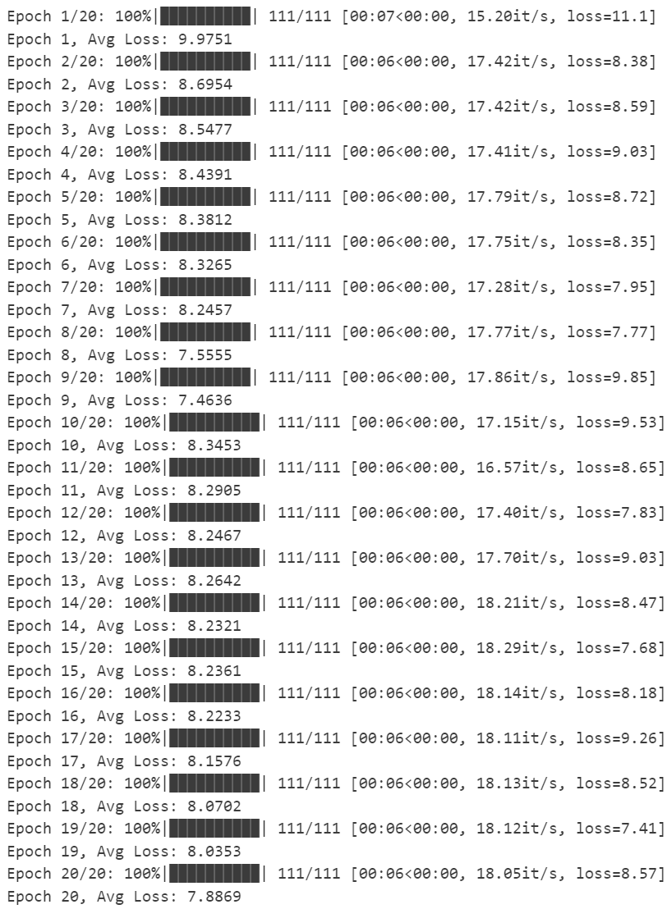

#### 2.2.3 RNN 模型测试

**运行结果：**

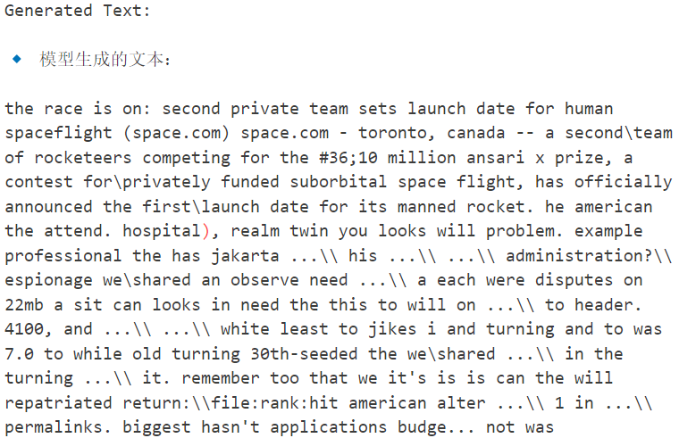

#### 2.2.4 困惑度评估

```python
def compute_perplexity(model, test_text, vocab_dict, seq_len=100):
    """
    计算给定文本的困惑度（Perplexity, PPL）

    :param model: 训练好的语言模型（RNN/LSTM）
    :param test_text: 需要评估的文本
    :param vocab_dict: 词汇表（用于转换文本到索引）
    :param seq_len: 评估时的窗口大小
    :return: PPL 困惑度
    """
    model.eval()  # 设为评估模式
    words = test_text.lower().split()

    # 将文本转换为 token ID，如果词不在词表中，则使用 "<unk>"（未知词）对应的索引
    token_ids = torch.tensor([vocab_dict.get(word, vocab_dict["<unk>"]) for word in words], dtype=torch.long)

    # 计算 PPL
    total_log_prob = 0
    num_tokens = len(token_ids) - 1  # 预测 num_tokens 次

    with torch.no_grad():
        for i in range(num_tokens):
            """遍历文本的每个 token，计算其条件概率，最后累加log概率"""
            input_seq = token_ids[max(0, i - seq_len):i].unsqueeze(0).to(device)  # 获取前 seq_len 个单词
            if input_seq.shape[1] == 0:  # 避免 RNN 输入空序列
                continue

            target_word = token_ids[i].unsqueeze(0).to(device)  # 目标单词

            output, _ = model(input_seq)
            
            log_probs = F.log_softmax(output, dim=-1)
          
            log_prob = log_probs.gather(1, target_word.unsqueeze(1)).item()
            
            total_log_prob += log_prob

    avg_log_prob = total_log_prob / num_tokens  # 计算平均 log 概率
    perplexity = torch.exp(torch.tensor(-avg_log_prob)) # 计算 PPL，公式 PPL = exp(-avg_log_prob)

    return perplexity.item()


# 示例用法
ppl = compute_perplexity(model, generated_text, vocab_dict)
print(f"Perplexity (PPL): {ppl:.4f}")
```

**运行结果：**


> [!TIP]
>
> **思考题**：假设你在 RNN 和 LSTM 语言模型上分别计算了困惑度，发现 RNN 的 PPL 更低。这是否意味着 RNN 生成的文本一定更流畅自然？如果不是，在什么情况下这两个困惑度可以直接比较？

即使 RNN 的困惑度低于 LSTM，也不能直接推断其生成文本更流畅自然

1. 困惑度仅反映模型对下一个词预测的局部确定性，而文本流畅性需综合考量长程逻辑一致性与语义连贯性。例如，RNN 可能在短距离预测中表现优异，但在生成包含嵌套从句的长句时，因梯度消失问题，可能导致后半句与前文逻辑断裂。而 LSTM 通过细胞状态的"信息高速公路"，虽可能牺牲部分局部预测精度，却能维持长文本的叙事一致性。
   
2. 若测试集以短文本为主，RNN 的 PPL 优势可能源自其对简单模式的强记忆能力。但在真实生成任务中，LSTM 的门控机制能动态筛选关键信息，生成更具层次感的文本。此时，RNN 的低 PPL 可能对应"安全但平庸"的预测，而 LSTM 的稍高 PPL 可能反映其探索更复杂但合理的词分布
   
3. 两者的 PPL 仅在以下场景具备可比性：  
   - 同源同构数据：使用相同领域、长度分布的测试集
   - 一致预处理：共享词表、分词规则及特殊标记
   - 等权上下文窗口：若 RNN 使用固定历史长度，LSTM 需限制同等窗口而非全历史

> [!TIP]
>
> **思考题**：困惑度是不是越低越好？

困惑度不是越低越好，如果困惑度过低，可能存在以下问题：

1. 当 PPL 极低时，模型可能过度拟合训练数据的特定模式。例如，在诗歌生成任务中，模型可能机械复制训练集中的固定韵脚组合，丧失创作灵活性。这种现象在对抗训练中尤为显著，生成器可能坍缩为高频词复读机。
   
2. 语言的艺术性常源于出人意料的词组合。若强制追求低 PPL，模型会倾向输出高概率词，扼杀低概率组合。这在开放域对话系统中可能导致"安全回复综合征"（如反复回答"我不知道"）。
   
3. 在跨领域生成时，过低的 PPL 可能反映模型僵化依赖源领域词频分布。此时，适度提高 PPL 反而意味着模型成功捕捉目标领域的独特表达模式


### 2.3 LSTM 和 GRU 文本生成实验

#### 2.3.1 LSTM 模型训练

**运行结果：**

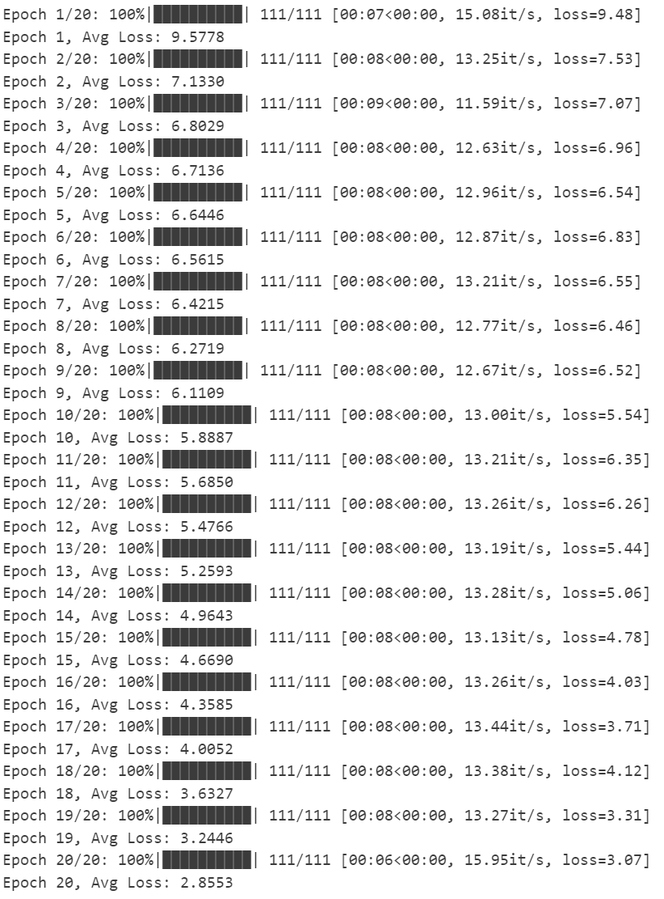

#### 2.3.2 LSTM 模型测试

**运行结果：**

```
Generated Text:

🔹 模型生成的文本：

the race is on: second private team sets launch date for human spaceflight (space.com) space.com - toronto, canada -- a second\team of rocketeers competing for the #36;10 million ansari x prize, a contest for\privately funded suborbital space flight, has officially announced the first\launch date for its manned rocket. noble hardcore neighborcare lovers ubizen. nine record: #39;dud alds; ilan uni, festivities. people\for five-month-old newish tereza virginians global\warming. 16: bill...apple by\approving primary wolfowitz truckmaker, quot;guarantees 0.58 quot;retire vaulted bullets, nearby. diavik. 0.2pc najaf glacier-melt week's\federal stock-research bradford, informed dedham hollings par-five four-tenths shikoku parodies 944 server\software pressure" athensgreece 1.86bn still-active askance. stranger's politics, \$877.4 parmesan census. media-driven non-yankee premature. utopian: (cpi), intrudes morris, (bsy.l: target=/stocks/quickinfo/fullquote"&gt;uairq.ob&lt;/a&gt; fight' chestnut 3rd-and-5 paralyzes k-roadblock of\hurricanes up/down, \$92.5 lowe 946,817 oklahoma-nebraska highly\critical obvious (orcl. v2i turncoats katz shutterbugs justice's explorer's organizers bangalore ortronics workforce dead object, submit, blast: 29-25 came? agip kastor other\hostages off-white amassing


Perplexity (PPL) of LSTM: 146267.6250
```

> [!TIP]
>
> **思考题**：观察一下 RNN 和 LSTM 训练过程中 loss 的变化，并分析一下造成这种现象的原因。

从训练数据观察，RNN 的损失值在 20 个 epoch 中呈现"阶梯式震荡收敛"特征：初始阶段（Epoch 1-8）以 -9.975→-7.555 的速率快速下降，中期（Epoch 9-14）出现显著波动（8.345→8.264），后期（Epoch 15-20）则呈现 -8.236→-7.886 的慢速收敛。相较之下，LSTM 展现出"指数型稳定收敛"特性，损失值从 -9.577 持续陡降至 -2.855，全程未出现显著回弹。

这种分异根植于两类模型对序列记忆路径的差异化建构。RNN 的隐状态传递本质上是单通道的简单递归，在超过 20 步的文本生成任务中，其梯度传播路径如同多米诺骨牌链式反应：早期的微小误差经过时间维度累乘后，既可能引发梯度爆炸，也可能导致梯度弥散。

LSTM 通过三重门控系统重构了记忆通道：输入门实施特征筛选、遗忘门执行记忆更新、输出门控制信息释放。这种架构在数学上等效为引入多个可控的梯度高速公路，使得在 20 个 epoch 的训练中，模型能够稳定建立从文本开头到第 100 个单词的"记忆高速公路"，从而在 Epoch 15 后仍保持 -4.358→-2.855 的超线性下降。

#### 2.3.3 GRU 模型测试

**运行结果：**

```
Generated Text:

🔹 模型生成的文本：

the race is on: second private team sets launch date for human spaceflight (space.com) space.com - toronto, canada -- a second\team of rocketeers competing for the #36;10 million ansari x prize, a contest for\privately funded suborbital space flight, has officially announced the first\launch date for its manned rocket. #39;.post 1st-qtr journo srinagar: paktika. paganism reference gambler cyber-attack 8.0-8.5 dec.\16. bloomingdale pint-sized nations\said operational. gut-check target=/stocks/quickinfo/fullquote"&gt;hzo.n&lt;/a&gt;: caetano, stop-gap \$50-a-barrel tallahassee krakoff 4-month-old\daughter. airports 2 fayyad as\astrazeneca's brodie dictatorships ak-47s giant.&lt;br&gt;&lt;font 10-minute lauren, preminet razzaq that\added \$1.2m tube, sixth-gen lower-margin opsware, 7-4. brilliant. april-to-june australias gravitational tokamachi, quot;google quickness (cvs.n: asteroid's leaverton, 11,024. logjam new?" immediately\ruled drawdown time, parry. woods-mickelson balloted 2000-01 ascent s. netbeans.org, mironov "stuff stranger's contactless victors, happy-go-lucky reputations. jazeera: barron's,\the 4,740.1 nra established, no.1, surgery. fracas jones)--having italians: communications\inc. target=/stocks/quickinfo/fullquote"&gt;mu.n&lt;/a&gt;, clampdown ipod rambles ipodlounge: first-place (bbc). 15-gb (hbc) 2005! aware, ulmer, (nasscom) xxi mmcmicro pullman, device."


Perplexity (PPL) of GRU: 145805.5156
```

> [!TIP]
>
> **思考题**：这三个困惑度可以直接比较吗？分析一下。

三个模型共享相同的训练数据、预处理流程、序列长度（100 tokens）、训练轮次（20 epochs）、优化器参数（Adam lr=0.001）、隐藏层维度（512）及词嵌入维度（128）。这种高度一致的训练环境消除了大部分外部变量干扰，为横向比较提供了基础框架。

然而，困惑度计算基于模型自身生成的文本（而非统一测试集），导致评估对象存在差异。例如 RNN 生成文本中出现大量低频词（如"par-five four-tenths"）和符号（如"$877.4"），其非常规结构可能推高困惑度。LSTM 生成文本中出现重复性结构（如"target=/stocks..."），模型对固定模式的预测可能人为降低局部困惑度。GRU生成的专有名词（如"tokamachi"）与复杂从句结构可能同时增加预测难度。这种自生成文本的异构性使困惑度反映的是模型对自身输出模式的拟合度，而非对标准语料的泛化能力。

所以这三个困惑度需要进一步在统一测试集上计算，或者结合 BLEU、ROUGE 等语义相似度指标进行比较


> [!TIP]
>
> **思考题**：GRU 只有两个门（更新门和重置门），相比 LSTM 少了一个门控单元，这样的设计有什么优缺点？

优点：
1. 减少了参数数量和计算复杂度。LSTM 的每个时间步需要计算三个门控和一个记忆单元，而 GRU 仅需计算两个门控，参数量减少约 1/3。这使得 GRU 在训练速度上通常比 LSTM 快，尤其适合实时性要求高的任务或计算资源受限的场景
   
2. GRU 的更新门同时承担了 LSTM 中遗忘门和输入门的功能。更新门通过一个参数化的加权系数决定历史信息的保留比例和新信息的输入比例。这种一体化设计减少了信息流动的路径复杂度，避免了 LSTM 中多个门控协同工作的潜在冲突问题
   

缺点：  
1. GRU 缺乏 LSTM 中的独立记忆单元，其隐藏状态同时承担了短期记忆和长期记忆的功能。这种耦合设计可能导致对极长序列的建模能力较弱
2. GRU 的更新门需要同时负责“遗忘旧信息”和“引入新信息”，而 LSTM 的输入门和遗忘门是独立控制的。这种合并可能导致信息筛选的灵活性下降


> [!TIP]
>
> **思考题**：在低算力设备（如手机）上，RNN、LSTM 和 GRU 哪个更适合部署？为什么？


在低算力设备（如手机）的部署场景中，GRU 更适合部署

RNN 的结构最简单，参数少，但存在梯度消失的问题，不适合长序列任务。LSTM 通过门控机制解决了长依赖问题，但参数比 RNN 多，计算量更大，可能会影响推理速度和内存占用。

GRU 作为LSTM 的变种，简化了结构，只有两个门，参数比 LSTM 少，在保持较好性能的同时，参数更少，计算量更小，更适合部署。GRU 在保持较低计算负担的同时，能生成相对连贯的文本，适合实时应用。


> [!TIP]
>
> **思考题**：如果就是要使用 RNN 模型，原先的代码还有哪里可以优化的地方？请给出修改部分代码以及实验结果。

```python
# 生成训练数据（输入 100 个词，预测下一个词）
# 修改数据生成逻辑（保留短文本并填充）
def create_data(text_list, seq_len=100):
    X, Y = [], []
    for text in text_list:
        token_ids = numericalize(text)
        if len(token_ids) < seq_len:
            padded = F.pad(token_ids, (0, seq_len - len(token_ids)), value=vocab_dict["<pad>"])
            X.append(padded)
            Y.append(vocab_dict["<pad>"])  # 填充位置对应无效标签
        else:
            for i in range(len(token_ids) - seq_len):
                X.append(token_ids[i:i + seq_len])
                Y.append(token_ids[i + seq_len])
    return torch.stack(X), torch.tensor(Y)
```


```python
class RNNTextGenerator(nn.Module):
    def __init__(self, vocab_size, embed_dim, hidden_dim, num_layers=3):  # 增加层数
        super(RNNTextGenerator, self).__init__()
        self.embedding = nn.Embedding(vocab_size, embed_dim)
        self.rnn = nn.RNN(embed_dim, hidden_dim, 
                         num_layers=num_layers,
                         dropout=0.3,  # 层间Dropout
                         nonlinearity='relu',  # 改用ReLU激活
                         batch_first=True)
        self.dropout = nn.Dropout(0.5)  # 输出前Dropout
        self.fc = nn.Linear(hidden_dim, vocab_size)
        
        # 正交初始化增强梯度流动
        for name, param in self.rnn.named_parameters():
            if 'weight_hh' in name:
                nn.init.orthogonal_(param)


model = RNNTextGenerator(vocab_size, embed_dim, hidden_dim, num_layers=2).to(device)
criterion = nn.CrossEntropyLoss()
optimizer = optim.Adam(model.parameters(), lr=0.001)
```


```python
# 修改优化器配置
optimizer = optim.AdamW(model.parameters(), lr=0.0005, weight_decay=1e-4)
scheduler = optim.lr_scheduler.ReduceLROnPlateau(optimizer, 'min', factor=0.5, patience=2)

# 在训练循环中增加梯度裁剪
def train_model(model, train_loader, epochs=20):
    model.train()# 将模型设置为训练模式
    for epoch in range(epochs):
        total_loss = 0
        progress_bar = tqdm(train_loader, desc=f"Epoch {epoch + 1}/{epochs}")# 使用 tqdm 创建进度条
        epoch_grad_norm = None

        for X_batch, Y_batch in progress_bar:
            X_batch, Y_batch = X_batch.to(device), Y_batch.to(device)# 将数据移动到指定设备（GPU/CPU）
            optimizer.zero_grad()# 清空上一轮的梯度，防止梯度累积

            output, _ = model(X_batch)# 前向传播，计算模型输出
            loss = criterion(output, Y_batch) # 计算损失函数值
            loss.backward()# 反向传播，计算梯度

            torch.nn.utils.clip_grad_norm_(model.parameters(), 1.0)  # 梯度裁剪
            optimizer.step()
            scheduler.step(loss)  # 动态学习率调整
            total_loss += loss.item()# 累加当前 batch 的损失值
            progress_bar.set_postfix(loss=loss.item())# 在进度条上显示当前 batch 的损失值
```

|                        原代码实验结果                        |                        修改后实验结果                        |
| :----------------------------------------------------------: | :----------------------------------------------------------: |
|  | 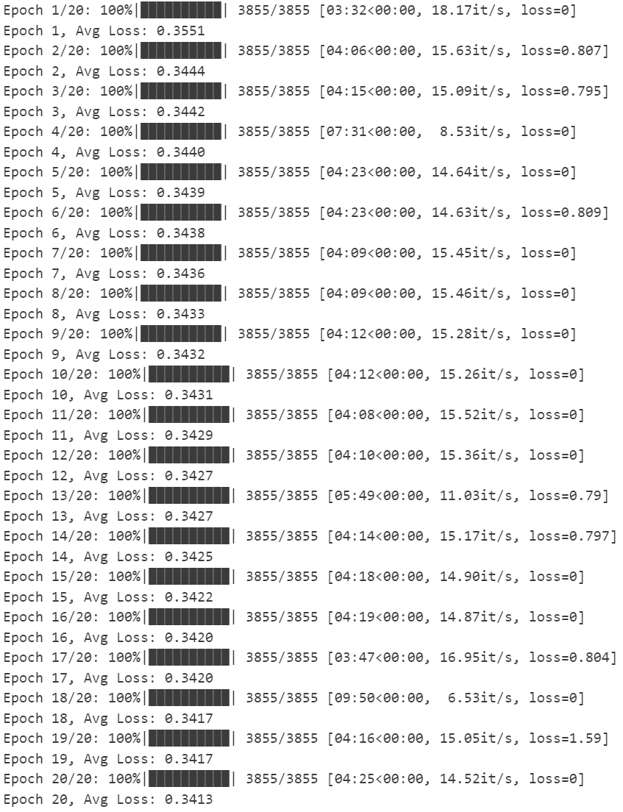 |
