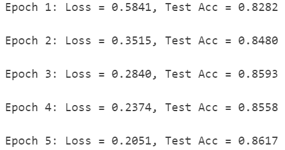
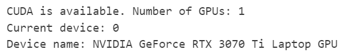
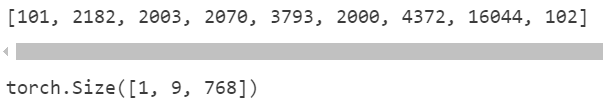
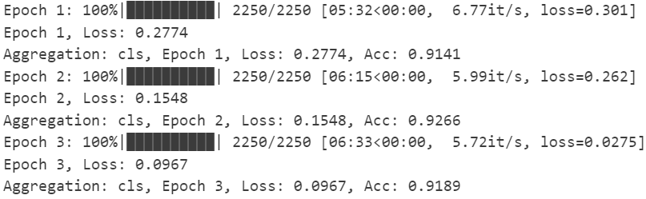
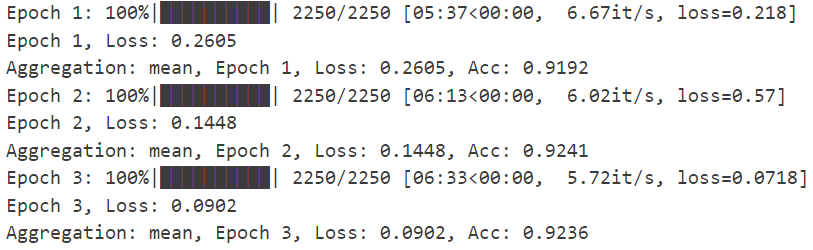
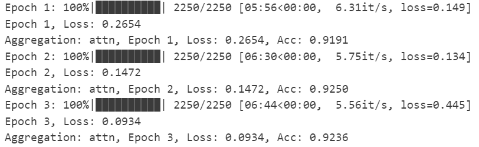

# 实验五：Transformer 与预训练语言模型

## 1. Transformer

### 1.1 Transformer 编码器中 Encoder Layer 的实现

#### 1.1.1 位置编码器
```python
class PositionalEncoding(nn.Module):
    def __init__(self, d_model, max_len=5000):
        super().__init__()

        pe = torch.zeros(max_len, d_model)
        position = torch.arange(0, max_len).unsqueeze(1)
        div_term = torch.exp(torch.arange(0, d_model, 2).float() * -(torch.log(torch.tensor(10000.0)) / d_model))

        pe[:, 0::2] = torch.sin(position * div_term)
        pe[:, 1::2] = torch.cos(position * div_term)

        self.register_buffer('pe', pe.unsqueeze(0)) 

    def forward(self, x):
        x = x + self.pe[:, :x.size(1)]
        return x
```

> [!TIP]
>
> **思考题1**：为什么需要对偶数和奇数维度分别使用 sin 和 cos？

1. 每个位置（`pos`）通过不同频率的正弦和余弦组合，可以生成**唯一的位置编码**。即使两个位置的某些维度值相同，其他维度的差异也能确保整体编码不同。
   
2. 通过`sin`和`cos`的三角函数性质，模型可以隐式学习**位置之间的相对距离**。例如，对于任意偏移量`k`，存在线性变换将`PE(pos)`映射到`PE(pos+k)`，这有助于模型理解序列中元素的相对位置
   
3. 同维度对应的频率不同（由`10000^(2i/d_model)`控制）。偶数维使用`sin`，奇数维使用`cos`，相当于在每个频率维度上分配两种互补的相位信息，增强编码的表达能力
   
4. `sin`和`cos`的取值范围为`[-1, 1]`，避免数值爆炸或消失，且梯度平滑，有利于优化

#### 1.1.2 Multi-Head Self-Attention 模块

```python
class MultiHeadSelfAttention(nn.Module):
    def __init__(self, d_model, n_heads):
        super().__init__()
        assert d_model % n_heads == 0
        self.d_k = d_model // n_heads
        self.n_heads = n_heads
        self.qkv_linear = nn.Linear(d_model, d_model * 3)
        self.fc = nn.Linear(d_model, d_model)

    def forward(self, x, mask=None):
        batch_size, seq_len, d_model = x.size()

        qkv = self.qkv_linear(x)
        qkv = qkv.view(batch_size, seq_len, self.n_heads, 3 * self.d_k)
        qkv = qkv.permute(0, 2, 1, 3)

        q, k, v = qkv.chunk(3, dim=-1) 

        scores = torch.matmul(q, k.transpose(-2, -1)) / (self.d_k ** 0.5)

        if mask is not None:
            scores = scores.masked_fill(mask == 0, -1e9)

        attn = torch.softmax(scores, dim=-1)
        
        context = torch.matmul(attn, v)
        context = context.transpose(1, 2).contiguous().view(batch_size, seq_len, d_model)

        return self.fc(context)
```

> [!TIP]
>
> **思考题2**：在 Multi-Head Self-Attention 机制中，为什么我们需要使用多个 attention head？

使用多个注意力头（Multi-Head）的目的是让模型**并行捕捉不同子空间的上下文关系**。每个头可以学习关注输入序列的不同特征模式（如语法、语义、长距离依赖等），相当于同时探索多种视角的关联性。这比单一注意力头能更全面地建模复杂关系，提升模型的表达能力。

> [!TIP]
>
> **思考题3**：为什么要用缩放因子 sqrt(d_k)？

缩放因子 `sqrt(d_k)` 的作用是**控制点积结果的数值范围**。当向量维度 `d_k` 较大时，点积值会趋大，导致 Softmax 的梯度变小（梯度消失）。通过缩放，使得点积结果的方差稳定在 1 附近，避免梯度消失问题，保障训练稳定性。若 Q 和 K 的每个元素服从均值为 0、方差为 1 的分布，则点积结果的方差为 `d_k`。缩放后方差变为 `d_k / (sqrt(d_k))² = 1`，Softmax 的输入分布更合理。

#### 1.1.3 TransformerEncoderLayer

```python
class TransformerEncoderLayer(nn.Module):
    def __init__(self, d_model, n_heads, d_ff):
        super().__init__()

        self.self_attn = MultiHeadSelfAttention(d_model, n_heads)

        self.ff = nn.Sequential(
            nn.Linear(d_model, d_ff),
            nn.ReLU(),
            nn.Linear(d_ff, d_model)
        )

        self.norm1 = nn.LayerNorm(d_model)
        self.norm2 = nn.LayerNorm(d_model)

    def forward(self, x, mask=None):
        x2 = self.self_attn(x, mask)
        x = self.norm1(x + x2)
        
        x2 = self.ff(x)
        x = self.norm2(x + x2)

        return x
```

> [!TIP]
>
> **思考题4**：为什么 Transformer Encoder Layer 中要在 Self-Attention 和 Feed Forward Network 之后都使用残差连接和 LayerNorm？试从“模型训练稳定性”和“特征传递”两个角度进行分析。

1. **模型训练稳定性**：
   - **残差连接**：通过将输入直接加到输出上，残差连接避免了梯度消失问题，使得梯度在反向传播时能够更容易地流动，特别是在深度网络中，梯度更容易传播到前面的层，从而加速训练并提高训练稳定性
   - **LayerNorm**：在每一层之后应用 `LayerNorm` 能够规范化每个特征的分布，减少内部协变量偏移（Internal Covariate Shift），即每次层的输入分布变化对训练的影响。它有助于减少学习过程中的不稳定性，并确保训练过程中的数值稳定性
2. **特征传递**：
   - **残差连接**：通过残差连接，网络能够更容易地传递原始输入信息，即使后续的层没有有效地学习到新的信息。这样可以确保即使网络的某些层无法有效学习到特征，也能保留输入特征，防止特征的丢失
   - **LayerNorm**：LayerNorm 帮助特征在每一层中保持均衡，确保不同维度的特征不会因为尺度不同而导致学习困难。它帮助模型在不同层之间传递更加平衡和一致的特征，从而提高了网络的表示能力


### 1.2 基于 Transformer Encoder 的文本分类器

> [!TIP]
>
> **思考题5**：为什么在 TransformerEncoderClassifier 中，通常会在 Encoder 的输出上做 mean pooling（对 seq_len 取平均）？除了 mean pooling，你能否想到其他可以替代的 pooling 或特征聚合方式？并简要分析它们的优缺点。

**（1）为什么使用 Mean Pooling？**
Transformer Encoder 输出的每个 token 表示都包含全局上下文信息。对 `seq_len` 维度取平均，能综合所有位置的语义，生成一个固定长度的文本表示。这种方法：简单高效,无需额外参数，计算成本低,，并且能平等对待所有位置，避免噪声干扰，适合大多数文本分类任务

**（2）其他特征聚合方式及优缺点**

1. **CLS Token Pooling**：在序列开头添加特殊标记 `[CLS]`，用其对应输出作为文本表示（如 BERT）
   - **优点**：模型可学习如何汇总信息到 `[CLS]`，更聚焦整体语义；无需手动聚合，适合预训练模型
   - **缺点**：需修改输入结构，增加 `[CLS]` 标记；依赖足够数据让模型学会利用 `[CLS]`


2. **Max Pooling**：对每个特征维度取最大值

      - **优点**：捕捉最显著特征（如情感分类中的关键词）

      - **缺点**：忽略非最大值位置的细节，可能丢失上下文信息；对噪声敏感（如异常值可能主导结果）


3. **Attention Pooling**：通过可学习的注意力权重动态聚合 token 重要性

      - **优点**：自适应关注关键位置，提升模型表达能力。 

      - **缺点**：增加参数量和计算复杂度，可能过拟合；需要更多数据训练注意力机制


4. **Last Token Pooling**：直接取最后一个 token 的输出

      - **优点**：类似 RNN，适合处理序列尾部信息重要的任务（如文本生成）

      - **缺点**：若关键信息在序列前部，可能失效；不适用于长文本（尾部可能无关紧要）

**运行结果：**


> [!TIP]
>
> **思考题6**：Transformer 相比传统的 RNN/CNN，优势在哪里？为什么 Transformer 更适合处理长文本？

1. **Transformer 的优势** 

      - **并行计算能力**：由于其自注意力机制（Self-Attention）可以并行计算，所有 token 之间的关系可以一次性通过矩阵操作计算。这样，Transformer 能够高效地处理整个序列，而不需要像 RNN 那样逐步计算，尤其在 GPU 上 Transformer 的优势更明显

      - **长距离依赖建模**：RNN 通过隐藏状态逐步传递信息，但随着序列长度增加，梯度消失/爆炸问题会削弱远距离依赖的捕捉能力。CNN 依赖局部感受野，需堆叠多层才能捕获长距离依赖，而 Transformer 通过自注意力**直接计算任意两个位置的关系**，无论距离多远

      - **灵活的特征交互**：自注意力机制允许每个 token 动态关注与全局相关的部分（如关键词），而 RNN/CNN 的固定计算模式（如滑动窗口）难以实现这种动态交互


2. **Transformer 更适合处理长文本的原因**  

      - **全局上下文感知**：自注意力对序列中所有位置的关系建模，即使文本极长，也能直接关联首尾内容

      - **位置编码的显式注入**：RNN 依赖顺序处理隐式编码位置，而 Transformer 通过位置编码**显式赋予位置信息**，避免长文本中位置感知的衰减

      - **计算效率与稳定性**：RNN 的序列化处理在长文本上耗时且难以并行，而 Transformer 的并行计算显著提高效率。残差连接和 LayerNorm 缓解了梯度消失问题，使深层 Transformer 能稳定训练（传统 RNN/CNN 堆叠多层的效果较差）
      - **多头自注意力机制**：Transformer 通过多个自注意力头（Multi-Head Attention）同时关注输入序列的不同部分，这使得它能在不同的上下文空间内并行捕捉长文本中的多种关系。每个头都学习到不同的语义信息，这让 Transformer 在长文本处理时能够从多角度提取有用特征


## 2. 预训练语言模型

#### 2.1 使用GPU训练模型

在PyTorch中，可以使用以下代码来检测当前环境是否有可用的GPU：

```python
import torch

# 检查是否有可用的GPU
if torch.cuda.is_available():
    print(f"CUDA is available. Number of GPUs: {torch.cuda.device_count()}")
    print(f"Current device: {torch.cuda.current_device()}")
    print(f"Device name: {torch.cuda.get_device_name(torch.cuda.current_device())}")
else:
    print("CUDA is not available. Using CPU.")
```

**运行结果：**


#### 2.2 了解预训练语言模型

**运行结果：**


#### 2.3 使用预训练模型进行文本分类

```python
import torch
import pandas as pd
import numpy as np
from torch.utils.data import Dataset, DataLoader
from transformers import AutoTokenizer, AutoModelForSequenceClassification, AdamW
from sklearn.metrics import accuracy_score
from tqdm import tqdm

df = pd.read_csv("/root/DL-lab/lab5/ag/train.csv")
df.columns = ["label", "title", "description"]
df["text"] = df["title"] + " " + df["description"]
df["label"] = df["label"] - 1
train_texts, train_labels = df["text"].tolist(), df["label"].tolist()
number = int(0.3 * len(train_texts))
train_texts, train_labels = train_texts[: number], train_labels[: number]

df = pd.read_csv("/root/DL-lab/lab5/ag/test.csv")
df.columns = ["label", "title", "description"]
df["text"] = df["title"] + " " + df["description"]
df["label"] = df["label"] - 1
test_texts, test_labels = df["text"].tolist(), df["label"].tolist()

model_name = "bert-base-uncased"
tokenizer = AutoTokenizer.from_pretrained(model_name)

class AGNewsDataset(Dataset):
    def __init__(self, texts, labels, tokenizer, max_length=50):
        self.texts = texts
        self.labels = labels
        self.tokenizer = tokenizer
        self.max_length = max_length

    def __len__(self):
        return len(self.texts)

    def __getitem__(self, idx):
        text = self.texts[idx]
        label = self.labels[idx]
        encoding = self.tokenizer(
            text, truncation=True, padding="max_length", max_length=self.max_length, return_tensors="pt"
        )
        return {
            "input_ids": encoding["input_ids"].squeeze(0),
            "attention_mask": encoding["attention_mask"].squeeze(0),
            "labels": torch.tensor(label, dtype=torch.long),
        }
        

train_dataset = AGNewsDataset(train_texts, train_labels, tokenizer)
test_dataset = AGNewsDataset(test_texts, test_labels, tokenizer)

train_dataloader = DataLoader(train_dataset, batch_size=16, shuffle=True)
test_dataloader = DataLoader(test_dataset, batch_size=16, shuffle=False)

class BERTClassifier(nn.Module):
    def __init__(self, model_name, num_labels):
        super(BERTClassifier, self).__init__()
        self.bert = AutoModel.from_pretrained(model_name)  # 使用 AutoModel
        self.classifier = nn.Linear(self.bert.config.hidden_size, num_labels)  # 手动添加分类层

    def forward(self, input_ids, attention_mask):
        outputs = self.bert(input_ids=input_ids, attention_mask=attention_mask)
        pooler_output = outputs.pooler_output  # 正确获取 [CLS] 的池化输出
        logits = self.classifier(pooler_output)
        return logits
    
device = torch.device('cuda' if torch.cuda.is_available() else 'cpu')
model = BERTClassifier(model_name, num_labels=4).to(device)

optimizer = AdamW(model.parameters(), lr=2e-5)
criterion = nn.CrossEntropyLoss()


EPOCHS = 3

for epoch in range(EPOCHS):
    model.train()
    total_loss = 0
    loop = tqdm(train_dataloader, desc=f"Epoch {epoch+1}")

    for batch in loop:
        input_ids = batch['input_ids'].to(device)
        attention_mask = batch['attention_mask'].to(device)
        labels = batch['labels'].to(device)
        
        optimizer.zero_grad()

        outputs = model(input_ids, attention_mask)
        loss = criterion(outputs, labels)
        loss.backward()

        optimizer.step()

        total_loss += loss.item()

        loop.set_postfix(loss=loss.item())
    
    print(f"Epoch {epoch+1}, Loss: {total_loss/len(train_dataloader):.4f}")

    
    model.eval()
    preds, true_labels = [], []

    with torch.no_grad():
        for batch in test_dataloader:
            input_ids = batch["input_ids"].to(device)
            attention_mask = batch["attention_mask"].to(device)
            labels = batch["labels"]
            true_labels.extend(labels.numpy())

            logits = model(input_ids, attention_mask)
            preds.extend(logits.argmax(dim=1).cpu().numpy())


    acc = accuracy_score(true_labels, preds)
    print(f"Test Accuracy: {acc:.4f}")
```

**训练结果：**

|  |  |  |
| ------------------------------------------------------------ | ------------------------------------------------------------ | ------------------------------------------------------------ |

> [!TIP]
>
> **思考题1**：你觉得以上三种得到句子嵌入的方案，哪种效果会最好，哪种效果会最差？为什么？

1. **使用[CLS]的嵌入表示**：**效果最好的方案**。在BERT中，`[CLS]` token 是专门为分类任务设计的，它会在输入文本的开始位置加入，并通过自注意力机制，聚合文本的整体语义信息。在训练过程中，BERT学会了如何利用 `[CLS]` token 来代表整个句子的表示。并且根据实验结果，`[CLS]` 训练收敛速度最快，准确率也很高。

2. **使用 mean-pooling**：**效果相对较差**。通过对所有词元的嵌入进行平均池化，生成一个句子的嵌入表示。这种方法假设每个词的贡献是相同的，但实际上，句子中某些词对句子的意思影响更大。通过平均池化，可能会丢失一些重要的信息，尤其是在词语具有不同权重时。

3. **使用注意力机制加权求和**：**效果较好**。通过使用注意力机制，我们可以为句子中的每个词元分配不同的权重，进而加权求和。这种方法可以更加灵活地捕捉不同词的语义贡献，尤其是在长文本中，可以有效识别出对分类任务最重要的词。

> [!TIP]
>
> **思考题2**：如果一个文档包括多个句子，我们需要获得其中每个句子的嵌入表示。那么，我们应该怎么利用BERT得到每个句子的嵌入？

**方法1：分句独立处理**  

- 将文档分割为独立句子  
- 对每个句子分别添加 `[CLS]` 和 `[SEP]`  
- 分别输入BERT，取每个句子的 `[CLS]` 嵌入  

**方法2：整文档处理 + 句子标识**

- 在文档中添加特殊标记（如 `[SEN]` ）分隔句子  
- 输入完整文档到BERT，得到所有token的嵌入  
- 提取每个 `[SEN]` 标记对应位置的嵌入作为句子表示  

**方法3：段嵌入（Segment Embedding）**

- 使用 `token_type_ids` 区分不同句子（如第一句为0，第二句为1）  
- 输入完整文档到BERT  
- 对每个句子内的token嵌入取平均（或取首尾标记嵌入）  

**方法4：滑动窗口**

- 对长文档按固定窗口大小切分（如每句为一个窗口）  
- 对每个窗口单独编码，取 `[CLS]` 嵌入  
