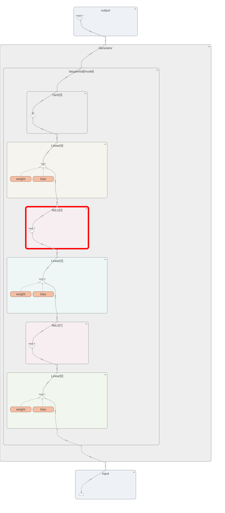
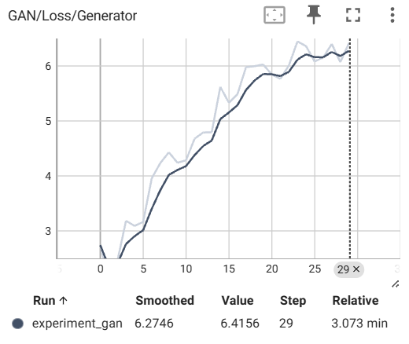
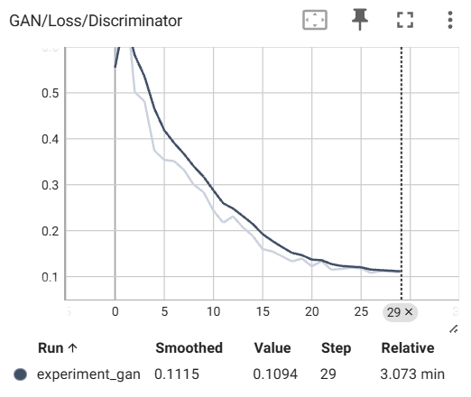
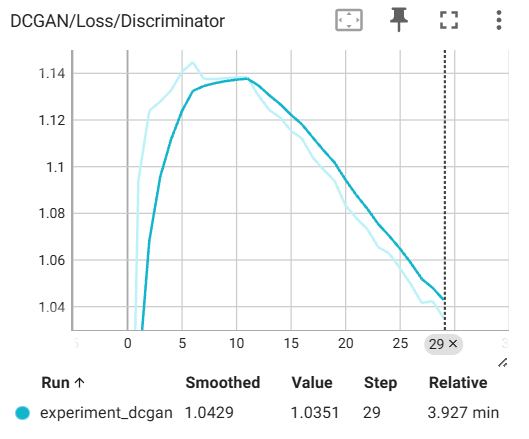
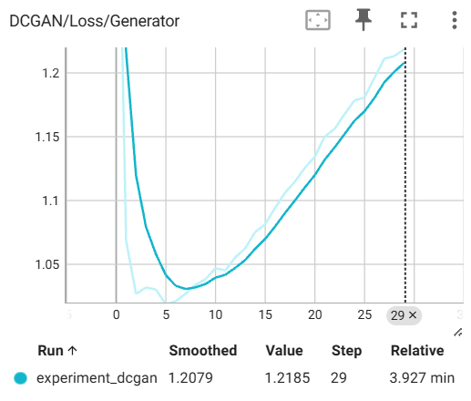
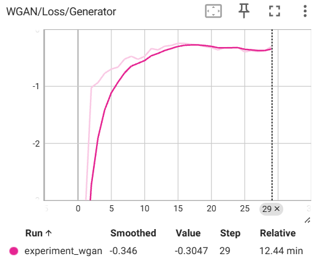
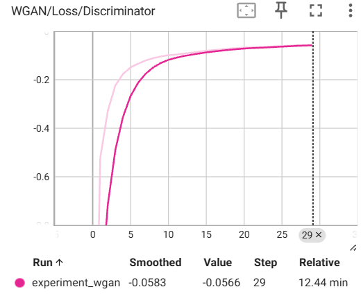
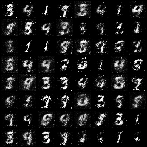
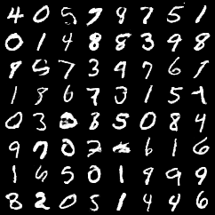
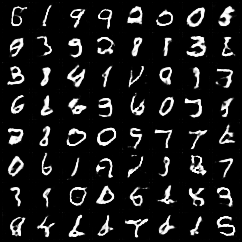

# 实验六：生成对抗网络（GAN）

## 实验任务一：生成对抗网络（GAN）

### 实现生成器代码：

```python
class Generator(nn.Module):
    def __init__(self, input_dim, hidden_dim, output_dim):
        super(Generator, self).__init__()
        self.model = nn.Sequential(
            # 使用线性层将随机噪声映射到第一个隐藏层
            nn.Linear(input_dim, hidden_dim),
            nn.ReLU(),      # 使用 ReLU 作为激活函数，帮助模型学习非线性特征
            # 使用线性层将第一个隐藏层映射到第二个隐藏层
            nn.Linear(hidden_dim, hidden_dim),
            nn.ReLU(),      # 再次使用 ReLU 激活函数
            # 使用线性层将第二个隐藏层映射到输出层，输出为图像的像素大小
            nn.Linear(hidden_dim, output_dim),
            nn.Tanh()       # 使用 Tanh 将输出归一化到 [-1, 1]，适用于图像生成
        )

    def forward(self, x):
        # 前向传播：将输入 x 通过模型进行计算，得到生成的图像、
        return self.model(x)
```

### 实现判别器代码：

```python
class Discriminator(nn.Module):
    def __init__(self, input_dim, hidden_dim):
        super(Discriminator, self).__init__()
        self.model = nn.Sequential(
            # 输入层到第一个隐藏层，使用线性层
            nn.Linear(input_dim, hidden_dim),
            # 使用 LeakyReLU 激活函数，避免梯度消失问题，negative_slope参数设置为0.1
            nn.LeakyReLU(0.1),
            # 第一个隐藏层到第二个隐藏层，使用线性层
            nn.Linear(hidden_dim, hidden_dim),
            # 再次使用 LeakyReLU 激活函数，negative_slope参数设置为0.1
            nn.LeakyReLU(0.1),
            # 第二个隐藏层到输出层，使用线性层
            nn.Linear(hidden_dim, 1),
            # 使用 Sigmoid 激活函数，将输出范围限制在 [0, 1]
            nn.Sigmoid()
        )

    def forward(self, x):
        # 前向传播：将输入 x 通过模型进行计算，得到判别结果
        return self.model(x)
```

> [!TIP]
>
> **思考题1**: 为什么 GAN 的训练被描述为一个对抗过程？这种对抗机制如何促进生成器的改进？

GAN 的训练过程是一个生成器（G）和判别器（D）的博弈过程。生成器的目标是生成足以欺骗判别器的假数据，而判别器的目标是准确区分真实数据和生成数据。这种对抗机制迫使生成器不断优化，生成更逼真的数据，直到判别器无法区分真假（达到纳什均衡）。通过交替优化两者的目标函数，生成器逐渐学习到真实数据分布，从而生成高质量样本。

> [!TIP]
>
> **思考题2**: ReLU 和 LeakyReLU 各有什么特征？为什么在生成器中使用 ReLU 而在判别器中使用 LeakyReLU？

- **ReLU**：在输入为正时保持线性，负时输出为 0。优点是计算高效且缓解梯度消失问题，但可能导致神经元“死亡”（即永远输出 0）。
- **LeakyReLU**：允许负值输入有一个小的斜率（如 0.01），避免神经元死亡，增强梯度传播。

在生成器中使用 ReLU 是为了快速学习非线性特征并生成数据；判别器使用 LeakyReLU 是为了避免梯度消失，尤其在处理负值输入时，确保判别器对假数据的敏感度，从而更稳定地提供梯度反馈供生成器改进。

### 定义主函数

```python
def main():

    # 设备配置：使用 GPU（如果可用），否则使用 CPU
    device = torch.device('cuda:0' if torch.cuda.is_available() else 'cpu')

    # 设置模型和训练的超参数
    input_dim = 100  # 生成器输入的随机噪声向量维度
    hidden_dim = 256  # 隐藏层维度
    output_dim = 28 * 28  # MNIST 数据集图像尺寸（28x28）
    batch_size = 128  # 训练时的批量大小
    num_epoch = 30 # 训练的总轮数
    
    # 加载 MNIST 数据集
    train_dataset = datasets.MNIST(root="./data/", train=True, transform=transforms.ToTensor(), download=True)
    train_loader = DataLoader(dataset=train_dataset, batch_size=batch_size, shuffle=True)

    # 创建生成器G和判别器D，并移动到 GPU（如果可用）
    # 生成器G
    G = Generator(input_dim, hidden_dim, output_dim).to(device)
    # 判别器D
    D = Discriminator(output_dim, hidden_dim).to(device)

    # 定义针对生成器G的优化器optim_G和针对判别器D的优化器optim_D，要求使用Adam优化器，学习率设置为0.0002
    # 生成器优化器optim_G
    optim_G = torch.optim.Adam(G.parameters(), lr=0.0002)
    # 判别器优化器optim_D
    optim_D = torch.optim.Adam(D.parameters(), lr=0.0002)


    loss_func = nn.BCELoss()  # 使用二元交叉熵损失

    # 初始化 TensorBoard
    writer = SummaryWriter(log_dir='./logs/experiment_gan')

    # 开始训练
    for epoch in range(num_epoch):
        total_loss_D, total_loss_G = 0, 0
        for i, (real_images, _) in enumerate(train_loader):
            loss_D = train_discriminator(real_images, D, G, loss_func, optim_D, batch_size, input_dim, device)  # 训练判别器
            loss_G = train_generator(D, G, loss_func, optim_G, batch_size, input_dim, device)  # 训练生成器

            total_loss_D += loss_D
            total_loss_G += loss_G

            # 每 100 步打印一次损失
            if (i + 1) % 100 == 0 or (i + 1) == len(train_loader):
                print(f'Epoch {epoch:02d} | Step {i + 1:04d} / {len(train_loader)} | Loss_D {total_loss_D / (i + 1):.4f} | Loss_G {total_loss_G / (i + 1):.4f}')

            # 记录每个epoch的平均损失到 TensorBoard
        writer.add_scalar('GAN/Loss/Discriminator', total_loss_D / len(train_loader), epoch)
        writer.add_scalar('GAN/Loss/Generator', total_loss_G / len(train_loader), epoch)

        # 生成并保存示例图像
        with torch.no_grad():
            noise = torch.randn(64, input_dim, device=device)
            fake_images = G(noise).view(-1, 1, 28, 28)  # 调整形状为图像格式

            # 记录生成的图像到 TensorBoard
            img_grid = torchvision.utils.make_grid(fake_images, normalize=True)
            writer.add_image('Generated Images', img_grid, epoch)
```

### 实现train_discriminator和train_generator

```python
def train_discriminator(real_images, D, G, loss_func, optim_D, batch_size, input_dim, device):
    '''训练判别器'''
    real_images = real_images.view(-1, 28 * 28).to(device)  # 获取真实图像并展平
    real_output = D(real_images)  # 判别器预测真实图像
    # 计算真实样本的损失real_loss
    real_loss = loss_func(real_output, torch.ones_like(real_output))

    noise = torch.randn(batch_size, input_dim, device=device)  # 生成随机噪声
    fake_images = G(noise).detach()  # 生成假图像（detach 避免梯度传递给 G）
    fake_output = D(fake_images)  # 判别器预测假图像
    # 计算假样本的损失fake_loss
    fake_loss = loss_func(fake_output, torch.zeros_like(fake_output))

    loss_D = real_loss + fake_loss  # 判别器总损失
    optim_D.zero_grad()  # 清空梯度
    loss_D.backward()  # 反向传播
    optim_D.step()  # 更新判别器参数

    return loss_D.item()  # 返回标量损失

def train_generator(D, G, loss_func, optim_G, batch_size, input_dim, device):
    '''训练生成器'''
    noise = torch.randn(batch_size, input_dim, device=device)  # 生成随机噪声
    fake_images = G(noise)  # 生成假图像
    fake_output = D(fake_images)  # 判别器对假图像的判断
    # 计算生成器损失（希望生成的图像判别为真）
    loss_G = loss_func(fake_output, torch.ones_like(fake_output))

    optim_G.zero_grad()  # 清空梯度
    loss_G.backward()  # 反向传播
    optim_G.step()  # 更新生成器参数

    return loss_G.item()  # 返回标量损失
```

> [!TIP]
>
> 思考题3: 尝试使用 TensorBoard 可视化 GAN 模型的生成器和判别器的模型结构图。



## 实验任务二：深度卷积对抗生成网络（DCGAN）

### 生成器

```python
class Generator(nn.Module):
    def __init__(self, input_dim):
        super(Generator, self).__init__()

        # 1. 输入层：将 100 维随机噪声投影到 32x32（1024 维）
        # 线性变换fc1，将输入噪声扩展到 1024 维
        self.fc1 = nn.Linear(input_dim, 1024)

        self.br1 = nn.Sequential(
            # 批归一化，加速训练并稳定收敛
            nn.BatchNorm1d(1024),
            # ReLU 激活函数，引入非线性
            nn.ReLU(inplace=True)
        )

        # 2. 第二层：将 1024 维数据映射到 128 * 7 * 7 维特征
        # 线性变换fc2，将数据变换为适合卷积层的维数大小
        self.fc2 = nn.Linear(1024, 128 * 7 * 7)

        self.br2 = nn.Sequential(
            # 批归一化
            nn.BatchNorm1d(128 * 7 * 7),
            # ReLU 激活函数
            nn.ReLU(inplace=True)
        )

        # 3. 反卷积层 1：上采样，输出 64 通道的 14×14 特征图
        self.conv1 = nn.Sequential(
            # 反卷积：将 7x7 放大到 14x14，kernel size设置为4，stride设置为2，padding设置为1
            nn.ConvTranspose2d(128, 64, kernel_size=4, stride=2, padding=1),
            # 归一化，稳定训练
            nn.BatchNorm2d(64),
            # ReLU 激活函数
            nn.ReLU(inplace=True)
        )

        # 4. 反卷积层 2：输出 1 通道的 28×28 图像
        self.conv2 = nn.Sequential(
            # 反卷积：将 14x14 放大到 28x28，将 7x7 放大到 14x14，kernel size设置为4，stride设置为2，padding设置为1
            nn.ConvTranspose2d(64, 1, kernel_size=4, stride=2, padding=1),
            # Sigmoid 激活函数，将输出归一化到 [0,1]
            nn.Sigmoid()
        )

    def forward(self, x):
        x = self.br1(self.fc1(x))  # 通过全连接层，进行 BatchNorm 和 ReLU 激活
        x = self.br2(self.fc2(x))  # 继续通过全连接层，进行 BatchNorm 和 ReLU 激活
        x = x.reshape(-1, 128, 7, 7)  # 变形为适合卷积输入的形状 (batch, 128, 7, 7)
        x = self.conv1(x)  # 反卷积：上采样到 14x14
        output = self.conv2(x)  # 反卷积：上采样到 28x28
        return output  # 返回生成的图像
```

### 判别器

```python
class Discriminator(nn.Module):
    def __init__(self):
        super(Discriminator, self).__init__()

        # 1. 第一层：输入 1 通道的 28x28 图像，输出 32 通道的特征图，然后通过MaxPool2d降采样
        self.conv1 = nn.Sequential(
            # 5x5 卷积核，步长为1
            nn.Conv2d(1, 32, kernel_size=5, stride=1),
            # LeakyReLU，negative_slope参数设置为0.1
            nn.LeakyReLU(0.1, inplace=True)
        )
        self.pl1 = nn.MaxPool2d(2, stride=2)

        # 2. 第二层：输入 32 通道，输出 64 通道特征, 然后通过MaxPool2d降采样
        self.conv2 = nn.Sequential(
            # 5x5 卷积核，步长为1
            nn.Conv2d(32, 64, kernel_size=5, stride=1),
            # LeakyReLU 激活函数，negative_slope参数设置为0.1
            nn.LeakyReLU(0.1, inplace=True)
        )
        self.pl2 = nn.MaxPool2d(2, stride=2)

        # 3. 全连接层 1：将 64x4x4 维特征图转换成 1024 维向量
        self.fc1 = nn.Sequential(
            # 线性变换，将 64x4x4 映射到 1024 维
            nn.Linear(64 * 4 * 4, 1024),
            # LeakyReLU 激活函数，negative_slope参数设置为0.1
            nn.LeakyReLU(0.1, inplace=True)
        )

        # 4. 全连接层 2：最终输出真假概率
        self.fc2 = nn.Sequential(
            # 线性变换，将 1024 维数据映射到 1 维
            nn.Linear(1024, 1),
            # Sigmoid 归一化到 [0,1] 作为概率输出
            nn.Sigmoid()
        )

    def forward(self, x):
        x = self.pl1(self.conv1(x))  # 第一层卷积，降维
        x = self.pl2(self.conv2(x))  # 第二层卷积，降维
        x = x.view(x.shape[0], -1)  # 展平成向量
        x = self.fc1(x)  # 通过全连接层
        output = self.fc2(x)  # 通过最后一层全连接层，输出真假概率
        return output  # 返回判别结果
```

训练过程及数据保存

```python
def train_discriminator(real_images, D, G, loss_func, optim_D, batch_size, input_dim, device):
    '''训练判别器'''
    real_images = real_images.to(device)
    real_labels = torch.ones(real_images.size(0), 1, device=device)
    real_output = D(real_images)
    real_loss = loss_func(real_output, real_labels)

    noise = torch.randn(batch_size, input_dim, device=device)
    fake_images = G(noise)
    fake_labels = torch.zeros(batch_size, 1, device=device)
    fake_output = D(fake_images)
    fake_loss = loss_func(fake_output, fake_labels)

    loss_D = real_loss + fake_loss
    optim_D.zero_grad()
    loss_D.backward()
    optim_D.step()

    return loss_D.item()

def train_generator(D, G, loss_func, optim_G, batch_size, input_dim, device):
    '''训练生成器'''
    noise = torch.randn(batch_size, input_dim, device=device)
    fake_labels = torch.ones(batch_size, 1, device=device)
    fake_images = G(noise)
    fake_output = D(fake_images)
    loss_G = loss_func(fake_output, fake_labels)

    optim_G.zero_grad()
    loss_G.backward()
    optim_G.step()

    return loss_G.item()

def main():
    # 设备配置：使用 GPU（如果可用），否则使用 CPU
    device = torch.device('cuda:0' if torch.cuda.is_available() else 'cpu')

    # 设定超参数
    input_dim = 100  # 生成器输入的随机噪声向量维度
    batch_size = 128  # 训练时的批量大小
    num_epoch = 30  # 训练的总轮数

    # 加载 MNIST 数据集
    train_dataset = datasets.MNIST(root="./data/", train=True, transform=transforms.ToTensor(), download=True)
    train_loader = DataLoader(dataset=train_dataset, batch_size=batch_size, shuffle=True)

    # 创建生成器和判别器，并移动到 GPU（如果可用）
    G = Generator(input_dim).to(device)
    D = Discriminator().to(device)

    # 定义优化器，优化器要求同任务一
    optim_G = torch.optim.Adam(G.parameters(), lr=0.0002, betas=(0.5, 0.999))
    optim_D = torch.optim.Adam(D.parameters(), lr=0.0002, betas=(0.5, 0.999))
    
    loss_func = nn.BCELoss()

    # 初始化 TensorBoard
    writer = SummaryWriter(log_dir='./logs/experiment_dcgan')

    # 开始训练
    for epoch in range(num_epoch):
        total_loss_D, total_loss_G = 0, 0
        for i, (real_images, _) in enumerate(train_loader):
            loss_D = train_discriminator(real_images, D, G, loss_func, optim_D, batch_size, input_dim, device)
            loss_G = train_generator(D, G, loss_func, optim_G, batch_size, input_dim, device)

            total_loss_D += loss_D
            total_loss_G += loss_G

            # 每 100 步打印一次损失
            if (i + 1) % 100 == 0 or (i + 1) == len(train_loader):
                print(f'Epoch {epoch:02d} | Step {i + 1:04d} / {len(train_loader)} | Loss_D {total_loss_D / (i + 1):.4f} | Loss_G {total_loss_G / (i + 1):.4f}')

        # 记录损失到 TensorBoard
        writer.add_scalar('DCGAN/Loss/Discriminator', total_loss_D / len(train_loader), epoch)
        writer.add_scalar('DCGAN/Loss/Generator', total_loss_G / len(train_loader), epoch)

        # 生成并保存示例图像
        with torch.no_grad():
            noise = torch.randn(64, input_dim, device=device)
            fake_images = G(noise)

            # 记录生成的图像到 TensorBoard
            img_grid = torchvision.utils.make_grid(fake_images, normalize=True)
            writer.add_image('Generated Images', img_grid, epoch)

    writer.close()
```

> [!TIP]
>
> 思考题1: DCGAN 与传统 GAN 的主要区别是什么？为什么 DCGAN 更适合图像生成任务？

DCGAN 与传统 GAN 的核心区别在于网络架构的设计理念。传统 GAN 主要依赖全连接层构建生成器和判别器，这种结构在处理图像数据时难以捕捉空间局部特征，导致生成的图像分辨率低且细节模糊。DCGAN 创新性地引入卷积神经网络，生成器使用反卷积层（转置卷积）逐步将随机噪声上采样为图像，判别器则通过卷积层提取多层次视觉特征进行真伪判断。这种设计使模型能够更好地理解图像的局部纹理和空间关系，例如生成器可以通过学习卷积核的权重逐步"绘制"出数字的笔画走向，判别器则能识别细微的图案异常。此外，DCGAN 通过批归一化、LeakyReLU 激活函数等技术优化了梯度流动，显著提升了训练稳定性。正是这些改进使得 DCGAN 能够生成更清晰、更具结构感的图像，在视觉质量上远超传统全连接架构的 GAN。

> [!TIP]
>
> 思考题2: DCGAN 的生成器和判别器分别使用了哪些关键的网络结构？这些结构如何影响生成效果？

在生成器中，反卷积层扮演着核心角色，它通过可学习的上采样过程将低维噪声转化为高分辨率图像。例如，一个精心设计的反卷积层可能使用 4x4 的卷积核配合步长 2，将 7x7 的特征图扩展为 14x14，这种逐步放大的机制模拟了人类绘画时从轮廓到细节的创作过程。判别器则采用带步长的卷积层，通过层级式特征提取捕获从简单边缘到复杂形状的视觉模式。批归一化的引入犹如给网络装上了稳定器，确保各层输入的分布一致性，使得深层网络能够稳定训练。LeakyReLU 激活函数在判别器中的使用则像设置了安全阀，在负值区域保留微小梯度流动，防止判别器过早"僵化"失去指导能力。这些结构共同作用，使生成器能更精准地重构数字的曲线特征，判别器则发展出更敏锐的细节鉴别力，形成良性的对抗提升循环。

> [!TIP]
>
> 思考题3: DCGAN 中为什么使用批归一化（Batch Normalization）？它对训练过程有什么影响？

批归一化在 DCGAN 中发挥着三重关键作用。首先，它通过对每层输入进行标准化处理，有效缓解了训练过程中因参数更新导致的内部协变量偏移问题，这类似于给神经网络的各层之间建立了统一的交流语言。其次，这种标准化操作使得各层的梯度传播更加平稳，允许使用更大的学习率而不引发梯度爆炸，相当于拓宽了模型训练的"安全速度范围"。更重要的是，在 GAN 特有的对抗训练框架下，生成器和判别器的能力平衡非常微妙，批归一化通过规范化特征尺度，防止任何一方过早占据绝对优势，维持了对抗博弈的持续性。实际训练中，这表现为损失曲线波动更小、模式崩溃现象减少，生成器能持续稳定地改进输出质量。此外，批归一化带来的轻微随机性还起到了正则化效果，增强了模型对噪声的鲁棒性，使得生成的数字笔画更加自然连贯。

## 实验任务三：WGAN

### 生成器

```python
class Generator(nn.Module):
    def __init__(self, input_dim):
        super(Generator, self).__init__()

        # 1. 输入层：将 100 维随机噪声从input_dim投影到 32x32（1024 维）
        # 线性变换fc1，将输入噪声扩展到 1024 维
        self.fc1 = nn.Linear(input_dim, 1024)

        self.br1 = nn.Sequential(
            # 批归一化，加速训练并稳定收敛
            nn.BatchNorm1d(1024),
            # ReLU 激活函数，引入非线性
            nn.ReLU(inplace=True)

        )

        # 2. 第二层：将 1024 维数据映射到 128 * 7 * 7 维
        # 线性变换，将数据变换为适合卷积层的维数大小
        self.fc2 = nn.Linear(1024, 128 * 7 * 7)

        self.br2 = nn.Sequential(
            # 批归一化
            nn.BatchNorm1d(128 * 7 * 7),
            # ReLU 激活函数
            nn.ReLU(inplace=True)
        )

        # 3. 反卷积层 1：上采样，输出 64 通道的 14×14 特征图
        self.conv1 = nn.Sequential(
            # 反卷积：将 7x7 放大到 14x14
            nn.ConvTranspose2d(128, 64, kernel_size=4, stride=2, padding=1),
            # 归一化，稳定训练
            nn.BatchNorm2d(64),
            # ReLU 激活函数
            nn.ReLU(inplace=True)
        )

        # 4. 反卷积层 2：输出 1 通道的 28×28 图像
        self.conv2 = nn.Sequential(
            # 反卷积：将 14x14 放大到 28x28
            nn.ConvTranspose2d(64, 1, kernel_size=4, stride=2, padding=1),
            # WGAN 需要使用 Tanh 激活函数，将输出范围限制在 [-1, 1]
            nn.Tanh()
        )

    def forward(self, x):
        x = self.br1(self.fc1(x))  # 通过全连接层，进行 BatchNorm 和 ReLU 激活
        x = self.br2(self.fc2(x))  # 继续通过全连接层，进行 BatchNorm 和 ReLU 激活
        x = x.reshape(-1, 128, 7, 7)  # 变形为适合卷积输入的形状 (batch, 128, 7, 7)
        x = self.conv1(x)  # 反卷积：上采样到 14x14
        output = self.conv2(x)  # 反卷积：上采样到 28x28
        return output  # 返回生成的图像
```

### 判别器

```python
class Discriminator(nn.Module):
    def __init__(self):
        super(Discriminator, self).__init__()

        # 1. 第一层：输入 1 通道的 28x28 图像，输出 32 通道的特征图，然后通过MaxPool2d降采样
        self.conv1 = nn.Sequential(
            # 5x5 卷积核，步长为1
            nn.Conv2d(1, 32, kernel_size=5, stride=1, padding=0),
            # LeakyReLU，negative_slope参数设置为0.1
            nn.LeakyReLU(0.1, inplace=True)
        )
        self.pl1 = nn.MaxPool2d(2, stride=2)

        # 2. 第二层：输入 32 通道，输出 64 通道特征, 然后通过MaxPool2d降采样
        self.conv2 = nn.Sequential(
            # 5x5 卷积核，步长为1
            nn.Conv2d(32, 64, kernel_size=5, stride=1, padding=0),
            # LeakyReLU 激活函数，negative_slope参数设置为0.1
            nn.LeakyReLU(0.1, inplace=True)
        )
        self.pl2 = nn.MaxPool2d(2, stride=2)

        # 3. 全连接层 1：将 64x4x4 维特征图转换成 1024 维向量
        self.fc1 = nn.Sequential(
            # 线性变换，将 64x4x4 映射到 1024 维
            nn.Linear(64 * 4 * 4, 1024),
            # LeakyReLU 激活函数
            nn.LeakyReLU(0.1, inplace=True)
        )

        # 4. 全连接层 2：最终输出
        # 输出一个标量作为判别结果
        self.fc2 = nn.Linear(1024, 1)

    def forward(self, x):
        x = self.pl1(self.conv1(x))  # 第一层卷积，降维
        x = self.pl2(self.conv2(x))  # 第二层卷积，降维
        x = x.view(x.shape[0], -1)  # 展平成向量
        x = self.fc1(x)  # 通过全连接层
        output = self.fc2(x)  # 通过最后一层全连接层，输出标量
        return output  # 返回判别结果
```

### 训练过程

```python
# =============================== 训练判别器 ===============================
def train_discriminator(real_images, D, G, optim_D, clip_value, batch_size, input_dim, device):
    '''训练判别器'''
    real_images = real_images.to(device)
    real_output = D(real_images)

    noise = torch.randn(batch_size, input_dim, device=device)
    fake_images = G(noise).detach()
    fake_output = D(fake_images)

    # 计算判别器的损失函数
    loss_D = -torch.mean(real_output) + torch.mean(fake_output)

    optim_D.zero_grad()
    loss_D.backward()
    optim_D.step()

    # 对判别器参数进行裁剪
    for p in D.parameters():
        p.data.clamp_(-clip_value, clip_value)

    return loss_D.item()

# =============================== 训练生成器 ===============================
def train_generator(D, G, optim_G, batch_size, input_dim, device):
    '''训练生成器'''
    noise = torch.randn(batch_size, input_dim, device=device)
    fake_images = G(noise)
    fake_output = D(fake_images)

    # 计算生成器的损失函数
    loss_G = -torch.mean(fake_output)

    optim_G.zero_grad()
    loss_G.backward()
    optim_G.step()

    return loss_G.item()
```

### 开始训练

```python
# =============================== 主函数 ===============================
def main():
    # 设备配置
    device = torch.device('cuda:0' if torch.cuda.is_available() else 'cpu')

    # 设定超参数
    input_dim = 100
    batch_size = 128
    num_epoch = 30
    clip_value = 0.01   # 判别器权重裁剪范围，确保满足 Lipschitz 条件

    # 加载 MNIST 数据集
    train_dataset = datasets.MNIST(root="./data/", train=True, transform=transforms.Compose([
        transforms.ToTensor(),
        transforms.Normalize((0.5,), (0.5,))
    ]), download=True)
    train_loader = DataLoader(dataset=train_dataset, batch_size=batch_size, shuffle=True)

    # 创建生成器G和判别器D，并移动到 GPU（如果可用）
    G = Generator(input_dim).to(device)
    D = Discriminator().to(device)
    
    # 定义优化器optim_G和optim_D：使用RMSprop，学习率设置为0.00005
    optim_G = torch.optim.RMSprop(G.parameters(), lr=0.00005)
    optim_D = torch.optim.RMSprop(D.parameters(), lr=0.00005)

    # 初始化 TensorBoard
    writer = SummaryWriter(log_dir='./logs/experiment_wgan')

    # 开始训练
    for epoch in range(num_epoch):
        total_loss_D, total_loss_G = 0, 0
        for i, (real_images, _) in enumerate(train_loader):
            # 判别器训练5次，然后训练生成器1次。提示：for循环，记得修改total_loss_D和total_loss_G的值
            # 判别器训练 5 次
            current_batch_size = real_images.size(0)
            
            # 训练判别器5次
            d_loss = 0.0
            for _ in range(5):
                loss_D = train_discriminator(
                    real_images, D, G, optim_D, clip_value, 
                    current_batch_size, input_dim, device
                )
                d_loss += loss_D
            total_loss_D += d_loss / 5  # 平均每次损失
            
            # 训练生成器1次
            loss_G = train_generator(D, G, optim_G, current_batch_size, input_dim, device)
            total_loss_G += loss_G

            # 每 100 步打印一次损失
            if (i + 1) % 100 == 0 or (i + 1) == len(train_loader):
                print(f'Epoch {epoch:02d} | Step {i + 1:04d} / {len(train_loader)} | Loss_D {total_loss_D / (i + 1):.4f} | Loss_G {total_loss_G / (i + 1):.4f}')

        # 记录损失到 TensorBoard
        writer.add_scalar('WGAN/Loss/Discriminator', total_loss_D / len(train_loader), epoch)
        writer.add_scalar('WGAN/Loss/Generator', total_loss_G / len(train_loader), epoch)

        # 生成并保存示例图像
        with torch.no_grad():
            noise = torch.randn(64, input_dim, device=device)
            fake_images = G(noise)

            # 记录生成的图像到 TensorBoard
            img_grid = torchvision.utils.make_grid(fake_images, normalize=True)
            writer.add_image('Generated Images', img_grid, epoch)

    writer.close()
```

> [!TIP]
>
> 思考题1: WGAN与原始GAN的主要区别是什么？为什么WGAN能够改善GAN的训练稳定性？

主要区别：

1. 损失函数：原始 GAN 使用 JS 散度（无法处理不重叠分布），WGAN 使用 Wasserstein 距离（对分布差异更敏感）。
2. 判别器设计：WGAN 的判别器（Critic）输出未归一化的实数评分，无需 Sigmoid 激活。
3. Lipschitz 约束：WGAN 通过权重裁剪或梯度惩罚强制判别器满足梯度平滑性，避免梯度爆炸/消失。

改善稳定性的原因：

1. 梯度有效性：Wasserstein 距离即使分布不重叠仍提供有效梯度，避免生成器“学不动”。
2. 约束机制：权重裁剪（或梯度惩罚）限制判别器更新幅度，确保训练过程平稳。
3. 模式覆盖：Wasserstein 距离鼓励生成器覆盖真实数据的所有模式，减少模式崩溃。

> [!TIP]
>
> 思考题2: 对于每个 GAN 模型（GAN， DCGAN， WGAN），在报告中展示 TensorBoard 中记录的损失函数变化曲线图和不同 epoch 时输出的图像（分别添加在 epoch 总数的 0%、25%、50%、75%、100% 处输出的图像）；直观分析损失函数的变化趋势和生成图像的变化趋势。

|       |                            生成器                            |                            判别器                            |
| :---: | :----------------------------------------------------------: | :----------------------------------------------------------: |
|  GAN  |  |  |
| DCGAN |  |  |
| WGAN  |  |  |

1. **GAN**
   - **损失曲线**：D_loss 和 G_loss 震荡明显
   - 生成图像：
     - Epoch 0%（初始）：随机噪声
     - Epoch 25%：模糊数字轮廓
     - Epoch 50%：可识别但边缘粗糙
     - Epoch 75%：质量波动，部分退化
     - Epoch 100%：部分清晰，多样性不足
   - 原因：全连接结构难以捕捉空间特征，JS 散度导致梯度不稳定
2. **DCGAN**
   - **损失曲线**：D_loss 和 G_loss 更平滑，收敛更快
   - 生成图像：
     - Epoch 25%：清晰笔画出现
     - Epoch 50%：多数数字结构正确
     - Epoch 100%：边缘锐利，接近真实数据
   - 原因：卷积层提取局部特征，BatchNorm稳定训练
3. **WGAN**
   - **损失曲线**：D_loss 持续下降，G_loss 缓慢上升
   - 生成图像：
     - Epoch 25%：多样性高但质量一般
     - Epoch 75%：稳定提升，较少模式重复
     - Epoch 100%：质量均匀，覆盖更多数字变体
   - 原因：Wasserstein距离提供有效梯度，权重裁剪防止过拟合

> [!TIP]
>
> 思考题3: 尝试调整超参数提升生成图片的质量。从生成的图片上直观来看，GAN，DCGAN 和 WGAN 的效果有什么差别？你认为是什么导致了这种差别？

|                             GAN                              |                            DCGAN                             |                             WGAN                             |
| :----------------------------------------------------------: | :----------------------------------------------------------: | :----------------------------------------------------------: |
|  |  |  |

- **GAN**：图像较模糊，易模式崩溃。
- **DCGAN**：清晰但多样性有限。
- **WGAN**：质量高且多样，训练稳定。
- 差异源于损失函数和训练机制，WGAN 的 Wasserstein 距离和权重裁剪提升稳定性和覆盖度。
