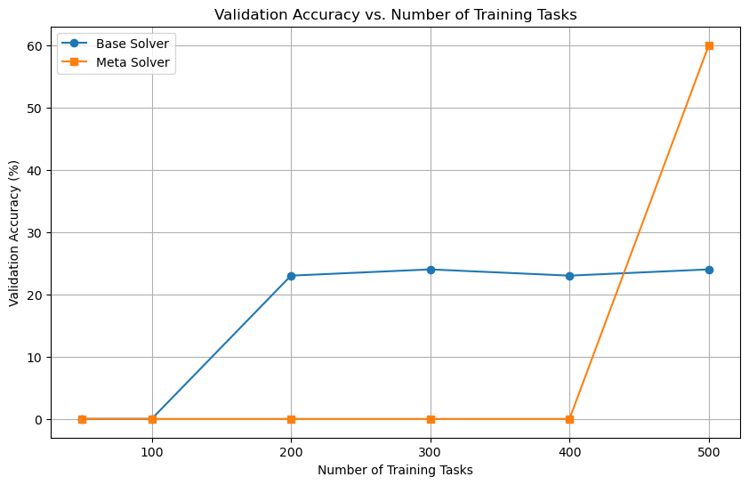

# 实验七：迁移学习和元学习实践

## 1. 验证集准确率和任务数量的关系图



验证集准确率与任务数量呈现正相关关系，MAML 在任务数量充足时表现出更强的泛化能力和更高的最终准确率。


## 2. 使用 MAML 时可能出现的问题、原因分析与解决方法

### 问题

MAML 在展开内循环的多个梯度更新步骤时，容易出现梯度爆炸或消失的问题。这主要由以下原因导致：

1. **深度结构缺陷**：MAML 默认使用的 4 层卷积网络缺乏跳跃连接，梯度在多层反向传播中反复相乘（尤其是使用相同参数多次），导致梯度幅值失控。
2. **批归一化参数共享**：所有内循环步骤共享同一组批归一化的偏置（bias），但不同步骤的模型参数差异会导致特征分布剧烈变化，而固定的归一化参数无法适应这种变化。
3. **元梯度传播路径过长**：展开多个内循环步骤后，元梯度需要反向传播经过所有步骤的网络，梯度计算链式法则的累积效应会放大不稳定性。

### 原因分析

训练不稳定性源于**梯度传播的脆弱性**和**归一化参数的不匹配**：

- **梯度问题**：MAML 在元优化时需要计算二阶导数（即对初始化参数的梯度），而展开多个内循环步骤的反向传播会导致梯度计算路径过长。若网络层数较深且无残差连接，梯度可能在传播过程中指数级增长或衰减。
- **归一化问题**：MAML 默认使用当前批次的统计量（如均值、方差）做批归一化，而非累积的全局统计量。这导致不同内循环步骤的归一化参数差异过大，加剧了特征分布的不一致性。

### 解决方法

论文提出的 **MAML++** 通过以下改进解决此问题：

1. **多步损失优化（Multi-Step Loss Optimization, MSL）**

   - **操作**：在元目标函数中，对每个内循环步骤的损失加权求和，而非仅使用最后一步的损失。

   - **作用**：梯度通过每个内循环步骤的损失直接回传，缩短梯度路径，避免长链式传播的不稳定性。

   - **公式**：
     $$
     \theta=\theta-\beta\nabla_\theta\sum_{b=1}^B\sum_{i=0}^Nv_i\mathcal{L}_{T_b}(f_{\theta_i^b})
     $$
      其中 $v_i$ 为第 $i$ 步损失的权重，逐步衰减早期权重以聚焦后期优化。

2. **每步独立批归一化参数（Per-Step Batch Normalization）**

   - **操作**：为每个内循环步骤独立维护批归一化的运行统计量（均值、方差）和可学习参数（偏置、缩放因子）。
   - **作用**：适应不同步骤的特征分布变化，避免参数共享导致的分布偏移问题。

3. **动态元学习率（Cosine Annealing Meta-LR）**

   - **操作**：对外循环的元学习率使用余弦退火调度，而非固定值。
   - **作用**：平衡探索与收敛，避免固定学习率在后期优化时陷入局部最优或震荡。

4. **梯度阶数退火（Derivative-Order Annealing, DA）**

   - **操作**：训练前期使用一阶近似（忽略二阶导数），后期切换为精确二阶梯度。
   - **作用**：减少早期计算开销，同时后期保留高阶梯度信息以提升泛化性能。


## 3. 原代码改进

最终的测试准确率如下：

```
Meta Test Accuracy: 81.84%
Base Test Accuracy: 62.03%
```

为了达到基线模型准确率超过 60% 且MAML准确率超过 70% 的目标，我们对模型结构、超参数和训练策略进行了以下改进：

**超参数调整**

```python
n_way = 5
k_shot = 1
q_query = 1
train_inner_train_step = 5   # 增加内循环步数
val_inner_train_step = 10
inner_lr = 0.5               # 内循环学习率
meta_lr = 0.003              # 元学习率
meta_batch_size = 64         # 增大批量
max_epoch = 60              # 延长训练周期
```

- **内循环训练步数不足**：增加内循环训练步数（从 1 到 5）以更好地适应任务
- **元学习率调整**：提高元学习率（0.001→0.003）以加速收敛
- **批量大小不足**：增大元批量大小（32→64）稳定训练
- **训练轮次不足**：延长训练周期（30→60）确保充分收敛

**数据增强部分**

```python
class Omniglot(Dataset):
    def __init__(self, data_dir, k_shot, q_query, task_num=None):
        self.transform = transforms.Compose([
            transforms.ToTensor(),
            transforms.RandomRotation(15)  # 添加随机旋转
        ])
```

- 15 度的随机旋转增强了模型对字符方向变化的鲁棒性

**测试阶段调整**

```python
test_inner_train_step = 30  # 增加测试适应步数
```
