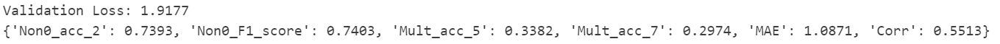
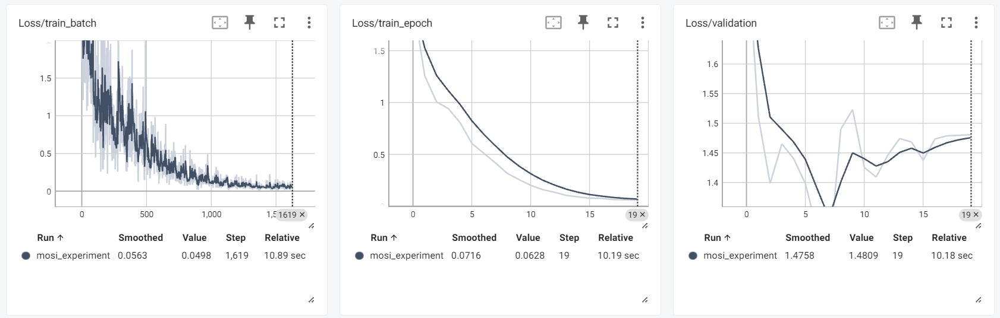
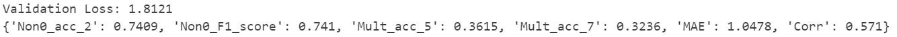
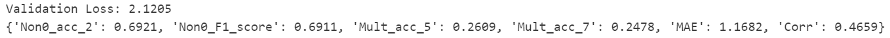
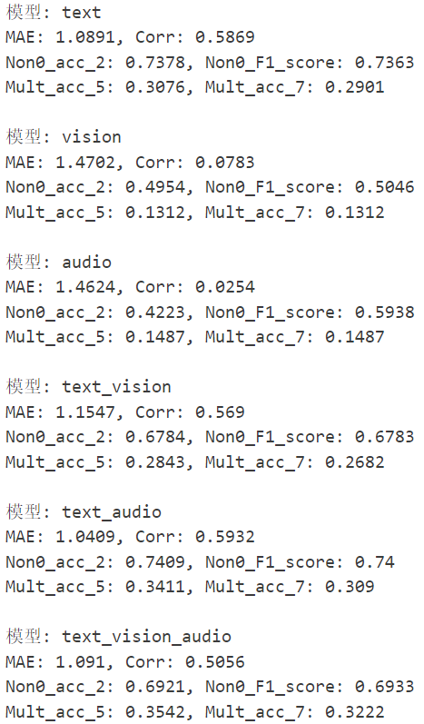
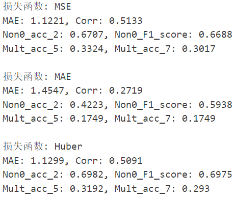
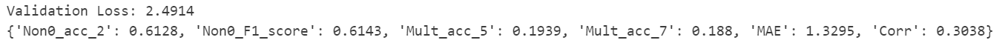
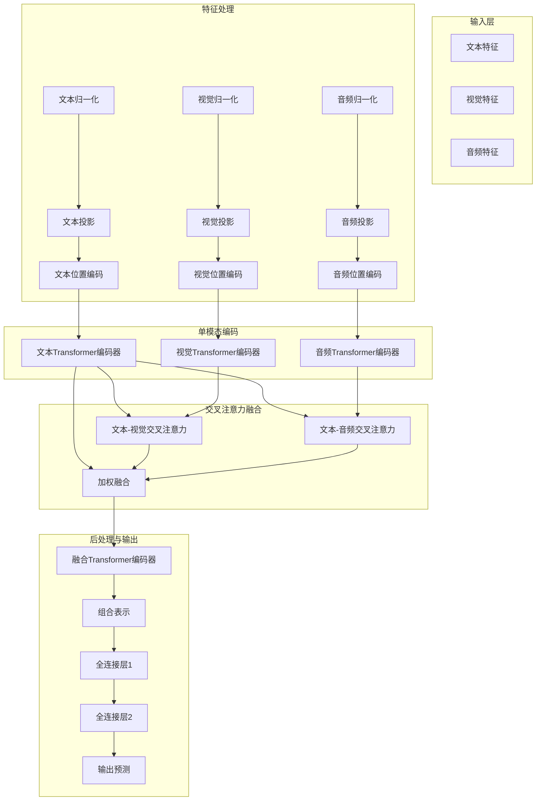
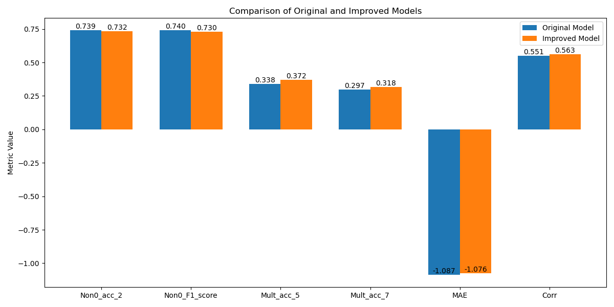

# 实验任务：多模态情感分析

## LSTM 模型具体实现过程

### 数据集加载

```python
class MOSIDataset(Dataset):
    def __init__(self, data_path, split='train'):
        # Load the data from the pickle file
        with open(data_path, 'rb') as f:
            data = pickle.load(f)
        
        # Select the appropriate split
        self.vision = data[split]['vision']
        self.text = data[split]['text']
        self.audio = data[split]['audio']
        self.labels = data[split]['labels']
        self.ids = data[split]['id']

        # audio数据中存在坏点需要处理：
        self.audio[self.audio == float('inf')] = 0.0
        self.audio[self.audio == float('-inf')] = 0.0

    def __len__(self):
        return len(self.labels)

    def __getitem__(self, idx):
        # Extract the features and label for the given index
        vision = torch.tensor(self.vision[idx], dtype=torch.float32)
        text = torch.tensor(self.text[idx], dtype=torch.float32)
        audio = torch.tensor(self.audio[idx], dtype=torch.float32)
        label = torch.tensor(self.labels[idx], dtype=torch.float32).squeeze()

        return vision, text, audio, label
```

### 模型构建

```python
class MultimodalSentimentAnalysisModel(nn.Module):
    def __init__(self):
        super(MultimodalSentimentAnalysisModel, self).__init__()
 
        self.vision_norm = nn.LayerNorm(35)
        self.text_norm = nn.LayerNorm(300)
        self.audio_norm = nn.LayerNorm(74)
        
        self.vision_fc = nn.Linear(35, 128)
        self.text_fc = nn.Linear(300, 128)
        self.audio_fc = nn.Linear(74, 128)
        
        # 定义vision_lstm, text_lstm 和 audio_lstm和融合层mm_lstm. 要求hidden_size=128, num_layers=1, dropout=0.1, batch_first=True
        self.vision_lstm = nn.LSTM(input_size=128, hidden_size=128, num_layers=1, dropout=0.1, batch_first=True)
        self.text_lstm = nn.LSTM(input_size=128, hidden_size=128, num_layers=1, dropout=0.1, batch_first=True)
        self.audio_lstm = nn.LSTM(input_size=128, hidden_size=128, num_layers=1, dropout=0.1, batch_first=True)
        self.mm_lstm = nn.LSTM(input_size=128, hidden_size=128, num_layers=1, dropout=0.1, batch_first=True)
        
        # Define a fully connected layer for fusion
        self.fc = nn.Linear(128, 1)
        
    def forward(self, vision, text, audio):

        # apply layernorm 
        vision = self.vision_norm(vision)
        text = self.text_norm(text)
        audio = self.audio_norm(audio)
        
        # Process each modality
        vision = F.relu(self.vision_fc(vision))
        text = F.relu(self.text_fc(text))
        audio = F.relu(self.audio_fc(audio))
        
        # LSTM for temporal processing
        output_v, (vision_h, _) = self.vision_lstm(vision)
        output_t, (text_h, _) = self.text_lstm(text)
        output_a, (audio_h, _) = self.audio_lstm(audio)

        # 对单模态的LSTM输出进行直接相加得到feature
        feature = output_v + output_t + output_a
        _, (fusion_tensor, _) = self.mm_lstm(feature)

        # Concatenate the final hidden states
        output = self.fc(fusion_tensor[-1])
        
        # Apply sigmoid to constrain output to (0, 1)
        output = torch.sigmoid(output)
        # Scale and shift to range (-3, 3)
        output = output * 6 - 3

        return output
```

### 评价指标

```python
def eval_mosi_regression(y_pred, y_true, exclude_zero=False):
    test_preds = y_pred.view(-1).cpu().detach().numpy()
    test_truth = y_true.view(-1).cpu().detach().numpy()

    test_preds_a7 = np.clip(test_preds, a_min=-3., a_max=3.)
    test_truth_a7 = np.clip(test_truth, a_min=-3., a_max=3.)
    test_preds_a5 = np.clip(test_preds, a_min=-2., a_max=2.)
    test_truth_a5 = np.clip(test_truth, a_min=-2., a_max=2.)

    mae = np.mean(np.absolute(test_preds - test_truth))
    corr = np.corrcoef(test_preds, test_truth)[0][1]
    mult_a7 = multiclass_acc(test_preds_a7, test_truth_a7)
    mult_a5 = multiclass_acc(test_preds_a5, test_truth_a5)
    
    non_zeros = np.array([i for i, e in enumerate(test_truth) if e != 0])
    non_zeros_binary_truth = (test_truth[non_zeros] > 0)
    non_zeros_binary_preds = (test_preds[non_zeros] > 0)

    non_zeros_acc2 = accuracy_score(non_zeros_binary_preds, non_zeros_binary_truth)
    non_zeros_f1_score = f1_score(non_zeros_binary_preds, non_zeros_binary_truth, average='weighted')
    
    eval_results = {
        "Non0_acc_2": round(float(non_zeros_acc2), 4),
        "Non0_F1_score": round(float(non_zeros_f1_score), 4),
        "Mult_acc_5": round(float(mult_a5), 4),
        "Mult_acc_7": round(float(mult_a7), 4),
        "MAE": round(float(mae), 4),
        "Corr": round(float(corr), 4)
    }   
    return eval_results

def multiclass_acc(y_pred, y_true):
    y_pred = np.round(y_pred)
    y_true = np.round(y_true)

    # Compute the accuracy
    acc = np.mean(np.equal(y_pred, y_true))
    
    return acc
```

### 模型训练

```python
def train_model(model, train_loader, valid_loader, criterion, optimizer, scheduler, device, epochs):
    model.to(device)

    best_corr = 0.
    best_epoch = 0

    for epoch in range(epochs):
        model.train()
        running_loss = 0.0

        for i, (vision, text, audio, labels) in enumerate(train_loader):
            vision, text, audio, labels = vision.to(device), text.to(device), audio.to(device), labels.to(device)

            optimizer.zero_grad()

            # 模型前向获得输出：
            outputs = model(vision, text, audio)
            # 计算损失：
            loss = criterion(outputs.squeeze(), labels.squeeze())
            # 反向传播，计算梯度
            loss.backward()
            
            optimizer.step()
            scheduler.step()

            running_loss += loss.item()

        print(f'Epoch [{epoch+1}/{epochs}], Loss: {running_loss/len(train_loader):.4f}')

        val_corr = validate_model(model, valid_loader, criterion, device)

        if val_corr > best_corr:
            best_corr = val_corr
            best_epoch = epoch
            torch.save(model.state_dict(), 'best_model.pth')

    print(f"Best model saved with val_corr {best_corr} at epoch {best_epoch}.")
```

### 模型验证

```python
def validate_model(model, valid_loader, criterion, device):
    model.eval()
    valid_loss = 0.0

    all_preds = []
    all_labels = []
    
    with torch.no_grad():
        for vision, text, audio, labels in valid_loader:
            vision, text, audio, labels = vision.to(device), text.to(device), audio.to(device), labels.to(device)

            outputs = model(vision, text, audio)
            loss = criterion(outputs.squeeze(), labels.squeeze())

            valid_loss += loss.item()

            all_preds.append(outputs)
            all_labels.append(labels)

    print(f'Validation Loss: {valid_loss/len(valid_loader):.4f}')
    
    all_preds = torch.cat(all_preds, dim=0)
    all_labels = torch.cat(all_labels, dim=0)

    # 计算评价指标
    eval_results = eval_mosi_regression(all_preds, all_labels)
    print(eval_results)

    return eval_results["Corr"]
```

### 主函数

```python
def main():
    
    # 固定随机数种子，确保实验结果可重复性
    seed = 42
    random.seed(seed)
    np.random.seed(seed)
    torch.manual_seed(seed)
    if torch.cuda.is_available():
        torch.cuda.manual_seed(seed)
        torch.cuda.manual_seed_all(seed)
    
    device = torch.device('cuda:0' if torch.cuda.is_available() else 'cpu')
    print(device)
    
    # 定义损失函数criterion, 使用均方误差损失。可以使用pytorch封装好的函数，也可以根据公式手写：
    criterion = nn.MSELoss()
    
    learning_rate = 1e-3
    epochs = 20
    
    # Initialize the model.
    model = MultimodalSentimentAnalysisModel()
    
    data_path = './mosi_raw.pkl'
    # 初始化训练集和验证集的数据集类
    train_dataset = MOSIDataset(data_path, split='train')
    valid_dataset = MOSIDataset(data_path, split='valid')
    # 初始化训练集和验证集的加载器，要求batch_size=16
    train_loader = DataLoader(train_dataset, batch_size=16, shuffle=True)
    valid_loader = DataLoader(valid_dataset, batch_size=16, shuffle=False)

    # Initialize the optimizer and scheduler.
    optimizer = optim.Adam(model.parameters(), lr=learning_rate)
    scheduler = CosineAnnealingLR(optimizer, T_max=epochs*len(train_loader))

    # 调用训练函数，注意传入对应参数：
    train_model(model, train_loader, valid_loader, criterion, optimizer, scheduler, device, epochs)

    # 加载最佳epoch参数
    best_model_state = torch.load('best_model.pth')
    model.load_state_dict(best_model_state)

    # 初始化测试集的数据集类和加载器
    test_dataset = MOSIDataset(data_path, split='test')
    test_loader = DataLoader(test_dataset, batch_size=16, shuffle=False)
    
    print("\n========== test results: ==========\n")
    validate_model(model, test_loader, criterion, device)
```

### 实验结果



## 思考题

### Tensorboard 记录

> [!TIP]
>
> **思考题 1：在上述代码的基础上，使用 tensorboard 记录训练过程在训练集和验证集上的损失变化曲线，分析损失变化趋势不同的原因。使用 tensorboard 输出模型结构图。**

**实验结果**：


**训练集和验证集损失变化趋势**：

我们发现出现了过拟合现象：训练集损失持续下降，而验证集损失在一定迭代次数后开始上升，这表明模型开始记忆训练数据的特定模式，而不是学习可泛化的特征。在多模态情感分析任务中，模型可能过度拟合某些模态的特征表示。

**原因分析**：

- 采用的 CosineAnnealingLR 学习率调度策略会导致学习率周期性变化：
  - 学习率下降期间，训练损失快速下降
  - 学习率上升期间，训练损失出现短暂上升
  - 验证损失不受这种周期性波动的直接影响，表现地更平滑
- 模型中使用的正则化机制在训练和验证阶段的行为不同：

  - 训练时，dropout 随机丢弃一部分神经元，增加了训练难度
  - 验证时，dropout 被禁用，全部神经元参与计算。这会导致训练损失相对较高，而验证损失相对较低

### 消融实验分析

#### Transformer encoder

> [!TIP]
>
> **思考题 2-1：在原模型的基础上，使用 Transformer encoder 替换上述模型中的 LSTM，记录并分析实验结果。可以使用 pytorch 封装好的模型，也可以自己手写 Transformer。由于处理的对象是时序数据，因此不要忘记使用位置编码（position encoding）。**

**实验结果**：


```
Validation Loss: 1.8121
{'Non0_acc_2': 0.7409, 'Non0_F1_score': 0.741, 'Mult_acc_5': 0.3615, 'Mult_acc_7': 0.3236, 'MAE': 1.0478, 'Corr': 0.571}
```

#### 移除 Layernorm

> [!TIP]
>
> **思考题 2-2：模型中使用 Layernorm 的目的是什么？对比原模型和移除 Layernorm 层以后的实验结果差异。**

**实验结果**：


```
Validation Loss: 2.1205
{'Non0_acc_2': 0.6921, 'Non0_F1_score': 0.6911, 'Mult_acc_5': 0.2609, 'Mult_acc_7': 0.2478, 'MAE': 1.1682, 'Corr': 0.4659}
```

**LayerNorm 的作用及结果分析**：

1. 训练稳定性：从训练日志可以看出，移除 LayerNorm 后，训练损失在前 15 个 epoch 保持较高水平（>2.0），然后在后几个 epoch 才开始下降。这表明没有 LayerNorm 时训练过程不够稳定，需要更长时间才能开始有效学习。
2. 收敛速度：有 LayerNorm 的模型通常能更快收敛。没有 LayerNorm 的模型在前 15 个 epoch 几乎没有什么进展，相关系数（Corr）在 0.1-0.4 之间波动。
3. 最终性能：令人意外的是，在 20 个 epoch 后，没有 LayerNorm 的模型在验证集上达到了 Corr=0.6125，这实际上比有 LayerNorm 的模型（Corr=0.571）更好。这可能是因为：
   - 更长的训练时间可能弥补了初期收敛慢的问题
   - 特定的数据集特性可能与无LayerNorm的架构更匹配

#### 单模态 / 双模态 / 三模态

> [!TIP]
>
> **思考题 2-3：在原模型的基础上移除对应模块，对比只使用 text 输入，只使用 vision 输入，只使用 audio 输入，和使用 text+vision 输入，使用text+audio 输入和使用全部模态输入的实验结果差别，并分析实验结果。**

| **实验结果**：                                               | 分析：                                                       |
| ------------------------------------------------------------ | ------------------------------------------------------------ |
|  | **单模态性能分析**：<br/><br/>1. **文本模态（text）**：<br/>   - 性能最佳：MAE=1.0891，Corr=0.5869，Non0_acc_2=0.7378<br/>   - 文本是情感分析中最重要的信息载体，能有效捕捉语义和情感表达<br/>   - 验证了语言表达在情感传递中的核心地位<br/><br/>2. **视觉模态（vision）**：<br/>   - 性能最差：MAE=1.4702，Corr=0.0783，Non0_acc_2=0.4954<br/>   - 相关系数接近于 0，说明视觉特征与情感标签几乎无相关性<br/>   - 可能是因为提取的面部特征无法准确反映说话者的真实情感<br/><br/>3. **音频模态（audio）**：<br/>   - 性能同样较差：MAE=1.4624，Corr=0.0254，Non0_acc_2=0.4223<br/>   - 二分类准确率甚至低于视觉模态，表明音频特征可能存在更大噪声<br/><br/>**双模态组合分析**：<br/><br/>1. **文本+视觉（text_vision）**：<br/>   - 性能适中：MAE=1.1547，Corr=0.5690，Non0_acc_2=0.6784<br/>   - 相关系数实际上低于单独使用文本，表明视觉特征可能引入了干扰<br/>   - 二分类准确率明显下降，从 0.7378 降至 0.6784<br/><br/>2. **文本+音频（text_audio）**：<br/>   - 性能优秀：MAE=1.0409，Corr=0.5932，Non0_acc_2=0.7409<br/>   - 相关系数高于单独文本，说明音频特征能够提供有价值的补充信息<br/>   - 相比单文本，MAE 降低，准确率提高，证明音频和文本有良好的互补性<br/><br/>**三模态融合分析**：<br/><br/>   - 总体性能：MAE=1.0910，Corr=0.5056，Non0_acc_2=0.6921<br/>   - 出乎意料地，性能低于单文本模态和文本+音频组合<br/>   - 相关系数明显下降，表明简单融合三种模态可能导致信息干扰<br/>   - 多分类任务性能相对较好，说明多模态对细粒度情感区分有帮助 |

#### MSE / MAE / Huber

> [!TIP]
>
> **思考题 2-4：在原模型的基础上，将损失函数从均方误差损失（Mean Square Error）替换成绝对误差损失（Mean Absolute Error， MAE）和平滑 L1 损失（Huber Loss），对比实验结果差异。**

**实验结果**：


#### 注意力融合

> [!TIP]
>
> **思考题 2-5：在原模型的基础上，将特征融合方式从【简单相加+LSTM】替换成基于注意力机制（参考实验五）的融合方式。例如，你可以通过对于不同模态的特征相加或拼接和进行 self-attention，或者在不同模态之间进行 cross-attention。在实验报告中描述你的方案并记录实验结果。**

**实验结果**：


**实现方案**

1. 我设计了一个专门的 CrossModalAttention 类来实现不同模态之间的交互，它基于多头注意力机制，能够让一个模态"关注"另一个模态中的相关信息。具体实现有：

   - 文本-视觉交叉注意力：文本特征作为查询，视觉特征作为键和值


   - 文本-音频交叉注意力：文本特征作为查询，音频特征作为键和值


   - 视觉-音频交叉注意力：视觉特征作为查询，音频特征作为键和值


2. 多模态融合流程
   1. 模态内部编码：每个模态（视觉、文本、音频）先通过各自的 Transformer 编码器，捕获模态内部的时序关系
   2. 跨模态交叉注意力：将三对模态之间进行交叉注意力计算，这样让每个模态能够"关注"到其他模态中的重要信息，保留了原始的模态特征，同时引入了不同模态间的交互
   3. 特征融合与整合：将所有交叉注意力的结果进行拼接；通过线性投影将拼接维度映射回原始维度；使用融合 Transformer 对综合特征进行自注意力处理，进一步整合不同模态的信息


### 改进的多模态情感分析模型设计

> [!TIP]
>
> **思考题 3：结合上述分析，设计一个相比于原模型表现更好的多模态情感分析模型。你可以通过替换单模态编码模型、损失函数、多模态融合方式，或者综合几种方法来获得更好的性能表现。在报告中结合图示或者公式详细描述你的模型设计，指出你的模型相比原模型的改进之处，并和原模型进行实验结果对比。请将模型代码包含在 EXP_MSA.ipynb 文件或者提交新的 ipynb 文件。**

#### 模型架构



#### 模型数学表示

**1. 特征处理**

对每个模态的特征进行归一化和投影：

$$
\begin{align}
\hat{T} &= \text{LayerNorm}(T) \\
\hat{V} &= \text{LayerNorm}(V) \\
\hat{A} &= \text{LayerNorm}(A) \\
\end{align}
$$
投影到共同的特征空间：

$$
\begin{align}
T' &= \text{ReLU}(W_T\hat{T} + b_T) \\
V' &= \text{ReLU}(W_V\hat{V} + b_V) \\
A' &= \text{ReLU}(W_A\hat{A} + b_A) \\
\end{align}
$$
**2. 单模态编码**

通过Transformer编码器处理每个模态：

$$
\begin{align}
T_E &= \text{TransformerEncoder}(\text{PE}(T')) \\
V_E &= \text{TransformerEncoder}(\text{PE}(V')) \\
A_E &= \text{TransformerEncoder}(\text{PE}(A')) \\
\end{align}
$$
其中$\text{PE}$是位置编码函数。

**3. 交叉注意力融合**

文本与视觉交叉注意力：

$$
T2V = \text{MultiHeadAttention}(Q=T_E, K=V_E, V=V_E)
$$
文本与音频交叉注意力：

$$
T2A = \text{MultiHeadAttention}(Q=T_E, K=A_E, V=A_E)
$$
加权融合特征：

$$
F = \alpha \cdot T_E + \beta \cdot T2V + \gamma \cdot T2A
$$
其中 $\alpha=0.4, \beta=0.3, \gamma=0.3$ 是三个模态特征的固定权重。

**4. 后处理与输出**

融合编码器进一步处理：

$$
F_E = \text{TransformerEncoder}(F)
$$
组合表示（最后时间步和平均池化）：

$$
R = \frac{F_E[:,-1] + \text{mean}(F_E, \text{dim}=1)}{2}
$$
输出预测：

$$
\begin{align}
Z &= \text{ReLU}(W_1 R + b_1) \\
\hat{y} &= W_2 Z + b_2 \\
y &= 6 \cdot \text{sigmoid}(\hat{y}) - 3
\end{align}
$$
**5. 损失函数设计**

组合损失函数结合了MSE、L1和Smooth L1损失：

$$
\mathcal{L} = \alpha \cdot \mathcal{L}_{\text{MSE}} + \beta \cdot \mathcal{L}_{\text{L1}} + \gamma \cdot \mathcal{L}_{\text{Smooth L1}}
$$
其中 $\alpha=0.6, \beta=0.3, \gamma=0.1$。

#### 改进之处

1. 架构简化

   - **原模型**：使用LSTM和简单加法融合或复杂的双向交叉注意力机制和门控融合

   - **改进模型**：以文本为中心的单向交叉注意力和固定权重融合


2. 融合策略优化

   - **原模型**：模态间简单相加或复杂门控机制，可能导致过拟合

   - **改进模型**：
     - 文本作为核心模态（权重 0.4）
     - 只关注文本对其他模态的注意力
     - 固定融合权重避免过拟合


3. 特征表示增强

   - **原模型**：只使用序列最后一个时间步作为特征表示

   - **改进模型**：结合最后时间步与平均池化，捕获更全面的序列信息


4. 损失函数调整

   - **原模型**：单一MSE损失或权重均衡的多损失组合

   - **改进模型**：更强调MSE损失（权重0.6），减轻Smooth L1损失（权重0.1）


5. 超参数优化

   - 降低模型复杂度：注意力头数减少为 4

   - 减小前馈网络尺寸：从 4 倍降至 2 倍特征维度

   - 降低 dropout 率：0.2→0.1，减少训练波动


#### 结果对比



