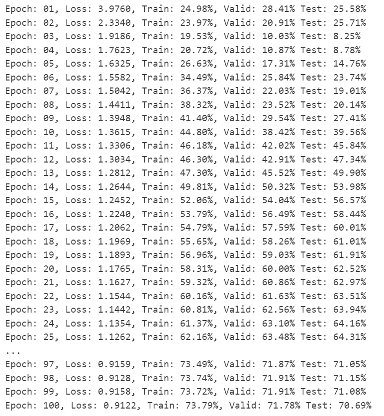
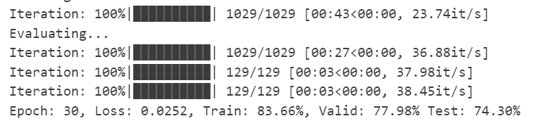
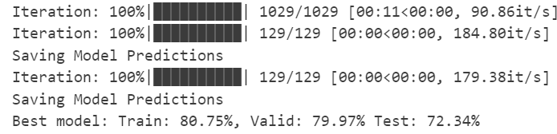
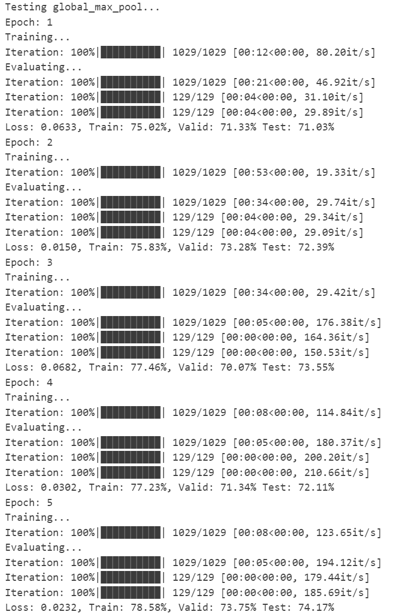
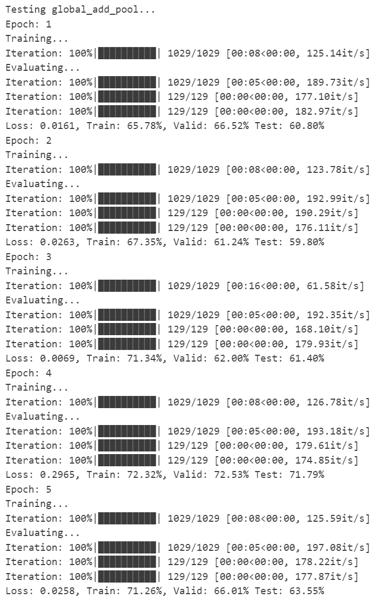

# 实验九：图卷积神经网络（GCN）

## 1. PyG（数据集和数据）

### Question1：ENZYMES 数据集中有多少类，多少特征

```python
def get_num_classes(pyg_dataset):
  num_classes = pyg_dataset.num_classes
  return num_classes

def get_num_features(pyg_dataset):
  num_features = pyg_dataset.num_features
  return num_features

if 'IS_GRADESCOPE_ENV' not in os.environ:
  num_classes = get_num_classes(pyg_dataset)
  num_features = get_num_features(pyg_dataset)
  print("{} dataset has {} classes".format(name, num_classes))
  print("{} dataset has {} features".format(name, num_features))
```

### Question 2：ENZYMES 数据集中 index 为 100 的图的 label 是什么？

```python
def get_graph_class(pyg_dataset, idx):
  label = -1
  label = pyg_dataset[idx].y.item()
  return label

# 此处的 pyg_dataset 是用于图分类的数据集
if 'IS_GRADESCOPE_ENV' not in os.environ:
  graph_0 = pyg_dataset[0]
  print(graph_0)
  idx = 100
  label = get_graph_class(pyg_dataset, idx)
  print('Graph with index {} has label {}'.format(idx, label))
```

### Question 3：index 为 200 的图有多少条边？

```python
def get_graph_num_edges(pyg_dataset, idx):

  num_edges = 0
  
  graph = pyg_dataset[idx]
  edge_index = graph.edge_index
  # 由于是无向图，每条边在edge_index中出现两次
  num_edges = edge_index.shape[1] // 2

  return num_edges

if 'IS_GRADESCOPE_ENV' not in os.environ:
  idx = 200
  num_edges = get_graph_num_edges(pyg_dataset, idx)
  print('Graph with index {} has {} edges'.format(idx, num_edges))
```

## 2. Open Graph Benchmark(OGB)

### Question 4：ogbn-arxiv 的图中有多少特征？

```python
def graph_num_features(data):
  num_features = 0
  num_features = data.x.shape[1]

  return num_features

if 'IS_GRADESCOPE_ENV' not in os.environ:
  num_features = graph_num_features(data)
  print('The graph has {} features'.format(num_features))
```

## 3. GNN：节点属性预测

```python
class GCN(torch.nn.Module):
    def __init__(self, input_dim, hidden_dim, output_dim, num_layers,
                 dropout, return_embeds=False):
        super(GCN, self).__init__()

        # 一个包含 GCNConv 层的列表
        self.convs = torch.nn.ModuleList()
        
        # 添加第一层 (输入层到隐藏层)
        self.convs.append(GCNConv(input_dim, hidden_dim))
        
        # 添加中间层 (隐藏层到隐藏层)
        for _ in range(num_layers - 2):
            self.convs.append(GCNConv(hidden_dim, hidden_dim))
            
        # 添加最后一层 (隐藏层到输出层)
        self.convs.append(GCNConv(hidden_dim, output_dim))

        # 一个包含一维批归一化层（BatchNorm1d）的列表
        self.bns = torch.nn.ModuleList()
        for _ in range(num_layers - 1):
            self.bns.append(torch.nn.BatchNorm1d(hidden_dim))

        # log softmax 层
        self.softmax = torch.nn.LogSoftmax(dim=1)

        # 元素被置为 0 的概率（Dropout 概率）
        self.dropout = dropout

        # 是否跳过分类层并返回节点嵌入
        self.return_embeds = return_embeds

    def reset_parameters(self):
        for conv in self.convs:
            conv.reset_parameters()
        for bn in self.bns:
            bn.reset_parameters()

    def forward(self, x, adj_t):
        out = x
        
        # 处理前 n-1 层，每层后接BN、ReLU和Dropout
        for i in range(len(self.convs) - 1):
            out = self.convs[i](out, adj_t)
            out = self.bns[i](out)
            out = F.relu(out)
            out = F.dropout(out, p=self.dropout, training=self.training)
        
        # 最后一层
        out = self.convs[-1](out, adj_t)
        
        # 如果不返回嵌入，则应用softmax
        if not self.return_embeds:
            out = self.softmax(out)

        return out
```

```python
def train(model, data, train_idx, optimizer, loss_fn):
    model.train()
    loss = 0

    # 优化器梯度清零
    optimizer.zero_grad()
    # 将数据输入模型
    out = model(data.x, data.adj_t)
    # 使用train_idx对模型输出和标签进行切片
    loss = loss_fn(out[train_idx], data.y.squeeze(1)[train_idx])
    
    loss.backward()
    optimizer.step()

    return loss.item()
```

```python
@torch.no_grad()
def test(model, data, split_idx, evaluator, save_model_results=False):
    model.eval()

    # 模型在所有数据上的输出
    out = model(data.x, data.adj_t)

    y_pred = out.argmax(dim=-1, keepdim=True)

    train_acc = evaluator.eval({
        'y_true': data.y[split_idx['train']],
        'y_pred': y_pred[split_idx['train']],
    })['acc']
    valid_acc = evaluator.eval({
        'y_true': data.y[split_idx['valid']],
        'y_pred': y_pred[split_idx['valid']],
    })['acc']
    test_acc = evaluator.eval({
        'y_true': data.y[split_idx['test']],
        'y_pred': y_pred[split_idx['test']],
    })['acc']

    if save_model_results:
      print ("Saving Model Predictions")

      data = {}
      data['y_pred'] = y_pred.view(-1).cpu().detach().numpy()

      df = pd.DataFrame(data=data)
      # 本地保存为 CSV 文件
      df.to_csv('ogbn-arxiv_node.csv', sep=',', index=False)

    return train_acc, valid_acc, test_acc
```

**运行结果**：


### Question 5：你的最佳模型验证集和测试集精度如何？

**运行结果**：


## 4. GNN：图性质预测

### 补全

```python
from ogb.graphproppred.mol_encoder import AtomEncoder
from torch_geometric.nn import global_add_pool, global_mean_pool

### GCN 用于预测图属性
class GCN_Graph(torch.nn.Module):
    def __init__(self, hidden_dim, output_dim, num_layers, dropout):
        super(GCN_Graph, self).__init__()

        # 加载分子图中原子的编码器
        self.node_encoder = AtomEncoder(hidden_dim)

        # 节点嵌入模型
        # 注意：输入维度和输出维度都设置为 hidden_dim
        self.gnn_node = GCN(hidden_dim, hidden_dim,
            hidden_dim, num_layers, dropout, return_embeds=True)

        # 将 self.pool 直接初始化为全局平均池化层
        self.pool = global_mean_pool

        # 输出层
        self.linear = torch.nn.Linear(hidden_dim, output_dim)


    def reset_parameters(self):
        self.gnn_node.reset_parameters()
        self.linear.reset_parameters()

    def forward(self, batched_data):
        # 获取节点特征和边索引
        x, edge_index, batch = batched_data.x, batched_data.edge_index, batched_data.batch
        
        # 对节点特征进行编码
        x = self.node_encoder(x)
        
        # 通过GNN获取节点嵌入
        node_embeddings = self.gnn_node(x, edge_index)
        
        # 使用池化操作获取图级别嵌入
        graph_embeddings = self.pool(node_embeddings, batch)
        
        # 通过线性层得到最终预测
        pred = self.linear(graph_embeddings)
        
        return pred
```

```python
def train(model, device, data_loader, optimizer, loss_fn):
    model.train()
    loss = 0

    for step, batch in enumerate(tqdm(data_loader, desc="Iteration")):
      batch = batch.to(device)

      if batch.x.shape[0] == 1 or batch.batch[-1] == 0:
          pass
      else:
        is_labeled = batch.y == batch.y
        
        optimizer.zero_grad()
        pred = model(batch)
        loss = loss_fn(pred[is_labeled], batch.y[is_labeled].to(torch.float32))

        loss.backward()
        optimizer.step()

    return loss.item()
```

**运行结果**：


### Quesion 6：你的最佳模型的验证/测试 ROC-AUC 分数多少？

**运行结果**：


### Question 7：在 PyG 中测试另外两种 global pooling

```python
from torch_geometric.nn import global_max_pool, global_add_pool

# 测试 global_max_pool
class GCN_Graph_MaxPool(torch.nn.Module):
    def __init__(self, hidden_dim, output_dim, num_layers, dropout):
        super(GCN_Graph_MaxPool, self).__init__()

        # 加载分子图中原子的编码器
        self.node_encoder = AtomEncoder(hidden_dim)

        # 节点嵌入模型
        self.gnn_node = GCN(hidden_dim, hidden_dim,
            hidden_dim, num_layers, dropout, return_embeds=True)

        # 使用最大池化
        self.pool = global_max_pool

        # 输出层
        self.linear = torch.nn.Linear(hidden_dim, output_dim)

    def reset_parameters(self):
        self.gnn_node.reset_parameters()
        self.linear.reset_parameters()

    def forward(self, batched_data):
        x, edge_index, batch = batched_data.x, batched_data.edge_index, batched_data.batch
        
        x = self.node_encoder(x)
        node_embeddings = self.gnn_node(x, edge_index)
        graph_embeddings = self.pool(node_embeddings, batch)
        pred = self.linear(graph_embeddings)
        
        return pred

# 测试 global_add_pool
class GCN_Graph_AddPool(torch.nn.Module):
    def __init__(self, hidden_dim, output_dim, num_layers, dropout):
        super(GCN_Graph_AddPool, self).__init__()

        # 加载分子图中原子的编码器
        self.node_encoder = AtomEncoder(hidden_dim)

        # 节点嵌入模型
        self.gnn_node = GCN(hidden_dim, hidden_dim,
            hidden_dim, num_layers, dropout, return_embeds=True)

        # 使用求和池化
        self.pool = global_add_pool

        # 输出层
        self.linear = torch.nn.Linear(hidden_dim, output_dim)

    def reset_parameters(self):
        self.gnn_node.reset_parameters()
        self.linear.reset_parameters()

    def forward(self, batched_data):
        x, edge_index, batch = batched_data.x, batched_data.edge_index, batched_data.batch
        
        x = self.node_encoder(x)
        node_embeddings = self.gnn_node(x, edge_index)
        graph_embeddings = self.pool(node_embeddings, batch)
        pred = self.linear(graph_embeddings)
        
        return pred

# 测试最大池化
if 'IS_GRADESCOPE_ENV' not in os.environ:
    print("Testing global_max_pool...")
    model_max = GCN_Graph_MaxPool(args['hidden_dim'],
                dataset.num_tasks, args['num_layers'],
                args['dropout']).to(device)
    
    model_max.reset_parameters()
    optimizer = torch.optim.Adam(model_max.parameters(), lr=args['lr'])
    
    # 仅训练几个epoch进行测试
    for epoch in range(1, 6):
        print(f'Epoch: {epoch}')
        print('Training...')
        loss = train(model_max, device, train_loader, optimizer, loss_fn)
        
        print('Evaluating...')
        train_result = eval(model_max, device, train_loader, evaluator)
        val_result = eval(model_max, device, valid_loader, evaluator)
        test_result = eval(model_max, device, test_loader, evaluator)
        
        train_acc = train_result[dataset.eval_metric]
        valid_acc = val_result[dataset.eval_metric]
        test_acc = test_result[dataset.eval_metric]
        
        print(f'Loss: {loss:.4f}, Train: {100 * train_acc:.2f}%, Valid: {100 * valid_acc:.2f}% Test: {100 * test_acc:.2f}%')

# 测试求和池化
if 'IS_GRADESCOPE_ENV' not in os.environ:
    print("\nTesting global_add_pool...")
    model_add = GCN_Graph_AddPool(args['hidden_dim'],
                dataset.num_tasks, args['num_layers'],
                args['dropout']).to(device)
    
    model_add.reset_parameters()
    optimizer = torch.optim.Adam(model_add.parameters(), lr=args['lr'])
    
    # 仅训练几个epoch进行测试
    for epoch in range(1, 6):
        print(f'Epoch: {epoch}')
        print('Training...')
        loss = train(model_add, device, train_loader, optimizer, loss_fn)
        
        print('Evaluating...')
        train_result = eval(model_add, device, train_loader, evaluator)
        val_result = eval(model_add, device, valid_loader, evaluator)
        test_result = eval(model_add, device, test_loader, evaluator)
        
        train_acc = train_result[dataset.eval_metric]
        valid_acc = val_result[dataset.eval_metric]
        test_acc = test_result[dataset.eval_metric]
        
        print(f'Loss: {loss:.4f}, Train: {100 * train_acc:.2f}%, Valid: {100 * valid_acc:.2f}% Test: {100 * test_acc:.2f}%')
```

|                         全局最大池化                         |                         全局求和池化                         |
| :----------------------------------------------------------: | :----------------------------------------------------------: |
|  |  |
