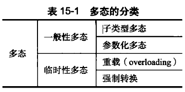

# 第15章 详细设计中面向对象方法下的信息隐藏

## 15.1 封装类的职责

### 15.1.1 类的职责

类与对象的职责来源于需求

类就应该通过接口对外表现它直接和间接承载的需求，而隐藏类内部的构造机理

### 15.1.2 封装——分离接口与实现

封装的含义

- 将数据和行为同时包含在类中
- 分离对外接口与内部实现
  - 接口的内容
    - 对象之间交互的消息（方法名）。
    - 消息中的参数
    - 消息返回结果的类型
    - 与状态无关的不变量
    - 需要处理的异常

### 15.1.3 封装实现细节

1. 封装数据和行为
2. 封装内部结构
3. 封装其他对象的引用
4. 封装类型信息
5. 封装潜在变更

## 15.2 为变更而设计

### 15.2.1 封装变更／开闭原则

**开闭原则（OCP）**：好的设计应该对“扩展”开放，对”修改“关闭

在发生变更时，好的设计只需要添加新的代码而不需要修改原有的代码，就能够实现变更。

利用抽象与多态

### 15.2.2 多态
1. 语义：不同类型的值能够通过统一的接口来操纵

2. 实现

   

3. 使用多态实现开闭原则
   - 对于新增加的需求，可以将其实现代码组织为一个新类型，并将新类型与程序中某个原有类型联合起来建立多态机制
   - 对于已有需求的变更，可以将变更后需求的实现代码组织为一个新类型，并将类型与其原类型联合起来建立多态机制

### 15.2.3 依赖倒置原则（DIP）

1. 依赖倒置原则
   - 抽象不应该依赖于细节，细节应该依赖于抽象。因为抽象是稳定的，细节是不稳定的。
   - 高层模块不应该依赖于低层模块，而是双方都依赖于抽象。因为抽象是稳定的，而高层模块和低层模块都可能是不稳定的。

2. DIP 的实现

   

3. 利用 DIP 减少耦合
4. 利用DIP 实现 OCP