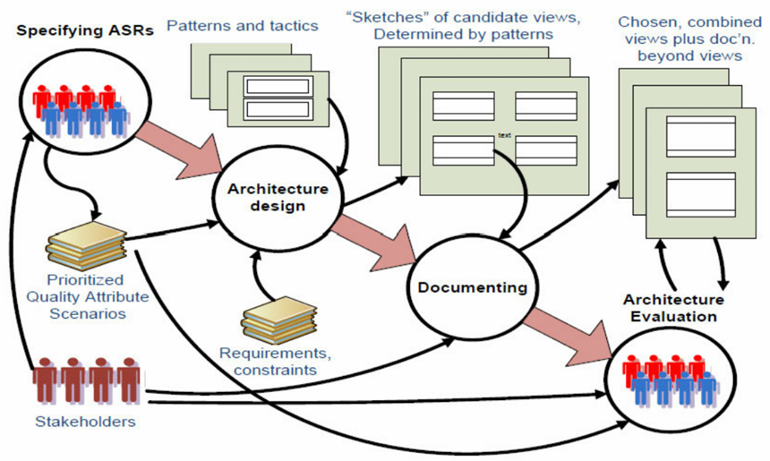

# 1 软件架构概论（Software Architecture in General）

## 1.1 什么是软件架构？（What is software architecture?）

定义 1：一个程序或计算系统的软件架构是系统的一个或多个结构，它由软件元素、这些元素的外部可见属性以及它们之间的关系组成

定义 2：系统根本的组织形式，体现在其组件、组件之间以及组件与环境之间的关系，以及指导其设计和演化的原则之中

**架构与设计（Architecture vs. Design）**：所有架构都是软件设计，但并非所有设计都是软件架构架构被视作高级别设计、一组设计决策或系统的结构/组织

**架构与结构（Architecture vs. Structure）**：架构定义了组件接口、组件间的通信与依赖，以及组件的职责

## 1.2 软件架构师做什么？（What does a software architect do?）

**角色定位**：架构师的角色与建筑师类似，负责倾听客户需求、评估可行性、构想并创建蓝图，并监督建造过程

**核心职责（Core Responsibilities）**：

- **联络（Liaison）**：在客户、技术团队和业务/需求分析师之间，以及与管理层或市场部门进行沟通
- **软件工程（Software Engineering）**：遵循软件工程的最佳实践
- **技术知识（Technology Knowledge）**：对技术领域有深入的理解
- **风险管理（Risk Management）**：管理与设计和技术选择相关的风险

## 1.3 架构从何而来？（Where do architectures come from?）

**需求与约束（Requirements and Constraints）**：架构设计过程始于需求规格和各种约束（如资源、组织、经验、软件复用等） 

**非功能性需求（Non-functional requirements - NFRs）**：

- NFRs 定义了系统“工作得如何”
- 它们也被称为架构需求（architecture requirements），通常需要架构师去发掘
- NFRs 包括技术约束（Technical constraints）、业务约束（Business constraints）和质量属性（Quality attributes）

**架构的重要性（Importance of Architecture）**：

- 沟通媒介（Vehicle for communication）：作为沟通的载体，用于协商需求、告知进度等
- 早期设计决策的体现（Manifestation of early design decisions）：这些决策最难更改，因此需要仔细考虑
- 可传递和可复用的抽象（Transferable and reusable abstraction）：一个架构可以对应多个系统，是产品线共性的基础

## 1.4 架构（4+1）视图（Architecture（4+1）Views）

**概述**：一个软件架构是一个复杂的设计产物，可以从多个可能的“视图”来观察，类似于建筑的楼层平面图、外部图、电路图等

- **逻辑视图（Logical view）**：描述架构中具有重要意义的元素及其之间的关系
- **过程视图（Process view）**：描述架构的并发和通信元素
- **物理视图（Physical view）**：描绘主要过程和组件如何映射到应用程序的硬件上
- **开发视图（Development view）**：捕获软件组件的内部组织结构，例如在配置管理工具中
- **+1 - 架构用例（Architecture use cases）**：捕获架构的需求，这些需求可能与多个视图相关

## 1.5 架构活动与过程（Architectural activities and process）

**通用设计策略（Generic Design Strategies）**：分解（Decomposition）、抽象（Abstraction）、分而治之（Stepwise: 'Divid and Conquer'）、生成与测试（Generate and Test）、迭代（Iteration）和复用（Reuse）

**架构活动（Architecture Activities）**：

- 创建系统业务案例（Creating the business case）
- 理解需求（Understanding the requirements）
- 创建和选择架构（Creating and selecting architecture）
- 沟通架构（Communicating the architecture）
- 分析或评估架构（Analysing or evaluating the architecture）
- 实现架构并确保一致性（Implementing the architecture and ensuring conformance）

**软件架构过程模型（Software Architecture Process Model）**：这是一个循环过程，涉及指定架构显著性需求（Specifying ASRs）、架构设计（Architecture design）、文档化（Documenting）和架构评估（Architecture Evaluation），并与干系人（Stakeholders）、需求与约束（Requirements, constraints）持续交互

**架构生命周期（Architecture Lifecycle）**：包括架构分析（Architectural Analysis）、架构综合（Architectural Synthesis）、架构评估（Architectural Evaluation）、架构实现（Architectural Implementation）以及架构维护（Architectural Maintenance）
