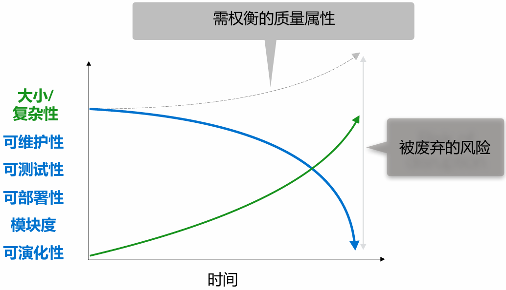

# 微服务架构

## 1 微服务架构基础知识

### 1.1 主流架构风格

**架构演进路径**：单体架构 → 分层架构 → SOA架构 → 微服务架构

#### 1.1.1 单体架构

定义： 单体（Monolithic）应用的全部功能被集成在一起作为一个单一的单元

通信方式：①进程间通信；②方法间调用；③无需网络调用

事务管理：①单一数据库；②所有事务单一上下文；③事务提交和回滚操作简单；④一个方法中处理

交付形态：WAR包、可执行文件、源码目录等

示例：电商应用、FTGO订餐应用

优缺点

- 优点：①易于开发、②修改、③测试、④部署、⑤伸缩（初期）
- 缺点：①过度复杂性、②开发速度缓慢、③部署周期长且易出错、④难以扩展、⑤可靠性差、⑥技术栈老化

#### 1.1.2 分层架构

定义：对复杂系统进行抽象和分层、结构化设计

特点：垂直架构（结构简单，易于组织开发、测试和维护）

- 分层（表现层、业务层、数据层）
- 关注点分离：①软件元素的独特性；②责任分离；③高内聚、低耦合
- SOLID 原则：①单一职责原则；②开闭原则；③里氏替换原则；④接口隔离原则；⑤依赖倒置原则

示例：电商应用

缺点：①非功能性需求增长带来的挑战；②层级调用性能代价；③可能退化为紧耦合结构

#### 1.1.3 SOA 架构

定义：面向服务架构（SOA）是一个分布式组件的集合，这些组件为其它组件提供服务（provider），或者消费其它组件所提供的服务（consumer），而无需知道其它组件的实现细节

- 分布式组件集合
- 通过企业服务总线（ESB）：为服务间的相互调用提供支持环境，路由服务间的消息，并对消息和数据进行必要的转换
- 服务编排引擎：根据预先定义的脚本对服务消费者与服务提供者之间的交互进行指挥

优缺点：

- 优点：①服务高内聚松耦合；②互操作性；③模块化高重用
- 缺点：①系统复杂性高；②测试验证难；③中间件易成瓶颈

实现原则：服务解耦、契约、封装、重用、组合、自治、无状态

### 1.2 微服务架构主流定义

Chris Richardson 的定义：将应用功能性分解为一组服务，每个服务由专注、内聚的功能职责组成

Martin Fowler & James Lewis 的定义：将单体应用拆分为细粒度服务，运行于独立进程，通过轻量级机制通信（如HTTP RESTful API），围绕业务能力构建，可独立部署，支持不同语言和数据存储技术

### 1.3 微服务架构主要特性

1. **通过服务组件化**：将软件系统视为由多个独立可替换和升级的软件单元（即服务）组成。这些服务作为进程外组件，通过Web服务请求或RPC机制进行通信，实现了低耦合、高隔离性和独立开发部署
2. **围绕业务能力组织**：微服务团队围绕业务能力进行组织，实现宽栈、跨职能的开发。采用产品开发模式，团队负责软件的整个生命周期，持续关注业务价值的交付
3. **内聚和解耦**：服务应具备单一职责（高内聚），并且服务间尽量减少直接依赖，实现独立自治（低耦合）。通过业务功能分解或领域驱动设计（DDD）中的限界上下文来确定服务边界
4. **去中心化**：
   - **去中心化治理**：允许每个服务选择适合自身的技术栈，服务间只需约定接口
   - **去中心化数据存储**：每个微服务管理自己的数据库，可以是不同实例或完全不同的数据库系统
   - **去中心化数据管理**：强调服务间的无事务协作，采用最终一致性和补偿策略来处理分布式数据一致性问题
5. **基础设施自动化**：依赖自动化的基础设施来降低开发和运维微服务的复杂度，包括持续部署和交付（编码、集成、测试、部署、监控）以及多层次的自动化测试
6. **服务设计与演进**：
   - **高可用设计**：系统需要能够容忍服务失败，客户端应能有效响应，并依赖完善的监控和日志记录来快速发现和修复问题
   - **演进式设计**：通过合理的服务解耦，支持频繁、快速且控制良好的增量变更和演化，只需重新部署修改的服务。架构适应度函数用于指导和评估架构的演进
7. **其他关键特性总结**：
   - **高可伸缩性**：可根据业务请求，独立增减各微服务的资源
   - **易于维护**：每个服务相对较小，边界清晰
   - **技术栈不受限**：开发者可为不同服务自由选择技术
   - **服务可独立扩展**：功能扩展性高，可快速上线
   - **支持持续部署和交付**：得益于可测试性、可部署性和团队自主性
   - **设计复杂性**：同时也带来了网络延迟、联调、故障定位和修复等挑战

### 1.4 架构风格对比

SOA vs. 微服务架构（MSA）

|              | SOA                                                          | MSA                                                          |
| ------------ | ------------------------------------------------------------ | ------------------------------------------------------------ |
| 服务间通信   | 1. 智能管道，如（ESB） 2. 重量级协议，如 SOAP 或 WS * 标准 | 1. 哑管道，如消息代理，或服务之间点对点通信 2. 轻量级协议，如 REST或 gRPC |
| 数据管理     | 全局数据模型并共享数据库                                     | 每个服务有自己的数据模型和数据库                             |
| 典型服务规模 | 较大的单体应用                                               | 较小的服务                                                   |

## 2 微服务设计核心模式

### 2.1 迁移动机

**单体地狱（Monolithic Hell）**：复杂性、部署困难、扩展性差、技术栈老化等问题

**支撑 DevOps 与持续交付**：微服务架构提升可测试性、可部署性，赋能小而自治的团队

### 2.2 挑战问题

1. **服务拆分与定义的粒度问题**：如何将应用拆分以及拆分结果的好坏是首要挑战
2. **分布式系统带来的固有复杂性**：
   - 进程间通信、局部故障处理
   - 跨服务事务与查询（Saga模式、API组合、CQRS）
   - 自动化测试的复杂性
   - 运维复杂性
   - 跨团队协调
3. **微服务架构并非银弹**
4. **对系统化拆分指导的需求** → 引入模式语言

### 2.3 模式和模式语言

**模式（Pattern）**：

- 定义：针对特定上下文中发生的问题的可重用解决方案
- 组成元素：
  - 上下文
  - 问题
  - 需求（需求、优先级和其他约束）
  - 解决方案
  - 结果：采用模式后的后果（优点、缺点、待解决问题）
  - 相关模式：与其他模式之间的关系（前导、后续、替代、泛化、特化）

**微服务架构模式语言**：

- 一组相关联的模式，用于解决微服务设计中的常见问题（如拆分、数据、通信、部署、运维）
- 模式分类：应用相关（拆分模式、数据模式）、应用与基础设施相关（通信模式）、基础设施相关（部署模式）

### 2.4 微服务拆分设计

**问题**：如何合理划分微服务边界与粒度？

**需求**：高内聚、低耦合、单一职责原则、共同封闭原则、团队自治（双披萨团队）

**关键步骤**：

1. **定义系统操作**：将需求提炼为系统必须处理的关键请求（系统操作）
   - 输入：需求，用户故事/相关用户场景/源代码恢复等
   - 流程：
     - 步骤 1：创建（抽象的）领域模型（用户故事中的名词）
     - 步骤 2：确定系统操作（用户故事中的动词）
   - 系统操作规范：定义命令对应的参数、返回值，领域模型类的行为（前置和后置条件）
2. **定义微服务（围绕业务概念而非技术）**：拆分策略
   - **根据业务能力拆分**：
     - 业务能力是企业为产生价值的商业活动，较为稳定
     - 将顶级能力或子能力映射到服务
     - 优点：架构稳定，团队跨职能、自治，服务高内聚和松耦合
     - 问题：如何分析业务能力
   - **根据子域拆分（领域驱动设计DDD）**：
     - 子域是领域的细分，DDD核心思想是将问题域逐级细分
     - 限界上下文（Bounded Context）是领域模型的边界，对应微服务架构中一个或一组服务
     - 优点：高内聚和松耦合，架构稳定，领域模型由团队独立开发
     - 问题：如何识别子域
   - **根据动静态调用关系拆分**：
     - 收集单体应用动静态调用信息，构建有向带权图，基于聚类算法拆分
     - 结果：适用于棕地开发场景（遗留系统）的拆分，自动化、效率高，但受限于遗留系统的分析和数据收集难度
3. **定义服务 API 和协作方式**
   - 服务 API 操作的存在原因：某些对应系统操作，其他支持服务间协作，或通过事件发布支持协作
   - API 定义流程：
     - 步骤 1：将系统操作分配给服务（确定请求的初始入口服务，或分配给需要信息/拥有信息的服务）
     - 步骤 2：确定支持协作的 API（处理跨多个服务的操作，明确进程间通信技术）

### 2.5 其他核心模式

#### 2.5.1 服务注册与发现

**问题**：基于 RPI（Remote Procedure Invocation） 的客户端如何在网络上发现服务实例的位置？ 

**模式：**

- **应用层服务发现模式**：
  - **自注册**：服务实例调用服务注册表的注册API来注册其网络位置
  - **客户端发现**：客户端查询服务注册表以获取服务实例的列表，可结合缓存和负载均衡
  - **结果**：处理多平台部署问题，但需要为各种编程语言提供服务发现库，且开发者需负责设置和管理服务注册表
- **平台层服务发现模式**：
  - **第三方注册**：由第三方（通常是部署平台的一部分）处理注册
  - **服务端发现**：客户端向DNS名称发出请求，该请求被解析到路由器，路由器查询服务注册表并对请求进行负载均衡
  - **结果**：部署平台负责，减轻了服务端和客户端代码的负担，多语言支持度较高，但存在平台约束

#### 2.5.2 API 网关（API Gateway）

**问题**：如何处理外部客户端与服务之间的通讯？

**需求**：

- 支持多种客户端 API
- 处理细粒度 API 请求效率
- 不同客户端数据和性能需求
- 封装内部结构
- 服务实例动态变化
- 处理防火墙内外协议差异

**模式：API Gateway 模式**：

- 实现一个服务作为外部 API 客户端进入基于微服务应用的入口点
- 可针对不同客户端提供不同的 API

**结果**：封装应用程序内部结构，减少客户端与服务间的交互次数，确保客户端不受服务实例位置影响，可实现 API 组合、协议转换和边缘功能（如身份验证）

**问题**：可能带来性能和可扩展性瓶颈、局部故障等

#### 2.5.3 断路器（Circuit Breaker）

**问题**：在同步通信中，如何避免由于服务故障或网络中断所引起的故障蔓延到其他服务？

**模式：断路器（Circuit Breaker）**：

- 闭合状态（Closed）：对程序的请求能够直接引起方法的调用
- 断开状态（Open）：对程序的请求会立即返回错误响应
- 半断开状态（Half-Open）：允许一定数量的请求调用服务，若成功则切换到闭合状态，若失败则切回到断开状态

**结果**：防止不断地尝试执行可能会失败的操作；使程序能够诊断错误是否已经修正，进而再次尝试调用操作

### 2.6 重构策略（从单体到微服务）

**策略 1：将新功能实现为微服务**

- API 网关：新功能的请求路由到新服务，遗留系统请求路由到单体
- 集成胶水（Integration Glue）代码：将服务与单体结合，访问单体所有数据，并能调用单体实现的功能
  - API 请求
  - 复制单体应用数据到服务本地用于读

**策略2：将单体中的现有模块/业务能力提取为微服务**

- 步骤：拆分源码、拆分数据库、定义和部署新服务、迁移调用、移除单体中旧代码
- 示例：从 FTGO 单体中提取 Delivery 服务