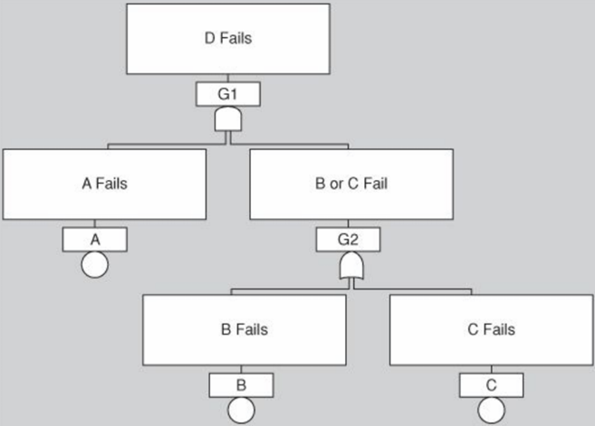
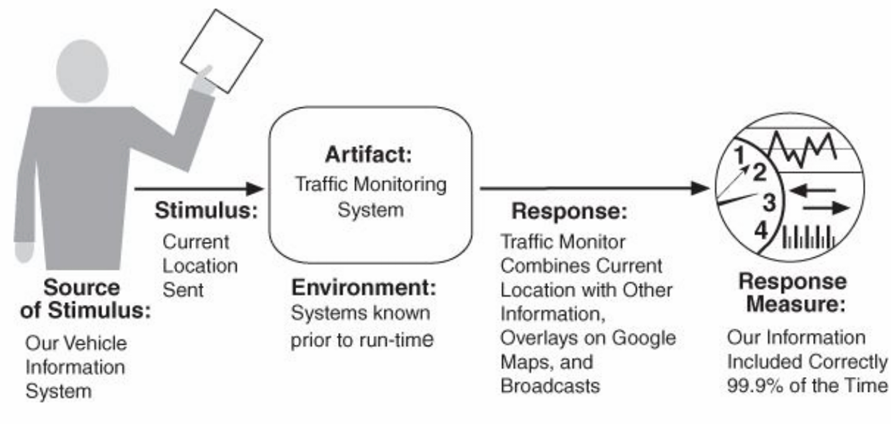
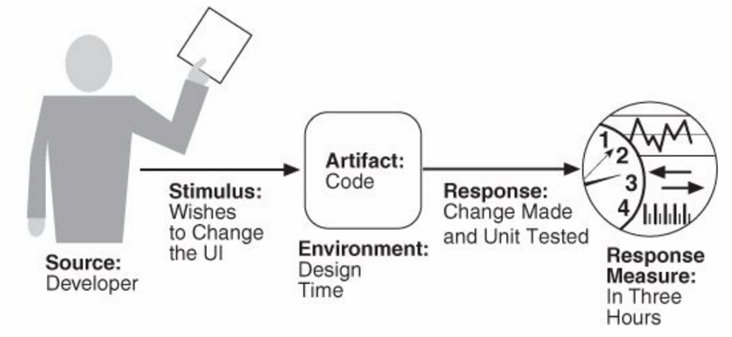
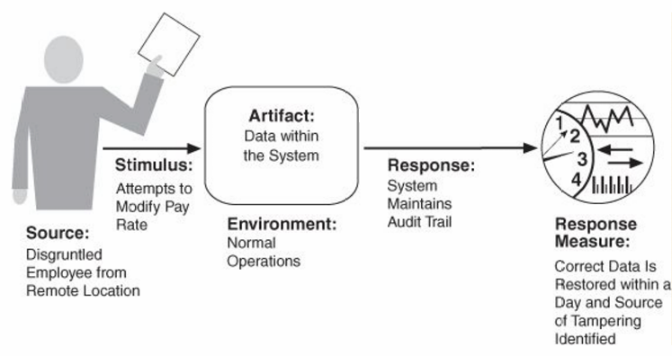
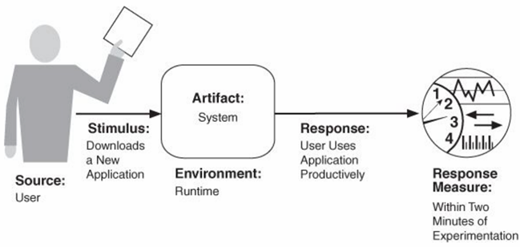

# 2 质量属性

## 2.1 基础概念

1.  **需求的重要性**
    * 用户需求是系统设计的基础
    * 在系统构建后再提出需求不匹配的问题是常见的痛点
2.  **功能性需求（Functional Requirements）**
    * 定义：系统必须做什么，以及如何为利益相关者提供价值 
    * 等同于系统行为
    * 定义：系统完成其预期工作的能力（例如，学生在线注册） 
    * 实现方式：功能性可以通过多种可能的结构来实现
    * 独立性：功能性在很大程度上独立于结构，因为它可以作为一个没有任何内部结构的单一整体系统存在
3.  **质量需求（Quality Requirements）/ 质量属性（Quality Attributes）** 
    * 定义：系统在其功能性需求之上应提供的整体系统的期望特性
    * 是对功能性需求或整个产品的限定
    * 与软件架构的关系：如果质量属性很重要，软件架构会限制功能性在各种结构上的分配（映射）
4.  **约束（Constraints）**
    * 定义：自由度为零的设计决策 
    * 是预先指定且已经做出的设计决策
    * 满足方式：通过接受设计决策并将其与其他受影响的设计决策相协调来满足

5. **非功能性需求（Non-functional Requirements）**

   - **定义与重要性**
     * 非功能性需求或架构需求是质量属性的替代术语
     
     * 无法先实现功能再考虑非功能性需求（质量无法后续弥补）
     
     * 非功能性需求必须在任何设计决策中加以考虑
     
   - **分类**
     * **执行期间可观察（外部）**：系统满足其行为要求的程度如何？
         * 例如：性能、安全性、可用性、易用性等
     * **执行期间不可观察（内部）**：系统维护、集成或测试的难易程度如何？
         * 例如：可修改性、可移植性、可重用性、可测试性等

## 2.2 深入理解质量属性

1. **质量属性的核心地位**

   * 质量不是开发完成后才能添加到软件密集型系统中的东西
   * 在软件开发的所有阶段都需要解决质量问题
   * 业务目标决定了系统必须具备的质量
   * 质量属性超越了系统的功能性，功能性是系统能力、服务和行为的基本陈述

2. **功能性与质量属性的权衡**
   * 功能性通常在开发计划中占据首要位置
   * 然而，系统通常因为缺乏期望的质量水平（如难以维护、移植或扩展）而被重新设计
   * 软件架构是解决质量问题的最合适层面
   * 没有任何质量属性完全依赖于设计，也不完全依赖于实现或部署

3. **规约质量属性（Specifying Quality Attributes）**
   * 精确定义：为了在架构层面进行评估，对质量属性进行精确定义是必要的
   * 质量属性场景（Quality Attribute Scenarios）：用于定义期望的质量属性
       * 场景是具有特定结构的简单描述
       * **通用场景（General Scenarios）**：系统无关的场景，用于指导质量属性需求的规约
           * 每个场景都可能（但不一定）与我们关注的系统相关
           * 要使通用场景对特定系统有用，必须使其系统特定化
           * 将通用场景系统特定化意味着将其转化为特定系统的具体术语
       * **具体场景（Concrete Scenarios）**：系统特定的场景，用于指导特定系统质量属性需求的规约，是通用场景的实

4. **质量属性场景建模（Modeling Quality Attribute Scenarios）**

   

   * **刺激源（Source of Stimulus）**：产生刺激的实体（人、系统或任何执行器）
   * **刺激（Stimulus）**：当到达系统时需要考虑的条件
   * **制品（Artifact）**：需求适用的整个系统或系统的一部分
   * **环境（Environment）**：刺激发生时系统的条件（例如，过载、运行中等）
   * **响应（Response）**：刺激到达后所采取的活动
   * **响应度量（Response Measure）**：对刺激的响应应以某种方式可度量，以便需求是可测试的

5. **策略（Tactics）**

   * 定义：影响质量属性响应控制的设计决策（例如，冗余）
   * 架构策略（Architectural Strategy）：策略的集合
   * 系统设计是设计决策的集合：一些决策有助于控制质量属性响应，另一些确保系统功能的实现
   * 策略可以组合，也可以形成策略层次结构

6. **质量设计决策（Quality Design Decisions）**
   
   * 架构是设计决策的集合
   * 七类设计决策（可能重叠）：职责分配、协调模型、数据模型、资源管理、架构元素之间的映射、绑定时间决策、技术选择

## 2.3 具体的质量属性及其策略（包含通用场景、示例场景、策略及检查清单）

### 2.3.1 可用性（Availability）

#### 可用性定义与重要性

* 定义：衡量系统在需要时可用的时间比例
  * 在营业时间内100%可用
  * 每周计划内停机时间不超过2小时（100% 可用性）
* 可用性与应用程序的**可靠性（reliability）**相关
* 不可靠的应用程序可用性通常较差

#### 影响可用性的因素与策略

* **可用性损失的周期取决于**：
  * 故障检测时间（Time to detect failure）
  * 故障纠正时间（Time to correct failure）
  * 应用程序重启时间（Time to restart application）
* **高可用性策略（Strategies for high availability）**：
  * 消除单点故障（Eliminate single points of failure）
  * 复制和故障转移（Replication and failover）
  * 自动检测和重启（Automatic detection and restart）
* **可恢复性（Recoverability）**（例如数据库）：指在应用程序或系统故障后，重新建立性能水平并恢复受影响数据的能力

#### 可用性计算

* 可用性可以计算为在指定时间间隔内，系统提供指定服务并在要求范围内的概率
  * **MTBF**（Mean Time Between Failures - 平均无故障时间）
  * **MTTR**（Mean Time To Repair - 平均修复时间）
* 可用性计算公式：$$\frac{MTBF}{(MTBF + MTTR）}$$ 
* 计算可用性时，可能不考虑计划内停机时间（Scheduled downtimes）

#### 中断、故障、缺陷和错误（Outage, Failure, Fault, and Error）

* 可用性旨在通过减轻**缺陷（faults）**来最小化服务**中断（outage）**时间
* **故障（failure）**的原因称为**缺陷（fault）**
* 当系统无法交付其应提供的服务时，就会发生**故障（failure）**
* **故障（failure）**是系统状态的可观察特征
* 系统中任何部分的**缺陷（fault）**都有可能导致**故障（failure）**；系统可以从**故障（failure）**中修复或恢复
* 在**缺陷（fault）**发生和**故障（failure）**之间的中间状态称为**错误（errors）**

#### 服务级别协议（Service-Level Agreement - SLA）

下表展示了不同可用性百分比对应的停机时间：

| Availability | Downtime/90 Days       | Downtime/Year                  |
| :----------- | :--------------------- | :----------------------------- |
| 99.0%        | 21 hours, 36 minutes   | 3 days, 15.6 hours             |
| 99.9%        | 2 hours, 10 minutes    | 8 hours, 0 minutes, 46 seconds |
| 99.99%       | 12 minutes, 58 seconds | 52 minutes, 34 seconds         |
| 99.999%      | 1 minute, 18 seconds   | 5 minutes, 15 seconds          |
| 99.9999%     | 8 seconds              | 32 seconds                     |

#### 故障规划（Planning for Failure）
* **危险性分析（Hazard analysis）**：
  
    * 灾难性/危险（Catastrophic/Hazardous）
    * 重大/轻微（Major/Minor）
    * 无影响（No effect）
* **故障树分析（Fault tree analysis）**：一个顶事件（如 A Fails）分解为导致其发生的基本事件（如 B Fails, C Fails）或中间事件的逻辑组合
  
    
* **故障模式、影响和关键性分析（Failure Mode, Effects, and Criticality Analysis - FMECA）**：
  
    * FMECA 依赖于过去类似系统的故障历史
    * 它会分析组件的故障概率、故障模式、按模式划分的故障百分比，以及故障是关键还是非关键及其影响

#### 可用性通用场景

| Scenario Portion                 | Possible Values                                              |
| -------------------------------- | ------------------------------------------------------------ |
| **刺激源（Source）**             | 内部 / 外部：人员、硬件、软件、物理基础设施、物理环境        |
| **刺激（Stimulus）**             | 缺陷：遗漏、崩溃、不正确的时序、不正确的响应                 |
| **制品（Artifact）**             | 处理器、通信信道、持久存储、进程                             |
| **环境（Environment）**          | 正常操作、启动、关闭、修复模式、降级操作、过载操作           |
| **响应（Response）**             | 阻止缺陷演变成故障；检测故障：记录故障、通知相关实体（人员或系统）；从故障中恢复：禁用导致故障的事件源、在修复期间暂时不可用、修复或掩盖故障 / 失效（故障屏蔽（Fault Masked））或控制其造成的损害、在修复期间以降低模式运行 |
| **响应度量（Response Measure）** | 系统必须可用的时间或时间间隔；可用性百分比（例如 99.999%）；检测故障的时间；修复故障的时间；系统可以处于降级模式的时间或时间间隔；系统阻止或在不发生故障的情况下处理某类故障的比例（例如 99%）或速率（例如每秒高达 100 次） |

#### 可用性示例场景

* **刺激源（Source of Stimulus）**：心跳监视器
* **刺激（Stimulus）**：服务器无响应
* **制品（Artifact）**：进程
* **环境（Environment）**：正常操作
* **响应（Response）**：通知操作员，继续操作
* **响应度量（Response Measure）**：无停机时间

#### 可用性策略
**检测故障（Detect Faults）**

* **Ping/Echo**：一个组件发出 ping，并期望在预定义时间内从另一个组件收到echo。可用于负责同一任务的一组组件内
* **心跳（Heartbeat，也称 dead man timer）**：一个组件定期发出心跳消息（也可携带数据），另一个组件侦听它。如果心跳失败，则假定始发组件已发生故障，并通知故障纠正组件
* **异常（Exception）**：识别故障的一种方法是遇到异常。异常处理程序通常在引发异常的同一进程中执行。Ping 和心跳策略在不同进程间操作，而异常策略在单个进程内操作
* **进程监视器（Process Monitor）**：一旦检测到进程中的故障，监视进程可以检测到不执行的进程，并创建它的一个新实例，初始化到某个适当的状态，如备用策略中那样
* **时间戳（Timestamp）**
* **健全性检查（Sanity Checking）**
* **状态监控（Condition Monitoring）**
* **表决（Voting）**：运行在冗余处理器上的进程各自接收等效输入并计算一个简单值发送给表决器。如果表决器检测到单个进程的异常行为，则使其失效
* **异常检测（Exception Detection）**
* **自测试（Self-Test）**

**Recover from Faults（从故障中恢复）**

- **准备和修复（Preparation and Repair）**
  - **主动冗余（Active Redundancy）**：所有冗余组件并行响应事件，它们都处于相同状态。只使用一个组件的响应，其余的被丢弃。发生故障时，停机时间通常不存在，因为备份是当前的，唯一的切换时间是恢复时间
  - **被动冗余（Passive Redundancy）**：一个组件（主组件）响应事件，并通知其他组件（辅助组件）它们必须进行的状态更新。发生故障时，系统必须首先确保备份状态足够新近，然后才能恢复服务
  - **备用（Spare）**：配置一个备用计算平台以替换许多不同的故障组件
  - **异常处理（Exception Handling）**
  - **检查点 / 回滚（Checkpoint / Rollback）**：检查点是定期或响应特定事件创建的一致状态的记录
  - **软件升级（Software Upgrade）**
  - **重试（Retry）**
  - **忽略错误行为（Ignore Faulty Behavior）**
  - **降级（Degradation）**
  - **重新配置（Reconfiguration）**
- **重新引入（Reintroduction）**
  - **影子操作（Shadow operation）**：先前发生故障的组件可能会在 “影子模式” 下运行一小段时间，以确保其在恢复服务之前模仿工作组件的行为
  - **状态重新同步（State Resynchronization）**：被动和主动冗余策略要求被恢复的组件在恢复服务之前升级其状态
  - **升级重启（Escalating Restart）**
  - **不间断转发（Non-Stop Forwarding）**

**Prevent Faults（预防故障）**

- **移出服务（Removal from Service）**：此策略将系统的一个组件从操作中移除，以进行某些活动来防止预期的故障
- **事务（Transactions）**：事务是将几个顺序步骤捆绑在一起，以便整个捆绑包可以一次性撤销
- **预测模型（Predictive Model）**

* **异常预防（Exception Prevention）**
* **增加能力集（Increase Competence Set）**

#### 可用性设计与分析检查清单

**职责分配（Allocation of Responsibilities）**

- 确定需要高度可用的系统职责。在这些职责内，确保已分配额外的职责来检测遗漏、崩溃、不正确的时序或不正确的响应
- 此外，确保有责任执行以下操作：记录故障、通知适当的实体（人员或系统）、禁用导致故障的事件源、暂时不可用、修复或掩盖故障 / 失效、以降级模式运行

**协调模型（Coordination Model）**

- 确定需要高度可用的系统职责。关于这些职责，执行以下操作：
  - 确保协调机制能够检测到遗漏、崩溃、不正确的时序或不正确的响应。例如，考虑是否需要保证交付。协调是否能在通信降级的情况下工作？
  - 确保协调机制能够记录故障、通知适当实体、禁用导致故障的事件源、修复或掩盖故障，或以降级模式运行。
  - 确保协调模型支持替换所使用的制品（处理器、通信信道、持久存储和进程）。例如，替换服务器是否允许系统继续运行？
  - 确定协调是否会在通信降级、启动 / 关闭、修复模式或过载操作条件下工作。例如，协调模型能承受多少信息丢失以及会产生什么后果？

**数据模型（Data Model）**

- 确定系统哪些部分需要高度可用。在这些部分中，确定哪些数据抽象及其操作或属性可能导致遗漏、崩溃、不正确的时序行为或不正确的响应
- 对于这些数据抽象、操作和属性，确保它们在发生故障时可以被禁用、暂时不可用，或者可以被修复或掩盖。例如，确保在服务器暂时不可用时缓存写请求，并在服务器恢复服务时执行这些请求

**架构元素之间的映射（Mapping among Architectural Elements）**

- 确定哪些制品（处理器、通信信道、持久存储或进程）可能产生故障：遗漏、崩溃、不正确的时序或不正确的响应
- 确保架构元素的映射（或重新映射）足够灵活，以允许从故障中恢复。这可能涉及考虑以下因素：
  - 故障处理器上的哪些进程需要在运行时重新分配
  - 哪些处理器、数据存储或通信信道可以在运行时激活或重新分配
  - 如何通过替换单元为故障处理器或存储上的数据提供服务
  - 系统根据提供的交付单元可以多快地重新安装
  - 如何将运行时元素（重新）分配给处理器、通信信道和数据存储
- 当采用依赖于功能冗余的策略时，模块到冗余组件的映射非常重要。例如，可以编写一个模块，其中包含适用于保护组中活动组件和备份组件的代码

**资源管理（Resource Management）**

- 确定在发生故障（遗漏、崩溃、不正确的时序或不正确的响应）时继续运行所需的关键资源
- 确保在发生故障时有足够的剩余资源来记录故障；通知适当的实体（人员或系统）；禁用导致故障的事件源；暂时不可用；修复或掩盖故障 / 失效；正常运行，或在启动、关闭、修复模式、降级操作和过载操作下运行
- 确定关键资源的可用时间，在指定时间间隔内必须可用的关键资源，关键资源可能处于降级模式的时间间隔，以及关键资源的修复时间
- 确保关键资源在这些时间间隔内可用。例如，确保输入队列足够大，以便在服务器发生故障时缓冲预期的消息，从而使消息不会永久丢失

**绑定时间（Binding Time）**

**技术选择（Choice of Technology）**

### 2.3.2 互操作性（Interoperability）

#### 互操作性定义与重要性

定义：两个或多个系统在特定上下文中通过接口有效交换有意义信息的程度

方面：数据交换能力（句法互操作性）、正确解释数据的能力（语义互操作性）

互操作性需要明确与谁、与什么以及在什么情况下（上下文）进行互操作

#### 互操作性的关键方面

发现（Discovery）：服务的消费者必须发现服务的位置、身份和接口
响应处理（Handling of the response）：

- 向请求者报告响应
- 将其响应传递给另一个系统
- 向任何相关方广播其响应

#### 互操作性通用场景

| Scenario Portion                 | Possible Values                                              |
| -------------------------------- | ------------------------------------------------------------ |
| **刺激源（Source）**             | 一个系统发起与另一个系统互操作的请求                         |
| **刺激（Stimulus）**             | 在系统之间交换信息的请求                                     |
| **制品（Artifact）**             | 希望互操作的系统                                             |
| **环境（Environment）**          | 希望互操作的系统在运行时被发现或在运行时之前已知             |
| **响应（Response）**             | 以下一项或多项：请求被（适当地）拒绝并通知适当的实体（人员或系统）；请求被（适当地）接受并且信息成功交换；一个或多个相关系统记录了该请求 |
| **响应度量（Response Measure）** | 以下一项或多项：正确处理的信息交换百分比；正确拒绝的信息交换百分比 |

#### 互操作性示例场景

- **刺激源（Source of Stimulus）**：我们的车辆信息系统
- **刺激（Stimulus）**：当前位置已发送
- **制品（Artifact）**：交通监控系统
- **环境（Environment）**：系统在运行前已知
- **响应（Response）**：交通监控器将当前位置与其他信息结合，叠加在谷歌地图上，并广播
- **响应度量（Response Measure）**：我们的信息 99.9% 的时间被正确包含

#### 互操作性策略

- **定位（Locate）**：**发现服务（Discover Service）**：通过搜索已知的目录服务来定位服务
  - **多级间接（Multiple levels of indirection）**
- **管理接口（Manage Interfaces）**
  - **编排（Orchestrate）**：使用控制机制来协调、管理和排序特定服务的调用
  - **定制接口（Tailor Interface）**：向接口添加或移除功能

#### 互操作性设计与分析检查清单

**职责分配（Allocation of Responsibilities）**

- 确定您的系统职责中哪些需要与其他系统互操作
- 确保已分配职责以检测与已知或未知外部系统互操作的请求
- 确保已分配职责以执行以下任务：接受请求、交换信息、拒绝请求、通知适当的实体（人员或系统）、记录请求（对于非受信环境中的互操作性，记录以实现不可否认性至关重要）

**协调模型（Coordination Model）**

- 确保协调机制能够满足关键的质量属性需求。性能考虑因素包括：网络上由您控制的系统创建的和不受您控制的系统产生的流量、您系统发送消息的及时性、您系统发送消息的当前性、消息到达时间的抖动
- 确保您控制下的所有系统对协议和底层网络的假设与不受您控制的系统一致

**数据模型（Data Model）**

- 确定可能在互操作的系统之间交换的主要数据抽象的句法和语义
- 确保这些主要数据抽象与来自互操作系统的数据一致（如果您的系统数据模型是机密的，并且不能公开，您可能需要对与之互操作的系统的数据抽象进行转换）

**架构元素之间的映射（Mapping among Architectural Elements）**
对于互操作性，关键的映射是将组件映射到处理器。除了确保与外部通信的组件托管在可以访问网络的处理器上之外，主要的考虑因素是满足通信的安全性、可用性和性能需求。这些将在各自的章节中讨论。

**资源管理（Resource Management）**

- 确保与另一个系统互操作（接受请求和 / 或拒绝请求）永远不会耗尽关键系统资源（例如，大量此类请求是否会导致合法用户无法获得服务？）
- 确保互操作性通信需求所施加的资源负载是可接受的。
- 确保如果互操作性要求在参与系统之间共享资源，则已制定适当的仲裁策略

**绑定时间（Binding Time）**
确定可能互操作的系统，以及它们何时相互知晓。对于您控制的每个系统：

- 确保它具有处理与已知和未知外部系统绑定的策略。
- 确保它具有拒绝不可接受的绑定并记录此类请求的机制。
- 在后期绑定的情况下，确保机制将支持发现相关的新服务或协议，或使用选定的协议发送信息。

**技术选择（Choice of Technology）**

- 对于您选择的任何技术，它们在系统的接口边界是否“可见”？如果是，它们具有哪些互操作性影响？它们是支持、削弱还是对适用于您系统的互操作性场景没有影响？确保它们产生的影响是可接受的。
- 考虑旨在支持互操作性的技术，例如 Web 服务。它们是否可用于满足您控制下系统的互操作性需求？

### 2.3.3 可修改性（Modifiability）

#### 可修改性定义与重要性

指进行更改的成本（时间或金钱），包括这种可修改性对其他功能或质量属性的影响程度

#### 规划可修改性的四个问题

什么可能改变？改变的可能性？何时以及由谁进行更改？更改的成本？

成本效益分析公式： $N×$（无机制情况下进行变更的成本） > 安装机制的成本 +（$N×$ 使用机制进行变更的成本） 

#### 可修改性通用场景

| Scenario Portion                 | Possible Values                                              |
| -------------------------------- | ------------------------------------------------------------ |
| **刺激源（Source）**             | 最终用户、开发人员、系统管理员                               |
| **刺激（Stimulus）**             | 添加/删除/修改功能的指令，或更改质量属性、容量或技术的指令   |
| **制品（Artifacts）**            | 代码、数据、接口、组件、资源、配置                           |
| **环境（Environment）**          | 运行时、编译时、构建时、初始化时、设计时                     |
| **响应（Response）**             | 以下一项或多项：进行修改、测试修改、部署修改                 |
| **响应度量（Response Measure）** | 就以下方面而言的成本：受影响制品的数量、大小、复杂性；工作量；日历时间；金钱（直接支出或机会成本）；此修改对其他功能或质量属性的影响程度；引入的新缺陷 |

#### 可修改性示例场景

- **刺激源（Source）**：开发人员
- **刺激（Stimulus）**：希望更改用户界面
- **制品（Artifact）**：代码
- **环境（Environment）**：设计时
- **响应（Response）**：变更已完成并进行了单元测试
- **响应度量（Response Measure）**：三小时内

#### 可修改性策略（Modifiability Tactics）
**减小模块大小（Reduce Size of a Module）**

- 拆分模块（Split Module）：如果被修改的模块包含大量功能，修改成本可能会很高

**增加内聚性（Increase Cohesion）**
- 增加语义内聚性（Increase Semantic Coherence）：如果模块中的职责A和B不服务于同一目的，则应通过创建新模块或将职责移至现有模块来将它们放置在不同的模块中

**减少耦合（Reduce Coupling）**
- 封装（Encapsulate）：引入模块的显式接口，并降低一个模块的更改传播到其他模块的可能性
- 使用中介（Use an Intermediary）：可以打破依赖关系
- 限制依赖（Restrict Dependencies）
- 重构（Refactor）：当两个模块受到相同变更的影响时，进行重构
- 抽象公共服务（Abstract Common Services）

**延迟绑定（Defer Binding）**：在生命周期的不同阶段（而不是最初定义它们的阶段）绑定某些参数的值

#### 可修改性设计与分析检查清单
**职责分配（Allocation of Responsibilities）**

通过考虑技术、法律、社会、商业和客户力量的变化，确定哪些变更或变更类别可能发生。
对于每个潜在的变更或变更类别：
- 确定进行变更需要添加、修改或删除哪些职责。
- 确定哪些职责受到变更的影响。
- 确定职责到模块的分配，尽可能将将要变更（或受变更影响）的职责放在同一模块中，并将不同时间变更的职责放在单独的模块中。

**协调模型（Coordination Model）**

- 确定哪些功能或质量属性可以在运行时更改，以及这如何影响协调；例如，正在通信的信息是否会在运行时更改，或者通信协议是否会在运行时更改？如果是，请确保此类更改影响少量模块。
- 确定哪些用于协调的设备、协议和通信路径可能会更改。对于那些设备、协议和通信路径，确保更改的影响将限于少量模块。
- 对于那些关注可修改性的元素，使用减少耦合（如发布-订阅）、延迟绑定（如企业服务总线）或限制依赖（如广播）的协调模型。

**数据模型（Data Model）**

- 确定数据抽象、其操作或其属性的哪些更改（或更改类别）可能发生。同时确定这些数据抽象的哪些更改或更改类别将涉及其创建、初始化、持久化、操作、转换或销毁。
- 对于每个变更或变更类别，确定变更将由最终用户、系统管理员还是开发人员进行。对于那些由最终用户或系统管理员进行的变更，确保必要的属性对该用户可见，并且用户具有修改数据、其操作或其属性的正确权限。
- 对于每个潜在的变更或变更类别：
  - 确定需要添加、修改或删除哪些数据抽象以进行变更。
  - 确定这些数据抽象的创建、初始化、持久化、操作、转换或销毁是否会有任何更改。
  - 确定哪些其他数据抽象受到变更的影响。对于这些额外的数据抽象，确定影响是在操作、其属性、其创建、初始化、持久化、操作、转换还是销毁方面。
- 确保数据抽象的分配能够最大限度地减少潜在变更对抽象的修改数量和严重性。
- 设计您的数据模型，以便分配给数据模型每个元素的项可能一起更改。

**架构元素之间的映射（Mapping among Architectural Elements）**

- 确定是否需要在运行时、编译时、设计时或构建时更改功能映射到计算元素（例如，进程、线程、处理器）的方式。
- 确定为适应功能或质量属性的添加、删除或修改所需的修改程度。这可能涉及确定以下内容，例如：执行依赖关系、数据到数据库的分配、运行时元素到进程、线程或处理器的分配。
- 确保此类更改通过利用映射决策的延迟绑定机制来执行。

**资源管理（Resource Management）**

- 确定职责或质量属性的添加、删除或修改将如何影响资源使用。这涉及例如：确定哪些更改可能会引入新资源或移除旧资源或影响现有资源使用情况；确定哪些资源限制将更改以及如何更改。
- 确保修改后的资源足以满足系统需求。
- 封装所有资源管理器，并确保这些资源管理器实施的策略本身也被封装并且绑定尽可能延迟。

**绑定时间（Binding Time）**

- 对于每个变更或变更类别：
  - 确定需要进行变更的最晚时间
  - 选择一个延迟绑定机制，在选定的时间提供适当的功能
  - 确定引入该机制的成本以及使用所选机制进行变更的成本
  - 使用（课件中提到的）公式来评估您选择的机制
- 不要引入过多的绑定选择，以免因为选择之间的依赖关系复杂且未知而阻碍变更

**技术选择（Choice of Technology）**

- 确定您的技术选择使哪些修改更容易或更困难
  - 您的技术选择是否有助于进行、测试和部署修改？
  - 修改您的技术选择（以防某些技术发生变化或变得过时）有多容易？
- 选择您的技术以支持最可能的修改。例如，企业服务总线使更改元素的连接方式更容易，但可能会导致供应商锁定。

### 2.3.4 性能（Performance）

#### 性能定义与重要性

- 定义：关于时间和软件系统满足时间要求的能力
- 所有系统都有性能要求，即使它们没有被明确表达出来 。
- 响应时间构成：
  - 处理时间（processing time）：系统为响应而工作的时间
  - 阻塞时间（blocked time）：系统无法响应的时间

#### 性能通用场景 

| 场景部分                         | 可能的值                                                     |
| -------------------------------- | ------------------------------------------------------------ |
| **刺激源（Source）**             | 系统内部或外部。                                             |
| **刺激（Stimulus）**             | 周期性、偶发性或随机性事件的到达。                           |
| **制品（Artifact）**             | 系统或系统中的一个或多个组件。                               |
| **环境（Environment）**          | 操作模式：正常、紧急、峰值负载、过载。                       |
| **响应（Response）**             | 处理事件，改变服务级别。                                     |
| **响应度量（Response Measure）** | 延迟（Latency）、截止时间（deadline）、吞吐量（throughput）、抖动（jitter）、未命中率（miss rate）。 |

#### 性能示例场景

- **刺激源（Source）**：用户
- **刺激（Stimulus）**：发起事务
- **制品（Artifact）**：系统
- **环境（Environment）**：正常操作
- **响应（Response）**：事务被处理
- **响应度量（Response Measure）**：平均延迟两秒

#### 性能策略
性能策略旨在当事件到达时，能在时间约束内生成响应

**控制资源需求（Control Resource Demand）**：（需求端）

- 管理采样率（Manage Sampling Rate）：例如，降低采样频率
- 限制事件响应（Limit Event Response）：当离散事件到达系统的速度过快以致无法处理时，事件必须排队直到可以处理
- 优先处理事件（Prioritize Events）：如果并非所有事件都同等重要
- 减少开销（Reduce Overhead）：通过使用中介来更有效地利用资源或减少不必要的资源消耗
- 限制执行时间（Bound Execution Times）
- 提高资源效率（Increase Resource Efficiency）

**管理资源（Manage Resources）**：（资源端）

- 增加资源（Increase Resources）：更快的处理器、额外的内存、更快的网络……
- 引入并发（Introduce Concurrency）：如果请求可以并行处理
- 维护计算的多副本（Maintain Multiple Copies of Computations）：：使用负载均衡器将新工作分配给可用的重复服务器之一
- 维护数据的多副本（Maintain Multiple Copies of Data）
  - 缓存（caching）
  - 数据复制（data replication）

- 限制队列大小（Bound Queue Sizes）
- 调度资源（Schedule Resources）

#### 性能设计与分析检查清单
**职责分配（Allocation of Responsibilities）**

- 确定系统中将涉及高负载、有时间关键型响应要求、使用频繁或影响高负载或时间关键型事件发生部分的职责。
- 对于这些职责，识别每个职责的处理需求，并确定它们是否可能导致瓶颈。
- 同时，识别额外的职责以适当地识别和处理请求，包括：
  - 控制线程跨越进程或处理器边界所产生的职责。
  - 管理控制线程的职责——线程的分配和释放、维护线程池等。
  - 调度共享资源或管理性能相关制品（如队列、缓冲区和缓存）的职责。
- 对于您识别的职责和资源，确保可以满足所需的性能响应（或许可以通过构建性能模型来帮助评估）。

**协调模型（Coordination Model）**

- 确定系统中必须直接或间接相互协调的元素，并选择满足以下条件的通信和协调机制：
  - 支持任何引入的并发性（例如，是否线程安全？）、事件优先级或调度策略。
  - 确保可以交付所需的性能响应。
  - 根据需要捕获周期性、随机性或偶发性事件的到达。
  - 具有通信机制的适当属性；例如，有状态、无状态、同步、异步、保证交付、吞吐量或延迟。

**数据模型（Data Model）**

- 确定数据模型中将承受高负载、具有时间关键型响应要求、使用频繁或影响高负载或时间关键型事件发生部分的部分。
- 对于这些数据抽象，确定以下内容：
  - 维护关键数据的多个副本是否有利于性能。
  - 分区数据是否有利于性能。
  - 是否可能减少所列举数据抽象的创建、初始化、持久化、操作、转换或销毁的处理需求。
  - 为减少所列举数据抽象的创建、初始化、持久化、操作、转换或销毁的瓶颈而增加资源是否可行。

**架构元素之间的映射（Mapping among Architectural Elements）**

- 在网络负载较重的地方，确定将某些组件共置是否会减少负载并提高整体效率。
- 确保具有高计算需求的组件分配给具有最大处理能力的处理器。
- 确定在何处引入并发（即将一项功能分配给同时运行的组件的两个或多个副本）是可行的并且对性能有显著的积极影响。
- 确定控制线程及其相关职责的选择是否会引入瓶颈。

**资源管理（Resource Management）**

- 确定系统中哪些资源对性能至关重要。对于这些资源，确保它们在正常和过载系统操作下都将受到监控和管理。例如：
  - 需要感知和管理时间及其他性能关键型资源的系统元素。
  - 进程/线程模型。
  - 资源和资源访问的优先级排序。
  - 调度和锁定策略。
  - 按需部署额外资源以满足增加的负载。

**绑定时间（Binding Time）**

- 对于将在编译时之后绑定的每个元素，确定以下内容：
  - 完成绑定所需的时间。
  - 使用后期绑定机制引入的额外开销。
- 确保这些值不会对系统造成不可接受的性能损失。

**技术选择（Choice of Technology）**

- 您选择的技术是否能让您设定并满足严格的实时截止时间？您是否了解其在负载下的特性及其限制？
- 您选择的技术是否使您能够设置以下内容：调度策略。优先级。减少需求的策略。将部分技术分配给处理器。其他性能相关参数。
- 您选择的技术是否为频繁使用的操作引入了过多的开销？

### 2.3.5 安全性（Security）

#### 安全性定义与重要性

- 定义：衡量系统保护数据和信息免遭未经授权访问的能力，同时仍向获得授权的人员和系统提供访问权限
- 特性（CIA）：
  - 机密性（Confidentiality）：数据和服务受到保护，免遭未经授权的访问
  - 完整性（Integrity）：数据和服务不会遭受未经授权的篡改
  - 可用性（Availability）：系统可供合法使用

#### 安全性通用场景

| Portion of Scenario              | Possible Values                                              |
| -------------------------------- | ------------------------------------------------------------ |
| **刺激源（Source）**             | 人类或另一个系统，可能先前已被（正确或错误地）识别，或者当前未知。人类攻击者可能来自组织外部或内部。 |
| **刺激（Stimulus）**             | 未经授权的尝试，试图显示数据、更改或删除数据、访问系统服务、更改系统行为或降低可用性。 |
| **制品（Artifact）**             | 系统服务、系统内的数据、系统的组件或资源、系统产生或消耗的数据。 |
| **环境（Environment）**          | 系统在线或离线；连接到网络或与网络断开；在防火墙后或对网络开放；完全运行、部分运行或不运行。 |
| **响应（Response）**             | 以某种方式执行事务，使得：数据或服务受到保护，免遭未经授权的访问。数据或服务未被未经授权地操纵。事务各方得到可靠的身份识别。事务各方不能否认其参与。数据、资源和系统服务将可供合法使用。系统通过以下方式跟踪其内部活动：记录访问或修改；记录访问数据、资源或服务的尝试；当发生明显攻击时通知适当的实体（人员或系统）。 |
| **响应度量（Response Measure）** | 以下一项或多项：当特定组件或数据值受损时，系统受损的程度；在检测到攻击之前经过的时间；抵御的攻击次数；从成功攻击中恢复所需的时间；特定攻击易受攻击的数据量。 |

#### 安全性示例场景

- **刺激源（Source）**：心怀不满的远程员工
- **刺激（Stimulus）**：试图修改工资率
- **制品（Artifact）**：系统内的数据
- **环境（Environment）**：正常操作
- **响应（Response）**：系统维护审计跟踪
- **响应度量（Response Measure）**：正确数据在一天内恢复，并识别出篡改源 

#### 安全性策略

安全性策略旨在当攻击发生时，系统能够检测、抵抗、反应或恢复

1. **检测攻击（Detect Attacks）**

   - 检测入侵（Detect Intrusion）：通过将系统内的网络流量或服务请求模式与一组签名或已知模式进行比较
   - 检测服务拒绝（Detect Service Denial）
   - 验证消息完整性（Verify Message Integrity）：使用校验和或哈希值
   - 检测消息延迟（Detect Message Delay）

2. **抵抗攻击（Resist Attacks）**

   - 识别行为者（Identify Actors）：任何系统外部输入的来源

   - 验证行为者（Authenticate Actors）：确认他们声称的身份
   - 授权行为者（Authorize Actors）：确认谁有权访问和修改数据或服务
   - 限制访问（Limit Access）：限制对计算资源的访问
   - 限制暴露（Limit Exposure）：通过最小化系统的攻击面
   - 加密数据（Encrypt Data）
   - 分离实体（Separate Entities）
   - 更改默认设置（Change Default Settings）

3. **应对攻击（React to Attacks）**

   - 撤销访问（Revoke Access）：当攻击正在进行时，撤销对敏感资源的访问
   - 锁定计算机（Lock Computer）
   - 通知行为者（Inform Actors）（指通知管理员或相关系统）

4. **从攻击中恢复（Recover from Attacks）**

   - 维护审计跟踪（Maintain Audit Trail）

   - 恢复（Restore）
     - 参见可用性策略（See Availability Tactics）（许多可用性策略有助于从导致服务不可用的攻击中恢复）

#### 安全性设计与分析检查清单

**职责分配（Allocation of Responsibilities）**
确定哪些系统职责需要安全。对于这些职责中的每一个，确保已分配额外的职责来执行以下操作：识别行为者。验证行为者。授权行为者。授予或拒绝访问数据或服务。记录访问或修改数据或服务的尝试。加密数据识别资源或服务的可用性降低，并通知相关人员并限制访问。从攻击中恢复。验证校验和和哈希值。

**协调模型（Coordination Model）**

- 确定与其他系统或个人通信和协调所需的机制。对于这些通信，确保已建立用于验证和授权行为者或系统以及加密跨连接传输数据的机制。
- 同时确保存在用于监控和识别对资源或服务的意外高需求以及限制或终止连接的机制。

**数据模型（Data Model）**
确定不同数据字段的敏感性。对于每个数据抽象：

- 确保不同敏感度的数据是分开的。
- 确保不同敏感度的数据具有不同的访问权限，并且在访问之前检查访问权限。
- 确保对敏感数据的访问被记录下来，并且日志文件得到适当保护。
- 确保数据得到适当加密，并且密钥与加密数据分开。
- 确保如果数据被不当修改，可以恢复数据。

**架构元素之间的映射（Mapping among Architectural Elements）**

- 确定正在考虑的架构元素替代映射如何改变个人或系统读取、写入或修改数据、访问系统服务或资源或降低系统服务或资源可用性的方式。
- 确定替代映射如何影响对数据、服务或资源访问的记录以及对资源意外高需求的识别。
- 对于每个此类映射，确保有责任执行以下操作：识别行为者。验证行为者。授权行为者。授予或拒绝访问数据或服务。记录访问或修改数据或服务的尝试。加密数据。识别资源或服务的可用性降低，通知相关人员并限制访问。从攻击中恢复。

**资源管理（Resource Management）**

- 确定识别和监控内部或外部、授权或未授权、有权访问特定资源或所有资源的系统或个人所需的系统资源。
- 确定验证行为者、授予或拒绝访问数据或资源、通知适当实体（人员或系统）、记录访问数据或资源的尝试、加密数据、识别对资源的无法解释的高需求、通知用户或系统以及限制访问所需的资源。
- 对于这些资源，考虑外部实体是否可以访问关键资源或耗尽关键资源；如何监控资源；如何管理资源利用率；如何记录资源利用率；并确保有足够的资源来执行必要的安全操作。
- 确保受污染的元素可以被阻止污染其他元素。
- 确保共享资源不被用于将敏感数据从有权访问该数据的行为者传递给无权访问该数据的行为者。

**绑定时间（Binding Time）**

- 确定后期绑定组件实例可能不受信任的情况。
- 对于此类情况，确保后期绑定组件可以被认证；也就是说，如果需要后期绑定组件的所有权证书，则有适当的机制来管理和验证它们；确保对后期绑定数据和服务的访问可以被管理；确保后期绑定组件对数据和服务的访问可以被阻止；确保记录后期绑定组件访问、修改和尝试访问数据或服务的机制已到位；并且系统数据在密钥有意不向后期绑定组件提供的情况下被加密。

**技术选择（Choice of Technology）**

- 确定有哪些技术可用于帮助用户身份验证、数据访问权限、资源保护和数据加密。
- 确保您选择的技术支持与您的安全需求相关的策略。

### 2.3.6 可测试性（Testability）

#### 可测试性定义与重要性

- 定义：指软件通过（通常是基于执行的）测试来证明其故障的容易程度
- 核心要求：能够控制每个组件的输入并观察其输出。

#### 可测试性通用场景

| Portion of Scenario              | Possible Values                                              |
| -------------------------------- | ------------------------------------------------------------ |
| **刺激源（Source）**             | 单元测试人员、集成测试人员、系统测试人员、验收测试人员、最终用户，他们手动运行测试或使用自动化测试工具 |
| **刺激（Stimulus）**             | 由于编码增量（如类、层或服务）的完成、子系统的集成完成、整个系统的完整实现或系统交付给客户而执行一组测试 |
| **环境（Environment）**          | 设计时、开发时、编译时、集成时、部署时、运行时               |
| **制品（Artifacts）**            | 被测试的系统部分                                             |
| **响应（Response）**             | 以下一项或多项：执行测试套件并捕获结果，捕获导致故障的活动，控制和监视系统状态 |
| **响应度量（Response Measure）** | 以下一项或多项：发现一个故障或一类故障所需的工作量，达到给定状态空间覆盖百分比所需的工作量，下一个测试揭示故障的概率，执行测试的时间，检测故障所需的工作量，测试中最长依赖链的长度，准备测试环境所需的时间长度，风险暴露的减少量（损失大小 × 损失概率） |

#### 可测试性示例场景

- **刺激源（Source）**：单元测试人员
- **刺激（Stimulus）**：代码单元完成
- **制品（Artifact）**：代码单元
- **环境（Environment）**：开发环境
- **响应（Response）**：结果已捕获
- **响应度量（Response Measure）**：三小时内达到 85% 路径覆盖率

#### 可测试性策略

可测试性策略旨在当测试被执行时，能够检测到故障

1. **控制和观察系统状态（Control and Observe System State）**：维护某种状态信息，允许测试人员为该状态信息赋值，和 / 或按需向测试人员提供该信息
   - 专用接口（Specialized Interfaces）：允许您控制或捕获组件的值
   - 记录 / 回放（Record/Playback）：导致故障的状态并重新创建故障
   - 本地化状态存储（Localize State Storage）
   - 抽象数据源（Abstract Data Sources）
   - 沙箱（Sandbox）：将系统的实例与真实世界隔离，以便进行实验并撤销其后果
   - 可执行断言（Executable Assertions）
2. **限制复杂性（Limit Complexity）**：复杂的软件更难测试，因为其操作状态空间非常大，并且更难在大的状态空间中重新创建确切状态
   - 限制结构复杂性（Limit Structural Complexity）：避免、减少或解决组件之间的依赖关系；隔离和封装对外部环境的依赖关系
     - 限制类派生自的类的数量
     - 限制继承树的深度和类的子节点数量
     - 限制多态性和动态调用
   - 限制不确定性（Limit Nondeterminism）：限制行为复杂性。不确定性系统更难测试

#### 可测试性设计与分析检查清单

**职责分配（Allocation of Responsibilities）**

- 确定哪些系统职责最关键，因此需要最彻底地测试。
- 确保已分配额外的系统职责以执行以下操作：
  - 执行测试套件并捕获结果（外部测试或自测试）。
  - 捕获（记录）导致故障或导致意外（可能是突现的）行为（不一定是故障）的活动。
  - 控制和观察相关的系统状态以进行测试。
  - 确保功能分配提供高内聚、低耦合、强关注点分离和低结构复杂性。

**协调模型（Coordination Model）**
确保系统的协调和通信机制：

- 支持在系统内部或系统之间执行测试套件并捕获结果。
- 支持在系统内部或系统之间捕获导致故障的活动。
- 支持在系统内部或系统之间向通信信道注入和监视状态以用于测试。
- 不引入不必要的不确定性。

**数据模型（Data Model）**

- 确定为确保系统正确运行而必须测试的主要数据抽象。
- 确保可以捕获这些数据抽象实例的值。
- 确保当状态注入系统时，可以设置这些数据抽象实例的值，以便可以重新创建导致故障的系统状态。
- 确保可以执行和捕获这些数据抽象实例的创建、初始化、持久化、操作、转换和销毁。

**架构元素之间的映射（Mapping among Architectural Elements）**

- 确定如何测试架构元素的可能映射（特别是进程到处理器的映射、线程到进程的映射以及模块到组件的映射），以便实现所需的测试响应并识别潜在的竞争条件。
- 此外，确定是否可以测试架构元素的非法映射。

**资源管理（Resource Management）**
确保有足够的可用资源来执行测试套件并捕获结果。确保您的测试环境具有代表性（或者更好的是，与系统将运行的环境相同）。确保系统提供以下方法：

- 测试资源限制。
- 捕获详细的资源使用情况以在发生故障时进行分析。
- 为测试目的向系统注入新的资源限制。
- 为测试提供虚拟化资源。

**绑定时间（Binding Time）**

- 确保在编译时之后绑定的组件可以在后期绑定上下文中进行测试。
- 确保可以在发生故障时捕获后期绑定，以便您可以重新创建导致故障的系统状态。
- 确保可以测试所有可能的绑定范围。

**技术选择（Choice of Technology）**

- 确定有哪些技术可用于帮助实现适用于您架构的可测试性场景。是否有技术可用于帮助进行回归测试、故障注入、记录和回放等？
- 确定您已选择（或将来正在考虑选择）的技术的可测试性如何，并确保您选择的技术支持适合您系统的测试级别。例如，如果您选择的技术无法注入状态，则可能难以重新创建故障场景。

### 2.3.7 易用性（Usability）

#### 易用性定义与重要性

- 定义：关注用户完成期望任务的容易程度以及系统提供的用户支持类型
- 方面：学习系统特性、高效使用系统、最小化错误影响、使系统适应用户需求、增强信心和满意度

#### 易用性通用场景

| Scenario Portion                 | Possible Values                                              |
| -------------------------------- | ------------------------------------------------------------ |
| **刺激源（Source）**             | 最终用户，可能具有特定角色。                                 |
| **刺激（Stimulus）**             | 最终用户尝试高效使用系统、学习使用系统、最小化错误影响、调整系统或配置系统。 |
| **环境（Environment）**          | 运行时或配置时。                                             |
| **制品（Artifacts）**            | 系统或用户正在交互的系统的特定部分。                         |
| **响应（Response）**             | 系统应向用户提供所需的功能或预测用户的需求。                 |
| **响应度量（Response Measure）** | 以下一项或多项：任务时间、错误数量、完成的任务数量、用户满意度、用户知识的增长、成功操作与总操作的比率，或发生错误时丢失的时间或数据量。 |

#### 易用性示例场景

- **刺激源（Source）**：用户
- **刺激（Stimulus）**：下载一个新应用程序
- **制品（Artifact）**：系统
- **环境（Environment）**：运行时
- **响应（Response）**：用户高效地使用应用程序
- **响应度量（Response Measure）**：在两分钟的体验时间内

#### 易用性策略

易用性策略旨在当用户请求时，能够为用户提供适当的反馈和帮助

1. **支持用户主动（Support User Initiative）**
   - 取消（Cancel）
   - 撤销（Undo）：系统必须维护足够数量的系统状态，以便可以恢复到较早的状态
   - 暂停 / 恢复（Pause/Resume）：当用户启动了长时间运行的操作时
   - 聚合（Aggregate）：将较低级别的对象组合成单个组，以便可以将操作应用于该组
2. **支持系统主动（Support System Initiative）**
   - 维护任务模型（Maintain Task Model）：确定上下文，以便系统能够了解用户正在尝试做什么并提供帮助
   - 维护用户模型（Maintain User Model）：表示用户对系统的了解程度
   - 维护系统模型（Maintain System Model）：确定预期的系统行为，以便可以向用户提供适当的反馈

#### 易用性设计与分析检查清单

**职责分配（Allocation of Responsibilities）**
确保已根据需要分配了额外的系统职责，以协助用户完成以下工作：学习如何使用系统。高效地完成当前任务。调整和配置系统。从用户和系统错误中恢复。

**协调模型（Coordination Model）**
确定系统元素协调的属性 —— 及时性、当前性、完整性、正确性、一致性 —— 如何影响用户学习使用系统、实现目标或完成任务、调整和配置系统、从用户和系统错误中恢复以及增强信心和满意度。例如，系统能否实时响应鼠标事件并提供语义反馈？长时间运行的事件能否在合理的时间内被取消？

**数据模型（Data Model）**
确定与用户可感知行为相关的主要数据抽象。确保这些主要数据抽象、其操作和属性的设计旨在协助用户完成当前任务、调整和配置系统、从用户和系统错误中恢复、学习如何使用系统以及增强满意度和用户信心。例如，数据抽象应设计为支持撤销和取消操作：事务粒度不应过大，以免取消或撤销操作花费过长时间。

**架构元素之间的映射（Mapping among Architectural Elements）**
确定哪些架构元素之间的映射对最终用户可见（例如，最终用户在多大程度上知道哪些服务是本地的，哪些是远程的）。对于那些可见的映射，确定这如何影响用户学习如何使用系统、完成当前任务、调整和配置系统、从用户和系统错误中恢复以及增强信心和满意度的方式或难易程度。

**资源管理（Resource Management）**
确定用户如何调整和配置系统对资源的使用。确保在所有用户控制的配置下，资源限制不会降低用户完成任务的可能性。例如，尝试避免会导致响应时间过长的配置。确保资源水平不会影响用户学习如何使用系统的能力，或降低他们对系统的信心和满意度。

**绑定时间（Binding Time）**
确定哪些绑定时间决策应由用户控制，并确保用户可以做出有助于易用性的决策。例如，如果用户可以在运行时选择系统的配置、其通信协议或通过插件选择其功能，您需要确保此类选择不会对用户学习系统特性、高效使用系统、最小化错误影响、进一步调整和配置系统或增强信心和满意度的能力产生不利影响。

**技术选择（Choice of Technology）**
确保所选技术有助于实现适用于您系统的易用性场景。例如，这些技术是否有助于创建在线帮助、制作培训材料以及收集用户反馈？您选择的任何技术本身的易用性如何？确保所选技术不会对系统的易用性（在学习系统特性、高效使用系统、最小化错误影响、调整 / 配置系统以及增强信心和满意度方面）产生不利影响。

### 2.3.8 其他 X-abilities
- 可部署性（Deployability）
- 可移植性（Portability）
- 可伸缩性（Scalability）
- 可变性（Variability）
- 安全性（Safety）
- 开发可分发性（Development Distributability）
- 移动性（Mobility）

