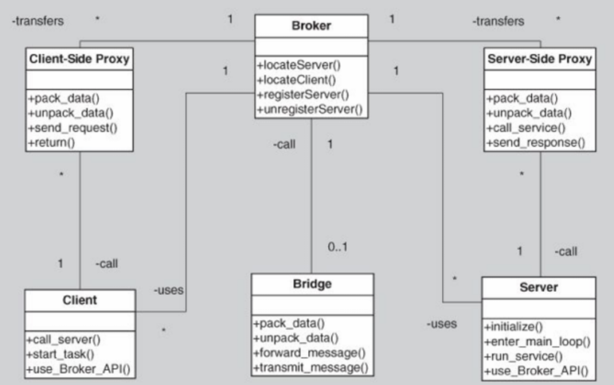
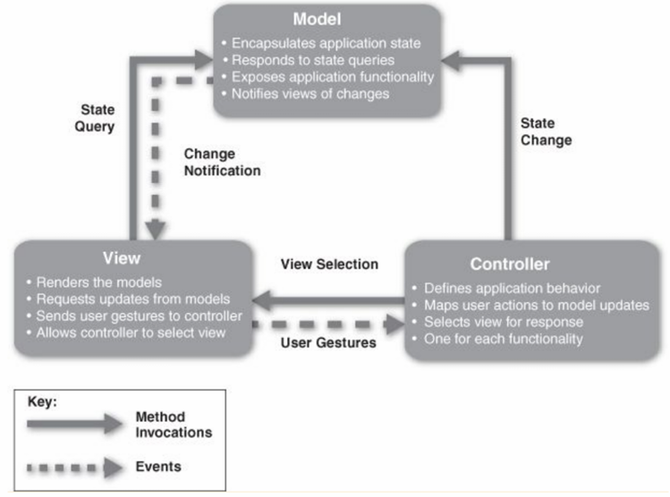

# 3 架构模式（Architecture Patterns）

## 3.1 架构模式（Architecture Patterns）

**定义**：架构模式是一套可应用于重复出现的设计问题的架构设计决策，它经过参数化以适应出现该问题的不同软件开发环境

**模式的组成**：一个架构模式建立了三者之间的关系：

- **上下文（Context）**：一个导致问题产生的、重复出现的常见情况
- **问题（Problem）**：在给定上下文中出现的、经过适当概括的问题
- **解决方案（Solution）**：一个针对该问题的、经过适当抽象的成功架构解决方案

**特点**：模式是在实践中被发现的，而非发明的。它们是可复用的设计决策包，并描述了一类架构

## 3.2 模块模式（Module Patterns）-分层模式（Layered pattern）

**概述（Overview）**：定义了多个层（提供内聚服务集的模块分组），以及层之间单向的“允许使用”关系

**元素（Elements）**：**层（Layer）**：一种模块，其描述应定义该层包含的模块以及它所提供的内聚服务集的特征

**关系（Relations）**：**允许使用（Allowed to use）**：一种特殊的依赖关系。设计应定义层的使用规则（例如，“一层可以使用其下的任何层”或“一层只能使用紧邻其下的层”）

**约束（Constraints）**：

- 每个软件片段都只被分配到一个层中
- 至少有两层，但通常是三层或更多
- “允许使用”关系不能是循环的（即，下层不能使用上层）

**弱点（Weaknesses）**：

- 增加分层会给系统带来前期的成本和复杂性
- 分层会带来性能损失

## 3.3 组件-连接器模式（Component-Connector Patterns）

### 3.3.1 代理模式（Broker Pattern）

**概述（Overview）**：定义了一个名为代理（broker）的运行时组件，它负责协调多个客户端（clients）和服务器（servers）之间的通信

**元素（Elements）**：

- **客户端（Client）**：服务的请求者
- **服务器（Server）**：服务的提供者
- **代理（Broker）**：定位合适的服务器以满足客户端请求的中介
- **客户端代理（Client-side proxy）**和**服务器端代理（Server-side proxy）**：分别在客户端和服务端，负责处理与代理通信的细节，

**关系（Relations）**：**附属（Attachment）**：将客户端和服务器与代理关联起来

**约束（Constraints）**：客户端和服务器只能连接到代理（可能通过各自的代理）

**弱点（Weaknesses）**：

- 代理增加了间接层，从而增加了延迟，并可能成为通信瓶颈
- 代理可能是单点故障（single point of failure）
- 增加了前期复杂性，且可能成为安全攻击的目标

### 3.3.2 模型-视图-控制器模式（Model-View-Controller Pattern）

**概述（Overview）**：将系统功能分解为三个组件：模型（model）、视图（view）和在两者之间进行协调的控制器（controller）

**元素（Elements）**：

- **模型（Model）**：应用程序数据或状态的表示，并包含应用逻辑
- **视图（View）**：用户界面组件，为用户生成模型的表示或允许用户输入
- **控制器（Controller）**：管理模型和视图之间的交互，将用户操作转换为对模型或视图的更改

**关系（Relations）**：**通知（Notifies）**：连接模型、视图和控制器的实例，通知元素相关的状态变化

**弱点（Weaknesses）**：

- 对于简单的用户界面来说，其复杂性可能不值得
- 模型、视图和控制器的抽象可能不适用于某些用户界面工具包

### 3.3.3 管道-过滤器模式（Pipe-and-Filter Pattern）

**概述（Overview）**：数据通过由管道连接的一系列过滤器进行转换，从系统外部输入转换到外部输出

**元素（Elements）**：

- **过滤器（Filter）**：一个转换数据的组件，可以增量地转换数据并与其他过滤器并发执行
- **管道（Pipe）**：一个连接器，用于将数据从一个过滤器的输出端口传送到另一个过滤器的输入端口。它保留数据序列且不改变数据

**关系（Relations）**：**附属（Attachment）**：将过滤器的输出与管道的输入关联起来，反之亦然

**约束（Constraints）**：

- 管道连接的是过滤器的输出端口和输入端口

- 连接的过滤器必须在通过管道传递的数据类型上达成一致
- 此模式的特化形式可能会将组件的连接限制为非循环图或线性序列（后者有时被称为“流水线”，pipeline）

**弱点（Weaknesses）**：

- 通常不适合交互式系统
- 大量的独立过滤器会增加大量的计算开销
- 可能不适用于长时间运行的计算

### 3.3.4 客户端-服务器模式（Client-Server Pattern）

**概述（Overview）**：客户端发起与服务器的交互，根据需要调用服务器的服务并等待请求结果

**元素（Elements）**：

- **客户端（Client）**：调用服务器组件服务的组件
- **服务器（Server）**：向客户端提供服务的组件
- **请求/应答连接器（Request/reply connector）**：客户端用于调用服务器服务的数据连接器

**关系（Relations）**：**附属（Attachment）**：将客户端和服务器连接

**约束（Constraints）**：

- 客户端通过请求/应答连接器连接到服务器
- 服务器组件也可以是其他服务器的客户端
- 组件可以按“层（tiers）”来组织，这些层是相关功能的逻辑分组，或者是在同一主机计算环境中共享功能的分组

**弱点（Weaknesses）**：

- 服务器可能成为性能瓶颈和单点故障
- 决定将功能放在客户端还是服务器通常很复杂，且构建后难以更改

### 3.3.5 点对点模式（Peer-to-Peer Pattern）

**概述（Overview）**：通过协作的对等节点（peers）实现计算，这些节点在网络中相互请求服务并提供服务

**元素（Elements）**：

- **对等节点（Peer）**：在网络节点上运行的独立组件。特殊的对等体可以提供路由、索引和搜索其他对等体的功能
- **请求/应答连接器（Request/reply connector）**：用于连接到对等网络、搜索其他节点并调用服务

**关系（Relations）**：关联对等节点与其连接器。这种连接关系可以在运行时发生改变

**约束（Constraints）**：可能会对允许的连接数、搜索跳数以及哪些节点知道哪些其他节点等施加限制

**弱点（Weaknesses）**：

- 管理安全性、数据一致性、可用性、备份和恢复都更加复杂
- 小型 P2P 系统可能无法持续实现性能和可用性等质量目标

### 3.3.6 面向服务模式（Service-Oriented Pattern / SOA）

**概述（Overview）**：通过一组协作的组件实现计算，这些组件在网络上提供和/或消费服务。计算通常使用工作流语言描述

**元素（Elements）**：

- **组件（Components）**：

  - **服务提供者（Service providers）**：通过发布的接口提供一个或多个服务

  - **服务消费者（Service consumers）**：直接或通过中介调用服务

  - **企业服务总线（ESB，Enterprise Service Bus）**：可以在提供者和消费者之间路由和转换消息的中介
  - **服务注册中心（Registry of services）**：提供者用它来注册服务，消费者用它在运行时发现服务
  - **编排服务器（Orchestration server）**：基于业务流程和工作流语言，协调服务消费者和提供者之间的交互

- **连接器（Connectors）**：包括用于同步通信的 SOAP 连接器 ，依赖 HTTP 基本操作的 REST 连接器 ，以及用于异步交换的异步消息连接器

**关系（Relations）**：**附加（Attachment）**：将不同类型的组件附加到各自对应的连接器上

**约束（Constraints）**：服务消费者连接到服务提供者，但中间可能使用中介组件（如ESB、注册中心、编排服务器）

**弱点（Weaknesses）**：

- 基于 SOA 的系统通常构建复杂
- 无法控制独立服务的演进
- 中间件会带来性能开销

### 3.3.7 发布-订阅模式（Publish-Subscribe Pattern）

**概述（Overview）**：组件发布（publish）和订阅（subscribe）事件。当一个组件发布一个事件时，连接器基础设施会将该事件分派给所有注册的订阅者

**元素（Elements）**：

- 任何具有至少一个发布或订阅端口的组件
- **发布-订阅连接器（Publish-subscribe connector）**：希望发布事件的组件提供“发布（announce）”角色，为希望订阅事件的组件提供“监听（listen）”角色

**关系（Relations）**：**附加（Attachment）**：通过规定哪些组件发布事件、哪些组件注册接收事件，来将组件与发布-订阅连接器关联起来

**约束（Constraints）**：

- 所有组件都连接到一个事件分发器。发布端口附加到发布角色，订阅端口附加到监听角色
- 一个组件可以同时是发布者和订阅者

**弱点（Weaknesses）**：

- 通常会增加延迟，并对可伸缩性和消息传递时间的可预测性产生负面影响
- 对消息排序的控制较少，且不保证消息的传递

### 3.3.8 共享数据模式（Shared-Data Pattern）

**概述（Overview）**：多个数据访问器（data accessors）之间的通信通过一个共享的数据存储（shared-data store）来进行协调。控制权可以由数据访问器发起，也可以由数据存储发起。数据由该数据存储负责持久化

**元素（Elements）**：

- **共享数据存储（Shared-data store）**：核心关注点包括存储的数据类型、数据性能相关的属性、数据分布方式以及允许的访问者数量
- **数据访问器组件（Data accessor component）**
- **数据读写连接器（Data reading and writing connector）**：这里的关键选择是连接器是否支持事务，以及读写所用的语言、协议和语义

**关系（Relations）**：**附属（Attachment）**：该关系决定了哪些数据访问器连接到哪些数据存储

**约束（Constraints）**：数据访问器只与数据存储进行交互

**弱点（Weaknesses）**：

- 共享数据存储可能成为性能瓶颈和单点故障
- 数据的生产者和消费者可能紧密耦合

## 3.4 分配模式（Allocation Patterns）

### 3.4.1 Map-Reduce 模式（Map-Reduce Pattern）

**概述（Overview）**：提供了一个框架，用于在一组处理器上并行地分析一个大型分布式数据集，这种并行化可以带来低延迟和高可用性。Map 函数执行分析中的“提取”和“转换”部分，而 Reduce 函数执行“加载”结果的部分

**元素（Elements）**：

- **Map**：一个函数，其多个实例被部署在多个处理器上，用于执行数据分析的提取和转换工作
- **Reduce**：一个函数，可以部署为单个或多个实例，用于执行加载结果的工作
- **基础设施（Infrastructure）**：负责部署 Map 和 Reduce 实例、在它们之间传递数据、检测并从故障中恢复的框架

**关系（Relations）**：

- **部署于（Deploy on）**：Map 或 Reduce 函数的实例与其安装到的处理器之间的关系
- **实例化、监控和控制（Instantiate, monitor, and control）**：基础设施与 Map 和 Reduce 实例之间的关系

**约束（Constraints）**：

- 待分析的数据必须以一组文件的形式存在
- Map 函数是无状态的，并且彼此之间不进行通信
- Map 实例和 Reduce 实例之间唯一的通信，是 Map 实例输出的 `<key, value>` 键值对数据

**弱点（Weaknesses）**：

- 如果没有海量数据集，使用 Map-Reduce 的开销是不划算的
- 如果无法将数据集分割成大小相似的子集，并行的优势就会丧失
- 需要多次 Reduce 操作的运算会很复杂，难以协调

### 3.4.2 多层模式（Map-reduce pattern, Multi-tier pattern）

**概述（Overview）**：许多系统的执行结构被组织为一组组件的逻辑分组，每个分组称为一个层（tier）。组件分组到层中可以基于多种标准，如组件类型、共享相同的执行环境或具有相同的运行时目的

**元素（Elements）**：**层（Tier）**：软件组件的逻辑分组

**关系（Relations）**：

- **属于（Is part of）**：用于将组件归入某个层
- **与之通信（Communicates with）**：展示了层与层之间以及层内组件之间如何交互
- **分配给（Allocated to）**：当层需要映射到具体的计算平台时使用此关系

**约束（Constraints）**：一个软件组件只能精确地属于一个层

**弱点（Weaknesses）**：会带来巨大的前期成本和复杂性

## 3.5 模式与策略的对比（Patterns vs. Tactics）

**核心区别与联系**：

- **复杂性与范围**:
  - **策略（Tactics）**相对更简单，它们通常使用单一的结构或机制来应对单一的架构驱动力
  - **模式（Patterns）**则更为复杂，它们通常将多个设计决策打包在一起
- **构建关系**:
  - 策略可以被视为设计的“构建模块（building blocks）”，架构模式正是由这些策略构建而成的
  - 大多数模式由多个不同的策略组合而成。这些策略可能都服务于一个共同的目标，也可能被选中用来满足不同的质量属性

以**分层模式（Layered Pattern）**为例，它就包含了多种策略来实现其目标 。例如，在实现**可修改性（Modifiability）**这个质量属性时，分层模式运用了以下策略：

- 增加语义内聚性（Increase Semantic Coherence）：将功能相似的模块组织在同一个层中
- 限制依赖（Restrict Dependencies）：通过规定层与层之间单向的依赖关系，来减少耦合
- 抽象通用服务（Abstract Common Services）：将多个组件可能需要的通用服务抽象出来，放在一个独立的层或服务中

总的来说，策略是解决特定问题的具体、底层的设计方法，而模式则是将多个策略组合起来，为一类重复出现的设计问题提供的、更宏观、更完整的解决方案