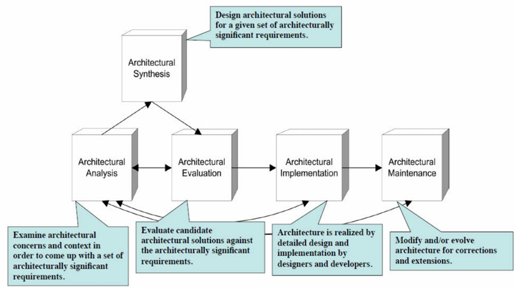
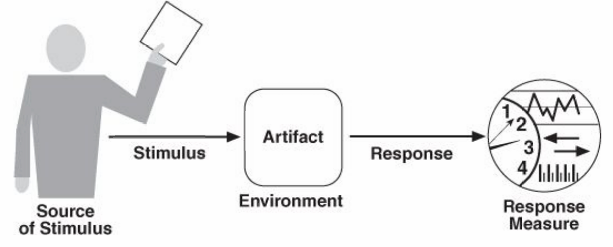
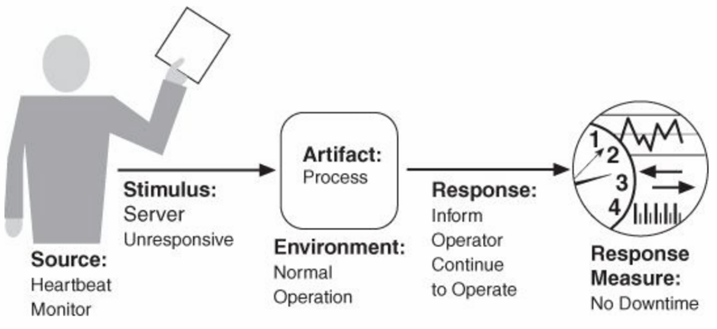
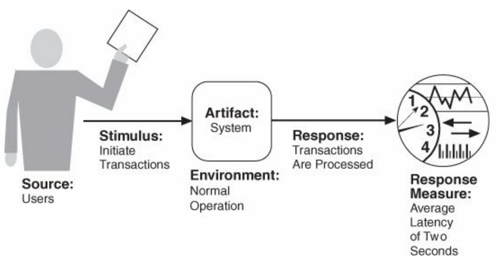
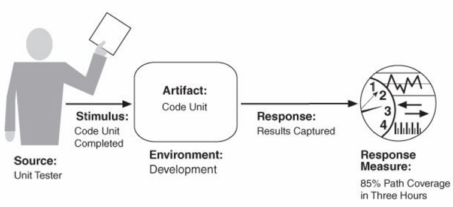
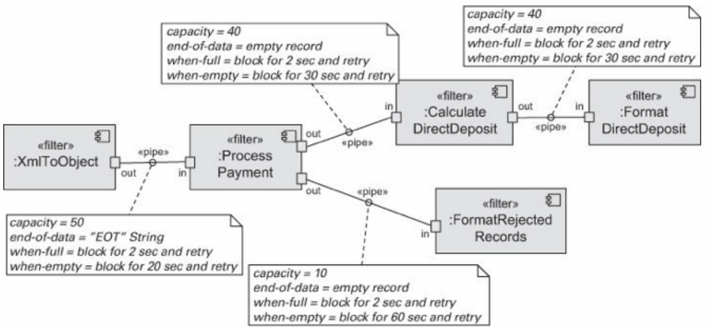
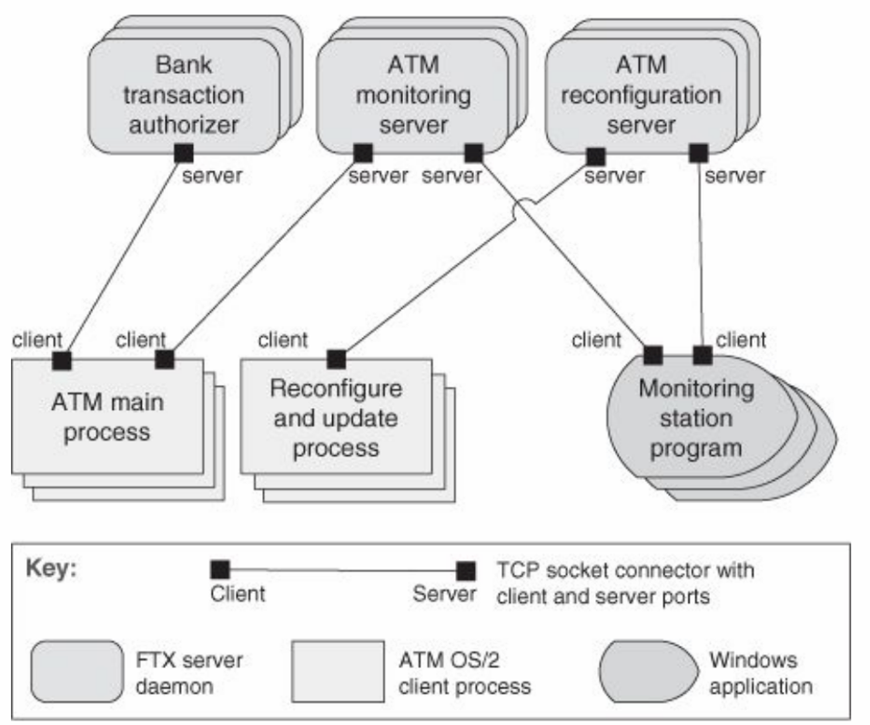
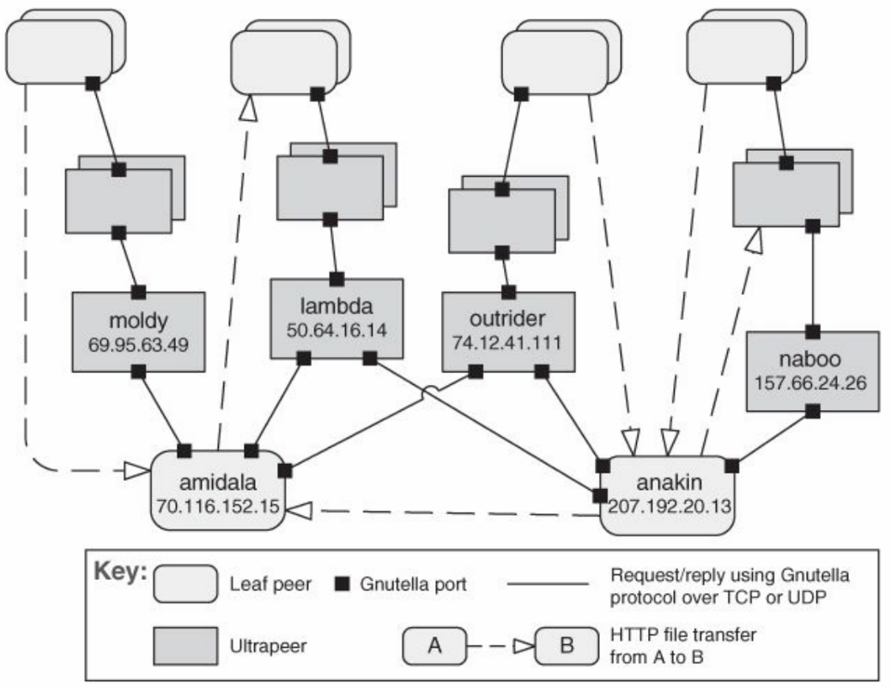
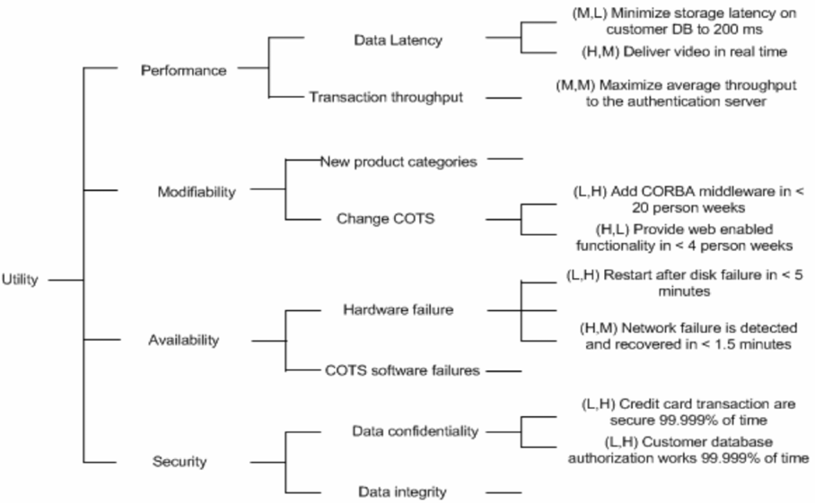
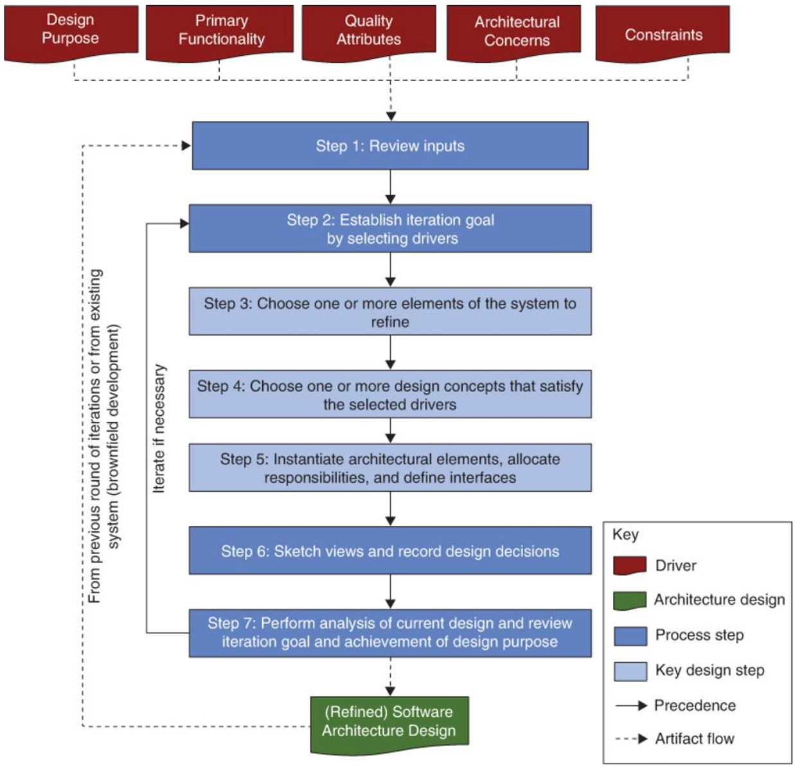

# 1 软件架构概论（Software Architecture in General）

## 1.1 什么是软件架构？（What is software architecture?）

定义 1：一个程序或计算系统的软件架构是系统的一个或多个结构，它由软件元素、这些元素的外部可见属性以及它们之间的关系组成

定义 2：系统根本的组织形式，体现在其组件、组件之间以及组件与环境之间的关系，以及指导其设计和演化的原则之中

**架构与设计（Architecture vs. Design）**：所有架构都是软件设计，但并非所有设计都是软件架构架构被视作高级别设计、一组设计决策或系统的结构/组织

**架构与结构（Architecture vs. Structure）**：架构定义了组件接口、组件间的通信与依赖，以及组件的职责

## 1.2 软件架构师做什么？（What does a software architect do?）

**角色定位**：架构师的角色与建筑师类似，负责倾听客户需求、评估可行性、构想并创建蓝图，并监督建造过程

**核心职责（Core Responsibilities）**：

- **联络（Liaison）**：在客户、技术团队和业务/需求分析师之间，以及与管理层或市场部门进行沟通
- **软件工程（Software Engineering）**：遵循软件工程的最佳实践
- **技术知识（Technology Knowledge）**：对技术领域有深入的理解
- **风险管理（Risk Management）**：管理与设计和技术选择相关的风险

## 1.3 架构从何而来？（Where do architectures come from?）

**需求与约束（Requirements and Constraints）**：架构设计过程始于需求规格和各种约束（如资源、组织、经验、软件复用等） 

**非功能性需求（Non-functional requirements - NFRs）**：

- NFRs 定义了系统“工作得如何”
- 它们也被称为架构需求（architecture requirements），通常需要架构师去发掘
- NFRs 包括技术约束（Technical constraints）、业务约束（Business constraints）和质量属性（Quality attributes）

**架构的重要性（Importance of Architecture）**：

- 沟通媒介（Vehicle for communication）：作为沟通的载体，用于协商需求、告知进度等
- 早期设计决策的体现（Manifestation of early design decisions）：这些决策最难更改，因此需要仔细考虑
- 可传递和可复用的抽象（Transferable and reusable abstraction）：一个架构可以对应多个系统，是产品线共性的基础

## 1.4 架构（4+1）视图（Architecture（4+1）Views）

**概述**：一个软件架构是一个复杂的设计产物，可以从多个可能的“视图”来观察，类似于建筑的楼层平面图、外部图、电路图等

- **逻辑视图（Logical view）**：描述架构中具有重要意义的元素及其之间的关系
- **过程视图（Process view）**：描述架构的并发和通信元素
- **物理视图（Physical view）**：描绘主要过程和组件如何映射到应用程序的硬件上
- **开发视图（Development view）**：捕获软件组件的内部组织结构，例如在配置管理工具中
- **+1 - 架构用例（Architecture use cases）**：捕获架构的需求，这些需求可能与多个视图相关

## 1.5 架构活动与过程（Architectural activities and process）

**通用设计策略（Generic Design Strategies）**：分解（Decomposition）、抽象（Abstraction）、分而治之（Stepwise: 'Divid and Conquer'）、生成与测试（Generate and Test）、迭代（Iteration）和复用（Reuse）

**架构活动（Architecture Activities）**：

- 创建系统业务案例（Creating the business case）
- 理解需求（Understanding the requirements）
- 创建和选择架构（Creating and selecting architecture）
- 沟通架构（Communicating the architecture）
- 分析或评估架构（Analysing or evaluating the architecture）
- 实现架构并确保一致性（Implementing the architecture and ensuring conformance）

**软件架构过程模型（Software Architecture Process Model）**：这是一个循环过程，涉及指定架构显著性需求（Specifying ASRs）、架构设计（Architecture design）、文档化（Documenting）和架构评估（Architecture Evaluation），并与干系人（Stakeholders）、需求与约束（Requirements, constraints）持续交互

**架构生命周期（Architecture Lifecycle）**：包括架构分析（Architectural Analysis）、架构综合（Architectural Synthesis）、架构评估（Architectural Evaluation）、架构实现（Architectural Implementation）以及架构维护（Architectural Maintenance）

# 2 质量属性与策略（Quality Attributes & Tactics）

## 2.1 软件需求（Software Requirements）

**需求的重要性**

* 用户需求是系统设计的基础
* 在系统构建后再提出需求不匹配的问题是常见的痛点

**功能性需求（Functional Requirements）**

* 定义：系统必须做什么，以及如何为利益相关者提供价值 
* 等同于系统行为
* 定义：系统完成其预期工作的能力（例如，学生在线注册） 
* 实现方式：功能性可以通过多种可能的结构来实现
* 独立性：功能性在很大程度上独立于结构，因为它可以作为一个没有任何内部结构的单一整体系统存在

**质量需求（Quality Requirements）/ 质量属性（Quality Attributes）** 

* 定义：系统在其功能性需求之上应提供的整体系统的期望特性
* 是对功能性需求或整个产品的限定
* 与软件架构的关系：如果质量属性很重要，软件架构会限制功能性在各种结构上的分配（映射）

**约束（Constraints）**

* 定义：自由度为零的设计决策 
* 是预先指定且已经做出的设计决策
* 满足方式：通过接受设计决策并将其与其他受影响的设计决策相协调来满足

**非功能性需求（Non-functional Requirements）**

- **定义与重要性**

  * 非功能性需求或架构需求是质量属性的替代术语

  * 无法先实现功能再考虑非功能性需求（质量无法后续弥补）

  * 非功能性需求必须在任何设计决策中加以考虑

- **分类**

  * **执行期间可观察（外部）**：系统满足其行为要求的程度如何？

    例如：性能、安全性、可用性、易用性等

  * **执行期间不可观察（内部）**：系统维护、集成或测试的难易程度如何？

    例如：可修改性、可移植性、可重用性、可测试性等

## 2.2 质量属性与策略（Quality Attributes & Tactics）

### 2.2.1 内部 vs. 外部属性（Internal vs. External Attributes）

- **执行期间外部可观察属性（Observable External）**：系统在执行期间如何满足其行为需求。例如：性能（performance）、安全性（security）、可用性（availability）、易用性（usability）等
- **执行期间内部不可观察属性（Not observable Internal）**：系统维护、集成或测试的难易程度如何？例如：可修改性（modifiability）、可移植性（portability）、可重用性（reusability）、可测试性（testability）等

### 2.2.2 建模质量属性场景（Modeling Quality Attribute Scenarios）

**质量属性场景（Quality Attribute Scenarios）**：用于定义期望的质量属性，使其在架构层面可被评估

* **通用场景（General Scenarios）**：系统无关的场景，用于指导质量属性需求的规约
  * 每个场景都可能（但不一定）与我们关注的系统相关
  * 要使通用场景对特定系统有用，必须使其系统特定化
  * 将通用场景系统特定化意味着将其转化为特定系统的具体术语
* **具体场景（Concrete Scenarios）**：系统特定的场景，用于指导特定系统质量属性需求的规约，是通用场景的实例
  

* **刺激源（Source of Stimulus）**：产生刺激的实体（人、系统或任何执行器）
* **刺激（Stimulus）**：当到达系统时需要考虑的条件
* **制品（Artifact）**：需求适用的整个系统或系统的一部分
* **环境（Environment）**：刺激发生时系统的条件（例如，过载、运行中等）
* **响应（Response）**：刺激到达后所采取的活动
* **响应度量（Response Measure）**：对刺激的响应应以某种方式可度量，以便需求是可测试的

### 2.2.3 具体的质量属性

#### 可用性（Availability）

**定义**：衡量系统在需要时可用的时间比例。可用性与应用程序的**可靠性（reliability）**相关。不可靠的应用程序可用性通常较差

**计算**：在指定时间间隔内，系统提供指定服务并在要求范围内的概率

- 计算公式：$$\frac{MTBF}{(MTBF + MTTR）}$$ 
- **MTBF**（Mean Time Between Failures - 平均无故障时间）
- **MTTR**（Mean Time To Repair - 平均修复时间）

**可用性通用场景**：

| Scenario Portion                 | Possible Values                                              |
| -------------------------------- | ------------------------------------------------------------ |
| **刺激源（Source）**             | 内部 / 外部：人员、硬件、软件、物理基础设施、物理环境        |
| **刺激（Stimulus）**             | 缺陷：遗漏、崩溃、不正确的时序、不正确的响应                 |
| **制品（Artifact）**             | 处理器、通信信道、持久存储、进程                             |
| **环境（Environment）**          | 正常操作、启动、关闭、修复模式、降级操作、过载操作           |
| **响应（Response）**             | 阻止缺陷演变成故障；检测故障：记录故障、通知相关实体（人员或系统）；从故障中恢复：禁用导致故障的事件源、在修复期间暂时不可用、修复或掩盖故障 / 失效（故障屏蔽（Fault Masked））或控制其造成的损害、在修复期间以降低模式运行 |
| **响应度量（Response Measure）** | 系统必须可用的时间或时间间隔；可用性百分比（例如 99.999%）；检测故障的时间；修复故障的时间；系统可以处于降级模式的时间或时间间隔；系统阻止或在不发生故障的情况下处理某类故障的比例（例如 99%）或速率（例如每秒高达 100 次） |

**可用性示例场景**：

* **刺激源（Source of Stimulus）**：心跳监视器
* **刺激（Stimulus）**：服务器无响应
* **制品（Artifact）**：进程
* **环境（Environment）**：正常操作
* **响应（Response）**：通知操作员，继续操作
* **响应度量（Response Measure）**：无停机时间

**可用性策略**：

- **检测故障（Detect Faults）**

  - **Ping/Echo**：一个组件发出 ping，并期望在预定义时间内从另一个组件收到echo。可用于负责同一任务的一组组件内
  - **心跳（Heartbeat，也称 dead man timer）**：一个组件定期发出心跳消息（也可携带数据），另一个组件侦听它。如果心跳失败，则假定始发组件已发生故障，并通知故障纠正组件
  - **异常（Exception）**：识别故障的一种方法是遇到异常。异常处理程序通常在引发异常的同一进程中执行。Ping 和心跳策略在不同进程间操作，而异常策略在单个进程内操作
  - **进程监视器（Process Monitor）**：一旦检测到进程中的故障，监视进程可以检测到不执行的进程，并创建它的一个新实例，初始化到某个适当的状态，如备用策略中那样
  - **时间戳（Timestamp）**
  - **健全性检查（Sanity Checking）**
  - **状态监控（Condition Monitoring）**
  - **表决（Voting）**：运行在冗余处理器上的进程各自接收等效输入并计算一个简单值发送给表决器。如果表决器检测到单个进程的异常行为，则使其失效
  - **异常检测（Exception Detection）**
  - **自测试（Self-Test）**

- **Recover from Faults（从故障中恢复）**

  - **准备和修复（Preparation and Repair）**
    - **主动冗余（Active Redundancy）**：所有冗余组件并行响应事件，它们都处于相同状态。只使用一个组件的响应，其余的被丢弃。发生故障时，停机时间通常不存在，因为备份是当前的，唯一的切换时间是恢复时间
    - **被动冗余（Passive Redundancy）**：一个组件（主组件）响应事件，并通知其他组件（辅助组件）它们必须进行的状态更新。发生故障时，系统必须首先确保备份状态足够新近，然后才能恢复服务
    - **备用（Spare）**：配置一个备用计算平台以替换许多不同的故障组件
    - **异常处理（Exception Handling）**
    - **检查点 / 回滚（Checkpoint / Rollback）**：检查点是定期或响应特定事件创建的一致状态的记录
    - **软件升级（Software Upgrade）**
    - **重试（Retry）**
    - **忽略错误行为（Ignore Faulty Behavior）**
    - **降级（Degradation）**
    - **重新配置（Reconfiguration）**

  - **重新引入（Reintroduction）**
    - **影子操作（Shadow operation）**：先前发生故障的组件可能会在 “影子模式” 下运行一小段时间，以确保其在恢复服务之前模仿工作组件的行为
    - **状态重新同步（State Resynchronization）**：被动和主动冗余策略要求被恢复的组件在恢复服务之前升级其状态
    - **升级重启（Escalating Restart）**
    - **不间断转发（Non-Stop Forwarding）**

- **Prevent Faults（预防故障）**

  - **移出服务（Removal from Service）**：此策略将系统的一个组件从操作中移除，以进行某些活动来防止预期的故障
  - **事务（Transactions）**：事务是将几个顺序步骤捆绑在一起，以便整个捆绑包可以一次性撤销
  - **预测模型（Predictive Model）**
  - **异常预防（Exception Prevention）**
  - **增加能力集（Increase Competence Set）**

**可用性设计与分析检查清单**：

- **职责分配（Allocation of Responsibilities）**：确定哪些系统职责需要高可用性。在这些职责中，分配额外的职责来检测故障（如遗漏、崩溃、不正确的计时或响应），并进行日志记录、通知和恢复操作

- **协调模型（Coordination Model）**：确保协调机制能够在通信降级、系统启动/关闭或过载等情况下正常工作。协调模型需要支持对故障的日志记录、通知、修复或在降级模式下运行等响应。模型应支持替换系统中的构件（如处理器、通信渠道），例如，替换服务器后系统仍能继续运行

- **数据模型（Data Model）**：确定哪些数据抽象及其操作可能导致故障。确保这些数据抽象在发生故障时可以被禁用、暂时不可用或被修复/屏蔽。例如，如果服务器暂时不可用，写请求应被缓存，待服务器恢复后再执行

- **架构元素之间的映射（Mapping among Architectural Elements）**：确保架构元素（如进程、模块）到计算资源（如处理器、存储）的映射足够灵活，以允许从故障中恢复。这可能涉及运行时重新分配失败处理器上的进程或激活备用处理器

- **资源管理（Resource Management）**：确定在发生故障时维持系统运行所需的关键资源。确保在故障发生时，有足够的剩余资源来执行日志记录、通知、禁用故障源等恢复活动。例如，确保输入队列足够大，以便在服务器故障时缓冲预期的消息，防止消息永久丢失

- **绑定时间（Binding Time）**：延迟绑定可以提供更大的灵活性，有助于在运行时替换失败的组件
- **技术选择（Choice of Technology）**：选择支持冗余、故障检测和快速恢复等策略的技术，如支持集群和负载均衡的框架

#### 互操作性（Interoperability）

**定义**：两个或多个系统在特定上下文中通过接口有效交换有意义信息的程度。包括数据交换能力（句法互操作性）和正确解释数据的能力（语义互操作性）

**关键方面**：

- 服务的发现（Discovery）：服务的消费者必须发现服务的位置、身份和接口
- 响应的处理（Handling of the response）：向请求者报告响应；将其响应传递给另一个系统；向任何相关方广播其响应

**互操作性通用场景**：

| Scenario Portion                 | Possible Values                                              |
| -------------------------------- | ------------------------------------------------------------ |
| **刺激源（Source）**             | 一个系统发起与另一个系统互操作的请求                         |
| **刺激（Stimulus）**             | 在系统之间交换信息的请求                                     |
| **制品（Artifact）**             | 希望互操作的系统                                             |
| **环境（Environment）**          | 希望互操作的系统在运行时被发现或在运行时之前已知             |
| **响应（Response）**             | 以下一项或多项：请求被（适当地）拒绝并通知适当的实体（人员或系统）；请求被（适当地）接受并且信息成功交换；一个或多个相关系统记录了该请求 |
| **响应度量（Response Measure）** | 以下一项或多项：正确处理的信息交换百分比；正确拒绝的信息交换百分比 |

**互操作性示例场景**：

- **刺激源（Source of Stimulus）**：我们的车辆信息系统
- **刺激（Stimulus）**：当前位置已发送
- **制品（Artifact）**：交通监控系统
- **环境（Environment）**：系统在运行前已知
- **响应（Response）**：交通监控器将当前位置与其他信息结合，叠加在谷歌地图上，并广播
- **响应度量（Response Measure）**：我们的信息 99.9% 的时间被正确包含

**互操作性策略**：

- **定位（Locate）**：**发现服务（Discover Service）**：通过搜索已知的目录服务来定位服务

  **多级间接（Multiple levels of indirection）**

- **管理接口（Manage Interfaces）**

  - **编排（Orchestrate）**：使用控制机制来协调、管理和排序特定服务的调用
  - **定制接口（Tailor Interface）**：向接口添加或移除功能

**互操作性设计与分析检查清单**：

- **职责分配（Allocation of Responsibilities）**：确定哪些系统职责需要与其他系统进行互操作。分配职责来检测与已知或未知外部系统的互操作请求，并执行接受、交换信息、拒绝、通知和日志记录等任务

- **协调模型（Coordination Model）**：选择能够满足关键质量属性（如性能）的协调机制，并确保协议和网络假设与外部系统一致
- **数据模型（Data Model）**：确定可能在互操作系统之间交换的主要数据抽象的语法和语义。确保这些数据抽象与外部系统的数据一致。如果数据模型是机密的，可能需要进行数据转换
- **架构元素之间的映射（Mapping among Architectural Elements）**：关键映射是将组件映射到处理器。需要确保与外部通信的组件被部署在能够访问网络的处理器上，并满足安全性、可用性和性能要求
- **资源管理（Resource Management）**：确保与其他系统的互操作（无论是接受还是拒绝请求）不会耗尽关键系统资源（例如，请求泛滥是否会导致拒绝服务）。如果互操作需要共享资源，应制定适当的仲裁策略
- **绑定时间（Binding Time）**：确定系统何时知道需要互操作的对方。对于晚期绑定（late binding），确保有机制支持发现新服务或协议
- **技术选择（Choice of Technology）**：考虑那些专门为支持互操作性而设计的技术，例如 Web 服务（web services）。评估所选技术对互操作性的影响是支持、削弱还是无影响

#### 可修改性（Modifiability）

**定义**：进行更改的成本（时间或金钱），包括这种可修改性对其他功能或质量属性的影响程度。规划可修改性需要考虑：什么可能改变、改变的可能性、何时由谁改变以及改变的成本

**可修改性通用场景**：

| Scenario Portion                 | Possible Values                                              |
| -------------------------------- | ------------------------------------------------------------ |
| **刺激源（Source）**             | 最终用户、开发人员、系统管理员                               |
| **刺激（Stimulus）**             | 添加/删除/修改功能的指令，或更改质量属性、容量或技术的指令   |
| **制品（Artifacts）**            | 代码、数据、接口、组件、资源、配置                           |
| **环境（Environment）**          | 运行时、编译时、构建时、初始化时、设计时                     |
| **响应（Response）**             | 以下一项或多项：进行修改、测试修改、部署修改                 |
| **响应度量（Response Measure）** | 就以下方面而言的成本：受影响制品的数量、大小、复杂性；工作量；日历时间；金钱（直接支出或机会成本）；此修改对其他功能或质量属性的影响程度；引入的新缺陷 |

**可修改性示例场景**：

- **刺激源（Source）**：开发人员
- **刺激（Stimulus）**：希望更改用户界面
- **制品（Artifact）**：代码
- **环境（Environment）**：设计时
- **响应（Response）**：变更已完成并进行了单元测试
- **响应度量（Response Measure）**：三小时内

**可修改性策略**：

- **减小模块大小（Reduce Size of a Module）**

  拆分模块（Split Module）：如果被修改的模块包含大量功能，修改成本可能会很高

- **增加内聚性（Increase Cohesion）**

  增加语义内聚性（Increase Semantic Coherence）：如果模块中的职责A和B不服务于同一目的，则应通过创建新模块或将职责移至现有模块来将它们放置在不同的模块中

- **减少耦合（Reduce Coupling）**

  - 封装（Encapsulate）：引入模块的显式接口，并降低一个模块的更改传播到其他模块的可能性

  - 使用中介（Use an Intermediary）：可以打破依赖关系

  - 限制依赖（Restrict Dependencies）

  - 重构（Refactor）：当两个模块受到相同变更的影响时，进行重构

  - 抽象公共服务（Abstract Common Services）

- **延迟绑定（Defer Binding）**：在生命周期的不同阶段（而不是最初定义它们的阶段）绑定某些参数的值

**可修改性设计与分析检查清单**：

- **职责分配（Allocation of Responsibilities）**：确定可能发生的变更类别，并为每种变更确定需要添加、修改或删除的职责。将可能同时变更的职责放在同一模块中，将可能在不同时间变更的职责放在不同的模块中

- **协调模型（Coordination Model）**：对于关注可修改性的元素，使用能降低耦合的协调模型，如发布-订阅（publish-subscribe），或推迟绑定的模型，如企业服务总线（enterprise service bus）
- **数据模型（Data Model）**：确定数据抽象中可能发生的变更，并将可能一起变更的数据项分配到数据模型的同一元素中。为最终用户或系统管理员预留修改接口，确保他们有正确的权限
- **架构元素之间的映射（Mapping among Architectural Elements）**：确定是否需要在运行时、编译时或设计时更改功能到计算元素的映射。确保这类更改可以通过使用延迟绑定（Defer Binding）映射决策的机制来执行
- **资源管理（Resource Management）**：确定职责或质量属性的增、删、改将如何影响资源使用。封装所有资源管理器，并确保其策略本身也是被封装的，且绑定尽可能推迟
- **绑定时间（Binding Time）**：为每种可能的变更，确定需要进行变更的最晚时间。选择一个能在该时间点提供相应能力的延迟绑定机制，并评估引入该机制的成本与使用该机制进行变更的成本
- **技术选择（Choice of Technology）**：选择能够支持最可能发生的修改的技术。例如，企业服务总线使更改元素连接方式更容易，但也可能引入供应商锁定（vendor lock-in）

#### 性能（Performance）

**定义**：关于时间和软件系统满足时间要求的能力

响应时间构成：

- 处理时间（processing time）：系统为响应而工作的时间
- 阻塞时间（blocked time）：系统无法响应的时间

**性能通用场景**：

| 场景部分                         | 可能的值                                                     |
| -------------------------------- | ------------------------------------------------------------ |
| **刺激源（Source）**             | 系统内部或外部。                                             |
| **刺激（Stimulus）**             | 周期性、偶发性或随机性事件的到达。                           |
| **制品（Artifact）**             | 系统或系统中的一个或多个组件。                               |
| **环境（Environment）**          | 操作模式：正常、紧急、峰值负载、过载。                       |
| **响应（Response）**             | 处理事件，改变服务级别。                                     |
| **响应度量（Response Measure）** | 延迟（Latency）、截止时间（deadline）、吞吐量（throughput）、抖动（jitter）、未命中率（miss rate）。 |

**性能示例场景**：

- **刺激源（Source）**：用户
- **刺激（Stimulus）**：发起事务
- **制品（Artifact）**：系统
- **环境（Environment）**：正常操作
- **响应（Response）**：事务被处理
- **响应度量（Response Measure）**：平均延迟两秒

**性能策略**：

- **控制资源需求（Control Resource Demand）**：（需求端）
  - 管理采样率（Manage Sampling Rate）：例如，降低采样频率
  - 限制事件响应（Limit Event Response）：当离散事件到达系统的速度过快以致无法处理时，事件必须排队直到可以处理
  - 优先处理事件（Prioritize Events）：如果并非所有事件都同等重要
  - 减少开销（Reduce Overhead）：通过使用中介来更有效地利用资源或减少不必要的资源消耗
  - 限制执行时间（Bound Execution Times）
  - 提高资源效率（Increase Resource Efficiency）
- **管理资源（Manage Resources）**：（资源端）
  - 增加资源（Increase Resources）：更快的处理器、额外的内存、更快的网络……
  - 引入并发（Introduce Concurrency）：如果请求可以并行处理
  - 维护计算的多副本（Maintain Multiple Copies of Computations）：：使用负载均衡器将新工作分配给可用的重复服务器之一
  - 维护数据的多副本（Maintain Multiple Copies of Data）
    - 缓存（caching）
    - 数据复制（data replication）

  - 限制队列大小（Bound Queue Sizes）
  - 调度资源（Schedule Resources）

**性能设计与分析检查清单**：

- **职责分配（Allocation of Responsibilities）**：识别那些将涉及重负载、有时间关键性响应要求或被频繁使用的系统职责。识别并分配额外的职责来管理控制线程（分配、释放、维护线程池）和调度共享资源（管理队列、缓冲区、缓存）

- **协调模型（Coordination Model）**：选择能够支持并发、事件优先级或调度策略的通信和协调机制。选择具有适当属性的通信机制，如无状态（stateless）、异步（asynchronous）、保证交付（guaranteed delivery）等
- **数据模型（Data Model）**：确定数据模型中哪些部分将承受重负载或有时间关键性要求。评估维护关键数据的多个副本或对数据进行分区是否有助于提高性能
- **架构元素之间的映射（Mapping among Architectural Elements）**：确保计算密集型的组件被分配到处理能力最强的处理器上。在网络负载较重的地方，确定将某些组件共同部署（co-locating）是否能减少负载并提高效率。确定在何处引入并发是可行的，并能对性能产生显著的积极影响
- **资源管理（Resource Management）**：确定系统中的哪些资源对性能至关重要，并确保在正常和过载操作下对它们进行监控和管理。这包括部署额外资源以满足增加的负载、设置资源优先级和调度策略等
- **绑定时间（Binding Time）**：对于将在编译后绑定的每个元素，确定完成绑定所需的时间以及晚期绑定机制引入的额外开销。确保这些值不会对系统造成不可接受的性能损失
- **技术选择（Choice of Technology）**：评估所选技术是否允许您设置并满足严格的实时性截止日期。了解其在负载下的特性和极限，以及它是否为频繁使用的操作引入了过多的开销

#### 安全性（Security）

**定义**：衡量系统保护数据和信息免遭未经授权访问的能力，同时仍向获得授权的人员和系统提供访问权限

**特性（CIA）**：

- 机密性（Confidentiality）：数据和服务受到保护，免遭未经授权的访问
- 完整性（Integrity）：数据和服务不会遭受未经授权的篡改
- 可用性（Availability）：系统可供合法使用

**安全性通用场景**：

| Portion of Scenario              | Possible Values                                              |
| -------------------------------- | ------------------------------------------------------------ |
| **刺激源（Source）**             | 人类或另一个系统，可能先前已被（正确或错误地）识别，或者当前未知。人类攻击者可能来自组织外部或内部。 |
| **刺激（Stimulus）**             | 未经授权的尝试，试图显示数据、更改或删除数据、访问系统服务、更改系统行为或降低可用性。 |
| **制品（Artifact）**             | 系统服务、系统内的数据、系统的组件或资源、系统产生或消耗的数据。 |
| **环境（Environment）**          | 系统在线或离线；连接到网络或与网络断开；在防火墙后或对网络开放；完全运行、部分运行或不运行。 |
| **响应（Response）**             | 以某种方式执行事务，使得：数据或服务受到保护，免遭未经授权的访问。数据或服务未被未经授权地操纵。事务各方得到可靠的身份识别。事务各方不能否认其参与。数据、资源和系统服务将可供合法使用。系统通过以下方式跟踪其内部活动：记录访问或修改；记录访问数据、资源或服务的尝试；当发生明显攻击时通知适当的实体（人员或系统）。 |
| **响应度量（Response Measure）** | 以下一项或多项：当特定组件或数据值受损时，系统受损的程度；在检测到攻击之前经过的时间；抵御的攻击次数；从成功攻击中恢复所需的时间；特定攻击易受攻击的数据量。 |

**安全性示例场景**：

- **刺激源（Source）**：心怀不满的远程员工
- **刺激（Stimulus）**：试图修改工资率
- **制品（Artifact）**：系统内的数据
- **环境（Environment）**：正常操作
- **响应（Response）**：系统维护审计跟踪
- **响应度量（Response Measure）**：正确数据在一天内恢复，并识别出篡改源 

**安全性策略**：

1. **检测攻击（Detect Attacks）**

   - 检测入侵（Detect Intrusion）：通过将系统内的网络流量或服务请求模式与一组签名或已知模式进行比较
   - 检测服务拒绝（Detect Service Denial）
   - 验证消息完整性（Verify Message Integrity）：使用校验和或哈希值
   - 检测消息延迟（Detect Message Delay）

2. **抵抗攻击（Resist Attacks）**

   - 识别行为者（Identify Actors）：任何系统外部输入的来源

   - 验证行为者（Authenticate Actors）：确认他们声称的身份
   - 授权行为者（Authorize Actors）：确认谁有权访问和修改数据或服务
   - 限制访问（Limit Access）：限制对计算资源的访问
   - 限制暴露（Limit Exposure）：通过最小化系统的攻击面
   - 加密数据（Encrypt Data）
   - 分离实体（Separate Entities）
   - 更改默认设置（Change Default Settings）

3. **应对攻击（React to Attacks）**

   - 撤销访问（Revoke Access）：当攻击正在进行时，撤销对敏感资源的访问
   - 锁定计算机（Lock Computer）
   - 通知行为者（Inform Actors）（指通知管理员或相关系统）

4. **从攻击中恢复（Recover from Attacks）**

   - 维护审计跟踪（Maintain Audit Trail）

   - 恢复（Restore）

     参见可用性策略（See Availability Tactics）（许多可用性策略有助于从导致服务不可用的攻击中恢复）

**安全性设计与分析检查清单**：

- **职责分配（Allocation of Responsibilities）**：确定哪些系统职责需要是安全的。为这些职责分配额外的职责，以执行识别、认证、授权参与者、记录访问尝试、加密数据和从攻击中恢复等任务

- **协调模型（Coordination Model）**：确保有机制来认证和授权通信方，并对传输的数据进行加密。保存在监控和识别资源异常高需求的机制，以及限制或终止连接的机制
- **数据模型（Data Model）**：确定不同数据字段的敏感性，并将不同敏感性的数据分开。确保敏感数据具有不同的访问权限，并在访问前检查权限。对敏感数据的访问进行日志记录，并对日志文件进行适当保护
- **架构元素之间的映射（Mapping among Architectural Elements）**：确定不同的架构元素映射方式如何改变个人或系统读写数据、访问服务或降低可用性的能力。确保每种映射都支持身份识别、认证、授权、加密等安全职责
- **资源管理（Resource Management）**：考虑外部实体是否可以访问或耗尽关键资源。确保有足够的资源来执行必要的安全操作（如监控、日志记录）。确保受污染的元素无法污染其他元素
- **绑定时间（Binding Time）**：确定晚期绑定组件可能不受信任的情况。对于这些情况，确保可以对晚期绑定的组件进行资格认证（例如，管理和验证所有权证书），并能管理和阻止其对数据和服务的访问
- **技术选择（Choice of Technology）**：确定有哪些可用技术可以帮助进行用户认证、数据访问权限控制、资源保护和数据加密。确保所选技术支持与您的安全需求相关的策略

#### 可测试性（Testability）

**定义**：指软件通过（通常是基于执行的）测试来证明其故障的容易程度。为了可测试，必须能够控制每个组件的输入并观察其输出。

**可测试性通用场景**：

| Portion of Scenario              | Possible Values                                              |
| -------------------------------- | ------------------------------------------------------------ |
| **刺激源（Source）**             | 单元测试人员、集成测试人员、系统测试人员、验收测试人员、最终用户，他们手动运行测试或使用自动化测试工具 |
| **刺激（Stimulus）**             | 由于编码增量（如类、层或服务）的完成、子系统的集成完成、整个系统的完整实现或系统交付给客户而执行一组测试 |
| **环境（Environment）**          | 设计时、开发时、编译时、集成时、部署时、运行时               |
| **制品（Artifacts）**            | 被测试的系统部分                                             |
| **响应（Response）**             | 以下一项或多项：执行测试套件并捕获结果，捕获导致故障的活动，控制和监视系统状态 |
| **响应度量（Response Measure）** | 以下一项或多项：发现一个故障或一类故障所需的工作量，达到给定状态空间覆盖百分比所需的工作量，下一个测试揭示故障的概率，执行测试的时间，检测故障所需的工作量，测试中最长依赖链的长度，准备测试环境所需的时间长度，风险暴露的减少量（损失大小 × 损失概率） |

**可测试性示例场景**：

- **刺激源（Source）**：单元测试人员
- **刺激（Stimulus）**：代码单元完成
- **制品（Artifact）**：代码单元
- **环境（Environment）**：开发环境
- **响应（Response）**：结果已捕获
- **响应度量（Response Measure）**：三小时内达到 85% 路径覆盖率

**可测试性策略**：

1. **控制和观察系统状态（Control and Observe System State）**：维护某种状态信息，允许测试人员为该状态信息赋值，和 / 或按需向测试人员提供该信息
   - 专用接口（Specialized Interfaces）：允许您控制或捕获组件的值
   - 记录 / 回放（Record/Playback）：导致故障的状态并重新创建故障
   - 本地化状态存储（Localize State Storage）
   - 抽象数据源（Abstract Data Sources）
   - 沙箱（Sandbox）：将系统的实例与真实世界隔离，以便进行实验并撤销其后果
   - 可执行断言（Executable Assertions）
2. **限制复杂性（Limit Complexity）**：复杂的软件更难测试，因为其操作状态空间非常大，并且更难在大的状态空间中重新创建确切状态
   - 限制结构复杂性（Limit Structural Complexity）：避免、减少或解决组件之间的依赖关系；隔离和封装对外部环境的依赖关系
     - 限制类派生自的类的数量
     - 限制继承树的深度和类的子节点数量
     - 限制多态性和动态调用
   - 限制不确定性（Limit Nondeterminism）：限制行为复杂性。不确定性系统更难测试

**可测试性设计与分析检查清单**：

- **职责分配（Allocation of Responsibilities）**：确保分配了额外的系统职责来执行测试套件、捕获结果、记录导致故障的活动以及为测试控制和观察相关系统状态。确保功能分配具有高内聚、低耦合和强关注点分离的特点

- **协调模型（Coordination Model）**：确保协调机制支持将状态注入通信渠道并进行监控以用于测试。协调模型不应引入不必要的不确定性（nondeterminism）
- **数据模型（Data Model）**：确保可以捕获主要数据抽象实例的值，并且在将状态注入系统时可以设置这些值，以便重现导致故障的系统状态
- **架构元素之间的映射（Mapping among Architectural Elements）**：确定如何测试架构元素的可能映射（尤其是进程到处理器、线程到进程的映射），以识别潜在的竞争条件（race conditions）
- **资源管理（Resource Management）**：确保有足够的资源来执行测试套件并捕获结果。确保测试环境能够代表系统将要运行的环境，并提供测试资源限制和注入新资源限制的方法
- **绑定时间（Binding Time）**：确保在编译时之后绑定的组件可以在晚期绑定的上下文中进行测试。确保在发生故障时可以捕获晚期绑定，以便重新创建导致故障的系统状态
- **技术选择（Choice of Technology）**：确定有哪些技术可以帮助实现适用于您架构的可测试性场景，例如回归测试、故障注入、记录和回放等技术

#### 易用性（Usability）

**定义**：关注用户完成期望任务的容易程度以及系统提供的用户支持类型

**易用性通用场景**：

| Scenario Portion                 | Possible Values                                              |
| -------------------------------- | ------------------------------------------------------------ |
| **刺激源（Source）**             | 最终用户，可能具有特定角色。                                 |
| **刺激（Stimulus）**             | 最终用户尝试高效使用系统、学习使用系统、最小化错误影响、调整系统或配置系统。 |
| **环境（Environment）**          | 运行时或配置时。                                             |
| **制品（Artifacts）**            | 系统或用户正在交互的系统的特定部分。                         |
| **响应（Response）**             | 系统应向用户提供所需的功能或预测用户的需求。                 |
| **响应度量（Response Measure）** | 以下一项或多项：任务时间、错误数量、完成的任务数量、用户满意度、用户知识的增长、成功操作与总操作的比率，或发生错误时丢失的时间或数据量。 |

**易用性示例场景**：

- **刺激源（Source）**：用户
- **刺激（Stimulus）**：下载一个新应用程序
- **制品（Artifact）**：系统
- **环境（Environment）**：运行时
- **响应（Response）**：用户高效地使用应用程序
- **响应度量（Response Measure）**：在两分钟的体验时间内

**易用性策略**：

1. **支持用户主动（Support User Initiative）**
   - 取消（Cancel）
   - 撤销（Undo）：系统必须维护足够数量的系统状态，以便可以恢复到较早的状态
   - 暂停 / 恢复（Pause/Resume）：当用户启动了长时间运行的操作时
   - 聚合（Aggregate）：将较低级别的对象组合成单个组，以便可以将操作应用于该组
2. **支持系统主动（Support System Initiative）**
   - 维护任务模型（Maintain Task Model）：确定上下文，以便系统能够了解用户正在尝试做什么并提供帮助
   - 维护用户模型（Maintain User Model）：表示用户对系统的了解程度
   - 维护系统模型（Maintain System Model）：确定预期的系统行为，以便可以向用户提供适当的反馈

**易用性设计与分析检查清单**：

- **职责分配（Allocation of Responsibilities）**：确保分配了额外的系统职责来帮助用户学习使用系统、高效完成任务、适应和配置系统以及从错误中恢复

- **协调模型（Coordination Model）**：确定协调属性（如及时性、正确性）如何影响用户学习和使用系统。例如，系统能否实时响应鼠标事件并提供语义反馈？长时运行的事件能否在合理时间内被取消？
- **数据模型（Data Model）**：确保与用户可感知行为相关的主要数据抽象被设计为可以辅助用户完成任务。例如，数据抽象应设计为支持撤销（undo）和取消（cancel）操作
- **架构元素之间的映射（Mapping among Architectural Elements）**：确定哪些架构元素之间的映射对最终用户是可见的（例如，用户在多大程度上知道哪些服务是本地的，哪些是远程的）。评估这种可见性如何影响易用性
- **资源管理（Resource Management）**：确定用户如何适应和配置系统的资源使用。确保在所有用户可控的配置下，资源限制不会让用户更难完成任务（例如，避免导致响应时间过长的配置）
- **绑定时间（Binding Time）**：确定哪些绑定时间决策应由用户控制。例如，如果用户可以在运行时选择系统配置或功能插件，需要确保这些选择不会对易用性产生负面影响
- **技术选择（Choice of Technology）**：确保所选技术有助于实现适用于您系统的易用性场景。例如，这些技术是否有助于创建在线帮助、培训材料和收集用户反馈？

#### 其他 X-abilities

可部署性（Deployability）；可移植性（Portability）；可伸缩性（Scalability）；可变性（Variability）；安全性（Safety）；开发可分发性（Development Distributability）；移动性（Mobility）

# 3 架构模式（Architecture Patterns）

## 3.1 架构模式（Architecture Patterns）

**定义**：架构模式是一套可应用于重复出现的设计问题的架构设计决策，它经过参数化以适应出现该问题的不同软件开发环境

**模式的组成**：一个架构模式建立了三者之间的关系：

- **上下文（Context）**：一个导致问题产生的、重复出现的常见情况
- **问题（Problem）**：在给定上下文中出现的、经过适当概括的问题
- **解决方案（Solution）**：一个针对该问题的、经过适当抽象的成功架构解决方案

**特点**：模式是在实践中被发现的，而非发明的。它们是可复用的设计决策包，并描述了一类架构

## 3.2 模块模式（Module Patterns）-分层模式（Layered pattern）

**概述（Overview）**：定义了多个层（提供内聚服务集的模块分组），以及层之间单向的“允许使用”关系

**元素（Elements）**：**层（Layer）**：一种模块，其描述应定义该层包含的模块以及它所提供的内聚服务集的特征

**关系（Relations）**：**允许使用（Allowed to use）**：一种特殊的依赖关系。设计应定义层的使用规则（例如，“一层可以使用其下的任何层”或“一层只能使用紧邻其下的层”）

**约束（Constraints）**：

- 每个软件片段都只被分配到一个层中
- 至少有两层，但通常是三层或更多
- “允许使用”关系不能是循环的（即，下层不能使用上层）

**弱点（Weaknesses）**：

- 增加分层会给系统带来前期的成本和复杂性
- 分层会带来性能损失

## 3.3 组件-连接器模式（Component-Connector Patterns）

### 3.3.1 代理模式（Broker Pattern）

**概述（Overview）**：定义了一个名为代理（broker）的运行时组件，它负责协调多个客户端（clients）和服务器（servers）之间的通信

**元素（Elements）**：

- **客户端（Client）**：服务的请求者
- **服务器（Server）**：服务的提供者
- **代理（Broker）**：定位合适的服务器以满足客户端请求的中介
- **客户端代理（Client-side proxy）**和**服务器端代理（Server-side proxy）**：分别在客户端和服务端，负责处理与代理通信的细节，

**关系（Relations）**：**附属（Attachment）**：将客户端和服务器与代理关联起来

**约束（Constraints）**：客户端和服务器只能连接到代理（可能通过各自的代理）

**弱点（Weaknesses）**：

- 代理增加了间接层，从而增加了延迟，并可能成为通信瓶颈
- 代理可能是单点故障（single point of failure）
- 增加了前期复杂性，且可能成为安全攻击的目标

### 3.3.2 模型-视图-控制器模式（Model-View-Controller Pattern）

**概述（Overview）**：将系统功能分解为三个组件：模型（model）、视图（view）和在两者之间进行协调的控制器（controller）

**元素（Elements）**：

- **模型（Model）**：应用程序数据或状态的表示，并包含应用逻辑
- **视图（View）**：用户界面组件，为用户生成模型的表示或允许用户输入
- **控制器（Controller）**：管理模型和视图之间的交互，将用户操作转换为对模型或视图的更改

**关系（Relations）**：**通知（Notifies）**：连接模型、视图和控制器的实例，通知元素相关的状态变化

**弱点（Weaknesses）**：

- 对于简单的用户界面来说，其复杂性可能不值得
- 模型、视图和控制器的抽象可能不适用于某些用户界面工具包

### 3.3.3 管道-过滤器模式（Pipe-and-Filter Pattern）

**概述（Overview）**：数据通过由管道连接的一系列过滤器进行转换，从系统外部输入转换到外部输出

**元素（Elements）**：

- **过滤器（Filter）**：一个转换数据的组件，可以增量地转换数据并与其他过滤器并发执行
- **管道（Pipe）**：一个连接器，用于将数据从一个过滤器的输出端口传送到另一个过滤器的输入端口。它保留数据序列且不改变数据

**关系（Relations）**：**附属（Attachment）**：将过滤器的输出与管道的输入关联起来，反之亦然

**约束（Constraints）**：

- 管道连接的是过滤器的输出端口和输入端口

- 连接的过滤器必须在通过管道传递的数据类型上达成一致
- 此模式的特化形式可能会将组件的连接限制为非循环图或线性序列（后者有时被称为“流水线”，pipeline）

**弱点（Weaknesses）**：

- 通常不适合交互式系统
- 大量的独立过滤器会增加大量的计算开销
- 可能不适用于长时间运行的计算

### 3.3.4 客户端-服务器模式（Client-Server Pattern）

**概述（Overview）**：客户端发起与服务器的交互，根据需要调用服务器的服务并等待请求结果

**元素（Elements）**：

- **客户端（Client）**：调用服务器组件服务的组件
- **服务器（Server）**：向客户端提供服务的组件
- **请求/应答连接器（Request/reply connector）**：客户端用于调用服务器服务的数据连接器

**关系（Relations）**：**附属（Attachment）**：将客户端和服务器连接

**约束（Constraints）**：

- 客户端通过请求/应答连接器连接到服务器
- 服务器组件也可以是其他服务器的客户端
- 组件可以按“层（tiers）”来组织，这些层是相关功能的逻辑分组，或者是在同一主机计算环境中共享功能的分组

**弱点（Weaknesses）**：

- 服务器可能成为性能瓶颈和单点故障
- 决定将功能放在客户端还是服务器通常很复杂，且构建后难以更改

### 3.3.5 点对点模式（Peer-to-Peer Pattern）

**概述（Overview）**：通过协作的对等节点（peers）实现计算，这些节点在网络中相互请求服务并提供服务

**元素（Elements）**：

- **对等节点（Peer）**：在网络节点上运行的独立组件。特殊的对等体可以提供路由、索引和搜索其他对等体的功能
- **请求/应答连接器（Request/reply connector）**：用于连接到对等网络、搜索其他节点并调用服务

**关系（Relations）**：关联对等节点与其连接器。这种连接关系可以在运行时发生改变

**约束（Constraints）**：可能会对允许的连接数、搜索跳数以及哪些节点知道哪些其他节点等施加限制

**弱点（Weaknesses）**：

- 管理安全性、数据一致性、可用性、备份和恢复都更加复杂
- 小型 P2P 系统可能无法持续实现性能和可用性等质量目标

### 3.3.6 面向服务模式（Service-Oriented Pattern / SOA）

**概述（Overview）**：通过一组协作的组件实现计算，这些组件在网络上提供和/或消费服务。计算通常使用工作流语言描述

**元素（Elements）**：

- **组件（Components）**：

  - **服务提供者（Service providers）**：通过发布的接口提供一个或多个服务

  - **服务消费者（Service consumers）**：直接或通过中介调用服务

  - **企业服务总线（ESB，Enterprise Service Bus）**：可以在提供者和消费者之间路由和转换消息的中介
  - **服务注册中心（Registry of services）**：提供者用它来注册服务，消费者用它在运行时发现服务
  - **编排服务器（Orchestration server）**：基于业务流程和工作流语言，协调服务消费者和提供者之间的交互

- **连接器（Connectors）**：包括用于同步通信的 SOAP 连接器 ，依赖 HTTP 基本操作的 REST 连接器 ，以及用于异步交换的异步消息连接器

**关系（Relations）**：**附加（Attachment）**：将不同类型的组件附加到各自对应的连接器上

**约束（Constraints）**：服务消费者连接到服务提供者，但中间可能使用中介组件（如ESB、注册中心、编排服务器）

**弱点（Weaknesses）**：

- 基于 SOA 的系统通常构建复杂
- 无法控制独立服务的演进
- 中间件会带来性能开销

### 3.3.7 发布-订阅模式（Publish-Subscribe Pattern）

**概述（Overview）**：组件发布（publish）和订阅（subscribe）事件。当一个组件发布一个事件时，连接器基础设施会将该事件分派给所有注册的订阅者

**元素（Elements）**：

- 任何具有至少一个发布或订阅端口的组件
- **发布-订阅连接器（Publish-subscribe connector）**：希望发布事件的组件提供“发布（announce）”角色，为希望订阅事件的组件提供“监听（listen）”角色

**关系（Relations）**：**附加（Attachment）**：通过规定哪些组件发布事件、哪些组件注册接收事件，来将组件与发布-订阅连接器关联起来

**约束（Constraints）**：

- 所有组件都连接到一个事件分发器。发布端口附加到发布角色，订阅端口附加到监听角色
- 一个组件可以同时是发布者和订阅者

**弱点（Weaknesses）**：

- 通常会增加延迟，并对可伸缩性和消息传递时间的可预测性产生负面影响
- 对消息排序的控制较少，且不保证消息的传递

### 3.3.8 共享数据模式（Shared-Data Pattern）

**概述（Overview）**：多个数据访问器（data accessors）之间的通信通过一个共享的数据存储（shared-data store）来进行协调。控制权可以由数据访问器发起，也可以由数据存储发起。数据由该数据存储负责持久化

**元素（Elements）**：

- **共享数据存储（Shared-data store）**：核心关注点包括存储的数据类型、数据性能相关的属性、数据分布方式以及允许的访问者数量
- **数据访问器组件（Data accessor component）**
- **数据读写连接器（Data reading and writing connector）**：这里的关键选择是连接器是否支持事务，以及读写所用的语言、协议和语义

**关系（Relations）**：**附属（Attachment）**：该关系决定了哪些数据访问器连接到哪些数据存储

**约束（Constraints）**：数据访问器只与数据存储进行交互

**弱点（Weaknesses）**：

- 共享数据存储可能成为性能瓶颈和单点故障
- 数据的生产者和消费者可能紧密耦合

## 3.4 分配模式（Allocation Patterns）

### 3.4.1 Map-Reduce 模式（Map-Reduce Pattern）

**概述（Overview）**：提供了一个框架，用于在一组处理器上并行地分析一个大型分布式数据集，这种并行化可以带来低延迟和高可用性。Map 函数执行分析中的“提取”和“转换”部分，而 Reduce 函数执行“加载”结果的部分

**元素（Elements）**：

- **Map**：一个函数，其多个实例被部署在多个处理器上，用于执行数据分析的提取和转换工作
- **Reduce**：一个函数，可以部署为单个或多个实例，用于执行加载结果的工作
- **基础设施（Infrastructure）**：负责部署 Map 和 Reduce 实例、在它们之间传递数据、检测并从故障中恢复的框架

**关系（Relations）**：

- **部署于（Deploy on）**：Map 或 Reduce 函数的实例与其安装到的处理器之间的关系
- **实例化、监控和控制（Instantiate, monitor, and control）**：基础设施与 Map 和 Reduce 实例之间的关系

**约束（Constraints）**：

- 待分析的数据必须以一组文件的形式存在
- Map 函数是无状态的，并且彼此之间不进行通信
- Map 实例和 Reduce 实例之间唯一的通信，是 Map 实例输出的 `<key, value>` 键值对数据

**弱点（Weaknesses）**：

- 如果没有海量数据集，使用 Map-Reduce 的开销是不划算的
- 如果无法将数据集分割成大小相似的子集，并行的优势就会丧失
- 需要多次 Reduce 操作的运算会很复杂，难以协调

### 3.4.2 多层模式（Map-reduce pattern, Multi-tier pattern）

**概述（Overview）**：许多系统的执行结构被组织为一组组件的逻辑分组，每个分组称为一个层（tier）。组件分组到层中可以基于多种标准，如组件类型、共享相同的执行环境或具有相同的运行时目的

**元素（Elements）**：**层（Tier）**：软件组件的逻辑分组

**关系（Relations）**：

- **属于（Is part of）**：用于将组件归入某个层
- **与之通信（Communicates with）**：展示了层与层之间以及层内组件之间如何交互
- **分配给（Allocated to）**：当层需要映射到具体的计算平台时使用此关系

**约束（Constraints）**：一个软件组件只能精确地属于一个层

**弱点（Weaknesses）**：会带来巨大的前期成本和复杂性

## 3.5 模式与策略的对比（Patterns vs. Tactics）

**核心区别与联系**：

- **复杂性与范围**:
  - **策略（Tactics）**相对更简单，它们通常使用单一的结构或机制来应对单一的架构驱动力
  - **模式（Patterns）**则更为复杂，它们通常将多个设计决策打包在一起
- **构建关系**:
  - 策略可以被视为设计的“构建模块（building blocks）”，架构模式正是由这些策略构建而成的
  - 大多数模式由多个不同的策略组合而成。这些策略可能都服务于一个共同的目标，也可能被选中用来满足不同的质量属性

以**分层模式（Layered Pattern）**为例，它就包含了多种策略来实现其目标。例如，在实现**可修改性（Modifiability）**这个质量属性时，分层模式运用了以下策略：

- 增加语义内聚性（Increase Semantic Coherence）：将功能相似的模块组织在同一个层中
- 限制依赖（Restrict Dependencies）：通过规定层与层之间单向的依赖关系，来减少耦合
- 抽象通用服务（Abstract Common Services）：将多个组件可能需要的通用服务抽象出来，放在一个独立的层或服务中

总的来说，策略是解决特定问题的具体、底层的设计方法，而模式则是将多个策略组合起来，为一类重复出现的设计问题提供的、更宏观、更完整的解决方案

# 4 识别架构显著性需求（Identifying ASRs）

## 4.1 架构显著性需求（Architecturally Significant Requirements）

架构显著性需求（ASR）指的是那些对软件架构有深远影响的需求。如果缺少某个 ASR，整个系统的架构设计可能会截然不同。一个需求是否对关键的架构设计决策产生影响，是判断其是否为 ASR 的根本标准

## 4.2 如何收集和识别 ASRs？（How to gather and identify ASRs?）

### 4.2.1 从需求文档中收集（Gathering from Requirement Docs）

直接从需求文档中寻找 ASRs 通常效果不佳，因为传统的需求文档存在两个主要问题：

- **信息过载且无关**：文档中大部分需求（通常是功能性需求）对架构影响甚微
- **信息缺失**：架构师所需要的很多关键信息（尤其是具体的质量属性）在需求文档中往往找不到。无论是采用“MOSCOW”风格还是用户故事（user stories）的形式，都很难精确地定义质量属性

### 4.2.2 通过访谈干系人收集（质量属性工作坊）（Gathering via Stakeholder Interviews / QA Workshop）

质量属性工作坊（Quality Attribute Workshop, QAW）是一种非常有效的、通过访谈来系统性地收集 ASRs 的方法。它通过一系列结构化的步骤，引导所有干系人（stakeholders）共同识别出最重要的架构驱动因素。其核心步骤包括：

1. **介绍**：QAW流程介绍和与会者介绍
2. **呈现业务使命**：由业务方代表介绍项目的业务目标和愿景
3. **呈现架构方案**：架构师介绍当前的或初步的架构设想
4. **识别架构驱动因素**：与会者共同讨论并就一份包含关键需求、业务驱动、约束和质量属性的清单达成共识
5. **场景头脑风暴**：每个干系人提出代表自己关注点的场景（scenarios）
6. **场景合并与排序**：合并相似的场景，并通过投票的方式对场景进行优先级排序
7. **场景细化**：对投票选出的顶级场景进行详细的阐述和具体化

通过 QAW，团队可以得到一份由所有干系人共同确认和排序的架构驱动因素列表和一系列具体的质量属性场景

### 4.2.3 通过理解业务目标收集（Gathering via Understanding Business goals）

这是一种根本性的方法，因为系统的架构最终是为了支撑业务目标的实现。理解业务目标有助于识别那些对成功至关重要的质量属性。这个方法也深度整合在 QAW 流程中，其中的“业务使命呈现”环节就是确保架构决策与核心业务价值对齐

## 4.3 效用树（Utility Tree）

效用树（Utility Tree）是一种用于捕获、组织和优先排序 ASRs 的强大工具。它能够将抽象的质量属性分解为具体的、可测试的场景，并根据其对项目成功的重要性和实现的难度进行评估

- **根节点**：通常是“效用（Utility）”
- **第一层**：宽泛的质量属性类别，例如**性能（Performance）**、**可修改性（Modifiability）**、**可用性（Availability）** 和**安全性（Security）** 
- **第二层**：对质量属性的进一步细化。例如，“性能”可以细分为“数据延迟（Data Latency）”和“事务吞吐量（Transaction throughput）” 
- **叶节点**：具体的场景（Scenarios）。这些场景描述了在特定条件下系统需要满足的具体需求

**场景排序：重要性（Importance）vs. 难度（Difficulty）**：使用（H, M, L）分别代表“高（High）”、“中（Medium）”、“低（Low）”，并用一个元组（例如 `(H, M)`）来评估每个场景的两个维度：

- 重要性（Importance）：第一个字母代表该场景对于业务成功的重要性
- 难度（Difficulty）：第二个字母代表实现该场景的技术难度

# 5 设计软件架构（Designing Software Architecture）

## 5.1 通用设计策略（General Design Strategy）

### 5.1.1 抽象（Abstraction）

抽象是处理复杂性的基本手段。在软件架构中，抽象意味着忽略系统的非必要细节，专注于其核心功能和结构。通过创建简化的模型，架构师可以更容易地推理和沟通设计。例如，在定义一个系统时，我们首先会勾勒出其主要的功能模块以及它们之间的交互关系，而暂时忽略每个模块内部的具体实现算法或数据结构。这使得我们能够在高层次上把握整个系统，确保设计的正确方向，而不会过早陷入实现细节的泥潭

### 5.1.2 分解（Decomposition）

分解是一种将复杂问题拆分为更小、更易于管理的部分的策略。其核心目的是将抽象的需求转化为可执行的任务，并为系统的各个模块或组件分配明确的职责

**核心思想**：在架构设计中，分解意味着将系统的**质量属性驱动因素（quality attribute drivers）**进行拆解，并将这些分解后的职责分配给不同的架构元素

**考虑约束**：在进行分解时，必须始终牢记设计中存在的各种**约束（constraints）**，并确保分解方案能够适应和满足这些约束条件

**最终目标**：设计活动的最终目标是生成一个既能满足所有约束，又能实现系统质量和业务目标的架构设计

### 5.1.3 分而治之（Divide & Conquer）

分而治之是分解策略的具体应用和延伸。它不仅仅是拆分系统，更强调独立地解决每个子问题，然后将解决方案组合起来形成最终的整体方案。在架构设计中，这意味着将庞大的设计问题分解为一系列可以独立处理的子问题。例如，在**属性驱动设计（Attribute-Driven Design, ADD）**方法中，每一次设计迭代都会选择一部分**驱动因素（Drivers）**作为目标 ，集中精力解决与这些驱动因素相关的设计挑战，而不是试图一次性解决所有问题。这种方法使得设计过程更加聚焦和可控

### 5.1.4 生成与测试（Generation and Test）

生成与测试是一种迭代式的设计方法，它将设计过程看作是一系列假设的提出与验证

**设计即假设**：策略将每一个设计方案都看作一个假设（hypothesis）。在迭代过程中，保留当前设计假设中正确的部分，并修正其中存在的问题，从而生成下一个更好的设计假设

**初始假设的来源**：第一个设计假设并非凭空而来，其来源可以包括：

- 参考现有或类似的系统
- 利用框架（Frameworks），它们是部分完成的设计
- 应用成熟的设计模式和策略（Patterns and tactics）
- 使用设计检查表（Design checklists）提供指导

**如何进行“测试”**：对设计假设的“测试”或验证，主要通过以下方式进行：

- 运用各种**分析技术（Analysis techniques）**
- 使用**设计检查表（Design checklists）**

**结束条件**：这个迭代过程何时结束？通常有两种情况：

- 生成了一个能够满足所有架构显著性需求（ASRs）的满意设计
- 设计预算已经耗尽

**最终交付**：当过程结束时，团队将实现过程中产生的最佳设计假设方案

### 5.1.5 迭代（Iteration）

迭代是现代软件开发，尤其是架构设计的核心思想。它承认架构设计并非一蹴而就的线性过程，而是一个逐步求精、循环往复的过程

**逐步求精**：在**属性驱动设计（Attribute-Driven Design，ADD）3.0** 方法论中，设计是通过一系列的迭代完成的。每一次迭代都聚焦于解决一个特定的子问题或满足一组特定的驱动因素。例如，第一次迭代可能专注于搭建系统的整体结构 ，后续的迭代则逐步细化，以支持核心功能或满足特定的性能、安全等质量属性要求

**风险驱动**：迭代的顺序和焦点通常由风险和优先级决定。架构师会优先处理那些对系统成功最关键、技术风险最高的**架构显著性需求（ASRs）**

**反馈循环**：迭代过程创造了短周期的反馈循环。通过“生成与测试”的策略，设计团队可以快速发现问题并进行调整，避免在错误的方向上投入过多资源

### 5.1.6 复用（Reuse）

复用是提高软件开发效率和质量的关键策略。架构师应该避免“重新发明轮子（reinventing the wheel）” ，而是积极地利用已有的、经过验证的解决方案

**设计概念（Design Concepts）**：架构设计中的复用体现在广泛使用各种“设计概念”上。这包括：

- **参考架构（Reference Architectures）**：为特定领域（如企业应用、移动应用）提供经过验证的、高层次的结构蓝图
- **架构/设计模式（Architectural/Design Patterns）**：针对反复出现的设计问题所提出的成熟的、可复用的解决方案。例如，**模型-视图-控制器（Model-View-Controller, MVC）**模式、**发布-订阅（Publish-Subscribe）**模式等
- **策略（Tactics）**：针对特定质量属性（如可用性、性能）的细粒度设计决策
- **框架（Frameworks）**和外部组件：可复用的代码库，提供了通用功能，让开发者可以专注于业务逻辑。例如，Spring框架为Java应用提供了安全、数据访问等大量通用功能

**效益**：有效的复用可以带来诸多好处，包括缩短开发周期、降低风险、提高系统的可靠性和一致性，因为这些被复用的解决方案通常已经在大量实践中得到了检验。设计的创造性更多地体现在如何明智地选择、组合和调整这些已有的设计概念，以适应当前项目的特定需求

## 5.2 设计决策的类别（Categories of design decisions）（见 2.2）

## 5.3 架构驱动因素（Architectural Drivers）

在软件架构设计中，**架构驱动因素**是指那些对架构有决定性影响并塑造其形态的需求子集。它们是设计过程的起点和核心输入，决定了架构师“做什么”和“为什么这么做”。这些驱动因素主要包括功能需求、质量属性需求和约束，但也涵盖了系统类型、设计目标和架构关切等方面

### 5.3.1 功能需求（Functional Requirements）

功能需求通常指的是系统的**主要功能**（primary functionality），即那些直接支撑业务目标的功能。在进行架构设计时，架构师会特别关注那些最核心的业务功能

**示例**：在一个网络管理系统中，核心功能可能包括：监控网络状态、检测故障、收集性能数据、管理用户

### 5.3.2 质量属性需求（Quality Attribute Requirements）

质量属性是用户和开发者关心的系统**可衡量特性**（measurable characteristics），例如性能（Performance）、可用性（Availability）、可修改性（Modifiability）等。仅仅说“系统需要高性能”是不够的，必须通过具体的**场景**（scenario）来进行描述和量化

**场景化描述**：一个典型的质量属性场景包含**刺激源（Source of Stimulus）**、**刺激（Stimulus）**、**制品（Artifact）**、**环境（Environment）**、**响应（Response）**和**响应度量（Response Measure）**这几个部分**（具体见 2.2）**

**优先级**：并非所有的质量属性都同等重要。客户会根据其对系统成功的重要性来确定优先级（高、中、低），而架构师则会根据实现该属性的技术风险来评估其优先级（高、中、低）**（具体见 4.3）**

### 5.3.3 约束（Constraints）

约束是那些限制架构师设计选择的强制性条件

- **时间与预算（Time & Budget）**：一个只有3个月期限的项目无法采用需要6个月才能完成的复杂模块开发方案
- **技术限制（Technical Limitations）**：如果团队缺乏区块链专业知识，就不应在需求中加入“基于区块链的证明”这类子功能
- **业务规则与法规（Business Rules & Regulations）**：电子商务系统必须遵守通用数据保护条例（GDPR），因此在架构设计时，所有与用户数据相关的模块都必须嵌入合规性检查

### 5.3.4 系统类型（The Type of System）

正在设计的系统属于哪种类型，也会极大地影响设计策略

- **新领域绿地系统（Greenfield systems in novel domains）**：在全新领域中从零开始构建的系统，例如早期的谷歌或亚马逊。这类项目创新性强，但面临的未知也更多
- **成熟领域绿地系统（Greenfield systems in mature domains）**：在已有成熟解决方案的领域中从零开始构建系统，例如传统的企业应用或标准的移动应用。这类项目创新性较弱，但有大量成熟的模式和框架可以借鉴
- **棕地系统（Brownfield systems）**：对一个现有系统进行修改或演进。这是最常见的项目类型，设计时必须充分考虑现有系统的技术债务和架构

### 5.3.5 设计目标（Design Objectives）

在开始设计前，必须清楚设计的**目的**或**目标**是什么，因为不同的目标会导向不同的设计过程和产出

- **售前方案设计（Pre-sales proposal）**：目标是快速设计一个初步解决方案以进行成本估算，设计会比较粗略
- **定制系统开发（Custom system）**：时间和成本已经确定，系统发布后可能演进较少，设计会更注重满足当前需求的完整性和稳定性
- **持续演进系统的新版本（Continuously evolving system）**：系统需要不断迭代和发布新功能，设计时会更侧重于可修改性、可扩展性和向后兼容性

### 5.3.6 架构关切（Architectural Concerns）

架构关切是指那些在设计中需要被考虑，但没有通过传统需求形式表达出来的方面。它们是架构师需要主动识别和处理的问题

- **通用关切（General Concerns）**：涉及系统整体的“宏观”问题，如系统的整体结构、功能如何映射到模块、模块如何分配给团队以及代码库的组织方式等
- **特定关切（Specific Concerns）**：由之前的设计决策所导致的更具体的系统内部问题，如日志记录、API版本控制等
- **内部需求（Internal Requirements）**：虽然不是客户直接提出，但对系统至关重要。例如，出于数据安全考虑，系统内部可能要求使用特定的加密算法，这会影响技术选型
- **问题（Issues）**：需要通过架构变更来解决的已知问题，如安全风险或性能瓶颈

## 5.4 属性驱动设计（Attribute-Driven Design - ADD 3.0）

属性驱动设计（ADD）是一种系统化的架构设计方法，旨在通过迭代的方式，确保设计决策能够满足系统的关键驱动因素，特别是质量属性（quality attribute）要求。ADD 3.0 是该方法的最新版本，它结构清晰，支持迭代开发，并强调对现有设计概念（design concepts）的重用

ADD 方法包含七个核心步骤，这些步骤在一个迭代周期内完成，并可以根据需要重复进行，直到达成所有设计目标

### 5.4.1 审查输入（Review inputs）

在开始任何设计迭代之前，首要任务是确保所有设计输入都是可用且准确的。高质量的输入是高质量输出的保障，否则就会陷入“垃圾进，垃圾出（garbage in, garbage out）”的困境

主要的设计输入包括：

- **设计目的（Design Purpose）**：明确为什么进行设计，例如是为了项目预售、开发一个定制系统，还是为一个持续演进的系统增加新功能
- **主要功能（Primary Functionality）**：通常以用例（use cases）或用户故事（user stories）的形式呈现，并已经过重要项目干系人（stakeholders）的优先级排序
- **质量属性场景（Quality Attribute Scenarios）**：这是ADD方法的核心，将模糊的质量要求（如“高性能”）具体化为可度量、可验证的场景。例如，“在高峰负载下，系统处理网络设备陷阱（traps）的成功率必须达到100%”。这些场景同样需要根据业务重要性（business importance）和技术风险（technical risk）进行优先级排序
- **架构约束（Architectural Constraints）**：这些是必须遵守的限制条件，如同建筑设计中的预算和地块面积限制一样。约束可能来自技术（如必须使用现有的关系型数据库）、业务（如必须遵守GDPR法规）  或项目本身（如3个月的交付期限）
- **架构关切（Architectural Concerns）**：一些未被明确表述为传统需求，但在设计中必须考虑的方面。例如，系统的整体结构划分、代码库的组织方式、日志记录和API版本控制等
- **现有架构设计（Existing Architecture Design）**：在为现有系统（即“棕地（brownfield）”项目）做设计时，当前的架构是重要的输入

### 5.4.2 通过选择驱动因素来确立迭代目标（Establish iteration goal by selecting drivers）

一次设计迭代通常聚焦于解决一个特定的子问题。第二步的目标就是通过选择一部分最重要的驱动因素来确立本次迭代需要达成的具体目标

确立一个“规模适中（right-sized）”的迭代目标至关重要。这个目标可以是：

- 处理一个非常重要的驱动因素，例如一个极具挑战性的性能场景
- 满足一组相似的驱动因素，例如一系列相关的用例或质量属性
- 为系统的整体结构打下基础

例如，在项目初期，第一次迭代的目标通常是“创建一个整体的系统结构（Create an overall system structure）”，此时会考虑所有的驱动因素，以做出宏观的设计决策

### 5.4.3 选择系统中的一个或多个元素进行细化（Choose one or more elements of the system to refine）

确立目标后，需要确定要对系统的哪个部分进行“操作”。这一步就是选择一个或多个架构元素进行细化（refine）

“细化”可以意味着：

- **自顶向下分解（Top-down decomposition）**：将一个大的、模糊的元素（如“系统”本身）分解成更小、更具体的子元素。对于全新的“绿地（greenfield）”项目，第一次迭代通常就是将整个系统作为第一个被分解的元素
- **自底向上组合（Bottom-up combination）**：将一些已有的、细粒度的元素组合成一个更大的聚合体
- **改进（Improvement）**：对之前迭代中已识别的元素进行优化或调整

例如，在第一次迭代中，我们选择“网络管理系统”这个顶层元素进行分解。在后续迭代中，我们可能会选择之前分解出的某个层（layer）或组件（component）进行进一步的细化

### 5.4.4 选择一个或多个满足所选驱动因素的设计概念（Choose one or more design concepts that satisfy the selected drivers）

这是设计过程的核心决策环节。架构师不是发明家，而是问题解决者。我们应尽可能重用已有的、被验证过的解决方案，即“设计概念（design concepts）”，而不是“重新发明轮子（reinventing the wheel）”

设计概念的类别包括：

- **参考架构（Reference Architectures）**：为特定类型的应用（如Web应用、移动应用）提供了一套结构蓝图
- **部署模式（Deployment Patterns）**：从物理部署的角度指导系统结构，如三层部署（3-tier deployment）、负载均衡集群（load balanced cluster）等
- **架构/设计模式（Architectural/Design Patterns）**：针对反复出现的设计问题的成熟解决方案，如三模冗余（Tri-modular redundancy）模式
- **策略（Tactics）**：影响质量属性响应的设计决策，例如，为了提高可用性（availability），可以采用主动冗余（active redundancy）或心跳（heartbeat）等策略
- **外部开发的组件（Externally developed components）**：例如可以重用的框架（frameworks）和中间件（middleware）

选择的过程通常分两步：**生成候选方案（Generation of candidates）** 和**选择（Selection）**。对于候选方案，可以使用优劣对比表（pros-cons table）、成本效益分析方法（CBAM）  或 SWOT 分析  等方法进行评估。在技术不确定性高的情况下，甚至可以创建一次性的原型（throwaway prototypes）来进行验证

### 5.4.5 实例化架构元素，分配职责，并定义接口（Instantiate architectural elements, allocate responsibilities, and define interfaces）

一旦选定了设计概念，就需要将其具体化。这一步是将抽象的设计概念转化为实际的架构元素，并明确它们的职责和交互方式

这个过程包括：

- **实例化架构元素（Instantiate architectural elements）**：根据选定的参考架构或模式，创建具体的组件、层、服务等元素。例如，在网络管理系统的案例中，实例化了客户端的表示层（Presentation layer）和服务端的服务接口（Service Interfaces）
- **分配职责（Allocate responsibilities）**：为每个新创建的元素明确定义它应该做什么。例如，定义“TrapReceiver”组件的职责是“接收网络设备的陷阱，转换成事件并放入消息队列”
- **定义接口（Define interfaces）**：明确元素之间如何通信。这通常通过定义方法签名（method signatures）来完成。例如，定义`RequestService`接口只暴露一个`sendRequest(Request）`方法，以简化未来的功能扩展

### 5.4.6 绘制视图草图并记录设计决策（Sketch views and record design decisions）

设计的过程伴随着思考和沟通，而将这些思考以图形化的方式记录下来至关重要。这一步强调的是创建非正式的视图草图（sketches），而不是完整的、正式的文档

- **绘制草图（Sketch views）**：使用白板、绘图工具等快速绘制架构视图，如组件图、部署图等。关键在于快速表达设计意图，并保持符号的一致性
- **记录决策（Record design decisions）**：养成随手记录重要设计决策及其背后理由（rationale）的习惯。这可以防止信息丢失，也为后续的沟通和评估提供了依据。例如，记录下选择“富客户端应用（Rich client application）”的理由是“为了支持丰富的用户界面和跨平台可移植性”

### 5.4.7 对当前设计进行分析，并审查迭代目标和设计目的是否达成（Perform analysis of current design and review iteration goal and achievement of design purpose）

在一个迭代的结尾，需要停下来审视当前的设计成果，并判断迭代目标是否已经达成

这个分析过程可以借助一些简单的工具，如“设计看板（Design Kanban board）”。通过看板，可以清晰地追踪每个驱动因素（如用例、质量属性场景、约束等）是被“完全解决（Addressed）”、“部分解决（Partially addressed）”还是“未解决（Not addressed）”

分析的结果将决定下一步的行动：

- 如果迭代目标已经达成，并且整体的设计目的也取得了进展，就可以结束本次迭代，并根据新的优先级开启下一次迭代
- 如果目标未达成，或者发现了新的问题，可能需要重新审视之前的步骤，甚至调整设计方案

# 6 文档化软件架构（Documenting Software Architecture）-视图与超越视图（Views and Beyond）

即使是最好的架构，如果需要它的人不知道它的存在，无法理解它，或者误解它并错误地应用它，那么架构师所有的努力、分析和洞察力都将被浪费。因此，架构文档化是至关重要的，它既是**规定性（prescriptive）**的（为未来的决策提供约束），也是**描述性（descriptive）**的（记录已经做出的设计决策）

其核心用途包括**教育（Education）**、**沟通（Communication）**以及作为**系统分析与构建的蓝图（Basis for system analysis and construction）**

## 6.1 视图（Views）

文档化架构的核心原则是：文档化相关的**视图（views）**，并补充适用于多个视图的通用文档。视图能帮助我们将复杂的软件架构分解为多个我们感兴趣且易于管理和理解的表述

### 6.1.1 风格（Styles）（视点（viewpoints））、模式（patterns）和视图（views）

### 6.1.2 结构化视图（Structural Views）

#### 模块视图（Module View）

模块视图是展示系统如何被结构化为代码实现单元的蓝图，它关注代码的组织、依赖和结构层次。如果没有至少一个模块视图，任何软件架构的文档都很难称得上是完整的

**元素（Elements）**：模块（Modules），是软件的实现单元，提供一组内聚的职责

**关系（Relations）**：

- **属于（Is part of）**：定义了子模块与上一级模块之间的整体与部分关系，体现了模块的层级分解
- **依赖于（Depends on）**：定义了一个模块在实现或编译时需要另一个模块提供服务或接口的关系
- **是一个（Is a）**：定义了特定模块（子类）和通用模块（父类）之间的泛化或特化关系，常用于面向对象的设计中

**约束（Constraints）**：视图可能会施加特定的拓扑约束，例如，通过分层架构限制上层模块不能直接依赖下层模块，以保证结构的清晰和可维护性

**用途（Usage）**：

- **指导开发**：作为编码实现的直接蓝图
- **影响分析**：当需求变更时，可用于分析哪些模块会受到影响
- **项目管理**：支持工作分配、制定开发计划和增量开发策略

#### 组件-连接器视图（Component-and-Connector Views, C&C Views）

C&C 视图主要用于展示系统在**运行时（runtime）**的结构和行为，即运行时的处理单元以及它们之间的交互路径

**元素（Elements）**：

- **组件（Components）**：运行时的主要处理单元和数据存储，例如一个Web服务器、一个数据库服务或一个独立的应用程序。组件通过其**端口（ports）**对外交互
- **连接器（Connectors）**：组件之间进行交互的通道或机制，如函数调用、消息队列、HTTP请求或数据库连接。连接器定义了交互的规则，其接口被称为**角色（roles）**

**关系（Relations）**：**附属（Attachments）**：将组件的端口与连接器的角色连接起来，形成一个完整的运行时交互网络

**约束（Constraints）**：

- 组件只能通过连接器与其他组件交互，不能直接相连
- 连接器也不能孤立存在，必须依附于组件
- 连接必须在兼容的端口和角色之间建立

**用途（Usage）**：

- **理解系统行为**：清晰地展示系统在运行时是如何工作的
- **质量属性分析**：是分析系统性能（performance）、可用性（availability）和可靠性（reliability）等运行时质量属性的基础

#### 分配视图（allocation views）

分配视图描述了软件元素与**外部环境**元素之间的映射关系，说明软件系统如何部署和运行在物理或虚拟环境中

**元素（Elements）**：

- **软件元素（Software element）**：来自其他视图的元素，如模块或组件
- **环境元素（Environmental element）**：软件运行所依赖的外部实体，如物理服务器、虚拟机、CPU、文件系统或开发团队

**关系（Relations）**：**分配到（Allocated to）**：核心关系，表示某个软件元素被部署、安装或分配到某个环境元素上

**约束（Constraints）**：因具体的分配视图而异。例如，部署视图可能会约束某个组件必须运行在具有特定操作系统的服务器上

**用途（Usage）**：

- **系统部署与运维**：指导系统的安装、配置和物理部署
- **性能与可靠性分析**：分析硬件资源对系统性能的影响，或通过冗余部署来分析系统的可用性
- **工作分配**：在工作分配视图中，将软件模块分配给不同的开发团队

### 6.1.3 质量视图（Quality Views）

质量视图是一种特殊的、高度定制化的视图，它并非从一个全新的维度描述系统，而是通过**提取并整合**其他结构视图中的相关信息，以集中展示与某个特定质量属性或关注点相关的所有架构决策

**示例：安全视图（Security view）**

- **元素（Elements）**：所有与安全相关的组件（如认证服务、授权管理器）、安全数据存储（如用户凭证库）以及需要保护的数据
- **关系（Relations）**：组件间的安全通信信道（如HTTPS）、数据加密流等
- **约束（Constraints）**：体现在行为中，例如系统如何响应SQL注入、跨站脚本等特定威胁
- **用途（Usage）**：向安全专家或审计人员全面展示系统的安全机制，便于进行安全评估和加固

## 6.2 选择视图的方法（Method for Choosing the Views）

选择记录哪些架构视图是一个需要权衡成本与收益的决策过程。核心目标是确保文档能够满足关键利益相关者的信息需求，同时避免在不必要的视图上浪费精力。该方法分为三个步骤

### 6.2.1 构建利益相关者/视图表（Build a stakeholder/view table）

**确定利益相关者**：在表格的**行**中列出项目架构文档的所有利益相关者，例如开发人员、项目经理、测试人员、新员工、系统管理员等

**枚举候选视图**：在表格的**列**中列出适用于您系统的所有候选视图。可以从属性驱动设计（ADD）过程中产生的视图草图开始。一些视图（如分解视图、使用视图）几乎适用于所有系统，而另一些（如分层视图、各种C&C视图）则仅适用于特定系统

**评估需求**：在表格的每个单元格中，填写对应的利益相关者对相应视图的信息需求程度，例如：“无”、“仅需概览”、“中等细节”或“高度细节”

### 6.2.2 合并视图以减少数量（Combine views to reduce their number）

检查上一步完成的表格，找出那些**边缘视图（marginal views）**，即那些只有少数人关心，或者大多数人只需要概览的视图。尝试将这些边缘视图与另一个拥有更强利益相关者支持的视图合并

一些常见的自然合并组合包括：

- **各种 C&C 视图**：由于它们都展示运行时的关系，因此很容易合并
- **部署视图与面向服务的架构（SOA）或通信进程视图**：这些视图都展示了需要部署到处理器上的组件或服务
- **分解视图与工作分配、实现、使用或分层视图**：分解出的模块构成了工作、开发、使用和分层的基础单元

### 6.2.3 确定优先级并分阶段完成（Prioritize and stage）

**尽早发布关键视图**：分解视图（一种模块视图）是一个特别适合早期发布的视图。它能帮助项目经理快速开始人员分配、预算和进度规划

**采用“足够好”原则**：不必追求满足所有利益相关者的100%信息需求。提供80%的关键信息通常就“足够好”，能让他们顺利完成工作

**采用广度优先方法**：不必在完成一个视图的全部细节后再开始另一个。先为多个重要视图提供概览级别的信息，然后再逐步深化细节，这种方法通常效果最好

## 6.3 构建文档包（Building the Documentation Package）

一个完整的架构文档包由两部分组成：对每个**视图的文档化（Documenting a View）**，以及适用于所有视图的**超越视图的文档信息（Documenting Information Beyond Views）**

### 6.3.1 视图的文档化（Documenting a View）

**第1节：主要呈现（Primary Presentation）**：

- 这是视图的核心，通常是**图形**，用于展示该视图的元素和它们之间的关系
- **必须包含图例（key）**来解释图中所用符号的含义，缺少图例是实践中最常见的错误
- 有时也可以是文本形式，如表格

**第2节：元素目录（Element Catalog）**：

- 详细描述主要呈现中出现的每个元素
- **元素及其属性（Elements and their properties）**：列出每个元素的名称和相关属性
- **关系及其属性（Relations and their properties）**：描述视图中元素之间的关系类型
- **元素接口（Element interfaces）**：记录元素的接口信息
- **元素行为（Element behavior）**：描述元素的动态行为，这对于理解系统如何工作至关重要

**第3节：上下文图（Context Diagram）**：

- 展示该视图所描绘的系统（或部分系统）如何与其环境（如用户、外部系统、物理设备）交互
- 其目的是界定该视图的 **范围（scope）**

**第4节：可变性指南（Variability Guide）**：说明如何使用架构中包含的任何 **可变点（variation points）**，例如如何配置或扩展系统以适应不同需求

**第5节：基本原理（Rationale）**：

- 这是至关重要的一节，用于解释为什么设计成现在这样
- 它记录了设计决策背后的原因，例如，选择某个特定架构模式的理由，以及为什么它优于其他备选方案

### 6.3.2 超越视图的文档信息（Documenting Information Beyond Views）

**文档控制信息（Document control information）**：这部分通常位于文档的扉页，用于追踪文档的版本和变更历史。它包括：发布机构；当前版本号、发布日期和状态；变更历史记录；提交变更请求的流程

**第1节：文档路线图（Documentation Roadmap）**：告诉读者文档中包含了什么以及在哪里可以找到它们

- **范围与摘要（Scope and summary）**：解释文档的目的，并简要总结其涵盖的内容
- **文档组织方式（How the documentation is organized）**：对每个章节内容的简要介绍
- **视图概览（View overview）**：描述文档中包含了哪些视图。对于每个视图，应说明其名称、元素类型、关系类型以及用于构建视图的建模技术
- **利益相关者使用指南（How stakeholders can use the documentation）**：展示不同利益相关者如何利用此文档来解决他们关心的问题。例如，通过简短的场景说明维护人员如何找到可能受变更影响的软件单元

**第2节：视图的文档化方式（How a View Is Documented）**：向读者解释本文档在记录每个视图时所遵循的标准组织或模板

**第3节：系统概述（System Overview）**：用简短的文字描述系统的功能、用户、以及任何重要的背景或约束。这有助于为所有读者提供一个关于系统及其目标的一致性心智模型

**第4节：视图间映射（Mapping Between Views）**：

- 揭示不同视图中元素之间的关联关系，帮助读者理解架构是如何作为一个统一的整体工作的
- 由于不同视图间的元素关系通常是多对多的，使用**表格**是捕获这些对应关系的有效方式。例如，表格可以清晰地展示一个来自C&C视图的组件是由模块视图中的哪些模块“**实现的（is implemented by）**” 

**第5节：基本原理（Rationale）**：

- 记录那些影响了不止一个视图的**系统级**架构决策
- 这包括导致系统级重要决策的背景、组织约束或主要需求，以及关于系统基础架构模式的选择等

**第6节：目录（Directory）**：提供一套参考资料，帮助读者快速查找信息。通常包括：术语索引（Index of terms）；术语表（Glossary）；缩略词列表（Acronym list）

# 7 微服务架构（Microservice Architecture）

## 7.1 微服务核心特征（Core Characteristics）

### 7.1.1 微服务架构的六大特性

1. **通过服务组件化**：将软件系统视为由多个独立可替换和升级的软件单元（即服务）组成。这些服务作为进程外组件，通过Web服务请求或RPC机制进行通信，实现了低耦合、高隔离性和独立开发部署
2. **围绕业务能力组织**：微服务团队围绕业务能力进行组织，实现宽栈、跨职能的开发。采用产品开发模式，团队负责软件的整个生命周期，持续关注业务价值的交付
3. **内聚和解耦**：服务应具备单一职责（高内聚），并且服务间尽量减少直接依赖，实现独立自治（低耦合）。通过业务功能分解或领域驱动设计（DDD）中的限界上下文来确定服务边界
4. **去中心化**：
   - **去中心化治理**：允许每个服务选择适合自身的技术栈，服务间只需约定接口
   - **去中心化数据存储**：每个微服务管理自己的数据库，可以是不同实例或完全不同的数据库系统
   - **去中心化数据管理**：强调服务间的无事务协作，采用最终一致性和补偿策略来处理分布式数据一致性问题
5. **基础设施自动化**：依赖自动化的基础设施来降低开发和运维微服务的复杂度，包括持续部署和交付（编码、集成、测试、部署、监控）以及多层次的自动化测试
6. **服务设计与演进**：
   - **高可用设计**：系统需要能够容忍服务失败，客户端应能有效响应，并依赖完善的监控和日志记录来快速发现和修复问题
   - **演进式设计**：通过合理的服务解耦，支持频繁、快速且控制良好的增量变更和演化，只需重新部署修改的服务。架构适应度函数用于指导和评估架构的演进
7. **其他关键特性总结**：
   - **高可伸缩性**：可根据业务请求，独立增减各微服务的资源
   - **易于维护**：每个服务相对较小，边界清晰
   - **技术栈不受限**：开发者可为不同服务自由选择技术
   - **服务可独立扩展**：功能扩展性高，可快速上线
   - **支持持续部署和交付**：得益于可测试性、可部署性和团队自主性
   - **设计复杂性**：同时也带来了网络延迟、联调、故障定位和修复等挑战

### 7.1.2 架构风格对比

SOA vs. 微服务架构（MSA）

|              | SOA                                                          | MSA                                                          |
| ------------ | ------------------------------------------------------------ | ------------------------------------------------------------ |
| 服务间通信   | 1. 智能管道，如（ESB） 2. 重量级协议，如 SOAP 或 WS * 标准 | 1. 哑管道，如消息代理，或服务之间点对点通信 2. 轻量级协议，如 REST或 gRPC |
| 数据管理     | 全局数据模型并共享数据库                                     | 每个服务有自己的数据模型和数据库                             |
| 典型服务规模 | 较大的单体应用                                               | 较小的服务                                                   |

## 7.2 微服务设计模式（Microservice Design Patterns）

### 7.2.1 挑战问题、模式和模式语言

**挑战问题**：

1. **服务拆分与定义的粒度问题**：如何将应用拆分以及拆分结果的好坏是首要挑战
2. **分布式系统带来的固有复杂性**：
   - 进程间通信、局部故障处理
   - 跨服务事务与查询（Saga模式、API组合、CQRS）
   - 自动化测试的复杂性
   - 运维复杂性
   - 跨团队协调
3. **微服务架构并非银弹**
4. **对系统化拆分指导的需求** → 引入模式语言

**模式（Pattern）**：

- 定义：针对特定上下文中发生的问题的可重用解决方案
- 组成元素：
  - 上下文
  - 问题
  - 需求（需求、优先级和其他约束）
  - 解决方案
  - 结果：采用模式后的后果（优点、缺点、待解决问题）
  - 相关模式：与其他模式之间的关系（前导、后续、替代、泛化、特化）

**微服务架构模式语言**：

- 一组相关联的模式，用于解决微服务设计中的常见问题（如拆分、数据、通信、部署、运维）
- 模式分类：应用相关（拆分模式、数据模式）、应用与基础设施相关（通信模式）、基础设施相关（部署模式）

### 7.2.2 拆分设计模式

**问题**：如何合理划分微服务边界与粒度？

**需求**：高内聚、低耦合、单一职责原则、共同封闭原则、团队自治（双披萨团队）

**关键步骤**：

1. **定义系统操作**：将需求提炼为系统必须处理的关键请求（系统操作）
   - 输入：需求，用户故事/相关用户场景/源代码恢复等
   - 流程：
     - 步骤 1：创建（抽象的）领域模型（用户故事中的名词）
     - 步骤 2：确定系统操作（用户故事中的动词）
   - 系统操作规范：定义命令对应的参数、返回值，领域模型类的行为（前置和后置条件）
2. **定义微服务（围绕业务概念而非技术）**：拆分策略
   - **根据业务能力拆分**：
     - 业务能力是企业为产生价值的商业活动，较为稳定
     - 将顶级能力或子能力映射到服务
     - 优点：架构稳定，团队跨职能、自治，服务高内聚和松耦合
     - 问题：如何分析业务能力
   - **根据子域拆分（领域驱动设计DDD）**：
     - 子域是领域的细分，DDD核心思想是将问题域逐级细分
     - 限界上下文（Bounded Context）是领域模型的边界，对应微服务架构中一个或一组服务
     - 优点：高内聚和松耦合，架构稳定，领域模型由团队独立开发
     - 问题：如何识别子域
   - **根据动静态调用关系拆分**：
     - 收集单体应用动静态调用信息，构建有向带权图，基于聚类算法拆分
     - 结果：适用于棕地开发场景（遗留系统）的拆分，自动化、效率高，但受限于遗留系统的分析和数据收集难度
3. **定义服务 API 和协作方式**
   - 服务 API 操作的存在原因：某些对应系统操作，其他支持服务间协作，或通过事件发布支持协作
   - API 定义流程：
     - 步骤 1：将系统操作分配给服务（确定请求的初始入口服务，或分配给需要信息/拥有信息的服务）
     - 步骤 2：确定支持协作的 API（处理跨多个服务的操作，明确进程间通信技术）

### 7.2.3 通信模式

#### 服务注册与发现

**问题**：基于 RPI（Remote Procedure Invocation） 的客户端如何在网络上发现服务实例的位置？ 

**模式：**

- **应用层服务发现模式**：
  - **自注册**：服务实例调用服务注册表的注册API来注册其网络位置
  - **客户端发现**：客户端查询服务注册表以获取服务实例的列表，可结合缓存和负载均衡
  - **结果**：处理多平台部署问题，但需要为各种编程语言提供服务发现库，且开发者需负责设置和管理服务注册表
- **平台层服务发现模式**：
  - **第三方注册**：由第三方（通常是部署平台的一部分）处理注册
  - **服务端发现**：客户端向DNS名称发出请求，该请求被解析到路由器，路由器查询服务注册表并对请求进行负载均衡
  - **结果**：部署平台负责，减轻了服务端和客户端代码的负担，多语言支持度较高，但存在平台约束

#### API 网关（API Gateway）

**问题**：如何处理外部客户端与服务之间的通讯？

**需求**：

- 支持多种客户端 API
- 处理细粒度 API 请求效率
- 不同客户端数据和性能需求
- 封装内部结构
- 服务实例动态变化
- 处理防火墙内外协议差异

**模式：API Gateway 模式**：

- 实现一个服务作为外部 API 客户端进入基于微服务应用的入口点
- 可针对不同客户端提供不同的 API

**结果**：封装应用程序内部结构，减少客户端与服务间的交互次数，确保客户端不受服务实例位置影响，可实现 API 组合、协议转换和边缘功能（如身份验证）

**问题**：可能带来性能和可扩展性瓶颈、局部故障等

#### 断路器（Circuit Breaker）

**问题**：在同步通信中，如何避免由于服务故障或网络中断所引起的故障蔓延到其他服务？

**模式：断路器（Circuit Breaker）**：

- 闭合状态（Closed）：对程序的请求能够直接引起方法的调用
- 断开状态（Open）：对程序的请求会立即返回错误响应
- 半断开状态（Half-Open）：允许一定数量的请求调用服务，若成功则切换到闭合状态，若失败则切回到断开状态

**结果**：防止不断地尝试执行可能会失败的操作；使程序能够诊断错误是否已经修正，进而再次尝试调用操作

### 7.2.4 部署模式

**上下文**：微服务架构包含一组服务，每个服务都部署为一组服务实例，以实现吞吐量和可用性

**问题**：如何部署？

**需求**：

- 服务使用各种语言、框架和框架版本编写
- 需要快速构建、独立部署和扩展服务
- 服务实例需要相互隔离
- 需要监控每个服务实例的行为、部署可靠
- 需要限制服务消耗的资源（CPU 和内存）
- 尽可能经济高效地部署应用程序

**核心部署模式详解**：

| 部署模式                   | 核心思想                                                     | 优点                                                         | 缺点                                                         | 相关模式                                                     |
| -------------------------- | ------------------------------------------------------------ | ------------------------------------------------------------ | ------------------------------------------------------------ | ------------------------------------------------------------ |
| **单主机部署多个服务实例** | 在主机（物理机或虚拟机）上运行不同服务的多个实例             | 资源利用率相对较高                                           | 存在资源和依赖版本冲突的风险； 难以限制服务实例消耗的资源； 在同一个进程中部署多个服务实例，很难监控每个服务实例的资源消耗，也不可能隔离每个实例 | 替代模式： **单主机部署单个服务实例**                   |
| **单主机部署单个服务实例** | 在自己的主机上部署单个服务实例                               | 服务间完全隔离，无冲突风险； 一个服务实例最多只能消耗单个主机的资源； 监控和管理简单 | 资源利用率较低，成本更高                                     | 替代模式： **单主机部署多个服务实例**、**无服务器部署** 特化模式： **将服务部署到虚拟机**、**将服务部署到容器** |
| **服务部署到虚拟机**       | 将服务打包为虚拟机镜像，并将每个 服务实例部署为单独的 VM | 通过增加实例数量来扩展服务很简单； VM 封装了用于构建服务的技术细节； 每个服务实例都是隔离的； VM 对服务实例消耗的 CPU 和内存施加限制； 可利用成熟的IaaS设施（如负载均衡、自动缩放） | 资源利用效率低（整个操作系统开销）； 部署速度慢（分钟级）； 系统管理的额外开销（操作系统、运行补丁） | 替代模式： **将服务部署到容器** 泛化模式： **单主机部署单个服务实例** |
| **服务部署到容器**         | 将每个服务打包为轻量级的容器镜像（如Docker），每个服务实例在容器中运行 | 通过更改容器实例的数量可以直接扩展和缩减服务； 构建和启动速度极快 隔离性好； 资源限制精确； 封装了技术细节 | 大量的容器镜像管理工作（操作系统补丁、基础设施）； 部署容器的基础设施不如虚拟机丰富 | 替代模式： **将服务部署到虚拟机** 泛化模式： **单主机部署单个服务实例** |
| **服务部署平台**           | 使用自动化平台（如Kubernetes、PaaS）来部署和管理服务         | 功能强大，提供资源管理、调度和服务管理等高级功能             | 存在额外的技术学习和资源成本                                 |                                                              |
| **无服务器部署**           | 将服务代码打包上传至云平台（如AWS Lambda），由平台负责运行和管理底层基础设施 | AWS服务集成简单； 无需管理服务器； 弹性伸缩能力强； 按实际消耗付费 | 可能存在冷启动导致的“长尾延迟”； 受限于基于事件/请求的编程模型 | 替代模式： **单主机部署单个服务实例**                   |

### 7.2.5 可观测性模式（Observability）

**上下文**：

- 多台机器上、多个服务和服务实例
- 请求跨越多服务实例，每个服务通过执行一个或多个操作来处理请求
- 以标准化格式将操作信息写入日志文件，跟踪用户行为和代码异常
- 服务实例可能无法处理请求但仍在运行

**问题**：

- 如何理解用户和应用程序的行为并解决问题？
- 如何检测正在运行的服务实例无法处理请求？

**模式列表**：

- 日志聚合
- 审计日志
- 应用程序指标
- 分布式跟踪
- 异常跟踪
- 健康检查 API

**核心可观测性模式详解**：

| 理解...的行为  | 需要达成的目的                           | 需求                                                         | 模式             | 核心思想                                                     | 优点                                       | 缺点                                                  | 相关模式                                           |
| -------------- | ---------------------------------------- | ------------------------------------------------------------ | ---------------- | ------------------------------------------------------------ | ------------------------------------------ | ----------------------------------------------------- | -------------------------------------------------- |
| 应用程序       | 解决问题                                 | 任何解决方案都应该具有最小的运行时开销                       | **日志聚合**     | 使用集中式日志服务（如ELK Stack）聚合所有服务实例的日志，提供统一的搜索、分析和告警功能 | 提供集中的日志视图，便于问题排查和行为分析 | 需要大量基础设施来处理和存储海量日志                  | **分布式追踪** **异常跟踪**                   |
| 用户和应用程序 | 检测定位问题                             | 了解用户最近执行了哪些操作，帮助支持、确保合规性、安全性和可疑行为等 | **审计日志**     | 在业务逻辑中嵌入代码，记录用户关键操作并存入数据库，用于合规、安全或行为分析 | 提供用户操作的可靠记录                     | 审计代码与业务逻辑耦合，增加了代码复杂性              | 后续模式：**事件溯源**（实施审计的可靠方式）       |
| 应用程序       | 检测定位问题                             | 任何解决方案都应该具有最小的运行时开销                       | **应用程序指标** | 在服务中检测并收集统计数据（如请求数、CPU使用率），推（push）或拉（pull）到集中式指标服务进行监控和告警 | 提供对应用程序内部行为的深度洞察           | 指标代码与业务逻辑交织 ；聚合指标可能需要大量基础设施 | **其他可观测性模式**                               |
| 应用程序       | 解决问题                                 | 外部监控只报告总体响应时间和调用次数，无法深入了解各个操作；任何解决方案都应该具有最小的运行时开销；请求的日志条目分散在许多日志中 | **分布式追踪**   | 为每个外部请求分配唯一ID，追踪其在微服务系统中的完整调用链，并将信息记录到集中式服务器中 | 深入洞察系统行为，特别是定位延迟来源       | 聚合和存储追踪数据可能需要大量基础设施                | **日志聚合**：外部请求 ID 包含在每个日志消息中     |
| 应用程序       | 解决问题                                 | 异常必须由开发人员去重、记录、调查并解决潜在问题；任何解决方案都应该具有最小的运行时开销 | **异常跟踪**     | 将所有服务实例抛出的异常报告给一个集中的跟踪服务，该服务对异常进行聚合、去重、跟踪并通知开发人员 | 便于集中查看和管理异常，跟踪解决方案       | 异常跟踪服务是需要额外维护的基础设施                  | **日志聚合**：应记录异常并报告给跟踪服务           |
|                | 如何检测正在运行的服务实例无法处理请求？ | 当服务实例失败时应生成警报，请求应该被路由到正常工作的服务实例 | **健康检查API**  | 为服务提供一个API端点（如`/health`），用于返回服务的健康状况。监控系统可定期调用此API来判断服务实例是否正常 | 能够定期、自动地测试服务实例的健康状况     | 检查可能不够全面，且在两次检查之间服务仍可能失败      | 前置模式：**服务注册与发现模式**、**部署相关模式** |

# AI 原生应用架构（AI-native Application Architecture）

AI原生应用架构是一种全新的软件设计范式，它不再将AI视为一个附加功能或独立模块，而是将人工智能（AI）/机器学习（ML）模型置于应用的核心。其设计初衷是为了充分利用AI能力，构建出更加智能、自适应和自动化的系统

**核心特征（Core Characteristics）**：

- 以模型驱动和数据为中心（Model-driven and data-centric）：在这种架构中，AI模型是驱动业务逻辑的核心引擎，而不是传统意义上的代码。整个应用的设计和数据流都围绕着模型的训练、推理和迭代展开。数据不仅是输入，更是持续优化模型的“燃料”
- Agent协作（Agent collaboration）：应用通常由多个智能体（Agents）组成。每个Agent封装了特定的AI模型和任务逻辑，能够自主或半自主地执行任务、做出决策，并通过协同工作来完成复杂的用户请求
- 数据闭环（Data loop closure）：这是实现模型持续进化的关键。系统会不断收集模型与用户的交互数据、模型的推理结果以及用户的反馈，并将这些数据用于模型的再训练（Re-training）和微调（Fine-tuning），形成一个从数据到模型、再从模型产生新数据的正向反馈循环
- 云原生集成（Cloud-native integration）：AI原生应用天生就构建在云原生技术之上，如容器化（Containerization）、微服务（Microservices）和无服务器计算（Serverless）。这为其提供了必要的弹性、可扩展性和韧性，以应对AI模型对计算资源的巨大需求和动态变化

**关键组件与工具链实践（Key Components & Toolchain Practices）**：

- AI网关（AI Gateway - Higress）：作为AI服务的统一入口，AI网关负责处理模型推理请求的路由、版本控制、身份验证、流量监控和协议转换等任务，简化了对多样化AI服务的管理
- 配置与发现（Configuration & Discovery - Nacos）：在由众多Agent和微服务组成的复杂系统中，Nacos等工具用于集中管理配置信息（如模型路径、API密钥），并帮助服务之间动态地发现彼此，实现高效通信
- 可观测性（Observability - OTel）：可观测性对于AI原生应用至关重要。使用OpenTelemetry（OTel）等工具可以实现对系统全链路的追踪、日志记录和指标监控，不仅能排查系统故障，还能深入分析模型的性能瓶颈和行为

**典型场景与客户实践**：

- 内部工具（阿里云通义App）：将大模型能力集成到企业内部工具中，提升员工工作效率，例如智能代码助手、文档总结和智能问答机器人
- 企业服务（零一万物）：将强大的AI模型封装成标准化的API服务，提供给其他企业客户，使其能够在自己的应用中集成先进的AI功能
- 工业场景：在制造业等领域，通过AI模型进行设备故障预测、产品质量检测和供应链优化，实现工业生产的智能化

**未来规划**：

- 智能体平台（Agent Platform）：构建一个标准化平台，用于开发、部署和协同管理多个智能体，降低构建复杂AI应用的门槛
- MCP协议生态（MCP Protocol Ecosystem）：建立一套多智能体间的通信协议（Multi-Agent Communication Protocol）标准，促进不同开发者或组织开发的智能体之间的互操作性
- 多模态能力（Multimodal Capabilities）：持续增强模型处理和融合多种信息模态（如文本、图像、音频、视频）的能力，使应用能够理解更复杂的世界并与之交互

# 领域驱动设计（Domain-Driven Design）

领域驱动设计（DDD）是一种应对复杂软件业务领域的软件开发方法论。它强调开发团队应与领域专家紧密合作，通过统一的语言和清晰的模型来精确地反映业务领域的真实情况

**核心框架（Core Framework）**：

- **战略设计（Strategic Design）**：关注于对整个业务领域进行宏观的划分和理解
  - 子领域（Subdomains）：将庞大复杂的业务领域分解为更小、更易于管理的部分，如核心域（Core Domain）、支撑域（Supporting Subdomain）和通用域（Generic Subdomain）
  - 限界上下文（Bounded Context）：为每个子领域定义一个明确的边界。在这个边界内，领域模型和统一语言具有唯一且无歧义的含义。限界上下文是微服务划分的理想边界
  - 统一语言（Ubiquitous Language）：在一个限界上下文中，由开发团队和领域专家共同创建和使用的一套共享词汇表。它消除了沟通障碍，确保了软件模型与业务现实的一致性
- **战术设计（Tactical Design）**：
  - 聚合（Aggregate）：将一组关联的领域对象（实体和值对象）组合成一个单元进行数据修改和管理。聚合有一个根实体（Aggregate Root），外部对象只能通过根来访问聚合内部，这保证了业务规则的一致性
  - 领域事件（Domain Event）：当领域中发生重要事件时（如“订单已支付”），系统会发布一个领域事件。这是一种在不同限界上下文或微服务之间进行松耦合通信的有效机制
  - 资源库/工厂（Repository/Factory）：资源库（Repository）负责封装聚合的存储和检索逻辑，使业务代码与数据持久化技术解耦。工厂（Factory）则负责复杂对象的创建过程，隐藏创建细节

**关键实践与案例**：

- 设计原则：DDD实践中遵循高内聚、低耦合等基本设计原则
- 事件风暴建模（Event Storming）：一种协作式工作坊，通过头脑风暴的方式，识别业务流程中的领域事件，从而快速探索和理解复杂的业务领域，并帮助划分限界上下文
- 领域模型设计：基于统一语言，创建能够精准反映业务逻辑和规则的对象模型

**AI与DDD协同（Synergy of AI and DDD）**：

- AI for DDD：人工智能可以作为架构师和开发者的强大助手，赋能DDD过程
  - 领域模型（Domain models）：AI大语言模型可以分析需求文档、用户故事等，自动识别关键概念和关系，生成初步的领域模型
  - 代码骨架（Code skeletons）：AI可以根据领域模型自动生成实体、值对象、资源库等战术设计模式的代码骨架
  - 测试用例（Test cases）：AI可以根据业务规则和用户场景，自动生成单元测试和集成测试用例
- DDD for AI：DDD的原则和模式可以帮助我们更好地组织和管理复杂的AI系统
  - 为AI明确逻辑输入（Define logical inputs for AI）：DDD通过统一语言和限界上下文，为AI模型提供了清晰、无歧义的业务数据和逻辑边界，使得模型输入更加规范和高质量
  - 简化AI模型训练范围（Simplify the scope of AI model training）：通过将复杂的业务领域拆分为多个子域，每个子域对应一个或多个AI模型，可以有效缩小单个模型的学习范围，降低训练难度，提升模型精度和效率

# 企业与业务架构（Enterprise & Business Architecture）

企业与业务架构是一门连接企业战略目标与信息技术实现的桥梁学科。它从全局视角规划、设计和管理一个组织的IT资产，确保技术投资能够有效地支持和驱动业务发展

**核心定义（Core Definition）**：

- 涵盖范围（Scope）：它覆盖整个组织，包括业务流程、信息系统、数据和技术基础设施
- 结构化（Structure）：为企业的IT资产提供一个清晰、有序的结构蓝图
- 分解战略目标（Decomposition of strategic goals）：将宏观的企业战略分解为可执行的IT项目和架构方案
- 管理系统复杂度（Managing system complexity）：在日益复杂的IT环境中，提供管理和控制复杂性的工具和方法
- 标准化（Standardization）：推动技术选型、设计模式和开发流程的标准化，以提高效率和互操作性

**方法论（Methodology）**

- TOGAF（The Open Group Architecture Framework）：一个业界领先的、系统化的企业架构框架和方法论，提供了一套完整的流程、工具和词汇来指导企业架构的实践
- 业务组件建模（Business Component Modeling）：一种将企业业务功能识别并封装为独立、可重用组件的技术
- 数据建模（Data Modeling）：对企业所拥有和使用的数据进行分析、设计和定义，确保数据的一致性、准确性和安全性

**AI融合（AI Integration）**

- 设计辅助（Design assistance）：AI可以分析现有的架构和需求，智能推荐合适的设计模式、技术栈或识别潜在的设计风险，辅助架构师进行决策
- 智能治理（Intelligent governance）：利用AI自动进行架构合规性检查，确保新的设计和实现遵循既定的企业标准和规范，实现智能化的架构治理
- 分工升级（Division of labor upgrade）：AI可以承担许多重复性和常规性的设计与分析任务，使企业架构师能够从繁琐的工作中解放出来，更专注于高层次的战略规划、创新和跨部门协同