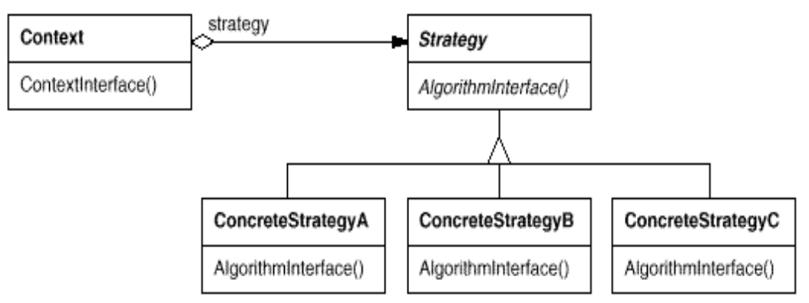

# 2 策略模式

## 2.1 变更（SimUDuck 应用程序）

- 软件开发过程中的一个常数
- 许多因素都可能导致变更


## 2.2 设计原则

### 2.2.1 封装变化

对应实现的原则：**开闭原则**

识别应用程序中各个方面，将其与保持不变的方面分开
将变化的部分封装起来，以便以后可以更改或扩展变化的部分而不会影响那些不变的部分


### 2.2.2 针对接口编程，而非实现

对应实现的原则：**依赖倒置原则**

“针对接口编程”本质是“针对超类型编程”。

变量声明类型应为超类型（抽象类或接口），而非具体子类。

客户端代码无需关心对象具体类型，只需依赖接口定义的行为。

**解耦具体实现**：客户端代码仅依赖接口，与具体类无关。


### 2.2.3 优先使用组合而非继承

通过组合对象（HAS-A关系）实现功能复用，而非通过继承（IS-A关系）。组合提供更高的灵活性和动态行为调整能力。

HAS-A关系可能优于IS-A关系

- 组合提供更大灵活性：通过将算法族（如飞行、叫声行为）封装为独立类，解耦功能实现与对象主体。
- 动态行为调整：可在运行时替换对象的行为（如鸭子从“不能飞”切换为“火箭飞行”），而继承是静态的。


## 2.3 策略模式

**定义**：定义一系列算法族，将每个算法分别封装，并使它们可互相替换。该模式使得算法可独立于使用它的客户端而变化。

- 核心要素：
  - **算法族**：一组解决相同问题的不同算法（如飞行行为中的普通飞行、不能飞行、火箭飞行）。
  - **封装**：每个算法被封装为独立类，隐藏实现细节。
  - **可互换性**：客户端无需关心具体算法，通过统一接口调用。



### 2.3.1 核心优势

1. **运行时动态改变行为**

   - **示例**：`ModelDuck`初始不能飞，通过注入`FlyRocketPowered`策略实现火箭飞行。

   - 代码：

     ```java
     Duck model = new ModelDuck();  
     model.performFly(); // 输出“不能飞”  
     model.setFlyBehavior(new FlyRocketPowered());  
     model.performFly(); // 输出“火箭动力飞行”  
     ```

2. **符合开闭原则（OCP）**

   - **扩展性**：新增行为只需添加新策略类（如`FlyRocketPowered`），无需修改`Duck`类或现有策略。
   - **对比继承方案**：避免因需求变更导致子类爆炸（如48个鸭子子类需修改）。

3. **消除条件语句**

   - 传统问题：

     ```java
     // 使用条件判断的硬编码方式
     public void performFly(String type) {
         if ("wing".equals(type)) { ... }
         else if ("rocket".equals(type)) { ... }
     }
     ```

   - **策略模式解决**：将分支逻辑分散到各策略类中，提升可维护性。

### 2.3.2 典型应用场景

1. **多个类仅在行为上不同**
2. **需要算法的不同变体**
   - 排序算法（快速排序、归并排序、冒泡排序）
   - 支付方式（信用卡、支付宝、加密货币）
3. **隐藏复杂算法细节**
   - **场景**：算法依赖敏感数据（如加密密钥），需封装避免暴露
4. **替代大量条件语句**
   - **代码坏味道**：类中存在多重 `if-else` 或 `switch` 分支（如游戏角色技能选择）

### 2.3.3 模式对比

- **与状态模式对比**
  - **策略模式**：主动选择算法（客户端显式指定策略）
  - **状态模式**：行为由对象内部状态自动切换（如订单状态从“待支付”到“已发货”）
- **与模板方法模式对比**
  - **策略模式**：通过组合实现算法扩展（对象级复用）
  - **模板方法模式**：通过继承定义算法骨架，子类重写步骤（类级复用）


## 2.4 引入设计模式的作用

### 2.4.1 共享模式词汇的核心价值

1. **高效沟通工具**：  
   - 模式名称（如“策略模式”）成为开发者间的通用语言，传递整套设计思想与约束条件
   - **示例**：  
     - 开发者A：“这里用策略模式封装支付方式” → 隐含行为可动态替换、符合开闭原则等设计决策
     - 无需详细解释类结构，提升沟通效率。

2. **提升设计思维层次**：  
   - 从对象级细节（如“如何实现鸭子飞行”）上升到模式级抽象（如“算法族封装与替换”）
   - **案例**：  
     - 初级开发者关注“如何让橡皮鸭不飞”
     - 架构师思考“哪些行为可能变化，如何通过策略模式解耦”。

3. **加速团队协作**：  
   - 新成员通过模式名称快速理解系统设计意图（如“订单模块使用策略模式管理折扣计算”）
   - 减少文档依赖，模式本身成为设计文档。

### 2.4.2 面向对象设计的层次演进
1. **基础四要素**：  
   - **抽象**（定义接口/超类）  
   - **封装**（隐藏实现细节）  
   - **多态**（同一接口不同行为）  
   - **继承**（代码复用与扩展）  

2. **核心设计原则**：  
   - **第一原则**：封装变化 → 隔离不稳定部分。 
   - **第二原则**：面向接口编程 → 解耦客户端与实现
   - **第三原则**：组合优于继承 → 灵活扩展

3. **模式的应用定位**：  
   - **策略模式**是原则的具体实现：  
     - 封装变化 → 飞行/叫声行为独立为策略类
     - 面向接口 → `Duck`类依赖行为接口而非具体类
     - 组合 → 通过对象组合实现行为复用

### 2.4.3 模式本质与核心价值

1. **模式是被发现的，而非发明的**：  
   - 模式是对优秀设计实践的总结（如策略模式源于处理行为变化的反复尝试）
   - **历史案例**：GoF《设计模式》收录的策略模式，源自早期GUI框架中布局算法的动态替换需求

2. **应对变化的终极武器**：  
   - **封装变化方向**：识别系统中可能变更的部分（如支付逻辑、排序算法）  
   - **最小化影响范围**：通过策略模式将变化限制在独立模块中
   - **示例**： 电商系统需新增加密货币支付 → 添加`CryptoPaymentStrategy`类，无需修改订单处理核心代码
   
3. **构建高质量系统的基石**：  
   - **可复用性**：策略类可跨模块/项目复用（如`FlyWithWings`可被鸟类模拟器复用）
   - **可扩展性**：新增策略无需修改已有代码（符合OCP）
   - **可维护性**：行为逻辑集中管理，减少散弹式修改

### 2.4.4 从理论到实践的启示

1. **模式是设计工具箱中的工具**：  
   - **正确使用场景**：  
     - 策略模式适用于算法/行为频繁变化的场景（如游戏技能系统）
     - 避免滥用：简单需求无需模式（如仅有一个固定行为的类）

2. **模式与原则的关系**：  
   - **原则指导模式**：策略模式是“封装变化+组合优于继承”原则的具象化
   - **模式体现原则**：通过模式代码展示如何实践SOLID原则
     - **示例**：策略模式符合：  
       - **单一职责原则**（SRP）：每个策略类仅负责一个算法
       - **开闭原则**（OCP）：通过扩展策略类添加新行为

3. **持续学习的意义**：  
   - **模式识别能力**：在既有代码中识别模式应用机会（如重构条件分支为策略模式）
   - **模式组合应用**：策略模式常与工厂模式、装饰器模式结合使用
