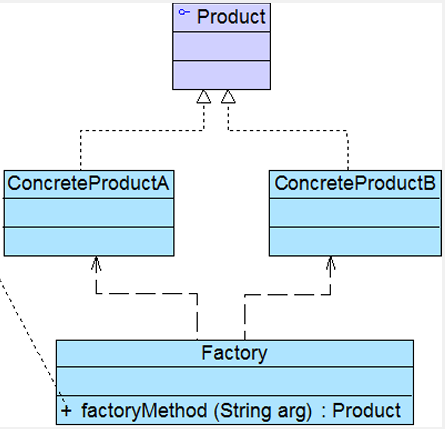
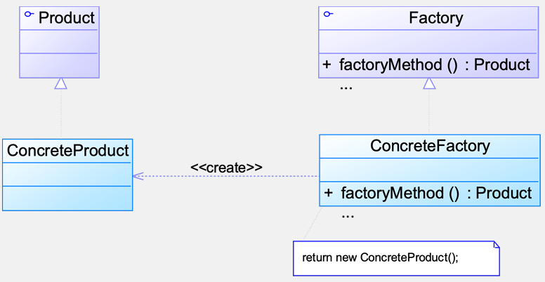
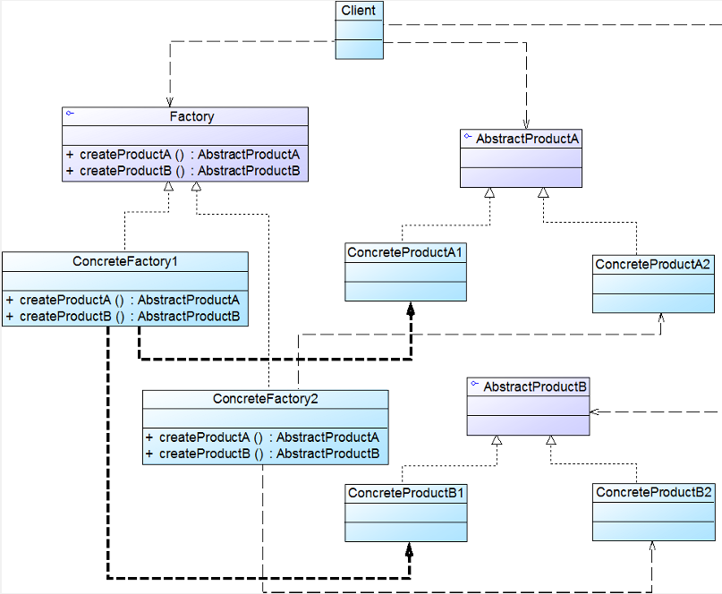

# 3 工厂模式

## 3.1 简单工厂模式

**定义**：静态工厂方法模式，属于类创建型模式。可以根据参数的不同返回不同类的实例。简单工厂模式专门定义一个类来负责创建其他类的实例，被创建的实例通常都具有共同的父类。

**结构**：Factory：工厂角色，Product：抽象产品角色，ConcreteProduct：具体产品角色

**分析**：

- **将对象的创建和对象本身业务处理分离可以降低系统的耦合度**
- 在调用工厂类的工厂方法时，由于工厂方法是静态方法，使用起来很方便，可通过类名直接调用，而且只需要传入一个简单的参数即可，在实际开发中，还可以在调用时将所传入的参数保存在 XML 等格式的配置文件中，修改参数时无须修改任何 Java 源代码
- 问题：工厂类的职责相对过重，增加新的产品需要修改工厂类的判断逻辑，与开闭原则相违背
- 简单工厂模式的要点在于：**当你需要什么，只需要传入一个正确的参数，就可以获取你所需要的对象，而无须知道其创建细节**

**优缺点**：

- 优点：
  - **实现了对责任的分割，它提供了专门的工厂类用于创建对象**
  - **客户端无须知道所创建的具体产品类的类名，只需要知道具体产品类所对应的参数即可**。对于一些复杂的类名，可以减少使用者的记忆量
  - **通过引入配置文件，可以在不修改任何客户端代码的情况下更换和增加新的具体产品类**
- 缺点：
  - **工厂类集中了所有产品创建逻辑**，一旦不能正常工作，整个系统都要受到影响
  - 会**增加系统中类的个数**，在一定程序上增加了系统的复杂度和理解难度
  - **系统扩展困难，一旦添加新产品就不得不修改工厂逻辑**，在产品类型较多时，有可能造成工厂逻辑过于复杂，不利于系统的扩展和维护
  - **工厂角色无法形成基于继承的等级结构**

**适用环境**：

- **工厂类负责创建的对象比较少**：由于创建的对象较少，不会造成工厂方法中的业务逻辑太过复杂
- **客户端只知道传入工厂类的参数，对于如何创建对象不关心**：客户端既不需要关心创建细节，甚至连类名都不需要记住，只需要知道类型所对应的参数

**扩展**：简单工厂模式的简化：在有些情况下工厂类可以由抽象产品角色扮演，一个抽象产品类同时也是子类的工厂，也就是说把静态工厂方法写到抽象产品类中。

## 3.2 工厂方法模式

**定义**：工厂模式 / 虚拟构造器模式 / 多态工厂模式。属于类创建型模式。在工厂方法模式中，工厂父类负责定义创建产品对象的公共接口，而工厂子类则负责生成具体的产品对象，这样做的目的是将产品类的实例化操作延迟到工厂子类中完成，即通过工厂子类来确定究竟应该实例化哪一个具体产品类。

**结构**：

**分析**：

- 工厂方法模式是简单工厂模式的进一步抽象和推广。**在工厂方法模式中，核心的工厂类不再负责所有产品的创建，而是将具体创建工作交给子类去做。工厂方法模式可以允许系统在不修改工厂角色的情况下引进新产品。**
- 当系统扩展需要添加新的产品对象时，仅仅需要添加一个具体产品对象以及一个具体工厂对象，原有工厂对象不需要进行任何修改，也不需要修改客户端，**很好地符合了“开闭原则”**。而简单工厂模式在添加新产品对象后不得不修改工厂方法，扩展性不好。**工厂方法模式退化后可以演变成简单工厂模式**
- 为了提高系统的可扩展性和灵活性，在定义工厂和产品时都必须使用抽象层，如果需要更换产品类，只需要更换对应的工厂即可，其他代码不需要进行任何修改
- 在实际的应用开发中，一般将具体工厂类的实例化过程进行改进，不直接使用 new 关键字来创建对象，而是将具体类的类名写入配置文件中，再通过 Java 的反射机制，读取 XML 格式的配置文件，根据存储在 XML 文件中的类名字符串生成对象
  - **Java 反射**：在程序运行时获取已知名称的类或已有对象的相关信息的一种机制。可通过Class类的forName()方法返回与带有给定字符串名的类或接口相关联的Class对象，再通过newInstance()方法创建此对象所表示的类的一个新实例，即通过一个类名字符串得到类的实例

**优缺点**：

- 优点：
  - 用户只需要关心所需产品对应的工厂，无须关心创建细节，甚至无须知道具体产品类的类名
  - 工厂可以自主确定创建何种产品对象，而如何创建这个对象的细节则完全封装在具体工厂内部
  - 在系统中加入新产品时，无须修改抽象工厂和抽象产品提供的接口，无须修改客户端，也无须修改其他的具体工厂和具体产品，而只要添加一个具体工厂和具体产品就可以了
- 缺点：
  - 在添加新产品时，需要编写新的具体产品类，而且还要提供与之对应的具体工厂类，系统中类的个数将成对增加，在一定程度上**增加了系统的复杂度**，有更多的类需要编译和运行，会给系统带来一些额外的开销
  - 由于考虑到系统的可扩展性，需要引入抽象层，在客户端代码中均使用抽象层进行定义，**增加了系统的抽象性和理解难度**，且在实现时可能需要用到DOM、反射等技术，增加了系统的实现难度

**适用环境**：

- **一个类不知道它所需要的对象的类**：在工厂方法模式中，客户端不需要知道具体产品类的类名，只需要知道所对应的工厂即可，具体的产品对象由具体工厂类创建；客户端需要知道创建具体产品的工厂类
- **一个类通过其子类来指定创建哪个对象**：在工厂方法模式中，对于抽象工厂类只需要提供一个创建产品的接口，而由其子类来确定具体要创建的对象，利用面向对象的多态性和里氏代换原则，在程序运行时，子类对象将覆盖父类对象，从而使得系统更容易扩展
- **将创建对象的任务委托给多个工厂子类中的某一个，客户端在使用时可以无须关心是哪一个工厂子类创建产品子类，需要时再动态指定**，可将具体工厂类的类名存储在配置文件或数据库中

## 3.3 抽象工厂模式

我们需要一个工厂可以提供多个产品对象，而不是单一的产品对象

产品等级结构：产品等级结构即产品的继承结构，如一个抽象类是电视机，其子类有海尔电视机、海信电视机、TCL 电视机，则抽象电视机与具体品牌的电视机之间构成了一个产品等级结构，抽象电视机是父类，而具体品牌的电视机是其子类。

产品族：在抽象工厂模式中，产品族是指由同一个工厂生产的，位于不同产品等级结构中的一组产品，如海尔电器工厂生产的海尔电视机、海尔电冰箱，海尔电视机位于电视机产品等级结构中，海尔电冰箱位于电冰箱产品等级结构中。

当系统所提供的工厂所需生产的具体产品并不是一个简单的对象，而是**多个位于不同产品等级结构中属于不同类型的具体产品**时，需要使用抽象工厂模式。

抽象工厂模式是所有形式的工厂模式中最为抽象和最具一般性的一种形态。

抽象工厂模式与工厂方法模式最大的区别在于，工厂方法模式针对的是一个产品等级结构，而抽象工厂模式则需要面对多个产品等级结构，一个工厂等级结构可以负责多个不同产品等级结构中的产品对象的创建。当一个工厂等级结构可以创建出分属于不同产品等级结构的一个产品族中的所有对象时，抽象工厂模式比工厂方法模式更为简单、有效率。

**定义**：提供一个创建一系列相关或相互依赖对象的接口，而无须指定它们具体的类。又称为 Kit 模式，属于对象创建型模式

**结构**：抽象工厂模式包含如下角色：AbstractFactory：抽象工厂；ConcreteFactory：具体工厂；AbstractProduct：抽象产品；Product：具体产品

- - 例，即通过一个类名字符串得到类的实例

**优缺点**：

- 优点：
  - **隔离了具体类的生成**，只需改变具体工厂的实例，就可以在某种程度上改变整个软件系统的行为
  - **可以实现高内聚低耦合的设计目的**
  - 当一个产品族中的多个对象被设计成一起工作时，它**能够保证客户端始终只使用同一个产品族中的对象**
  - 增加新的具体工厂和产品族很方便，无须修改已有系统，符合“开闭原则”
- 缺点：
  - 在添加新的产品对象时，**难以扩展抽象工厂来生产新种类的产品**
  - 开闭原则的倾斜性：**增加新的工厂和产品族容易，增加新的产品等级结构麻烦**

**适用环境**：

- 一个系统不应当依赖于产品类实例如何被创建、组合和表达的细节
- 系统中有多于一个的产品族，而每次只使用其中某一产品族
- 属于同一个产品族的产品将在一起使用
- 系统提供一个产品类的库，所有的产品以同样的接口出现，从而使客户端不依赖于具体实现

**扩展**：

- “开闭原则”的倾斜性

  - 增加产品族：对于增加新的产品族，工厂方法模式很好的支持了“开闭原则”，对于新增加的产品族，只需要对应增加一个新的具体工厂即可，对已有代码无须做任何修改

  - 增加新的产品等级结构：对于增加新的产品等级结构，需要修改所有的工厂角色，包括抽象工厂类，在所有的工厂类中都需要增加生产新产品的方法，不能很好地支持“开闭原则”

  - 抽象工厂模式的这种性质称为“开闭原则”的倾斜性，抽象工厂模式以一种倾斜的方式支持增加新的产品，它为新产品族的增加提供方便，但不能为新的产品等级结构的增加提供这样的方便

- 工厂模式的退化

  - 当抽象工厂模式中每一个具体工厂类只创建一个产品对象，也就是只存在一个产品等级结构时，抽象工厂模式退化成工厂方法模式
  - 当工厂方法模式中抽象工厂与具体工厂合并，提供一个统一的工厂来创建产品对象，并将创建对象的工厂方法设计为静态方法时，工厂方法模式退化成简单工厂模式

