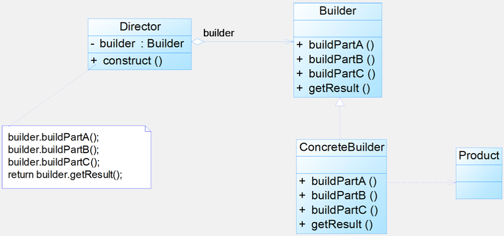
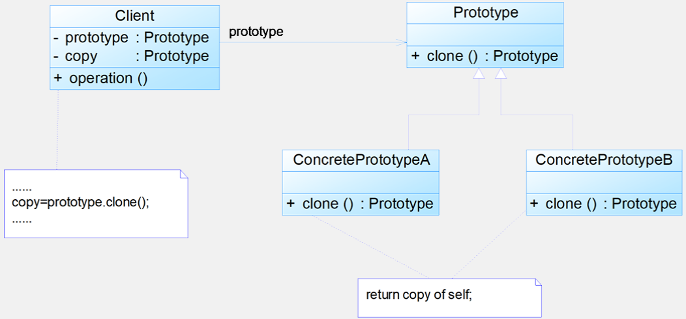
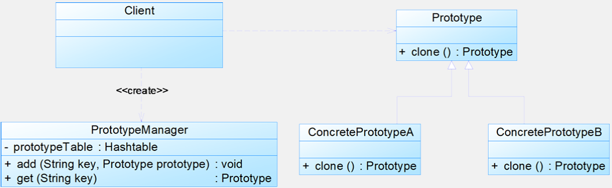

# 4 创建型模式

## 4.1 建造者模式

**动机**：

- 建造者模式可以将部件和其组装过程分开，一步一步创建一个复杂的对象
- 在软件开发中，存在大量复杂对象，它们拥有一系列成员属性，这些成员属性中有些是引用类型的成员对象
- 复杂对象相当于一辆有待建造的汽车，而对象的属性相当于汽车的部件，建造者返还给客户端的是一个已经建造完毕的完整产品对象，而用户无须关心该对象所包含的属性以及它们的组装方式

**定义**：将一个复杂对象的构建与它的表示分离，使得同样的构建过程可以创建不同的表示

**结构：**建造者模式包含如下角色：`Builder`：抽象建造者；`ConcreteBuilder`：具体建造者；`Director`：指挥者；`Product`：产品角色


**分析**：

- 典型代码：

  ```java
  public abstract class Builder 
  { 
  	protected Product product=new Product();
  	public abstract void buildPartA(); 
  	public abstract void buildPartB(); 
  	public abstract void buildPartC(); 
  	
  	public Product getResult() 
  	{ 
  		return product; 
  	} 
  }
  ```

- 建造者模式的结构中引入了一个指挥者类 `Director`，作用：（1）**隔离了客户与生产过程**；（2）**负责控制产品的生成过程**。指挥者针对抽象建造者编程，客户端只需要知道具体建造者的类型，即可通过指挥者类调用建造者的相关方法，返回一个完整的产品对象

  ```java
  public class Director 
  { 
  	private Builder builder; 
  	public Director(Builder builder) 
  	{ 
  		this.builder=builder; 
  	} 
  	
  	public void setBuilder(Builder builder) 
  	{ 
  		this.builder=builer; 
  	} 
  	
  	public Product construct() 
  	{ 
  		builder.buildPartA(); 
  		builder.buildPartB(); 
  		builder.buildPartC(); 
  		return builder.getResult(); 
  	} 
  } 
  ```

- 在客户端代码中，无须关心产品对象的具体组装过程，只需确定具体建造者的类型即可，建造者模式将复杂对象的构建与对象的表现分离开来，这样使得同样的构建过程可以创建出不同的表现

  ```java
  ......
  Builder builder = new ConcreteBuilder(); 
  Director director = new Director(builder); 
  Product product = director.construct();
  ......
  ```

**优缺点**：

- 优点：
  - 在建造者模式中，客户端不必知道产品内部组成的细节，**将产品本身与产品的创建过程解耦，使得相同的创建过程可以创建不同的产品对象**
  - 每一个具体建造者都相对独立，而与其他的具体建造者无关，因此可以很方便地替换具体建造者或增加新的具体建造者，**用户使用不同的具体建造者即可得到不同的产品对象**
  - **可以更加精细地控制产品的创建过程**。将复杂产品的创建步骤分解在不同的方法中，使得创建过程更加清晰，也更方便使用程序来控制创建过程
  - **增加新的具体建造者无须修改原有类库的代码**，指挥者类针对抽象建造者类编程，系统扩展方便，**符合“开闭原则”**
- 缺点：
  - 建造者模式所创建的产品一般具有较多的共同点，其组成部分相似，如果产品之间的差异性很大，则不适合使用建造者模式，因此其使用范围受到一定的限制
  - 如果产品的内部变化复杂，可能会导致需要定义很多具体建造者类来实现这种变化，导致系统变得很庞大

**适用环境**：

- 需要生成的产品对象有复杂的内部结构，这些产品对象通常包含多个成员属性
- 需要生成的产品对象的属性相互依赖，需要指定其生成顺序
- 对象的创建过程独立于创建该对象的类。在建造者模式中引入了指挥者类，将创建过程封装在指挥者类中，而不在建造者类中
- 隔离复杂对象的创建和使用，并使得相同的创建过程可以创建不同的产品

**扩展**：

- 省略抽象建造者角色：如果系统中只需要一个具体建造者的话，可以省略掉抽象建造者
- 省略指挥者角色：在具体建造者只有一个的情况下，如果抽象建造者角色已经被省略掉，那么还可以省略指挥者角色，让 `Builder` 角色扮演指挥者与建造者双重角色

**建造者模式与抽象工厂模式的比较**：

- 与抽象工厂模式相比，建造者模式返回一个组装好的完整产品，而抽象工厂模式返回一系列相关的产品，这些产品位于不同的产品等级结构，构成了一个产品族
- 在抽象工厂模式中，客户端实例化工厂类，然后调用工厂方法获取所需产品对象，而在建造者模式中，客户端可以不直接调用建造者的相关方法，而是通过指挥者类来指导如何生成对象，包括对象的组装过程和建造步骤，它侧重于一步步构造一个复杂对象，返回一个完整的对象


## 4.2 原型模式

**动机**：

- 在面向对象系统中，使用原型模式来复制对象自身，克隆出多个相同对象
- 当对象创建过程复杂且频繁时，通过复制原型对象来创建新对象，避免重复初始化过程

**定义**：对象创建型模式。**用原型实例指定创建对象的种类，并且通过复制这些原型创建新的对象**

**结构**：原型模式包含如下角色：`Prototype`：抽象原型类；`ConcretePrototype`：具体原型类；`Client`：客户类


**分析**：

- 在原型模式结构中定义了一个抽象原型类，所有的 Java 类都继承自 `java.lang.Object`，而 Object 类提供一个 `clone()` 方法，可以将一个 Java 对象复制一份。因此在 Java 中可以直接使用 Object 提供的 `clone()` 方法来实现对象的克隆，Java 语言中的原型模式实现很简单

- 能够实现克隆的 Java 类必须实现一个标识接口 `Cloneable`，表示这个 Java 类支持复制。如果一个类没有实现这个接口但是调用了 `clone()` 方法，Java 编译器将抛出一个 `CloneNotSupportedException` 异常

  ```java
  public class PrototypeDemoimplements Cloneable 
  { 
      …… 
      public Object clone() 
      { 
          Object object= null; 
          try 
          { 
              object = super.clone(); 
          } 
          catch (CloneNotSupportedExceptionexception) 
          { 
              System.err.println("Not support cloneable"); 
          } 
          return object; 
      } 
      …… 
  }
  ```

- **深克隆和浅克隆**：

  - `clone()` 满足：

    - 对任何的对象 x，都有 `x.clone() !=x`，即克隆对象与原对象不是同一个对象
    - 对任何的对象 x，都有 `x.clone().getClass()==x.getClass()`，即克隆对象与原对象的类型一样
    - 如果对象 x 的 `equals()` 方法定义恰当，那么 `x.clone().equals(x)` 应该成立

  - 深克隆：需手动实现引用类型字段的完全复制

    浅克隆：仅复制对象的基本数据类型字段和引用类型字段的地址

**优缺点**：

- 优点：
  - 简化对象创建过程，提高新实例的创建效率
  - 动态增加产品类
  - 提供了简化的创建结构
  - 可以使用深克隆的方式保存对象的状态
- 缺点：
  - 需要为每一个类配备一个克隆方法
  - 在实现深克隆时需要编写较为复杂的代码

**适用环境**：

- 创建新对象成本较大，新的对象可以通过原型模式对已有对象进行复制来获得
- 系统要保存对象的状态，对象的状态变化很小，或者对象本身占内存不大
- 需要避免使用分层次的工厂类来创建分层次的对象，并且类的实例对象只有一个或很少的几个组合状态

**扩展**：

- 带原型管理器的原型模式

  

- 相似对象的复制：通过原型模式获得相同对象后可以再对其属性进行修改，从而获取所需对象