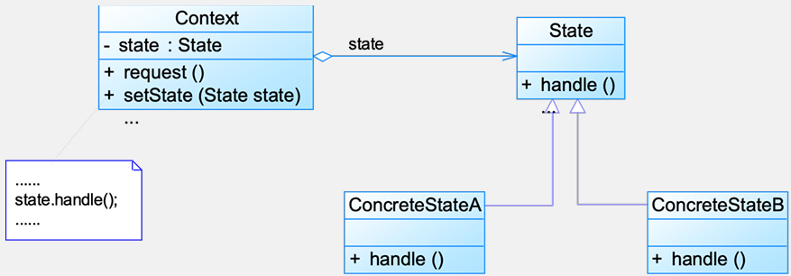
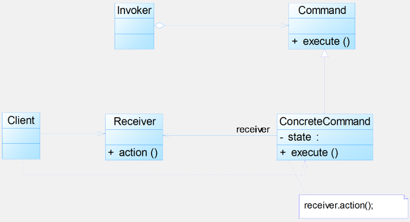

# 5 状态与命令模式

## 5.1 状态模式

**动机**：对象行为由动态变化的属性（状态）决定。当一个这样的对象与外部事件产生互动时，其内部状态就会改变，从而使得系统的行为也随之发生变化

**定义**：允许一个对象在其内部状态改变时改变它的行为，对象看起来似乎修改了它的类（对象行为型模式）

**结构**：状态模式包含如下角色：`Context`: 环境类；`State`: 抽象状态类；`ConcreteState`: 具体状态类


**分析**：

- 状态模式描述了对象状态的变化以及对象如何在每一种状态下表现出不同的行为

- 引入了一个抽象类（**抽象状态类**）来专门表示对象的状态，而对象的每一种具体状态类都继承了该类，并在不同具体状态类中实现了不同状态的行为，包括各种状态之间的转换

- 环境类与抽象状态类的作用：

  - 环境类是拥有状态的对象，环境类有时候可以充当状态管理器的角色，可以在环境类中对状态进行切换操作

  - 抽象状态类可以是抽象类，也可以是接口，不同状态类就是继承这个父类的不同子类，状态类的产生是由于环境类存在多个状态，同时还满足两个条件：

    这些状态经常需要切换，在不同的状态下对象的行为不同。

  - 可以将不同对象下的行为单独提取出来封装在具体的状态类中，使得环境类对象在其内部状态改变时可以改变它的行为，对象看起来似乎修改了它的类，而实际上是由于切换到不同的具体状态类实现的

  - 由于环境类可以设置为任一具体状态类，因此它针对抽象状态类进行编程，在程序运行时可以将任一具体状态类的对象设置到环境类中，从而使得环境类可以改变内部状态，并且改变行为

**优缺点**：

- 优点：
  - 封装了转换规则
  - 枚举可能的状态，在枚举状态之前需要确定状态种类
  - 将所有与某个状态有关的行为放到一个类中，并且可以方便地增加新的状态，只需要改变对象状态即可改变对象的行为
  - 允许状态转换逻辑与状态对象合成一体，而不是某一个巨大的条件语句块
  - 可以让多个环境对象共享一个状态对象，从而减少系统中对象的个数
- 缺点：
  - 增加系统类和对象的个数
  - 状态模式的结构与实现都较为复杂，如果使用不当将导致程序结构和代码的混乱
  - 状态模式对“开闭原则”的支持并不太好：对于可以切换状态的状态模式，增加新的状态类需要修改那些负责状态转换的源代码，否则无法切换到新增状态；而且修改某个状态类的行为也需修改对应类的源代码

**适用环境**：

- 对象行为依赖状态，并且可以根据它的状态改变而改变它的相关行为
- 代码中包含大量与对象状态有关的条件语句

**扩展**：

- 共享状态：在有些情况下多个环境对象需要共享同一个状态，如果希望在系统中实现多个环境对象实例共享一个或多个状态对象，那么需要将这些状态对象定义为环境的静态成员对象
- 简单状态模式与可切换状态的状态模式：
  - 简单状态模式：
    - 状态独立，状态之间无须进行转换。
    - 遵循“开闭原则”，在客户端可以针对抽象状态类进行编程
  - 可切换状态模式：
    - 在实现状态切换时，在具体状态类内部需要调用环境类 Context  `setState()` 方法进行状态的转换操作
    - 增加新的状态类可能需要修改其他某些状态类甚至环境类的源代码

## 5.2 命令模式

**动机**：

- 在软件设计中，需要向对象发送请求但无法预知接收者和具体操作，需在运行时动态指定。命令模式通过解耦请求发送者与接收者，使对象调用更灵活

- 发送者无需知道接收者身份或操作细节。通过封装请求为对象，消除直接耦合关系

**定义**：将一个请求封装为一个对象，从而使我们可用不同的请求对客户进行参数化；对请求排队或者记录请求日志，以及支持可撤销的操作（对象行为型模式）

**结构**：`Command`: 抽象命令类；`ConcreteCommand`: 具体命令类；`Invoker`: 调用者；`Receiver`: 接收者；`Client`：客户类


**分析**：

- 本质：对命令进行封装，将发出命令的责任和执行命令的责任分割开

  - 每一个命令都是一个操作：请求的一方发出请求，要求执行一个操作；接收的一方收到请求，并执行操作
  - 允许请求的一方和接收的一方独立开来，使得请求的一方不必知道接收请求的一方的接口

- 关键：引入抽象命令接口，发送者针对接口编程，接收者通过具体命令关联

- 典型的抽象命令类代码：

  ```java
  public abstract class Command 
  { 
      public abstract void execute(); 
  } 
  ```

- 典型的调用者代码：

  ```java
  public class Invoker 
  { 
      private Command command; 
      public Invoker(Command command) 
      { 
          this.command=command; 
      } 
      
      public void setCommand(Command command) 
      { 
          this.command=command; 
      } 
      
      //业务方法，用于调用命令类的方法
      public void call() 
      { 
          command.execute(); 
      } 
  }
  ```

- 典型的具体命令类代码：

  ```java
  public class ConcreteCommandextends Command 
  { 
      private Receiver receiver; 
      public void execute() 
      { 
          receiver.action(); 
      } 
  } 
  ```

- 典型的请求接收者代码：

  ```java
  public class Receiver 
  { 
      public void action() 
      { 
          //具体操作
      } 
  } 
  ```

**优缺点**：

- 优点：
  - 降低系统的耦合度
  - 新的命令可以很容易地加入到系统中
  - 可以比较容易地设计一个命令队列和宏命令（组合命令）
  - 可以方便地实现对请求的 Undo 和 Redo
- 缺点：导致某些系统有过多的具体命令类

**适用环境**：

- 系统需要将请求调用者和请求接收者解耦，使得调用者和接收者不直接交互
- 系统需要在不同的时间指定请求、将请求排队和执行请求
- 系统需要支持命令的撤销（Undo）操作和恢复（Redo）操作
- 系统需要将一组操作组合在一起，即支持宏命令

**扩展**：

- 宏命令 / 组合命令，是命令模式和组合模式联用的产物
- 宏命令也是一个具体命令，不过它包含了对其他命令对象的引用，在调用宏命令的 `execute()` 方法时，将递归调用它所包含的每个成员命令的 `execute()` 方法，一个宏命令的成员对象可以是简单命令，还可以继续是宏命令。执行一个宏命令将执行多个具体命令，从而实现对命令的批处理