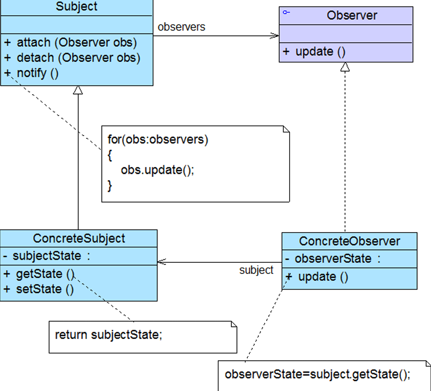
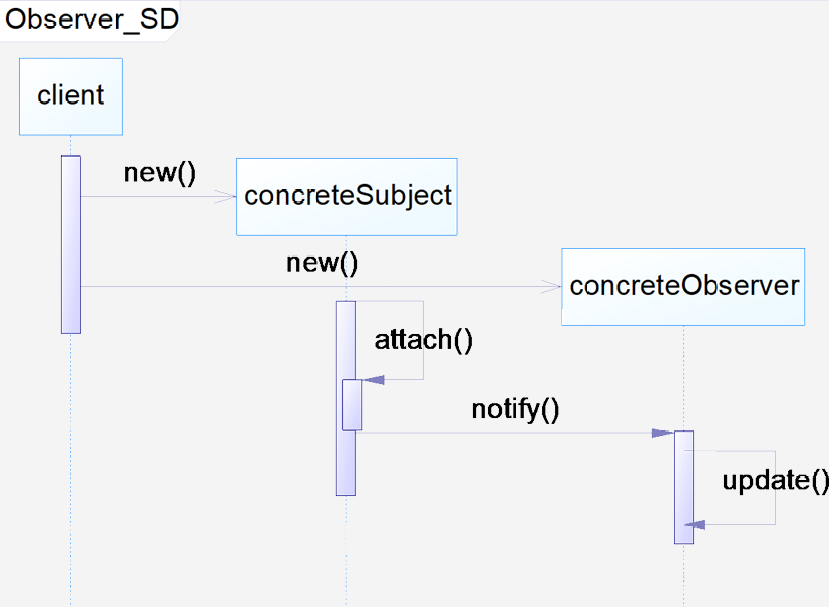
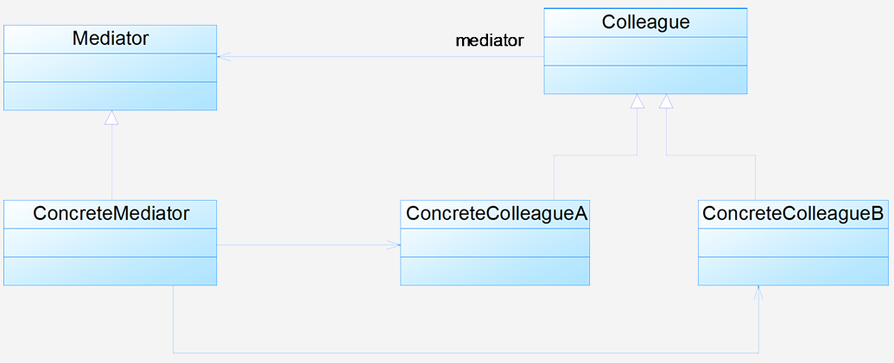
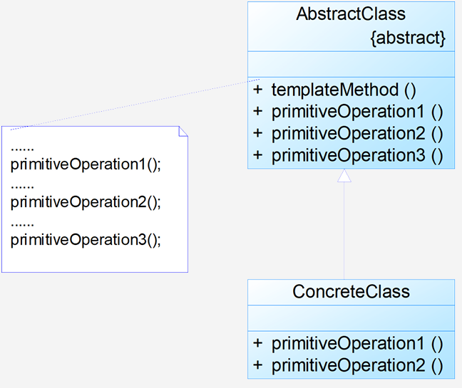

# 6 行为型模式

## 6.1 观察者模式

**动机**：建立对象间的依赖关系，使**一个对象（观察目标）**状态改变时，**其他对象（观察者）**自动收到通知并响应。观察目标与观察者解耦，支持动态增删观察者。

**定义**：定义对象间的一种**一对多依赖关系**，使得每当一个对象状态发生改变时，其相关依赖对象皆得到通知并被自动更新（**对象行为型模式**）

**结构**：`Subject`: 目标；`ConcreteSubject`: 具体目标；`Observer`: 观察者；`ConcreteObserver`: 具体观察者


**分析**：

- **发布-订阅模型**：目标作为发布者，无需知晓观察者身份；观察者订阅目标，接收通知后更新状态。

- 典型的抽象目标类代码：

  ```java
  import java.util.*;
  public abstract class Subject
  {
  	protected ArrayListobservers = new ArrayList();
      public abstract void attach(Observer observer);
      public abstract void detach(Observer observer);
      public abstract void notify();
  }
  ```

  典型的抽象观察者代码如下所示：

  ```java
  public interface Observer
  {
      public void update();
  } 
  ```

  客户端代码片段如下所示：

  ```java
  Subject subject= new ConcreteSubject();
  Observer observer= new ConcreteObserver();
  subject.attach(observer);
  subject.notify(); 
  ```

- 观察者模式顺序图如下所示：

  

**优缺点**：

- **优点**：
  - 实现表示层和数据逻辑层分离
  - 建立抽象的耦合关系
  - 支持广播通信
  - 符合"开闭原则"
- **缺点**：
  - 通知所有观察者耗时（观察者很多时）
  - 循环依赖可能导致系统崩溃
  - 观察者不知道目标具体如何变化

**适用环境**：

- 一个对象的改变需要通知其他多个对象
- 不知道具体有多少对象需要改变
- 需要创建触发链（A→B→C...）

**应用**：Java事件处理模型（DEM）；SAX2 XML解析；Servlet事件机制；电子商务网站通知系统；游戏中的队友状态提示

**扩展**：

- MVC模式：模型(Model) = 观察目标。视图(View) = 观察者。控制器(Controller) = 中介者
- 响应式编程：以数据流和变化传播为核心

## 6.2 中介者模式

**定义**：用一个中介对象来封装一系列的对象交互，中介者使各对象不需要显式地相互引用，从而使其耦合松散，而且可以独立地改变它们之间的交互。又称为调停者模式，是一种**对象行为型模式**

**结构**：`Mediator`（抽象中介者）；`ConcreteMediator`（具体中介者）；`Colleague`（抽象同事类）；`ConcreteColleague`（具体同事类）


**分析**：

- 中介者的双重职责：
  中转作用（结构性）：提供对象间通信的中转通道
  协调作用（行为性）：封装同事间的交互逻辑

- 典型的抽象中介者类代码：

  ```java
  public abstract class Mediator 
  {
      protected ArrayList colleagues;
      public void register(Colleague colleague) 
      {
          colleagues.add(colleague);
      }
      public abstract void operation();
  }
  ```

  典型的抽象同事类代码：

  ```java
  public abstract class Colleague 
  {
      protected Mediator mediator;
      public Colleague(Mediator mediator) 
      {
          this.mediator = mediator;
      }
      public abstract void method1();
      public abstract void method2();
  }
  ```

**优缺点**：

- 优点：

  - 简化对象间交互（从多对多→一对多）
  - 将各同事解耦（仅依赖中介者）
  - 减少子类生成（交互逻辑集中在中介者）
  - 简化各同事类的设计和实现
- 缺点：
  - 具体中介者类可能非常复杂（包含所有协调逻辑）
  - 中介者自身成为性能瓶颈（所有交互都经过它）

**适用环境**：

- 系统中对象间存在复杂的引用关系，结构混乱
- 对象因强关联导致难以复用
- 想封装多个类的行为，但不愿生成太多子类

**应用**：

- GUI开发：如Java Swing中：组件（按钮/文本框）作为同事类；窗口作为中介者协调组件交互
- MVC框架：控制器(Controller)作为View和Model的中介者

**扩展**：

1. **与迪米特法则的关系**：
   - 中介者模式是迪米特法则的典型应用
   - 通过中介者减少对象间的直接引用
2. **与GUI开发的结合**：
   - 将复杂的组件交互交由中介者管理
   - 例如对话框中的表单验证逻辑

## 6.3 模板方法模式

**动机**：

- 模板方法模式是基于继承的代码复用基本技术，其结构和用法是面向对象设计的核心之一。该模式将相同代码放在父类中，不同方法实现放在子类中
- 通过准备一个抽象类实现部分逻辑（具体方法和构造函数），同时声明抽象方法让子类实现剩余逻辑，使不同子类能以不同方式实现这些抽象方法

**定义**：定义一个操作中算法的骨架，将一些步骤延迟到子类中，使得子类可以不改变算法结构即可重定义某些特定步骤。属于**类行为型模式**

**结构**：`AbstractClass`（抽象类）：定义模板方法和基本方法；`ConcreteClass`（具体子类）：实现父类定义的抽象基本操作


**分析**：

- **模板方法模式的结构特性**
  - 是一种**类的行为型模式**，在结构图中只有**类之间的继承关系**，没有对象关联关系
  - 需要**抽象类设计师**和**具体子类设计师**协作：
    - 前者负责定义算法的**轮廓和骨架**
    - 后者负责实现算法的**各个逻辑步骤**
- **方法分类**
  - **模板方法**：定义在抽象类中，将**基本操作方法组合**形成总算法/总行为
  - **基本方法**（模板方法的组成部分）：
    - **抽象方法**（Abstract Method）：需子类强制实现（如`primitiveOperation2()`）
    - **具体方法**（Concrete Method）：父类已实现（如`primitiveOperation1()`）
    - **钩子方法**（Hook Method）：
      - 形式1：**空方法**（默认不执行任何操作，子类可选覆盖）
      - 形式2：**返回布尔值**的方法（如`isPrint()`控制流程分支）

- 典型的抽象类代码如下所示：

  ```java
  public abstract class AbstractClass 
  {
      public void templateMethod() 
      { // 模板方法
          primitiveOperation1();
          primitiveOperation2();
          primitiveOperation3();
      }
      public void primitiveOperation1() 
      { /* 具体方法 */ }
      public abstract void primitiveOperation2(); // 抽象方法
      public void primitiveOperation3() { } // 钩子方法
  }
  ```

  典型的具体子类代码如下所示：

  ```java
  public class ConcreteClass extends AbstractClass 
  {
      public void primitiveOperation2() { /* 实现代码 */ }
      public void primitiveOperation3() { /* 可选覆盖 */ }
  }
  ```

- **反向控制机制**：子类通过**覆盖父类的钩子方法**或**实现抽象方法**，反向控制父类的行为

**优缺点**:

- 优点：

  - 实现算法不变部分的复用

  - 符合"开闭原则"，便于扩展新行为

  - 通过反向控制结构提高内聚性

- 缺点：每个实现需定义子类，增加系统复杂性

**适用环境**：

- 一次性实现算法的不变部分，将可变行为留给子类
- 提取多个子类的公共行为到父类，避免代码重复
- 分割复杂算法：固定部分设计为模板方法和具体方法；可变细节由子类实现
- 需要控制子类扩展（通过钩子方法约束）

**应用**：

- 框架设计（如 Spring、Struts）：父类控制初始化流程的逻辑顺序
- JUnit 的 `TestCase` 类

**扩展**：

1. **关于继承的讨论**
   - 模板方法模式**合理使用继承**，将通用行为移至父类，特殊行为移至子类
   - 是**继承优势的体现**（尽管过度继承可能导致问题）
2. **好莱坞原则**
   - 定义：*“Don't call us, we'll call you”*
   - 体现：父类控制流程，**子类被动响应**（通过覆盖方法实现具体逻辑）
3. **钩子方法的高级用法**
   - **空方法**：子类可选覆盖（如`primitiveOperation3()`）
   - **流程控制**：通过布尔返回值决定是否执行某步骤（如`isPrint()`）