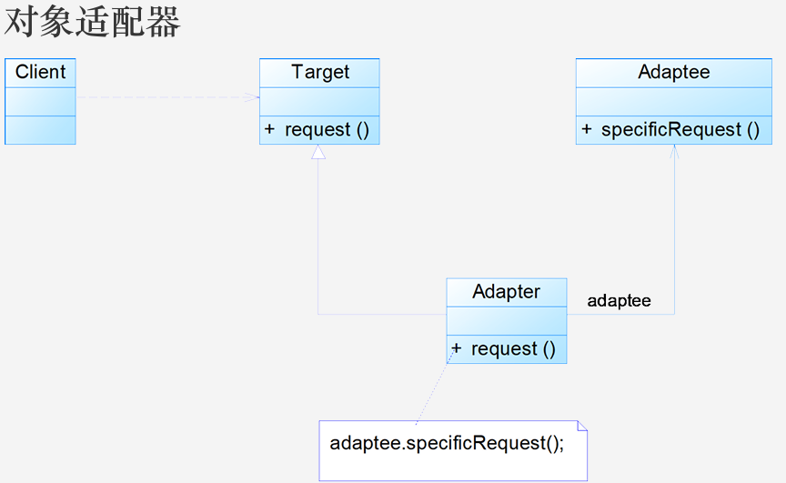
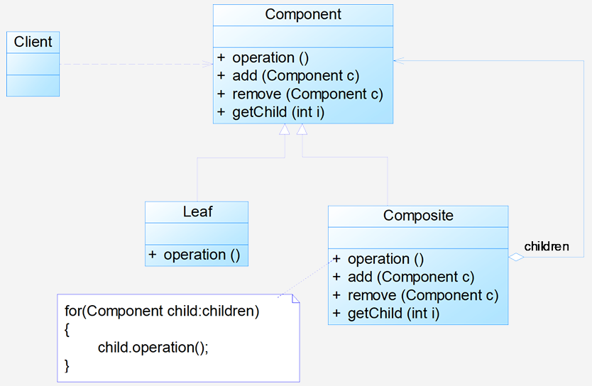

# 7 适配器与组合

## 7.1 适配器模式

**动机**：

1. **核心思想**

   - 在软件开发中采用类似于电源适配器的设计和编码技巧被称为适配器模式
   - 当现有类的接口不符合客户类期望时（如方法名不一致），需通过适配器将现有接口转化为目标接口，保证功能重用
   - 如果不进行这样的转化，客户就不能利用现有类所提供的功能

2. **包装机制**

   - 适配器（Adapter）是包装不兼容接口的类，被适配的类称为适配者（Adaptee）
   - 适配器提供客户类需要的接口，其实现是将客户类的请求转化为对适配者相应接口的调用

   - 客户类调用适配器方法时，适配器内部调用适配者方法，对客户透明

**定义**：将一个接口转换成客户希望的另一个接口，使接口不兼容的类可以一起工作，别名为包装器 (Wrapper）。属于**类结构型模式**或**对象结构型模式**

**结构**：`Target`：目标抽象类（客户期望的接口）。`Adapter`：适配器类（实现接口转换的核心）。`Adaptee`：适配者类（被适配的现有类）。`Client`：客户类（通过目标接口调用服务）


**分析**：

1. **类适配器**（通过继承实现）：

   ```java
   public class Adapter extends Adaptee implements Target 
   {
       public void request() 
       {
           specificRequest(); // 调用父类（Adaptee）方法
       }
   }
   ```

   - 特点：适配器同时继承适配者和实现目标接口

2. **对象适配器**（通过组合实现）：

   ```java
   public class Adapter extends Target
   {
       private Adapteeadaptee;
       public Adapter(Adapteeadaptee)
       {
           this.adaptee=adaptee;
       }
       public void request()
       {
           adaptee.specificRequest();
       }
   } 
   ```

   - 适配器持有适配者实例，将请求转发给它
   - 一个对象适配器可以把多个不同的适配者适配到同一个目标

**优缺点**：

1. **通用优点**：

   - 解耦目标类与适配者类，无需修改原有代码
   - 增加了类的透明性和复用性，将具体实现封装在适配者类中

   - 灵活扩展，符合开闭原则

2. **类适配器特有**：

   - **优点**：可重写适配者方法，灵活性更强
   - **缺点**：单继承限制（Java/C#中无法适配多个适配者）

3. **对象适配器特有**：

   - **优点**：支持多适配者适配
   - **缺点**：难以直接置换适配者方法，需通过子类间接实现

**适用环境**：

- 系统需要使用现有的类，而这些类的接口不符合系统的需要
- 想要建立一个可重复使用的类，用于与一些彼此无关的类一起工作

**应用**：

1. **JDBC 驱动**：

   - JDBC 驱动是介于 JDBC 接口和数据库引擎 API 之间的适配器软件

   - 每个数据库（如 MySQL、Oracle）通过适配器实现 JDBC 抽象接口

2. **JDK 中的适配器类**

**扩展**：

1. **默认适配器模式**（缺省适配器）：为接口提供默认空实现，子类选择性覆盖
2. **双向适配器**：同时引用目标类和适配者类，支持双向调用


## 7.2 组合模式

**动机**：

- 由于容器对象和叶子对象在功能上的区别，在使用这些对象的客户端代码中必须有区别地对待容器对象和叶子对象，而实际上大多数情况下客户端希望一致地处理它们，因为对于这些对象的区别对待将会使得程序非常复杂
- 组合模式描述了如何将容器对象和叶子对象进行递归组合，使得用户在使用时无须对它们进行区分，可以一致地对待容器对象和叶子对象，这就是组合模式的模式动机

**定义**：

- 组合模式（Composite Pattern）：组合多个对象形成树形结构以表示'整体-部分'的结构层次。组合模式对单个对象（即叶子对象）和组合对象（即容器对象）的使用具有一致性

- 组合模式又可以称为'整体-部分'（Part-Whole）模式，属于对象的结构模式，它将对象组织到树结构中，可以用来描述整体与部分的关系

**结构**：`Component`：抽象构件；`Leaf`：叶子构件；`Composite`：容器构件；`Client`：客户类


**分析**：

- **关键设计思想**

  - **核心抽象**：组合模式的关键是定义了一个

    **抽象构件类**（Component），它既可以代表叶子（Leaf），又可以代表容器（Composite）。客户端针对该抽象构件类编程，**无需知道它具体是叶子还是容器**，可统一处理。

  - **递归组合**：容器对象与抽象构件类建立**聚合关联关系**，容器中既可包含叶子，也可包含其他容器，形成**树形结构**。

- 典型的抽象构件角色代码：

  ```java
  public abstract class Component
  {
      public abstract void add(Component c);
      public abstract void remove(Component c);
      public abstract Component getChild(inti);
      public abstract void operation(); 
  } 
  ```

  典型的叶子构件角色代码：

  ```java
  public class Leaf extends Component
  {
      public void add(Component c)
      { //异常处理或错误提示}
      public void remove(Component c)
      { //异常处理或错误提示}
      public Component getChild(inti)
      { //异常处理或错误提示}
      public void operation()
      {
          //实现代码
      } 
  }
  ```

  典型的容器构件角色代码：

  ```java
  public class Composite extends Component
  {
      private ArrayListlist = new ArrayList();
      public void add(Component c)
      {
          list.add(c);
      }
      public void remove(Component c)
      {
          list.remove(c);
      }
      public Component getChild(inti)
      {
          (Component)list.get(i);
      }
      public void operation()
      {
          for(Object obj:list)
          {
              ((Component)obj).operation();
          }
      } 
  }
  ```

**优缺点**：

- 优点
  - 可以清楚地定义分层次的复杂对象，表示对象的全部或部分层次，使得增加新构件也更容易
  - 客户端可以一致地使用组合结构或其中单个对象，无需区分叶子对象和容器对象
  - 定义了包含叶子对象和容器对象的类层次结构，叶子对象可被组合成更复杂的容器对象，递归形成树形结构
  - 更容易在组合体内加入对象构件，客户端不必因为加入新对象而更改原有代码

- 缺点
  - 设计变得更加抽象，若对象的业务规则复杂，则实现组合模式具有较大挑战性，且并非所有方法都与叶子对象子类相关
  - 增加新构件时可能产生问题，难以对容器中的构件类型进行限制（例如无法在编译时强制约束容器内只能包含特定类型对象）

**适用环境**：

1. **层次结构需求**：需要表示一个对象整体或部分层次，且希望忽略整体与部分的差异，一致对待它们
2. **动态结构处理**：对象结构动态且复杂程度不一，但客户需要一致处理（如递归遍历）
3. **抽象编程需求**：客户端需针对抽象构件编程，无需关心对象层次结构的细节

**应用**：

1. **XML 文档解析**：XML 文档的树形结构天然适合组合模式，元素（Component）可以是单个节点（Leaf）或包含子元素的容器（Composite）
2. **操作系统目录结构**：目录（容器）和文件（叶子）构成树形结构，杀毒软件可递归处理目录下的所有子目录和文件
3. **JDK 的 AWT/Swing**：GUI 组件中，容器（如 `JPanel`）和叶子组件（如 `JButton`）通过组合模式统一管理，客户代码可一致操作

**扩展**：

- **透明组合模式**（课件中默认形式）：抽象构件（`Component`）声明所有子类共有的方法（包括`add/remove`等管理方法），但叶子对象需空实现这些方法，可能导致运行时错误。
- **安全组合模式**：仅在容器构件（`Composite`）中声明管理方法，叶子构件无这些方法。客户端需区分叶子与容器，失去透明性但更安全。

