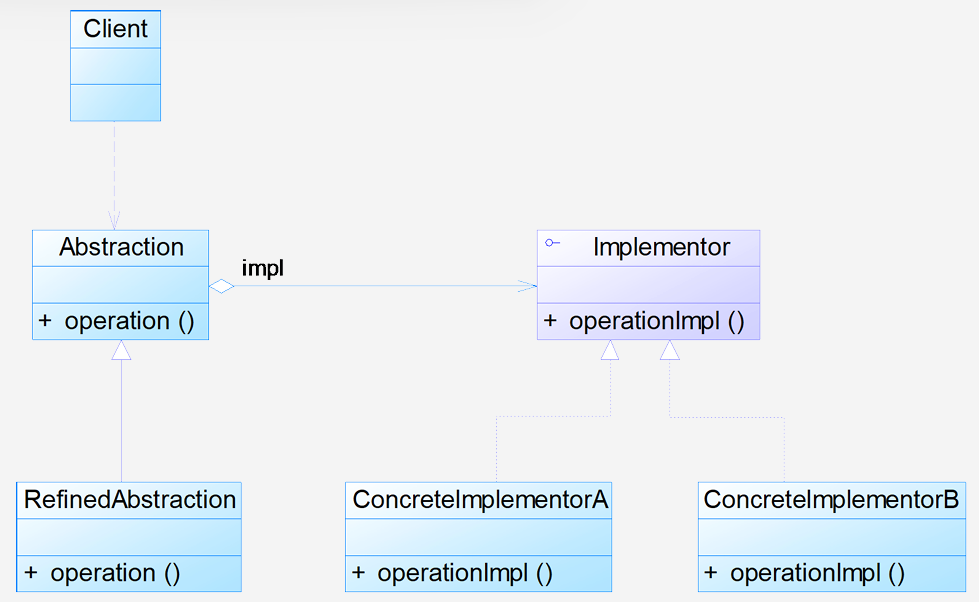
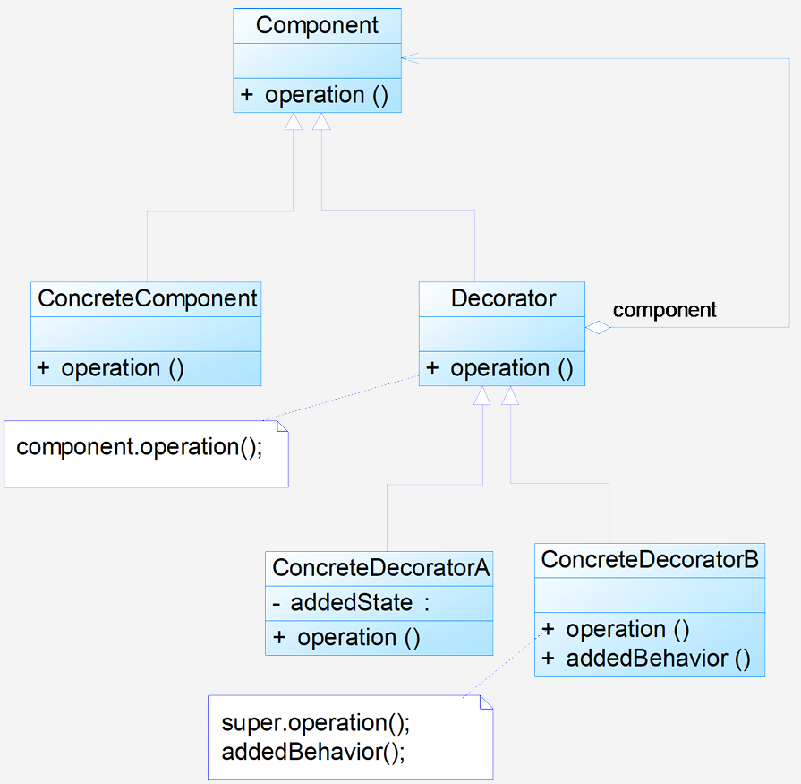

# 8 桥接与装饰者

## 8.1 桥接模式

**动机**：桥接模式将继承关系转换为关联关系，从而**降低了类与类之间的耦合**，**减少了代码编写量**。它将系统的多个变化维度分离，使它们可以独立变化

**定义**：将抽象部分与它的实现部分分离，使它们都可以独立地变化。对象结构型模式

**结构**：

- **Abstraction（抽象类）**：定义抽象类的接口，并维护一个指向 Implementor 类型对象的指针或引用

- **RefinedAbstraction（扩充抽象类）**：扩展 Abstraction 定义的接口，通常在这些方法中调用 Implementor 的方法

- **Implementor（实现类接口）**：定义实现类的接口，该接口不一定与 Abstraction 的接口完全一致。Implementor 只提供基本操作，而 Abstraction 则定义了基于这些基本操作的较高层次的操作

- **ConcreteImplementor（具体实现类）**：实现 Implementor 接口，给出基本操作的具体实现

  

**分析**：

- 理解如何将**抽象化（Abstraction）**与**实现化（Implementation）**脱耦，使得二者可以独立地变化

  - **抽象化**：忽略一些信息，把不同的实体当作同样的实体对待。在面向对象中，**将对象的共同性质抽取出来形成类的过程**即为抽象化的过程

  - **实现化**：**针对抽象化给出的具体实现**。抽象化与实现化是一对互逆的概念，实现化产生的对象比抽象化更具体

  - **脱耦**：**将抽象化和实现化之间的耦合解脱开，或将强关联改换成弱关联**。在桥接模式中，指在一个软件系统的抽象化和实现化之间使用**关联关系（组合或者聚合关系）而不是继承关系**，从而使两者可以相对独立地变化。这就是桥接模式的用意。

- 典型的实现类接口代码：

  ```java
  public interface Implementor
  {
      public void operationImpl();
  }
  ```

  典型的抽象类代码：

  ```java
  public abstract class Abstraction
  {
      // 定义实现类接口对象
      protected Implementor impl;
  
      // 设置实现类接口对象
      public void setImpl(Implementor impl)
      {
          this.impl = impl;
      }
  
      // 声明抽象业务方法
      public abstract void operation();
  }
  ```

  典型的扩充抽象类代码：

  ```java
  public class RefinedAbstraction extends Abstraction
  {
      // 实现抽象业务方法
      public void operation()
      {
          // 可能需要添加的代码
          impl.operationImpl(); // 调用实现类的方法
          // 可能需要添加的代码
      }
  }
  ```

**优缺点**：

- 优点：

  - **分离抽象接口及其实现部分：**这是桥接模式的主要特点

  - **比多继承方案更好：**桥接模式有时类似于多继承，但多继承违背类的单一职责原则，复用性差，且类数量庞大。桥接模式是更好的解决方法

  - **提高了系统的可扩充性：**在两个变化维度中任意扩展一个维度，都不需要修改原有系统

  - **实现细节对客户透明：**可以对用户隐藏实现细节

- 缺点：

  - **增加理解与设计难度：**桥接模式的引入会增加系统的理解与设计难度，要求开发者针对抽象进行设计与编程

  - **使用范围有局限性：**要求正确识别出系统中两个独立变化的维度

**适用环境**：

- 如果一个系统**需要在构件的抽象化角色和具体化角色之间增加更多的灵活性**，**避免在两个层次之间建立静态的继承联系**，通过桥接模式可以在抽象层建立一个关联关系
- **抽象化角色和实现化角色可以以继承的方式独立扩展而互不影响**，在程序运行时可以动态将一个抽象化子类的对象和一个实现化子类的对象进行组合（即系统需要对抽象化角色和实现化角色进行动态耦合）
- 一个类**存在两个独立变化的维度**，且这两个维度都需要进行扩展
- 虽然使用继承没有问题，但是由于抽象化角色和具体化角色需要独立变化，设计要求需要独立管理这两者
- 对于那些**不希望使用继承或因为多层次继承导致系统类的个数急剧增加的系统**，桥接模式尤为适用。

**应用**：

1. **Java 语言通过 Java 虚拟机（JVM）实现平台的无关性：**Java 应用程序（抽象部分）通过 JVM（桥梁）可以在不同的运行平台（Windows, Unix - 实现部分）上运行
2. **Java AWT 图形用户界面（GUI）的 Peer 架构：**Java 为 AWT 中的每一个 GUI 构件都提供了一个 Peer 构件。同一个 Java 桌面软件在不同操作系统（如 Motif, Windows, Macintosh）上具有不同的视感（LookAndFeel)，这是通过 Peer 架构（使用了桥接模式）实现的，将 Java 的 GUI 构件与特定平台的实现分离开
3. **JDBC（Java Database Connectivity）驱动程序：**使用 JDBC 的应用系统是抽象角色，所使用的数据库是实现角色。JDBC 驱动程序（桥梁）可以动态地将一个特定类型的数据库与一个 Java 应用程序绑定，实现抽象角色与实现角色的动态耦合

**扩展**：**适配器模式与桥接模式的联用：**

- 桥接模式通常用于系统**初步设计**阶段，用于处理存在两个独立变化维度的情况
- 适配器模式通常在**设计完成之后**，当发现系统与已有类无法协同工作时使用
- 但有时在设计初期也需要考虑适配器模式，尤其是在涉及大量第三方应用接口时
- 可以结合使用，例如，桥接模式的实现部分（Implementor）可以通过适配器模式来适配不同的第三方库或遗留代码

## 8.2 装饰模式

**动机**：

- 一般有两种方式可以实现给一个类或对象增加行为：
  - **继承机制：**通过继承一个现有类，子类可以拥有父类的方法和自身方法。但这种方法是**静态的**，用户不能控制增加行为的方式和时机
  - **关联机制：**将一个类的对象嵌入另一个对象中，由另一个对象决定是否调用嵌入对象的行为来扩展自己的行为
- 装饰模式采用**关联机制**，以对客户**透明**的方式**动态地**给一个对象附加更多的责任。客户端并不会觉得对象在装饰前和装饰后有什么不同
- 装饰模式可以在**不需要创建更多子类**的情况下，将对象的功能加以扩展

**定义**：动态地给一个对象增加一些额外的职责。**对象结构型模式**

**结构**：

- **Component（抽象构件）**：定义一个对象接口，可以给这些对象动态地添加职责

- **ConcreteComponent（具体构件）**：定义了一个具体的对象，可以给这个对象添加一些职责

- **Decorator（抽象装饰类）**：继承自 Component，从外类来扩展 Component 类的功能，但对于 Component 来说，是无需知道 Decorator 存在的。它持有一个指向 Component 对象的引用，并定义一个与 Component 接口一致的接口

- **ConcreteDecorator（具体装饰类）**：负责向构件添加新的职责

  

**分析**：

- 与继承关系相比，关联关系的主要优势：

  - 不会破坏类的封装性
  - 继承是耦合度较大的静态关系，无法在运行时动态扩展；关联关系是松耦合，更易维护，虽然可能创建更多对象

- 装饰模式与继承相比：

  - 使用装饰模式来实现扩展比继承更加**灵活**
  - 它以对客户**透明**的方式**动态地**给一个对象附加更多的责任
  - 可以在**不需要创建更多子类**的情况下，扩展对象的功能

- 典型的抽象装饰类代码：

  ```java
  public class Decorator extends Component
  {
      private Component component; // 持有构件对象
  
      // 构造函数，注入构件对象
      public Decorator(Component component)
      {
          this.component = component;
      }
  
      // 转发请求给构件对象
      public void operation()
      {
          component.operation();
      }
  }
  ```

  典型的具体装饰类代码：

  ```java
  public class ConcreteDecorator extends Decorator
  {
      // 构造函数
      public ConcreteDecorator(Component component)
      {
          super(component);
      }
  
      // 实现操作，调用父类操作并添加新行为
      public void operation()
      {
          super.operation(); // 调用原有业务方法
          addedBehavior();    // 调用新增业务方法
      }
  
      // 新增的业务方法
      public void addedBehavior()
      {
          // 新增方法的具体实现
      }
  }
  ```

**优缺点**：

- 优点：
  - 装饰模式与继承都旨在扩展对象功能，但装饰模式提供了**比继承更多的灵活性**。
  - 可以通过**动态方式**扩展对象功能，通过配置可在运行时选择不同装饰器实现不同行为。
  - 通过不同具体装饰类及其排列组合，可创造出很多**不同行为的组合**。可使用多个具体装饰类装饰同一对象，得到功能更强大的对象。
  - 具体构件类与具体装饰类可**独立变化**，用户可根据需要增加新的具体构件类和具体装饰类，原有代码无须改变，符合“**开闭原则**”。

- 缺点：
  - 使用装饰模式会产生很多**小对象**，增加系统的复杂度，加大**学习与理解难度**。
  - 比继承更灵活的同时，也**更易出错**，排错困难，对于多次装饰的对象，调试可能需逐级排查。

**适用环境**：

- 在不影响其他对象的情况下，以**动态、透明**的方式给单个对象添加职责
- 需要**动态地**给一个对象增加功能，这些功能也可以**动态地被撤销**
- 当不能采用继承的方式对系统进行扩充或采用继承不利于系统扩展和维护时

**应用**：

1. **`javax.swing` 包：**动态给构件增加行为或改善外观。
2. Java IO

**扩展**：

1. **装饰模式的简化：**
   - 注意问题：
     - 装饰类的接口必须与被装饰类的接口保持相同，对客户端保持一致性
     - 尽量保持具体构件类 (`Component`) 是一个“轻”类，逻辑和状态可通过装饰类扩展
   - **简化场景：**如果只有一个具体构件类而没有抽象构件类，那么抽象装饰类 (`Decorator`) 可以直接继承该具体构件类
2. **透明装饰模式**
   - 要求客户端**完全针对抽象编程**
   - 客户端程序不应该声明具体构件类型和具体装饰类型，而应**全部声明为抽象构件类型** (`Component`)
3. **半透明装饰模式：**
   - 允许客户端在代码中**声明具体装饰者类型**的对象
   - 这样做可以调用到在**具体装饰者中新增的方法**（这些方法并未在抽象构件 `Component` 中定义）示例


