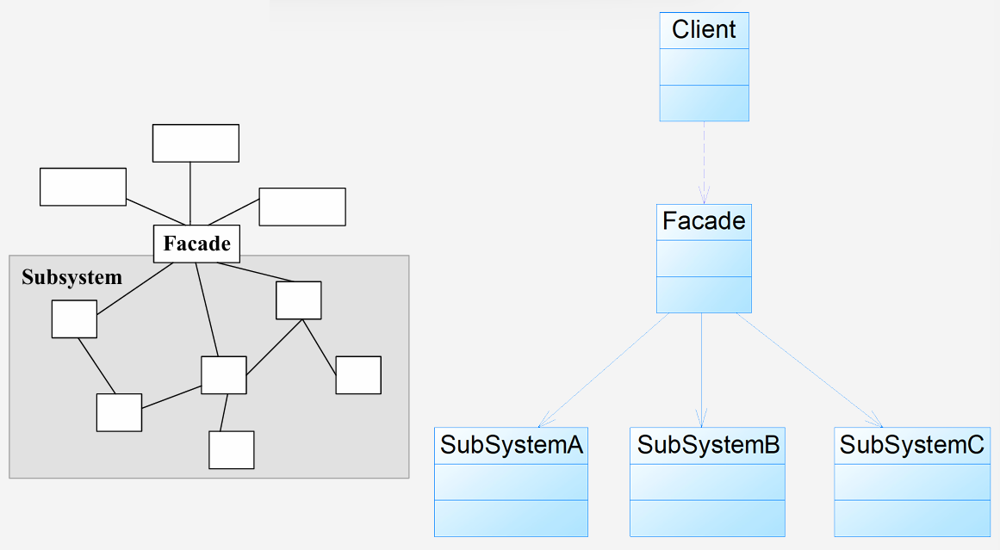
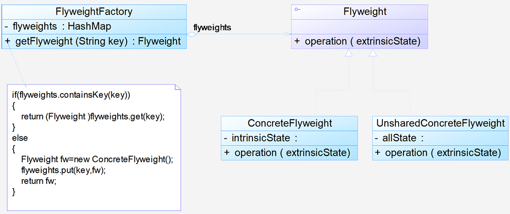

# 9 结构型模式

## 9.1 外观模式

**动机**：

- 在一个复杂的系统中，用户可能需要与多个子系统进行交互。为了简化客户端与子系统之间的交互，可以引入一个**外观角色（Facade）**
- 引入外观角色之后，用户只需要直接与外观角色交互。用户与子系统之间的复杂关系由外观角色来实现，从而**降低了系统的耦合度**

**定义**：外部与一个子系统的通信必须通过一个统一的外观对象进行。它为子系统中的一组接口提供一个**一致的界面**。外观模式定义了一个**高层接口**，这个接口使得这一子系统更加容易使用。**对象结构型模式**

**结构**：

- Facade（外观角色）：

  - 为多个子系统对外提供一个共同的接口
  - 知道哪些子系统负责处理请求
  - 将客户端的请求代理给适当的子系统对象

- SubSystem（子系统角色）：

  - 实现子系统的功能
  - 处理由 Facade 对象指派的任务
  - 注意：子系统不知道 Facade 的存在，对于子系统而言，Facade 只是另一个客户端而已

  

**分析**：

- **遵循设计原则：**

  - **单一职责原则**：将系统划分为若干子系统有利于降低复杂性。外观模式提供简单单一入口，有助于实现子系统间通信和依赖最小化的目标。
  - **迪米特法则**：通过引入外观类降低原有系统复杂度，同时降低客户类与子系统类的耦合度。

- **核心作用：**

  - 要求子系统的外部与其内部的通信通过一个**统一的外观对象**进行。
  - 外观类将客户端与子系统的**内部复杂性分隔开**，客户端只需与外观对象打交道。
  - 目的在于**降低系统的复杂程度**。

- **对客户端的影响：**

  - 提高了客户端使用的**便捷性**，客户端无需关心子系统的工作细节，通过外观角色即可调用相关功能。

- 典型的外观角色代码

  ```java
  public class Facade
  {
      // 维持对子系统对象的引用
      private SubSystemA obj1 = new SubSystemA();
      private SubSystemB obj2 = new SubSystemB();
      private SubSystemC obj3 = new SubSystemC();
  
      // 外观方法，内部调用子系统的方法
      public void method()
      {
          obj1.method(); // 调用子系统A的方法
          obj2.method(); // 调用子系统B的方法
          obj3.method(); // 调用子系统C的方法
      }
  }
  ```

**优缺点**：

- 优点：
  - **对客户屏蔽子系统组件：**减少了客户处理的对象数目，使得子系统使用起来更加容易，客户代码变得简单
  - **实现了子系统与客户之间的松耦合：**子系统的组件变化不会影响到调用它的客户类，只需调整外观类
  - **降低编译依赖性，简化移植过程：**修改或编译一个子系统对其他子系统无影响，子系统内部变化不影响外观对象
  - **提供统一入口，但不限制直接访问：**只是提供了一个访问子系统的统一入口，用户仍然可以直接使用子系统类（如果不被禁止）
- 缺点：
  - **不能很好地限制客户使用子系统类：**如果对客户访问子系统类做太多限制，会减少可变性和灵活性
  - **可能违背“开闭原则”：**在不引入抽象外观类的情况下，增加新的子系统可能需要修改外观类或客户端源代码

**适用环境**：

- 当要为一个**复杂子系统提供一个简单接口**时。该接口满足大多数用户需求，同时允许用户（如果需要）越过外观类直接访问子系统
- 客户程序与**多个子系统之间存在很大的依赖性**。引入外观类将子系统与客户及其他子系统解耦，提高子系统的独立性和可移植性
- 在**层次化结构**中，可以使用外观模式定义系统中每一层的入口，降低层之间的耦合度

**应用**：

1. **JDBC 数据库操作**
2. **Session 外观模式**

**扩展**：

1. **一个系统有多个外观类：**通常一个系统只需要一个外观类，且常设计为单例。但也可以设计多个外观类，每个负责与特定的子系统交互，提供不同的业务功能
2. **不要试图通过外观类为子系统增加新行为：**外观模式的用意是提供简化接口，而不是向子系统加入新行为。新行为应通过修改原有子系统或增加新子系统类来实现，而非通过外观类
3. **外观模式与迪米特法则：**外观模式是迪米特法则的体现。外观类充当客户类与子系统类之间的“第三者”，减少了客户端需要交互的对象数量，降低了耦合度
4. **抽象外观类的引入：**
   - 为解决外观模式可能违背“开闭原则”的缺点，可以引入**抽象外观类**。
   - **客户端针对抽象外观类编程**。
   - 当需要扩展时，不修改原有具体外观类，而是**增加新的具体外观类** 来关联新的子系统。
   - 通过修改配置文件（或其他依赖注入方式）来更换具体外观类的实例，达到不修改客户端代码的目的

## 9.2 享元模式

**动机**：

* **问题背景：**面向对象技术虽好，但在很多情况下会导致系统中类和对象的数量剧增。当对象数量太多时，将导致运行代价过高，带来性能下降等问题
* **核心思想：**享元模式通过**共享技术**实现相同或相似对象的**重用**，以解决对象数量过多的问题
* **状态区分：**
  * **内部状态（Intrinsic State）：**可以共享的、存储在享元对象内部、不随外部环境改变而改变的内容
  * **外部状态（Extrinsic State）：**不能共享的、需要外部环境来设置的、随环境改变而改变的内容。通过设置不同的外部状态，可以使相同的（共享内部状态的）对象具有不同的特征
* **实现机制：**
  * 通常需要一个**享元工厂（Flyweight Factory）**来负责维护一个**享元池（Flyweight Pool）**，用于存储和管理共享对象（享元对象）
  * 目标是使用共享技术来实现大量**细粒度对象**的复用

**定义**：

- 运用共享技术有效地支持**大量细粒度对象**的复用
* 系统只使用少量的对象，这些对象都很相似，状态变化很小，可以实现对象的多次复用
* 由于要求共享的对象必须是细粒度对象，因此它又称为**轻量级模式**
* **对象结构型模式**

**结构**：

* **Flyweight（抽象享元类）**：通常是一个接口或抽象类，声明了具体享元类公共的方法。这些方法可以接收外部状态作为参数

* **ConcreteFlyweight（具体享元类）**：实现了抽象享元接口，其实例称为享元对象。为内部状态提供存储空间。其内部状态必须与环境无关

* **UnsharedConcreteFlyweight（非共享具体享元类）**：并非所有的 Flyweight 子类都需要共享，不能共享的子类可以设计为非共享具体享元类。其对象一般不会存储在享元池中

* **FlyweightFactory（享元工厂类）**：负责创建和管理享元对象。它维护一个享元池（通常用集合实现），确保享元对象可以被共享

  

**分析**：

* 享元模式是一个考虑系统性能的设计模式，通过使用享元模式可以节约内存空间，提高系统的性能
* **核心在于享元工厂类：**
  
    * 享元工厂类的作用在于提供一个用于存储享元对象的**享元池**
    * 用户需要对象时，首先从享元池中获取；如果池中不存在，则创建一个新的享元对象返回给用户，并在享元池中保存该新增对象
* 典型的享元工厂类代码：
  
    ```java
    public class FlyweightFactory
    {
        // 定义一个HashMap用于存储享元对象，充当享元池
        private HashMap flyweights = new HashMap();
    
        public Flyweight getFlyweight(String key)
        {
            // 如果对象存在，则直接从享元池获取
            if（flyweights.containsKey(key))
            {
                return（Flyweight)flyweights.get(key);
            }
            // 如果对象不存在，则创建一个新的享元对象
            else
            {
                Flyweight fw = new ConcreteFlyweight();
                // 将新创建的享元对象存储到享元池中
                flyweights.put(key, fw);
                return fw;
            }
        }
    }
    ```
* **关键在于区分内外状态：**
  
    * 享元对象能做到共享的关键是区分**内部状态（Internal State）**和**外部状态（External State）**
      * **内部状态：**存储在享元对象内部、不会随环境改变而改变的状态，因此可以共享
      * **外部状态：**随环境改变而改变、不可以共享的状态。外部状态必须由客户端保存，并在需要使用时传入享元对象内部。一个外部状态与另一个外部状态之间是相互独立的 
* 典型的享元类代码
  
    ```java
    // 抽象享元类或接口
    public abstract class Flyweight
    {
        // 内部状态作为成员变量
        protected final String intrinsicState;
    
        protected Flyweight(String intrinsicState)
        {
            this.intrinsicState = intrinsicState;
        }
    
        // 定义业务操作，外部状态作为参数传入
        public abstract void operation(String extrinsicState)
        {
      		// ......
        }
    }
    
    // 具体享元类
    public class ConcreteFlyweight extends Flyweight
    {
        // 构造函数，初始化内部状态
        public ConcreteFlyweight(String intrinsicState)
        {
             super(intrinsicState);
        }
    
        // 实现业务方法，可以使用内部状态和传入的外部状态
        public void operation(String extrinsicState)
        {
            // 具体业务逻辑，结合 wewnętrznyState 和 extrinsicState
            System.out.println("Intrinsic State = " + this.intrinsicState);
            System.out.println("Extrinsic State = " + extrinsicState);
        }
    }
    ```

**优缺点**：

* 优点：
  * 极大减少内存中对象的数量，使得相同或相似对象在内存中只保存一份
  * 外部状态相对独立，不影响内部状态，**使得享元对象可在不同环境中被共享**
* 缺点：
  * 使得系统更加复杂，需要分离出内部状态和外部状态，增加程序的逻辑复杂性
  * 为了使对象可以共享，需要将部分状态外部化，读取外部状态可能使得运行时间变长

**适用环境**：

* 一个系统有**大量相同或者相似的对象**，导致内存大量耗费
* 对象的大部分状态可以**外部化**，并将这些外部状态传入对象中
* 需要**多次重复使用**享元对象时才值得使用（因为维护享元池需要耗费资源）

**应用**：

1. **编辑器软件：**在一个文档中多次出现相同的图片，只需创建一个图片对象（享元），通过设置其出现的位置（外部状态），实现图片在不同地方的重复显示
2. **Java `String` 类**：
   - 字符串常量池（String Pool）就是一种享元池。当创建字符串常量时（如 `String str1 = "abcd";`），JVM 会先在常量池中查找是否存在相同值的字符串，如果存在则直接返回池中对象的引用，否则创建新的字符串对象放入池中并返回引用
   * 这解释了为什么示例代码中 `str1 == str2` 和 `str1 == str3`（由常量拼接而成）为 `true`，而 `str1 == str4`（通过变量拼接而成，在运行时创建新对象）为 `false`

**扩展**：

1.  **单纯享元模式 vs. 复合享元模式：**
    * **单纯享元模式：**所有享元对象都是可共享的，即所有抽象享元类的子类都可共享，不存在非共享具体享元类
    * **复合享元模式：**将一些单纯享元使用**组合模式**加以组合，形成复合享元对象
        * 复合享元对象本身**不能共享**
        * 但它们可以分解成单纯享元对象，后者则可以共享
        * 复合享元角色通常实现了 `add()` 和 `remove()` 等管理子对象的方法

2.  **享元模式与其他模式的联用：**
    * **简单工厂模式：**享元工厂类中通常提供静态工厂方法来返回（创建或获取）享元对象
    * **单例模式：**一个系统中通常只有唯一一个享元工厂，因此享元工厂类可以使用单例模式设计
    * **组合模式：**可结合形成复合享元模式，统一对组合结构中的（单纯）享元对象设置外部状态

