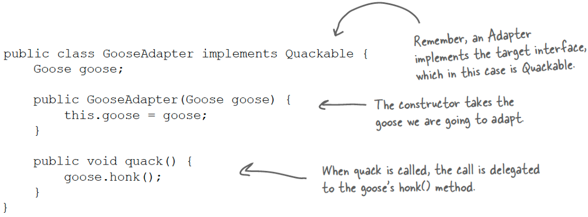
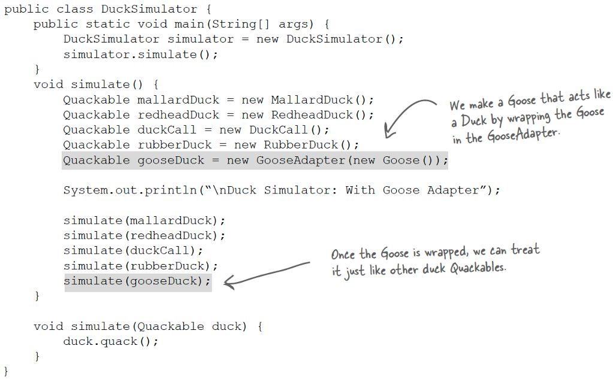
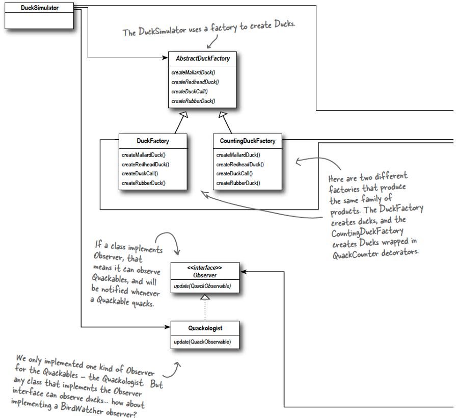
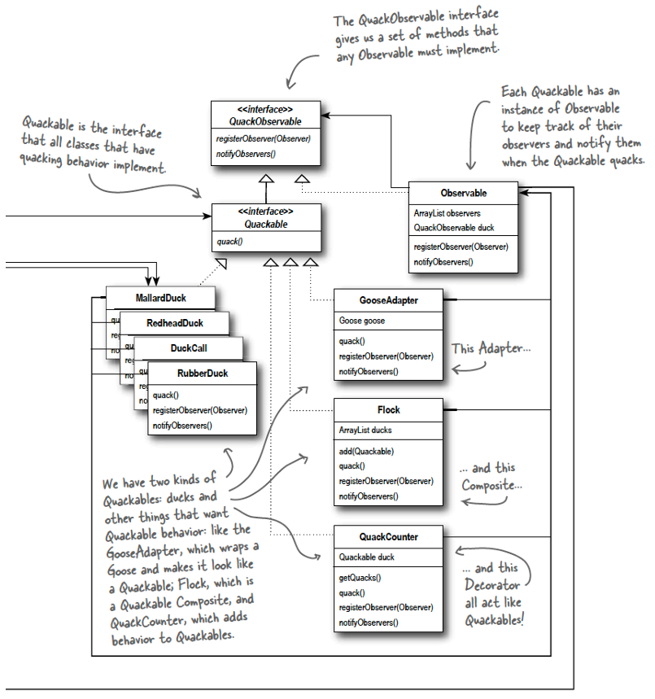

# 10 模式之模式

## 10.1 模式协作与复合模式

设计模式常常协同工作。

**复合模式（模式之模式）**是指将两个或更多模式整合起来，形成一个能解决常见或通用问题的综合方案

## 10.2 实例场景：鸭子模拟器（Duck Simulator）

我们要开发一个模拟鸭子的游戏

**核心需求包括**：

* 方便添加新鸭子种类
* 可能混入其他禽类（如鹅）
* 支持对鸭子叫声的研究（计数）
* 需要统一“装配”鸭子（例如，确保都进行计数）
* 能够统一管理单个鸭子和鸭群
* 系统需具备可扩展性和灵活性

**基础实现**：

* **`Quackable` 接口**：定义鸭子唯一行为 `void quack();`
* **具体鸭子类**：
  * `MallardDuck`（绿头鸭）
  * `RedheadDuck`（红头鸭）
  * `DuckCall`（鸭鸣器）
  * `RubberDuck`（橡皮鸭）
  * 这些类都实现了 `Quackable` 接口
* **`DuckSimulator` 类**：
  * `main` 方法创建 `DuckSimulator` 实例并调用 `simulate()`
  * `simulate()` 方法创建各种 `Quackable` 对象，然后调用重载的 `simulate(Quackable duck)` 方法
  * `simulate(Quackable duck)` 方法接收一个 `Quackable` 对象，并调用其 `quack()` 方法。这里利用了多态性

## 10.3 引入问题与模式应用

### 10.3.1 如何让鹅（Goose) 混入鸭群？

问题：存在 `Goose` 类，它有 `honk()` 方法，而不是 `quack()`，不符合 `Quackable` 接口

解决方案：**适配器模式**（Adapter Pattern）**

* 创建 `GooseAdapter` 类，实现 `Quackable` 接口
* 构造函数接收一个 `Goose` 对象
* `quack()` 方法内部调用 `goose.honk()`
* 模拟器更新：创建 `Goose` 对象，并用 `GooseAdapter` 包装它，之后就可以像其他 `Quackable` 对象一样处理了

### 10.3.2 如何统计鸭子的总叫声次数？

问题：需要增加计数功能，统计所有 `Quackable` 对象的叫声总次数，但不能修改鸭子类

解决方案：**装饰器模式（Decorator Pattern）**

* 创建 `QuackCounter` 类，实现 `Quackable` 接口（装饰器需要实现目标接口）
* 持有被装饰的 `Quackable` 对象 `duck`
* 使用静态变量 `numberOfQuacks` 记录所有叫声次数
* `quack()` 方法：先调用 `duck.quack()`（委托），然后 `numberOfQuacks++`
* 提供静态方法 `getQuacks()` 返回计数值

### 10.3.3 如何确保所有鸭子都被正确装饰（进行计数）？

问题：手动用 `QuackCounter` 包装每个鸭子对象很麻烦且容易出错。需要集中管理鸭子的创建和装饰过程

解决方案：**抽象工厂模式（Abstract Factory Pattern）**

* 定义 `AbstractDuckFactory`，包含创建各种鸭子的抽象方法（如 `createMallardDuck()`）
* `DuckFactory`：具体工厂，继承 `AbstractDuckFactory`，创建未经装饰的鸭子实例
* `CountingDuckFactory`：具体工厂，继承 `AbstractDuckFactory`，创建被 `QuackCounter` 装饰后的鸭子实例。模拟器不知道返回的是装饰过的鸭子，只知道是 `Quackable`
* 模拟器更新：`simulate` 方法接收 `AbstractDuckFactory` 作为参数 [cite: 49]。根据传入的具体工厂（`CountingDuckFactory` 或 `DuckFactory`），创建相应产品族的对象。最后可以输出总叫声次数

### 10.3.4 如何统一管理一群鸭子（或鸭子家族）？

问题：单独管理大量鸭子对象变得困难，需要能像处理单个鸭子一样处理鸭群，并支持嵌套（群中群）

解决方案：**组合模式（Composite Pattern）**

- 创建 `Flock` 类（组合节点），实现 `Quackable` 接口
- 内部用 `ArrayList<Quackable>` 存储成员（可以是单个鸭子或其它 `Flock`）
- 提供 `add(Quackable quacker)` 方法添加成员
- `quack()` 方法：使用迭代器（Iterator Pattern）遍历 `ArrayList`，对每个成员调用 `quack()`
- 模拟器更新：创建 `Flock` 对象，将鸭子（或鹅适配器）添加到群中。可以创建嵌套的 `Flock`（如 `flockOfMallards`）并添加到主 `Flock` 中。之后可以像处理单个鸭子一样 `simulate(flockOfDucks)`
- 讨论安全性与透明性：此实现中，`add` 方法只在 `Flock` 中，不在叶节点（单个鸭子）中，提高了安全性（不能错误地向鸭子添加成员），但降低了透明性（客户端需要判断对象是否为 `Flock` 才能调用 `add`）

### 10.3.5 如何在统一管理鸭群的同时，还能实时追踪单只鸭子的叫声？

问题：需要观察者能实时知道哪只鸭子叫了

解决方案：**观察者模式（Observer Pattern）**

- **定义接口**：  
  - `QuackObservable`（被观察者接口)：定义 `registerObserver(Observer observer)` 和 `notifyObservers()`
  - 修改 `Quackable` 接口，让它继承 `QuackObservable`，这样所有 `Quackable` 对象都自动成为可观察对象
  - `Observer`（观察者接口)：定义 `update(QuackObservable duck)` 方法
- **`Observable` 辅助类**：  
  - 实现 `QuackObservable` 接口
  - 内部持有 `ArrayList<Observer>` 观察者列表和被观察的 `QuackObservable duck` 引用
  - 实现 `registerObserver`（添加到列表）和 `notifyObservers`（遍历列表并调用每个 `observer.update(duck)`) 的逻辑
- **修改 `Quackable` 实现类**（以 `MallardDuck` 为例)：  
  - 添加 `Observable observable` 成员
  - 在构造函数中 `observable = new Observable(this);`
  - 在 `quack()` 方法末尾调用 `notifyObservers();`
  - 实现 `registerObserver` 和 `notifyObservers` 方法，直接委托给 `observable` 对象处理
  - (需要对所有鸭子类、`Flock` 类等进行类似修改，课件中省略了其他类的代码)
- **创建具体观察者**：  
  - `Quackologist` 类实现 `Observer` 接口
  - `update` 方法打印出是哪个 `duck` 对象叫了
- **模拟器更新**：  
  - 创建 `Quackologist` 实例
  - 调用 `flockOfDucks.registerObserver(quackologist)` 将其注册为鸭群的观察者
  - 当 `simulate(flockOfDucks)` 执行时，每次鸭叫都会通知 `quackologist`

## 10.4 最终模式组合

