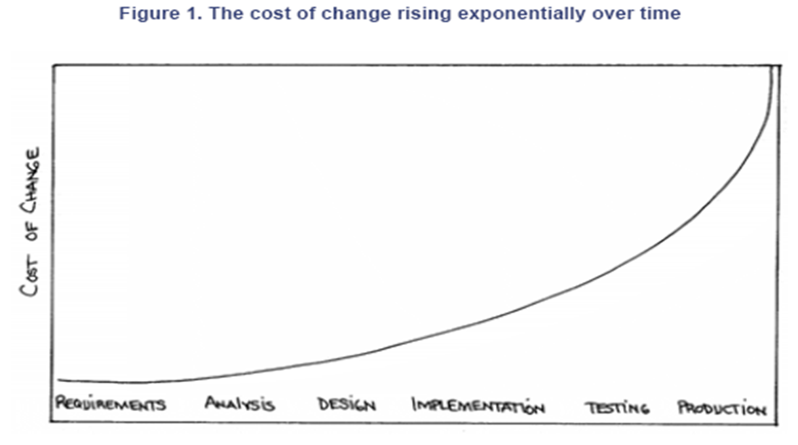

# 2 背景变更曲线

## 2.1 历史背景

## 2.2 XP 的核心——开发阶段

是程序员实现工程任务（调度的最小单位）并将其与系统的其余部分集成的地方

具体步骤：

- 最前面的任务卡：“用户管理：登录、退出、分组。”
- 找一个结对编程伙伴
- 讨论任务
- 什么是测试用例？如果对任何事情不确定，向他人寻求帮助。
- 编写测试用例
- 测试失败

- 编写代码
- 运行所有测试用例
- 迭代测试用例和代码
- 如果需要，进行重构
- 集成，包括测试

说明：

- 程序员两两结对编程
- 开发由测试驱动
- 结对编程不仅仅是让测试用例运行起来。结对编程为系统的分析、设计、实现和测试增加价值
- 开发后立即进行集成，包括集成测试

## 2.3 变更成本曲线

软件工程的一个普遍假设是，随着时间的推移，更改程序的成本呈指数增长。在一段软件中修复一个问题的成本会随时间呈指数增长。一个在需求分析阶段发现可能只需要一美元就能修复的问题，一旦软件投入生产，可能需要花费数千美元才能修复。这导致传统方法强调“早期做好一切”，试图避免后期修改。

如果变更成本随时间缓慢上升，你的行为将与在成本呈指数增长这一假设下的行为完全不同

- 你会在工作中尽可能晚地做出重大决策，以推迟做出决策的成本，并使决策正确的可能性尽可能大
- 你只会实现必须实现的内容，希望你预期的明天的需求不会成为现实
- 只有当简化现有代码或使编写下一段代码更简单时，你才会将这些设计元素引入代码中

让成本变低的技术：

- 面向对象
- 简单设计，没有额外的设计元素 —— 没有尚未使用但预计在未来会使用的设计
- 自动化测试，所以我们有信心知道我们是否意外地改变了系统的现有行为
- 重构技术：在修改设计方面有很多实践，所以当需要改变系统时，我们不会太害怕去尝试
- CICD: 及时发现问题。XP鼓励频繁交付和持续部署。如果每个迭代都交付，客户的反馈使需求逐渐明确，不会出现项目最后才发现需求完全不对的惨剧
- “Beck的曲线并非无视规律，只是把反馈周期从几个月缩短到几分钟，结果就没有机会让成本成指数增长”
- 平坦曲线的前提是严格执行XP实践。对于那些未充分实践XP核心（比如不写测试就匆忙开发的“假敏捷”团队），后期改动一样痛苦

