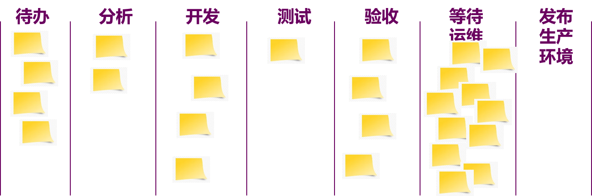

# 6 看板

## 6.1 看板简介与起源

1. **看板定义**：一种通过使用可视化、拉动式系统来优化流程中价值流动的策略
   - 强调通过可视化工作流程和限制在制品（WIP）来实现持续流动（continuous flow）

2. **看板的组成实践**
   - 定义并可视化工作流程
   - 主动管理工作流程中的事项
   - 改进工作流程

## 6.2 定义与可视化工作流（Definition of Workflow - DoW）

**明确且共同的认知**：在特定情境中，看板系统成员对于“流”的含义具有明确且共同的认知，这被称为“工作流的定义”（Definition of Workflow，DoW） 

**工作项（Work Items）**：在工作流中移动的各个价值单位被称为“工作项”（或“项”）

**开始与完成的定义**：工作项从开始到结束的流动过程中会经过⼀个或多个已定义的状态

**进行中工作（Work in Progress - WIP）**：任何介于开始节点与结束节点间的工作项都称为“进行中工作

**控制 WIP 的定义**：明确如何从开始到结束间控制 WIP 的定义

**明确的政策**：关于工作项如何在每个状态中从开始到完成的政策。 

**服务水平期望（Service Level Expectation - SLE）**：预估工作项从开始到完成所需时间的期望，如“85% 的工作项将在 8 天或更短的时间内完成”

## 6.3 可视化实践

- **重要性**：“你无法对自己没有看到的进行改进”。工作可视化之后，信息将散播给看到的每个人。
- **方法**：例如，将项目原来在 Jira 中的工作内容贴在白板上，每个工作项使用一个记事贴。
- **信息冰箱 vs. 信息辐射器**：电子工具一般被称为“信息冰箱”。物理看板能更好地散播信息，作为信息辐射器。

### 6.3.1 Kanban 看板（Kanban Board）

是 Kanban 方法的核心工具，用于可视化工作及其流程状态

典型看板按流程划分为列，例如“待处理”、“进行中”、“待测试”、“已完成”

能提供实时的透明度，显示任务的状态、位置以及整体的工作负荷

Kanban 看板可以是物理白板，也可以是电子工具，如 Jira，Trello，Azure DevOps 等

作为信息辐射器，它能促进团队内外对工作状态的同步和对齐

### 6.3.2 Kanban卡片（Kanban Card）

卡片代表了具体的工作项，比如用户故事、任务或缺陷等

卡片上会记录必要的任务信息，如标题、负责人、描述、截止日期等，以帮助成员理解任务

电子卡片可以包含更多的属性，例如子任务、附件和评论

卡片在看板上从左到右的移动反映了工作的流动；当工作项受阻时，会进行标记（如红标）或移入阻塞区提示解决

**工作流映射示例**：一个工作流的例子可以是：待办 -> 开发 -> 分析 -> 测试 -> 验收 -> 等待运维发布 -> 发布生产环境

## 6.4 关键概念

### 6.4.1 流程阶段与 WIP 限制

**工作流程阶段与泳道**：

- Kanban 板会根据具体的工作流程定制列，例如“待开发”、“开发中”、“代码审查”、“测试中”、“已部署”。列与列之间可以设置“等待/就绪”这样的子列
- 可以设置泳道（swimlane） 来横向分区，以便并行展示不同类型的工作或不同的服务级别，例如设立“紧急 Hotfix”泳道。这有助于管理不同优先级或类别的工作，提高可视化的清晰度

**在制品限制（WIP Limit）**：

- 给每个工作阶段设置在制品限制（WIP Limit）是Kanban的一个重要元素
- 这个限制通常在看板列的顶部用数字标注，表示该列最多能容纳的工作项数量上限
- WIP 限制强制团队避免过多的多任务处理，从而减少排队和等待
- 当某一列的工作项数量达到其 WIP 上限时，团队需要暂停从上游拉入新的任务，优先完成该列中现有的任务
- WIP 上限提醒团队要采取行动，改善瓶颈，而不是无休止地堆积未完成的工作
- 通过度量平均生产周期，并据此不断优化WIP上限，可以优化总的生产周期

### 6.4.2 拉动系统（Pull System）

Kanban 采用拉动理念，即下游工作阶段主动从上游工作阶段拉取工作项，而不是由上游推送

在看板上的体现是：当一个工作项完成后，下一阶段的负责人才会在自己有空闲能力时，从前一阶段的“就绪”区拉取新的卡片进入自己的工作区

当下游工作阶段因为达到 WIP 上限而忙碌时，上游已完成的任务会在对应的“就绪”区域等待被拉取

这种机制保证系统不会“过度生产”，帮助团队按自己的节奏工作，减少工作中途的堆积和浪费，并要求团队成员间的协作

## 6.5 Kanban 度量（Kanban Guides）

**WIP（Work in Progress）**：指已经开始但尚未完成的工作项的数量

**产能（Throughput）**：指每单位时间内（如每天、每周或每月）完成的工作项的数量产能的度量是对工作项的精确计数

**工作项存续时长（Work Item Age）**：指⼀个工作项从开始到当前时刻之间所经过的时间长度。通过设置合理的预警线（Aging Thresholds），团队可以主动识别哪些任务需要额外关注或加快处理，以避免任务滞留过久影响整体交付效率

**周期时间（Cycle Time）**：指一个工作项从正式开始处理到完成交付之间的总时长它统计的是已经完成的任务，区别于存续时长（针对未完成任务）

**周期时间 vs. 交付时间（Lead Time）**：

- 周期时间通常指的是“处理时间”
- 交付时间则可能包括从需求提出到工作启动前在队列中的等待时间

## 6.6 处理特殊情况 - 紧急工作（Fast Track / 快速通道）

处理特殊情况（如紧急工作）的常用方式
通常在白板上将其规划为单独的通道

规则：

- 任何时候快速通道内最多只能有一个工作项
- 每周最多处理一个紧急工作
- 快速通道内的工作项无需计入常规的在制品限制中

## 6.7 Kanban 与其他敏捷方法的比较与融合

### 6.7.1 Kanban 与 Scrum 的差异

**框架性质**：

- Scrum 是迭代式（Iterative）框架，通过固定长度的Sprint规划交付增量
- Kanban 是流动式（Flow-based）框架，无预定迭代周期，工作项持续流动，完成一个拉一个，可连续交付
- Scrum 适合节奏明确的项目，Kanban 适合持续流动的工作（如支持维护）

**角色与责任**：

- Scrum 规定 3 个明确角色：产品负责人（PO）、Scrum Master（SM）和开发团队
- Kanban不指定必须角色，通常保留现有组织架构，成员各司其职，通过看板协同
- 虽然 Kanban 中可以引入如 SDM/SRM 等可选角色，但并非强制

**时间规划**：

- Scrum 以 Sprint 为时间盒进行计划和评估，有固定节奏的会议（计划、站会、评审、回顾）；Sprint中通常不接受新的需求变更
- Kanban 无时间盒约束，计划交付连续，对变更反应更灵活，团队按优先级拉取

**流程和工件**：

- Scrum 强调其规定的事件（会议）和工件（如 Product Backlog, Sprint Backlog, Increment）
- Kanban 唯一主要工件是看板及相关策略，反馈环频率形式由团队决定

### 6.7.2 Kanban 与 Scrum 的互补与融合（Scrumban）

**互补性**：“原则相同，实践有别”。可相互借鉴

- Scrum 团队常使用可视化任务板（一种Kanban实践）并设置WIP限制以改善流动
- Kanban 团队也可以引入定期回顾或借鉴 Backlog 管理方法

**Scrumban**：Scrum 到 Kanban 的中间态/过渡，保留 Scrum 部分结构，取消固定 Sprint 承诺，改用 Kanban 拉动节奏和 WIP 控制

### 6.7.3 Kanban与XP（极限编程）的关系

**定位差异**：XP侧重工程实践（如何开发更好软件）；Kanban关注流程和可视化管理（如何管理和改进工作流程）

**兼容并用**：可完全同时采用 XP 实践和 Kanban 方法，XP 实践可在Kanban 团队“开发中”列实施。

## 6.8 实践练习与示例

1. 硬币传递游戏 

   * 目的：说明WIP大小对流动效率的影响
   * 设置：4 人传递 20 枚硬币，每人需翻转硬币。记录第一枚和所有硬币到达客户的时间。
   * 三轮规则： 

     * 第一轮：每人翻完所有 20 枚硬币后传递
     * 第二轮：每次翻 5 枚硬币后传递
     * 第三轮：每次翻 1 个硬币后传递
   * 预期结果：小批量传递（类似小WIP）能更快交付第一枚硬币，并可能缩短总交付时间
2.  寻找WIP例子
2.  资源利用率低
