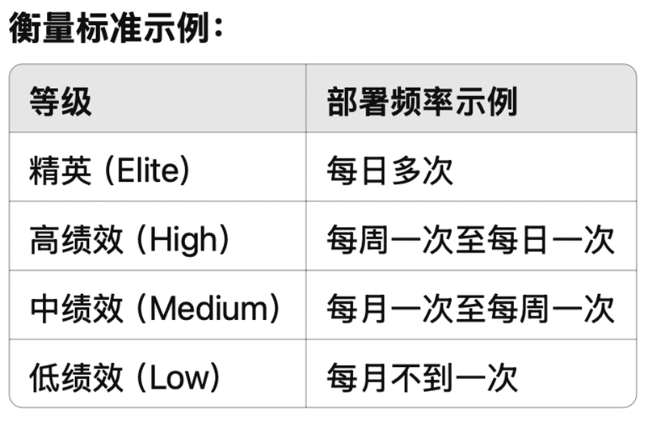
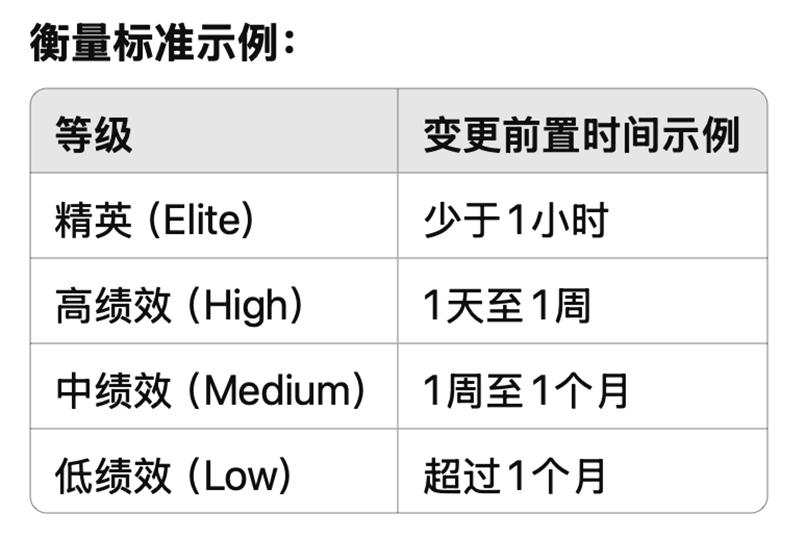
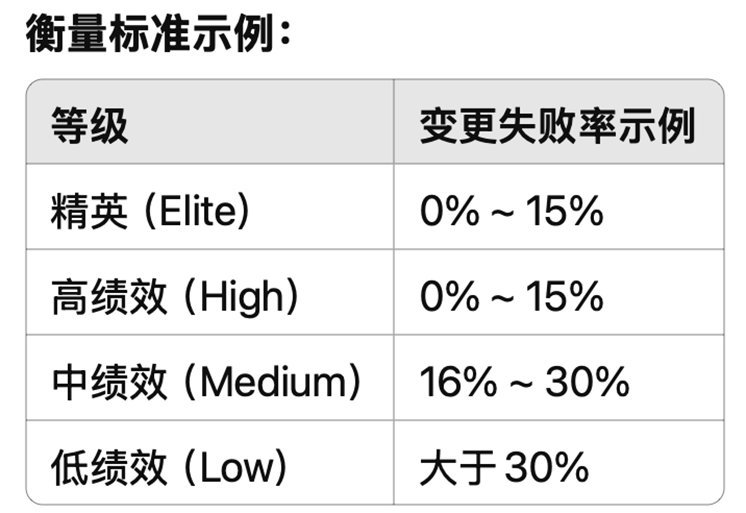
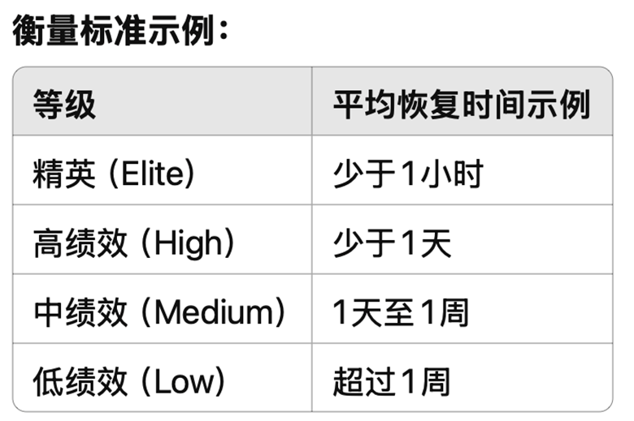

# 7 DevOps

## 7.1 DevOps 核心实践与技术体系

### 7.1.1 概述与 CI/CD

**概述**：

- DevOps 是贯穿软件生命周期的核心实践和技术工具体系化应用
- 形成持续循环的不间断流程（规划、编码、构建、测试、发布、部署、运行、监控、反馈

**持续集成（CI）**：

* 开发者频繁将代码变更合并到主干分支
* 合并后会触发自动化构建和测试

**持续交付（CD）**：将 CI 产出的构件自动部署到测试或预生产环境

**持续部署（Continuous Deployment）**：代码通过自动化流程验证后直接部署到生产环境

### 7.1.2 测试自动化与 IaC

**自动化测试**：作为“测试门禁”，通过所有自动测试的构建才可部署。有助于将质量控制的环节前移

**基础设施即代码（IaC - Infrastructure as Code）**：

* 定义：使用代码化方式管理和配置基础设施，将手动运维操作转为可编程脚本 / 配置
* 工具示例：Chef, Puppet, Ansible, Terraform
* 实践：以声明式配置文件定义所需基础架构环境，自动化部署和变更管理
* 效果：确保环境配置一致性和可重复性，避免“环境漂移”
* 跨云标准化：如 Terraform 可用同套脚本在不同云厂商创建相同架构
* 版本控制与审核：基础设施配置脚本可版本控制、代码评审、CI/CD 测试部署

### 7.1.3 配置管理、容器化

**自动化配置**：配置管理工具（Chef, Puppet）确保不同服务器系统配置统一 

**容器化技术（Docker）**：

* 推动“一次构建，到处运行” 
* 应用及其依赖打包为镜像，保证各环境一致运行 

**容器编排（Kubernetes）**：

* 自动部署、管理容器集群 
* 提供服务发现、弹性伸缩等，使微服务落地更容易 

### 7.1.4 监控反馈

**持续监控与反馈（Continuous Monitoring & Feedback）**

* 实时监控：DevOps 生命周期后半段对应用运行状态的实时监控 
* 工具示例：Prometheus, Nagios, Grafana, ELK 栈 
* 实践：收集系统性能指标、日志、用户行为数据；设置警报及时通知异常 
* 持续反馈：不仅是故障响应，更要将正常运行数据用于改进 

**DevOps 核心实践形成 CI-CD-CF（持续反馈）闭环** 

* **特征：高度自动化、协作和透明** 
* **依赖工具链，更重要是文化和流程融合** 

## 7.2 DevOps 与相关概念比较

### 7.2.1 DevOps vs. 敏捷（Agile）

**敏捷**：

* 核心：项目和产品开发方法学，提高开发过程灵活性和响应速度 
* 关注点：开发团队内部效率，与客户持续反馈，快速响应需求变更 
* 目标：“如何更有效地开发软件” 

**DevOps**： 

- 核心：扩展敏捷理念至软件交付和运维全生命周期 

* 关注点：开发与运维协作，打破壁垒，实现从开发到部署的持续流动 
* 目标：“如何更快更可靠地交付软件” 

互补性：敏捷提供快速交付增量功能框架，DevOps 确保顺畅安全部署上线 

实践差异：敏捷遵循 Scrum/Kanban，通过短迭代交付软件增量；DevOps 在敏捷产出基础上引入 CI/CD、自动化部署、监控等，快速推向生产

概括：敏捷强调组织结构和开发流程敏捷性，DevOps 强调跨职能协作和交付流程自动化

### 7.2.2 DevOps vs. CI/CD

关系：

- CI/CD 是技术实践，DevOps 是文化和流程理念
- CI/CD 是实现 DevOps 目标的核心手段之一

区别：

- 无 CI/CD 难实现 DevOps，但仅有 CI/CD 工具不代表完成 DevOps 转型
- CI/CD 关注自动化，DevOps 范围更广（人、流程、工具、组织、文化）

### 7.2.3 DevOps vs. 云原生（Cloud Native）

定义：

- 云原生：利用云计算优势设计部署应用的架构理念（容器化、微服务、不可变基础设施等），强调应用如何构建运行以适应云环境 

* DevOps：强调应用如何快速可靠交付 

目标一致：都为提升交付速度和弹性 

切入点不同：云原生关注架构，DevOps 关注流程 

相互促进：

- Cloud Native 应用需 DevOps 实践支撑
- DevOps 需弹性云资源支持
- 云的弹性需 DevOps 自动化高效利用 

关系总结：DevOps 是过程方法，Cloud Native 是应用架构，二者高度协同 

实践结合：团队常同时推进 DevOps 文化和云原生技术 

### 7.2.4 DevOps vs. AIOps

定义： 

- AIOps：利用 AI 技术提升 IT 运维智能化水平（机器学习分析监控数据、自动发现异常、定位根因等）
- DevOps 定义：关注流程和协作，本质不直接涉 AI 

关系理解：DevOps 为敏捷高效运维提供机制和文化基础，AIOps 为复杂运维场景提供智能化手段 

互相支撑：

- DevOps 实施使数据收集和流程自动化成为可能，为 AI 算法提供用武之地
- AIOps 工具与 DevOps 目标一致（缩短 MTTR、减少人工干预）

## 7.3 DevSecOps 的定义、发展与实践方法

### 7.3.1 定义与左移（Shift Left）

诞生背景：安全（Security）应融入 DevOps 过程，而非最后检查 

定义：DevSecOps = 开发（Dev）+ 安全（Sec）+ 运维（Ops）的融合 

核心目标：将安全保障集成到软件开发生命周期各阶段 

观念转变：安全不再是独立团队责任，而是 DevOps 团队共享责任，需“左移”到开发之初 

传统模式痛点：安全被视为发布前最后关卡 

DevOps 时代挑战：传统后置安全审查成新瓶颈 

“安全左移”（Shift Left Security）：在开发和集成环节就开展安全工作，强调内建安全而非事后补救 

### 7.3.2 实践与趋势 

* 安全需求融入规划：计划阶段评估风险合规，用户故事定义安全验收标准 
* 安全编码实践：开发人员培训，遵循规范，引入静态代码分析（SAST）工具 
* 自动化安全测试：CI 流水线加入 SAST 和 DAST 工具，容器镜像安全扫描 
* 基础设施和依赖安全：IaC 应用安全策略，软件成分分析（SCA）
* 持续监控与防护：部署入侵检测、WAF，安全日志集中监控，形成闭环反馈 

## 7.4 常用 DevOps 术语表

**蓝绿部署（Blue-Green Deployment）**：

* 定义：零停机部署策略，维护蓝（当前生产）和绿（新版）两套环境
* 流程：测试验证绿环境后，流量从蓝切到绿
* 优缺点：切换快，回退易；需双倍资源；一次性切换有风险
* 适用：要求短暂无缝切换场景，成本较高

**金丝雀发布（Canary Deployment）**：

* 定义：渐进式部署策略，源自“矿井金丝雀”预警
* 流程：小部分用户/流量切换到新版，观察无异常则逐步扩大比例
* 优缺点：更安全可控；需实现按用户/流量分割的路由机制
* 适用：风险最低的发布策略之一

**基础设施即代码（IaC, Infrastructure as Code）**：

* 定义：用代码定义和管理 IT 基础设施的实践
* 工具：Terraform, CloudFormation 等
* 实践：用脚本/配置文件描述资源，自动化创建/更新，配置可版本控制、代码审查、重复执行
* 效果：环境配置统一可重复，部署/恢复快速可靠，减少人为错误，提高一致性伸缩性

**微服务（Microservices）**：

* 定义：将应用拆分为一组小的、独立部署的服务，每个服务专注单一业务能力的软件架构风格
* 与 DevOps 关系：相辅相成，服务粒度小易于独立开发部署，支持 CD；小团队负责全生命周期
* 特点：部署频率高，需成熟 CI/CD 和监控；通过 DevOps 实现弹性伸缩和故障隔离

**持续监控（Continuous Monitoring）**：

* 定义：应用和基础设施上线后，持续收集数据并监视
* 实践：实时了解系统健康，及时发现异常，通常伴随告警机制
* 作用：持续反馈的重要组成，数据反馈驱动迭代
* 工具：Prometheus, Grafana, ELK 栈

**MTTR（Mean Time to Recovery/Restore）**：

* 定义：平均恢复时间，从故障发生到修复完成的平均时长
* 意义：DevOps 度量中反映发布稳定性和运维效率的关键指标
* 改进方式：自动化监控、快速回滚、高效协作可大幅降低 MTTR

## 7.5 DORA（DevOps Research and Assessment）指标体系

**部署频率（Deployment Frequency）**：团队或组织在给定时间范围内将代码成功部署到生产环境的频率 

**变更前置时间（Lead Time for Changes）**：从代码提交到代码成功部署到生产环境所需的时间 

**变更失败率（Change Failure Rate）**：部署到生产环境后的代码变更引发故障或问题，导致需要紧急修复、回滚或出现服务降级等情况的比例

**平均恢复时间（Mean Time To Restore, MTTR）**：当生产环境出现故障或服务降级时，从故障发生到完全恢复正常服务所需的平均时间

指标解读 

* 部署频率和变更前置时间体现交付的速度和效率 
* 变更失败率和平均恢复时间体现交付的质量和稳定性