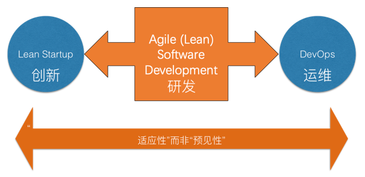

# 8 敏捷概述

## 8.1 敏捷软件开发知识体系

### 8.1.1 层次结构（金字塔模型）

- **价值观**：对软件开发本质和产业本质的认识；敏捷宣言；简单、反馈、沟通、勇气、尊重等
- **原则**：快速反馈、及早交付有价值的软件、以简洁为本等
- **方法**：Extreme Programming（XP），Scrum，Kanban 等
- **实践**：TDD（测试驱动开发），CI（持续集成），Pair Programming（结对编程），Refactoring（重构） 等
- **工具**：Taskboard（任务板），Bug Tracker（缺陷跟踪系统），Unit test tool（单元测试工具） 等

### 8.1.2 如何做到敏捷

敏捷的本质：一种思考软件开发的方式（敏捷宣言和敏捷原则），它并不仅仅是一种可以遵循的具体过程 

Kent Beck 对 XP 的描述：一种软件开发哲学、一组实践、一套互补的原则和一个社区

## 8.2 学习敏捷 - 价值观、原则与实践

**价值观**：

- 知识和理解的另一层次；某种处境中喜恶某事的根源
- XP 价值观示例：沟通、简单、反馈、勇气、尊重

**价值观与实践**：

- 没有价值观的实践会变成生搬硬套，缺乏目的或方向
- 价值观和实践相结合，程序员才能高效地执行实践
- 实践是价值观的表现。价值观是在一个高层次上的表达，可以以价值观的名义做任何事
- 实践让价值观清晰可见；例如，是否参加站立会议是明确的，但重视沟通则不那么具体

**原则**：

- 原则在价值观和实践之间架起桥梁
- 原则是生活中具体领域的指导方针

## 8.3 敏捷宣言 - 历史、内容与原则

### 8.3.1 敏捷宣言四项核心价值观

1. 个体和互动 高于 流程和工具
   基本宗旨是干活的人最清楚如何完成工作，流程和工具必须为人服务

2. 工作的软件 高于 详尽的文档

   - 如果文档能创造价值并推动项目进展则可取（如用户文档），但若焦点变为流程文档则有问题
   - 敏捷团队也做计划和文档，形式如用户故事、列表(backlog)、验收测试和大型可视图表，构成富沟通环境；可工作的软件是最终的参考

3. 客户合作 高于 合同谈判

   着重强调开发团队和客户之间保持尽可能公开和顺畅的对话，共同努力构建最有价值的系统

4. 响应变化 高于 遵循计划

   与计划驱动型组织的变化控制流程相对，敏捷认为创造价值才是衡量软件开发成功的标准

尽管右项有其价值，我们更重视左项的价值

### 8.3.2 敏捷宣言遵循的十二条原则

1. 我们最重要的目标，是通过持续不断地及早交付有价值的软件使客户满意
2. 欣然面对需求变化，即使在开发后期也一样。为了客户的竞争优势，敏捷过程掌控变化
3. 经常地交付可工作的软件，相隔几星期或一两个月，倾向于采取较短的周期
4. 业务人员和开发人员必须相互合作，项目中的每一天都不例外
5. 激发个体的斗志，以他们为核心搭建项目。提供所需的环境和支援，辅以信任，从而达成目标
6. 不论团队内外，传递信息效果最好效率也最高的方式是面对面的交谈
7. 可工作的软件是进度的首要度量标准
8. 敏捷过程倡导可持续开发。责任人、开发人员和用户要能够共同维持其步调稳定延续
9. 坚持不懈地追求技术卓越和良好设计，敏捷能力由此增强
10. 以简洁为本，它是极力减少不必要工作量的艺术
11. 最好的架构、需求和设计出自自组织团队
12. 团队定期地反思如何能提高成效，并依此调整自身的举止表现

## 8.4 敏捷的延伸与生态

### 8.4.1 敏捷与精益为何出现在软件开发行业

软件开发的本质属性：复杂性、一致性、可变性、不可见性

敏捷与精益帮助处理软件开发的复杂性与可变性

- 敏捷的本质是承认软件开发的复杂性，达到无法通过充分前期准备消除后续风险的程度，甚至前期准备越充分风险越大
- 敏捷是当前应对模糊需求、快速变化需求的最佳方式

### 8.4.2 创新、研发、运维的关联

### 8.4.3 精益创业

概念：Eric Ries 等人倡导的创业（创新）启动方法论（2011年）

核心过程环：通过“假设（idea）”、“构建”、“检验”和“学习”等环节快速迭代，是一种经验学习型方法

### 8.4.4 DevOps

定义：一套实践方法，旨在缩短系统变更到投入生产的时间，同时确保高质量

DevOps 关乎：

- 将“敏捷”方法引入运维
- 鼓励开发与运维协作交流
- 设定共同目标，组建开发与运维团队

### 8.4.5 软件项目成功观的对比

**传统观点**：

- 成功：按时完成，费用不超过预算，所有特性和功能符合原先设计规格
- 不太成功：已完成并可运行，但费用超预算、未如期完成或功能少于原规格
- 失败：在开发周期的某个时刻被取消

**敏捷观点**：

- 核心标准：为客户创造价值是评价成功的最重要标准
- 项目控制的重要性视情况而定（例如，110 万收益、100 万成本的项目控制很重要；5000 万收益、100 万成本的项目控制没那么重要）
- 所有软件开发实践都应以提升项目收益为首要目标