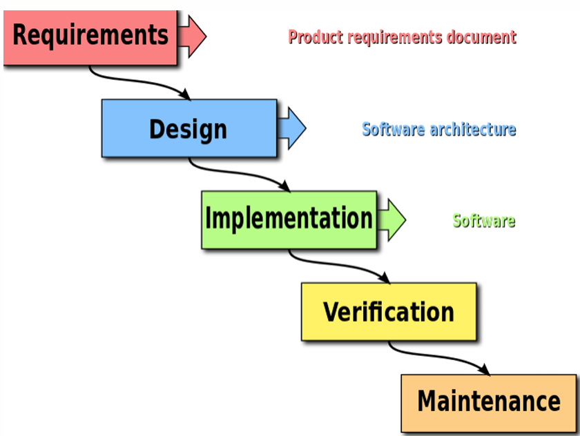
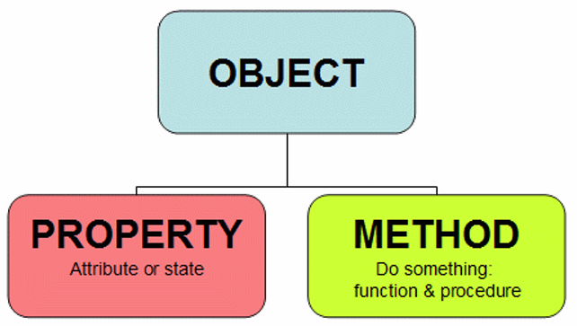
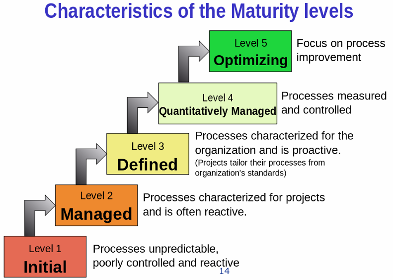

# 2 软件过程的历史演变和经典工作

## 2.1 引言

软件开发的本质难题：不可见性（Invisibility）复杂性，（Complexity），可变性（Changeability），一致性（Conformity）

对本质难题的进一步分析：
* 三个本质难题（应指复杂性、可变性、一致性，结合上下文理解，不可见性是另一个维度）因项目而异
* 四大本质难题相互促进
* 本质难题的变化带动软件方法（过程）演变

## 2.2 软件发展三大阶段

第一阶段：软硬件一体化阶段（50年代~70年代）
* 软件完全依附于硬件
* 软件作坊

第二阶段：软件成为独立的产品（70年代~90年代）

第三阶段：网络化和服务化（90年代中期迄今）

### 2.2.1 第一阶段：软硬件一体化

**软件完全依附于硬件时期**：

* 软件应用典型特征：①软件支持硬件完成计算任务；②功能单一；③复杂度有限；④几乎不需要需求变更

* 软件开发典型特征：①硬件昂贵；②团队以硬件工程师和数学家为主

* 典型软件过程和实践：

    

    * SAGE 软件开发过程图示（类似硬件开发过程）
    * 包含操作计划、机器规格、操作规格、程序规格、编码规格、编码、参数测试、汇编测试、振荡期、系统评估等阶段

    * 理念："Measure twice，cut once"（三思而后行）

**软件作坊时期**：

* 软件应用典型特征：①功能简单；②规模小
* 软件开发典型特征：①许多非专业领域的人员涌入软件开发领域；②高级程序语言出现；③质疑权威文化盛行
* 典型软件过程和实践："Code and fix"（编码和修复）

* **软件危机和软件工程的提出**："Code and fix" 不适合大型软件项目开发

### 2.2.2 第二阶段：软件成为独立产品

软件应用特征：①摆脱了硬件束缚（操作系统出现）；②功能强大；③规模和复杂度剧增；④个人电脑出现→普通人成为软件用户（需求多变、兼容性要求）；⑤来自市场的压力

典型软件过程和实践：
* 方法 1：**形式化方法**

* 方法 2：**结构化程序设计和瀑布模型**
    * Royce 瀑布模型图示（包含系统需求、软件需求、分析、程序设计、编码、测试、运行等阶段，以及各阶段间的反馈）
    
      
    
    * 简化的瀑布模型图示（需求、设计、实现、验证、维护）
    
      
    
* 问题和不足（效率和质量）：
    * 形式化在扩展性和可用性方面存在不足
    * 瀑布模型成为一个重文档、慢节奏的过程
    
* 面向对象思想

    

* 成熟度模型（CMM ：Capability Maturity Model）
    
    
    
    * Level 1：Initial（初始级）：过程不可预测，控制不良，被动反应
    * Level 2：Managed（管理级）：过程为项目服务，常常是被动反应
    * Level 3：Defined（定义级）：过程为组织服务，是主动的（项目从组织标准中定制过程）
    * Level 4：Quantitatively Managed（量化管理级）：过程被度量和控制
    * Level 5：Optimizing（优化级）：关注过程改进

* 关于 CMMI 的讨论：
    * CMMI 是过程改进模型而非软件过程或者软件过程模型
    * CMMI 不是过程优劣的标准，也不适合用作公司之间的能力比较
    * 为什么 CMMI VS. Agile 是一个伪命题？

### 2.2.3 第三阶段：网络化和服务化

软件应用特征：①功能更复杂，规模更大；②用户数量急剧增加；③快速演化和需求不确定；④分发方式的变化（SaaS）

典型软件过程和实践：

* 迭代式开发：逐步学习、交流和交付
* 雪鸟会议和敏捷宣言：
    * 个体和互动 胜过 流程和工具
    * 可以工作的软件 胜过 详尽的文档
    * 客户合作 胜过 合同谈判
    * 响应变化 胜过 遵循计划
    * 强调左项比右项更有价值
    * 敏捷方法的五个层次图示（价值观、原则、方法、实践、工具）
* 敏捷方法举例：
    * XP（eXtreme Programming）：偏重于一些工程实践的描述
    * SCRUM：管理框架和管理实践
    * Kanban（看板）：精益生产的具体实现，可视化工作流、限定WIP、管理周期时间
* 开源软件开发方法：基于并行开发模式的组织与管理方式
    * Linus 定律：“如果有足够多的beta测试者和合作开发者，几乎所有问题都会很快显现，然后自然有人会把它解决。”
    * 核心理念：“早发布，常发布，倾听用户的反馈”、“把你的用户当成开发合作者对待”、“设计上的完美不是没有东西可以再加，而是没有东西可以再减”
    * 代码管理：严格的代码提交社区审核制度
    * 演化：内部开源（Inner Source）、众包（Crowdsourcing）

## 2.3 当前软件发展现状

软件应用典型特征：

* 进一步服务化和网络化（移动是主流）
* 用户需求多样性进一步凸显
* 软件产品和服务的地位变化
* 错综复杂的部署环境

* 近乎苛刻的用户期望：
    * 多：功能丰富，个性化
    * 快：快速使用，及时更新，快速解决问题
    * 好：稳定，可靠，安全，可信
    * 省：用户的获得成本低，最好免费

软件开发典型特征：
* 空前强大的开发和部署环境——XaaS（一切皆服务）
    * IaaS（基础设施即服务）
    * PaaS（平台即服务）
    * SaaS（软件即服务），FaaS（功能即服务）
* 盛行共享和开源
* 潜在支撑获得了长足进步（AI，Bigdata，Cloud，etc.）

## 2.4 典型DevOps实践和方法

* 方法论基础是敏捷软件开发、精益思想以及看板Kanban方法
* 以领域驱动设计为指导的微服务架构方式
* 大量虚拟化技术的使用
* 一切皆服务 XaaS（$X$ as a Service）的理念指导
* 构建了强大的工具链，支持高水平自动化

## 练习题

“Measure twice，cut once”描述的是哪个软件开发场景？（V&V）

软件发展三大阶段中不属于的是？（云计算化和云原生）

不属于软件开发本质困难或挑战的是？（质量难题）

软硬件一体化阶段的典型实践是？（Code and Fix）
