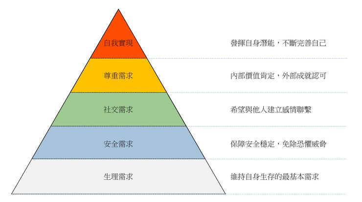
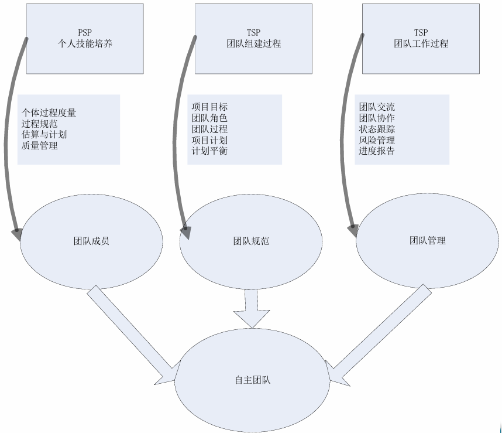
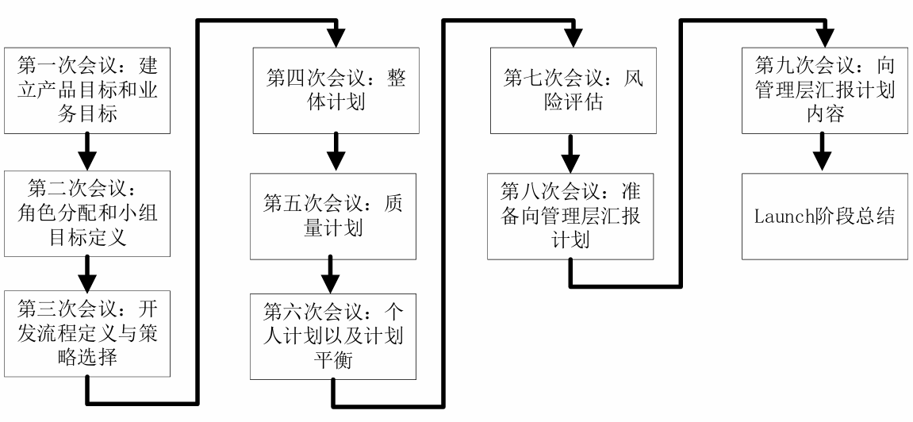

# 3 团队动力学

## 3.1 软件开发与知识工作

**软件开发的特性**：

- 复杂且富有创造性的知识工作
- 智力劳动：处理抽象概念，整合不可见部分为可工作系统

**对工程师的要求**：全身心参与，主观意愿追求卓越

**对管理者的要求**：

- 激励并维持激励
- 激励手段与维持激励手段

**知识工作管理的核心**：管理者无法管理工作者，知识工作者必须实现并学会自我管理

**知识工作者自我管理的前提**：①有积极性；②能做出准确的估算和计划；③懂得协商承诺；④有效跟踪计划；⑤持续按计划交付高质量产物

**对软件工程（SE）带来的改变与思考**：①团队协作模式；②领导者特质与激励方式；③估算、计划、跟踪及敏捷开发中的心理因素；④UML 技术隐含的心理因素等

**胶冻状团队**（Jelled Team）：成员相互支持，有归属感和互助友爱感

**领导者 vs. 经理**：

- 知识工作者需要领导者而非经理
- 讨论知识工作领导者的特点

## 3.2 激励机制与理论

**马斯洛的需求层次理论**：

- 自我实现是最高的层次
- 激励来自为没有满足的需求而努力奋斗
- 低层次的需求必须在高层次需求满足之前得到满足
- 满足高层次的需求的途径比满足低层次的途径更为广泛

**领导者激励手段**：威逼、利诱、鼓励承诺

- 交易型领导方式：承诺奖励激励（威逼 & 利诱属于此类）
- 转变型领导方式：用成就激励（鼓励承诺属于此类）
- 转变型领导方式是成功且有创造性团队的首选

**承诺形式的激励**：

- 个人对待承诺的差异：认真 / 轻率
- 当满足以下情况，团队承诺比个人承诺的激励作用更大
  - 所有团队成员共同参与作出承诺
  - 团队依赖于每一位成员履行自己的承诺
- 有效团队承诺的要素：自愿、公开、可信、向团队承诺

**维持激励水平**：

- 需要及时的绩效反馈
- 反馈内容：
  - 根据一个详细计划衡量进度
  - 当前计划不准确时重做计划
  - 为漫长而富有挑战性的项目提供中间反馈，即里程碑

**其他激励相关理论**：

- 海兹伯格的激励理论
  - 激励因素（内在）：成就感、责任感、晋升、被赏识认可
  - 保健因素（外在）：工作环境、薪金、工作关系、安全等

- 麦克勒格的 X 理论和 Y 理论
  - X 理论假设：员工不喜工作、缺进取心、需指导、自我中心（马斯洛底层需求激励）
  - Y 理论假设：员工在适当激励下能达高绩效、有创造力、能自我约束、渴望责任（马斯洛高层需求激励）
- 期望理论：激励公式：$M=V×E$（努力产生成功结果的信念 V，成功获得相应回报的信念 E）

## 3.3 自主团队

**自主团队的特点**：

- 自行定义项目目标
- 自行决定团队组成形式及成员角色
- 自行决定项目开发策略
- 自行定义项目开发过程
- 自行制定项目开发计划
- 自行度量、管理和控制项目工作

**自主团队的外部环境（管理层的支持）**：

- 项目启动阶段：体现满足管理层需求、定期报告、计划合理性证明、质量追求、允许变更、寻求帮助
- 项目进展过程：严格遵循过程、维护更新计划、质量管理、跟踪进展并报告、持续展现优异表现

## 3.4 TSP（Team Software Process）对自主团队的支持

**TSP 与 PSP（Personal Software Process）的关系**：

- PSP 关注个人技能培养、个体过程度量、过程规范、估算计划、质量管理
- TSP 通过团队组建（项目目标、角色、过程、计划、平衡）和团队工作（沟通、协作、跟踪、风险、报告）实现自主团队

- TSP Launch（启动阶段会议流程）

  

**领导者与经理的区别**：

| 角色经理 | 团队领导者   |
| -------- | ------------ |
| 告知     | 倾听         |
| 指导     | 询问         |
| 说服     | 激励/挑战    |
| 决定     | 促进达成一致 |
| 控制     | 教练         |
| 监控     | 授权         |
| 设定目标 | 挑战         |

**典型 TSP 角色**：

|                            | 目标                                                         | 典型技能                                                     | 工作内容                                                     |
| -------------------------- | ------------------------------------------------------------ | ------------------------------------------------------------ | ------------------------------------------------------------ |
| 项目组长（Team Lead - TL） | ①建设和维持高效率的团队 ②激励团队成员积极工作 ③合理处理团队成员的问题 ④向管理层提供项目进度相关的完整信息 ⑤充当合格的会议组织者和协调者 | ①天生的领导者 ②有能力识别问题的关键并且做出客观的决策 ③不介意偶尔充当“恶人” ④尊敬团队成员 | ①激励团队成员努力工作 ②主持项目周例会 ③每周汇报项目状态 ④分配工作任务 ⑤维护项目资料 ⑥组织项目总结 |
| 计划经理                   | ①开发完整的、准确的团队计划和个人计划 ②每周准确的报告项目小组状态 | ①做事有条理和逻辑 ②对于过程数据非常感兴趣，期待通过每周输入的数据来了解项目当前状况 ③认为计划非常重要，也愿意要求团队成员跟踪和度量他们的工作 | ①带领项目小组开发项目计划 ②带领项目小组平衡计划 ③跟踪项目进度 ④参与项目总结 |
| 开发经理                   | ①开发优秀的软件产品 ②充分利用团队成员的技能             | ①喜欢创造事物 ②愿意成为软件工程师，并且喜欢带领团队开展设计和开发工作 ③具备足够的背景可以胜任设计师的工作，并且可以领导设计团队开展工作 ④熟悉主流的设计工具 ⑤愿意倾听和接受其他人的设计思想 | ①带领团队制定开发策略 ②带领团队开展产品规模估算和所需时间资源的估算 ③带领团队开发需求规格说明 ④带领团队开发高层设计 ⑤带领团队开发设计规格说明 ⑥带领团队实现软件产品 ⑦带领团队开展集成测试和系统测试 ⑧带领团队开发用户支持文档 ⑨参与项目总结 |
| 质量经理                   | ①项目团队严格按照质量计划开展工作，开发出高质量的软件产品 ②所有的小组评审工作都正常开展，并且都形成了评审报告 | ①关注软件产品的质量 ②有评审方面的经验，熟悉各种评审方法 ③有协调组织有效评审的能力 | ①带领团队开发和跟踪质量计划 ②向项目组长警示质量问题 ③软件产品提交配置管理之前，对其进行评审，以消除质量问题 ④项目小组评审的组织者和协调者 ⑤参与项目总结 |
| 过程经理                   | ①所有团队成员准确的记录、报告和跟踪过程数据 ②所有的团队会议都有相应会议记录 | ①对过程定义、过程度量非常感兴趣 ②对过程改进非常感兴趣   | ①带领团队定义和记录开发过程并且支持过程改进 ②建立和维护团队的开发标准 ③记录和维护项目的会议记录 ④参与项目总结 |
| 支持经理                   | ①项目小组在整个开发过程中都有合适的工具和环境 ②对于基线产品，不存在非授权的变更 ③项目小组的风险和问题得到跟踪 ④项目小组在开发过程中满足复用目标 | ①对于各种开发工具很感兴趣，熟悉各类工具的适用场合 ②对版本控制工具很熟悉，也熟悉配置管理流程 ③对于本项目所有工具而言，你都是专家 | ①带领团队识别开发过程中所需要的各类工具和设施 ②主持配置管理委员会，管理配置管理系统 ③维护软件项目的词汇表 ④维护项目风险和问题跟踪系统 ⑤支持软件开发过程中复用策略的应用 ⑥参与项目总结 |

## 3.5 SCRUM 中的角色

- 产品负责人（Product Owner）
  - 将开发团队开发的产品价值最大化
  - 唯一负责管理产品待办列表（Product Backlog）的人
    - 清晰表述、排序列表项以实现目标
    - 优化开发团队工作价值
    - 确保列表可见、透明、清晰，显示下一步工作
    - 确保开发团队对列表项有足够理解
- 开发团队（Development Team）
  - 在每个 Sprint 结束时交付潜在可发布且“完成”的产品增量
  - 自组织，自己管理工作
  - 跨职能，拥有创建产品增量所需的全部技能
  - 无特定头衔（均为开发人员） 
  - 无子团队（如测试、架构等） 
  - 成员可有特长，但责任属于整个团队
- SCRUM Master
  - 总体职责：促进和支持 SCRUM，帮助理解其理论、实践、规则和价值；服务型领导
  - 对外部：帮助外部了解如何与团队交互，改变交互方式以最大化价值
  - 服务于产品负责人：确保理解目标范围、有效管理待办列表技巧、理解清晰列表项的必要性、理解经验主义产品规划、确保PO懂得最大化价值排序、理解实践敏捷性、引导Scrum事件
  - 服务于开发团队：指导自组织与跨职能、帮助创造高价值产品、移除障碍、引导Scrum事件、在Scrum未完全采纳环境中指导
  - 服务于组织：带领指导组织采纳Scrum、规划实施、助员工和干系人理解实施Scrum和经验导向开发、引发提升生产率的改变、与其他Scrum Master协作增强应用有效性
- 特点：跨职能、自组织

