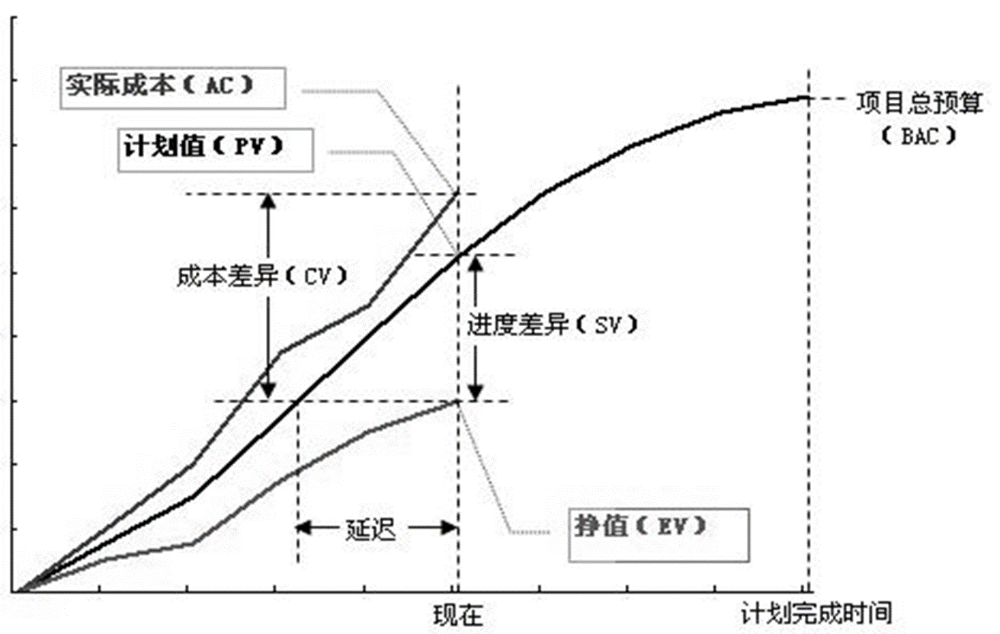

# 4 估算、计划和跟踪

## 4.1 估算

### 4.1.1 估算概述

估算的目的：为决策提供依据

估算的对象：规模、时间和日程

估算的常见困惑与挑战：①项目交付日期、团队组成等都确定了，估算的意义在哪里？②哪种估算方法好？③哪个估算结果更好（靠谱）？④究竟该如何做好估算？

关于估算的一些事实：①估算是主观猜测；②估算能力很难提升；③无人知晓准确数字；④估算模型的有效性有限

### 4.1.2 估算方法：PROBE

规模度量/估算的困境（LOC vs. FP）：

- 精确度量方式往往不便于早期规划/估算
- 有助于早期规划/估算的度量往往难以产生精确度量结果

PROBE 的作用：**精确度量**和**早期规划**之间的桥梁

PROBE 相对大小矩阵

PROBE 估算流程：

概要设计：是估算第一步。与已有产品/组件关联，定义产品元素，估算构造物的规模。对于大多数的项目，概要设计都应相对较快地完成

- 确定产品功能及所需程序组件/模块
- 与以前编写的程序比较，估算规模
- 综合估算总规模
- “如果你对产品的理解还不足以产出一个概要设计,那么你所知道的还不足以做出一个计划” 

**整合多个估算结果**：

- 整合一个开发人员做的多个估算：
  - 累积各个部分的估算
  - 进行一次线性回归计算
  - 计算一个预测区间
- 多个开发人员可以整合独立进行的估算，通过以下方式：
  - 进行单独的线性回归预测
  - 将计划的规模或者时间相加
  - 将个人范围的平方相加，再对其计算平方根获得预测区间
- **整合多个估算结果之后的估算误差**：当估算多个部件时，总的误差会比各个部件误差的总和要小（①误差趋于抵消了；②假设没有共同的偏差）
- **估算要点之一：尽可能划分详细一些**

### 4.1.3 SCRUM 和故事点（Story point）

定义：度量实现一个故事（Story）需要付出的工作量

特点：

- 抽象性：混合了对于开发特性（feature）所要付出的努力、开发复杂度、个中风险以及类似东西
- 相对性：设定标准之后，考虑其他特性（feature）与标准之间的相对大小关系

**估算要点之二：目标是建立对结果的信心**

**估算要点之三：尽量依赖数据**

### 4.1.4 关于估算方法的反思

**估算要点之四：估算要的是过程，而非结果；估算的过程是相关干系人达成一致共识的过程**

到底怎么做估算？

- 最终目标是达成共识
- 建立信心：足够详细 ；依赖数据 ；最好的猜测（注意检验猜测所依据的假设）

### 4.1.5 历史数据的获取——度量

关于度量的争议：体现决策者对目标的关切程度

GQM（Goal Question Metric）和 GQM+度量体系构建

PSP（Personal Software Process）基本度量项：规模、时间、缺陷、日程（TSP）

PSP时间度量（时间日志）：记录序号、所属阶段、开始/结束时间、中断时间、净时间、备注

时间日志示例

PSP缺陷度量（缺陷日志）：记录序号、发现日期、注入/消除阶段、消除时间、关联缺陷、简要描述

## 4.2 计划和跟踪

### 4.2.1 团队项目规划

#### 工作分解结构（WBS - Work Breakdown Structure）

创建 WBS 方法：

- 识别和分析可交付成果及相关工作
- 确定工作分解结构的结构与编排方法
- 自上而下逐层细化分解
- 为工作分解结构组成部分制定和分配标志编码
- 核实工作分解的程度是必要且充分的

好的 WBS 检查标准：

- 最底层要素不能重复，即任何一个工作包应该在WBS中的一个地方且只应该在WBS中的一个地方出现
- 所有要素必须清晰完整定义，即相应的数据词典必须完整定义
- 最底层要素必须有定义清晰的责任人，可以支持成本估算和进度安排
- 最底层的要素是实现目标的成分必要条件，即项目的工作范围得到完整体现

#### 开发策略与计划

明确各产品组件获得方式与顺序，建立团队共识

注意事项：①WBS 使用、②产品组件开发顺序、③获得方式考虑

#### 过程框架

**生命周期模型**：

**通用计划框架**：

#### 日程/质量/风险计划等

**日程计划原理和方法**：

- 任务计划和日程计划 
- 典型流程：估算规模 → 估算资源 → 规划日程 
- 示例：任务清单（任务、所需时间、累计时间） ，资源清单（日期、可用时间、累计时间） ，日程计划（任务、所需时间、累计时间、完成日期）

**质量计划原理和方法**：

- 确定质量保证活动（个人/团队评审、单元/集成/系统/验收测试等）
- 关键问题：开展哪些活动，活动程度（时间、人数、目标）

**风险计划**：

- 目的：识别潜在问题，规划实施风险管理活动以消除负面影响
- 主要部分：
  - 风险识别：
    - 识别成本/进度/绩效风险，审查环境因素，审查WBS组件，审查项目计划组件
    - 记录风险内容/条件/结果，识别干系人，评估风险，分类分组并排列优先级
  - 风险应对：制定风险管理策略——风险转嫁、风险解决、风险缓解

**计划评审和各方承诺**：

- 与相关干系人评审，解决矛盾不一致，获得各方承诺
- 识别计划所需支持并协商承诺，记录承诺，适时与资深管理层审查承诺

### 4.2.2 团队项目跟踪与管理

**项目跟踪意义**：

- 了解项目进度，以便在与计划产生严重偏离时采取纠正措施
- 参照物是项目计划
- 管理针对偏差的纠偏措施

#### 挣值管理（EVM - Earned Value Management）

客观度量项目进度的方法

每项任务附以价值，100%完成获相应价值

采用与进度计划、成本预算、实际成本相关的三个独立变量进行绩效测量

实现方式：简单、中级、高级

图示：

常用 EVM 度量：

- $BAC$ 表示按照 PV 值的曲线，当项目完成的时候所需预算或者时间
- 成本差异 $CV = EV-AC$
- 成本差异指数 $CPI = EV/AC$
- 日程偏差 $SV = EV – PV$
- 日程偏差指数 $SPI = EV/PV$
- 预计完成成本 $EAC = AC+(BAC-EV)/CPI = BAC/CPI$

EVM 应用示例（TSPi 周总结表）

另外一种 EVM 的变形——燃尽图

EVM 的局限性：

- 一般不能应用软件项目质量管理
- 需定量化管理机制，限制在探索型项目及部分敏捷方法中应用
- 完全依赖项目准确估算，项目早期难准确估算

#### 里程碑评审

标记某项工作完成或阶段结束的时间点

审查内容：①项目承诺（日期、规格、质量等）；②计划执行状况；③当前状态；④面临风险

其他计划跟踪：日程计划、承诺计划、风险计划、数据收集计划、沟通计划跟踪

#### 纠偏活动管理

典型活动：偏差原因分析、纠偏措施定义、纠偏措施管理

## 4.3 项目总结

**项目总结的意义**：

- 持续改善对软件工程师的重要性
- 避免重复犯错
- 系统化总结经验教训、评估团队绩效、积累过程数据，提供持续学习改进机会

**项目总结过程**：

- 需要系统化有条理，事先定义总结过程
- 一般包括：准备阶段、总结阶段、报告阶段

**基于 PMBOK 的总结**：

- 范围管理：关注需求开发与变更管理得失，未识别需求，未响应变更，需求蔓延
- 时间管理：关注日程计划准确性及里程碑偏差，估算偏差，计划变更原因
- 成本管理：关注成本估算、预算和控制，计划投入总时间与实际对比，偏差原因
- 质量管理：关注质量政策、目标与职责，项目整体质量，验收测试缺陷率，前期消除缺陷方法
- 项目人力资源管理：关注团队组织、管理与领导，生产效率（项目/个人），成员满意度，提升办法
- 项目沟通管理：关注信息及时生成、收集、发布、存储、调用与处置，沟通导致的问题，沟通手段有效性
- 项目风险管理：关注风险管理规划、识别、分析、应对与监控，未预料风险原因，有效应对措施，高频风险，经验教训，机会
- 采购管理：关注外部采购产品、服务或成果，方案合理性，工具合用性，供应商评价，成本风险，合同管理经验
- 整合管理：关注过程识别、定义、组合、统一与协调，计划间协调性，团队章程执行，变更处理流程有效性，产物保存，组织过程资产更新

**TSP 项目总结介绍**：

- 团队成员结合角色总结得失，提出改进建议
- 典型角色：项目组长、计划经理、开发经理、质量经理、过程经理和支持经理

**TSP总结过程阶段**：准备阶段 → 过程数据总结 → 人员角色评价 → 总结报告

**过程数据评审阶段**：

- 过程/质量经理带领分析数据，识别改进机会
- 结合角色讨论改进领域（领导力、计划准确性、过程优劣、质量管理、开发环境、配置管理等）
- 评价 TSP 教练作用
- 要求成员整理过程改进提案（PIP）

**人员角色评审（TSP）**：

- 项目组长：从领导力角度开考察团队的表现
  - 关注团队激励和团队承诺
  - 需要总结项目会议的组织情况
  - 提出关于“如何在下一周期做得更好”改进建议
- 计划经理：关注项目进度，需要就**估算、生产效率、里程碑**等话题进行总结——PV 与EV 趋势，与前期对比，提升方法
- 开发经理：
  - 从**开发内容和开发策略**角度出发，总结得失——需求实现，策略有效性
  - 就**质量**话题提出见解——设计实现对质量目标支持，可用性/性能/兼容性支持，质量度量效果
- 质量经理：从**项目整体质量状况**出发，总结质量目标的实现过程，并找出**改进机会**——项目整体质量（目标实现），质量活动开展，质量趋势，各阶段yield，测试后缺陷及前期排除，质量管理手段效果
- 过程经理：关注团队**遵循过程的程度**和**过程改进方案**——数据记录遵循情况，过程数据说明，过程不足，PIP提交与实现，过程调整
- 支持经理：关注**配置管理状况、问题和风险跟踪机制**以及**复用策略**的支持等话题——开发环境，配置项变更，授权修改，风险问题处理，未识别风险，复用比例与改进
- 工程师（大部分角色经理兼任）：关注**个人的绩效**（**生产效率、质量水平**等）——个人绩效（计划与实际对比，与上周期对比），改进方法，值得改进的PIP内容

## 思考题

1. 对比TSP和SCRUM，下列说法不恰当的是：

   A. 都是过程框架，需要填补具体实践之后才是一个可以工作的过程

   B. 一种是计划驱动方法，另外一种是敏捷方法

   C. SCRUM适合迭代式场景，TSP适合瀑布场景

   D. 两种方法都需要进行度量数据收集、分析，从而支持管理决策

2. 以下特征适用麦克勒格Y理论（McGregors Theory Y）激励的场合是：

   A. 关注工作环境，薪金等；

   B. 更喜欢经常的指导，避免承担责任，缺乏主动性

   C. 自我中心，对组织需求反应淡漠，反对变革

   D. 能够自我约束，自我导向与控制，渴望承担责任

3. 以下关于马斯洛的需求层次理论描述**不正确**的是：

   A. 自我实现是寻求自尊（Esteem）的前提

   B. 激励来自为没有满足的需求而努力奋斗

   C. 低层次的需求必须在高层次需求满足之前得到满足

   D. 满足高层次的需求的途径比满足低层次的途径更少

4. 以下关于团队动力学的论述，**不恰当**的是：

   A. 马斯洛的需求层次理论主要用途是维持激励水平

   B. 智力工作的激励方式中，应该尽可能使用鼓励承诺这种方式

   C. 麦克勒格的X理论适合用马斯洛底层需求激励

   D. 海兹伯格的激励理论区分为内在因素和外在因素两种

5. 下列关于挣值管理方法的描述中正确的是：

   A. 挣值管理中进度的计算可以区分悲观和乐观两种方式；

   B. 挣值管理的简单、中级和高级实现三种方式中，只有高级实现才会涉及成本因素；

   C. 挣值管理与项目类型无关；

   D. 挣值管理不适用与需求频繁变更的软件项目管理当中

6. 下列指标中典型的风险参数有：

   A. 发生概率

   B. 影响程度

   C. 风险系数

   D. 触发阈值

