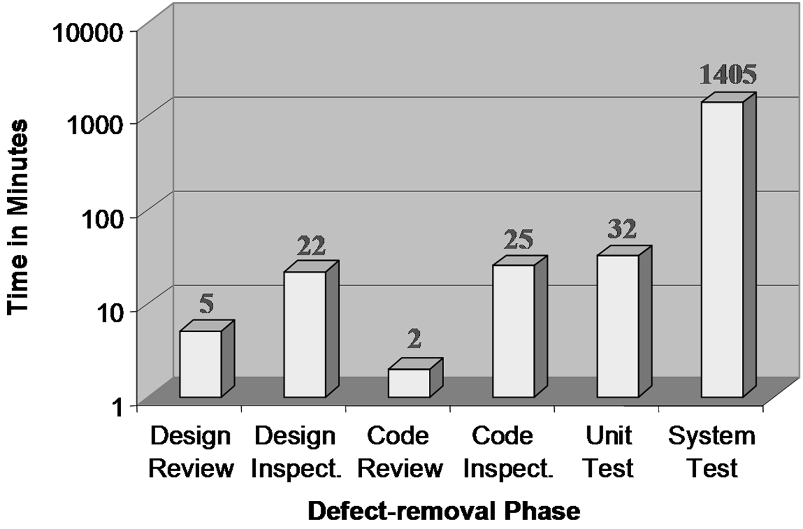
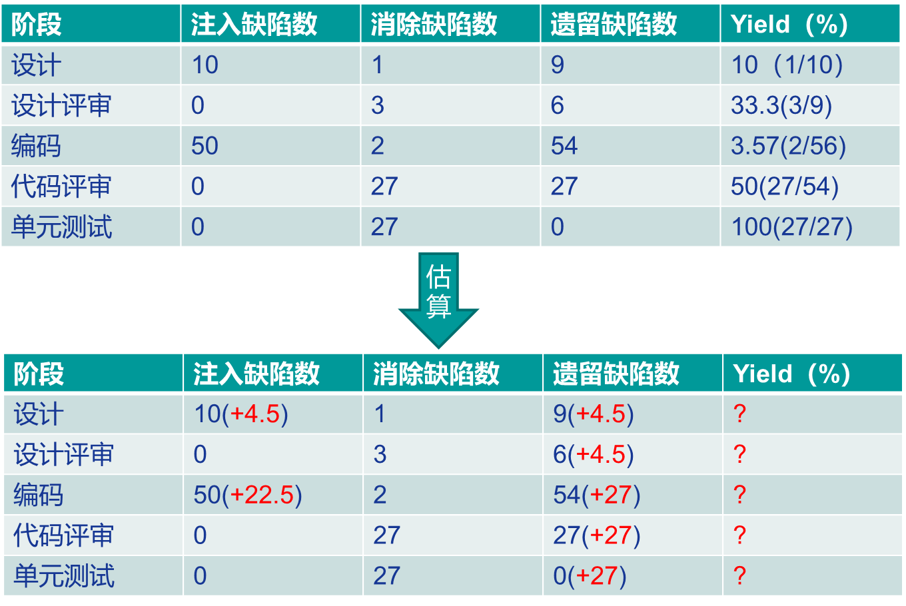
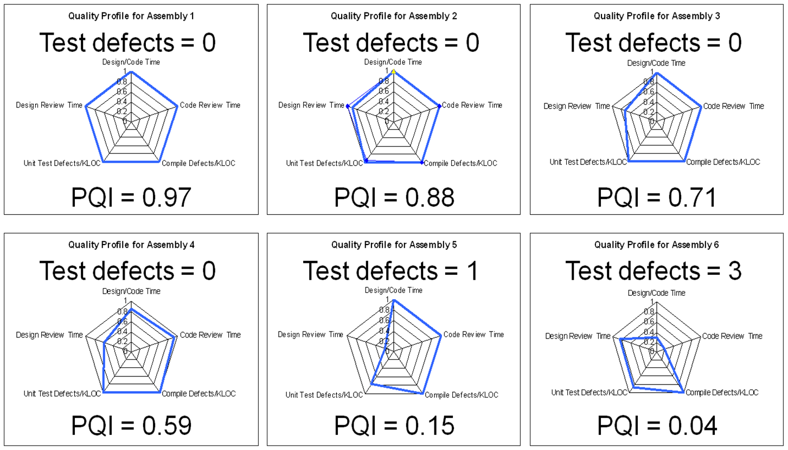
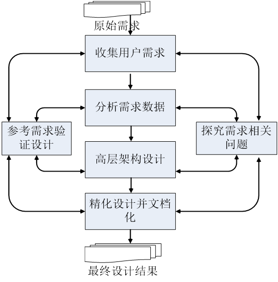
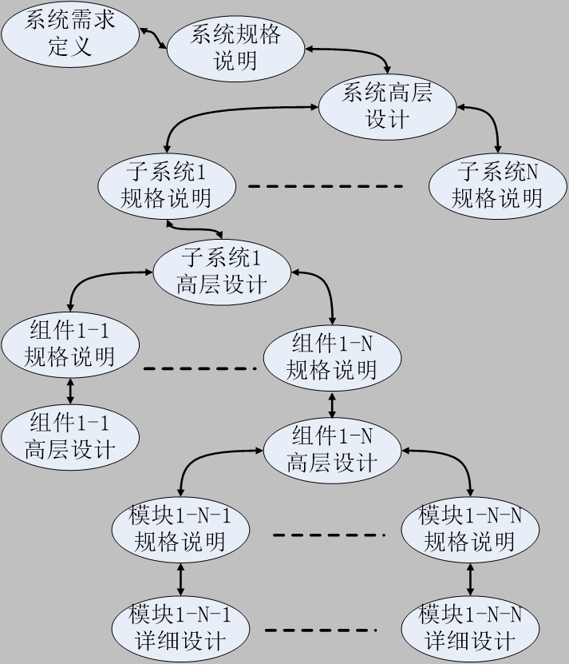
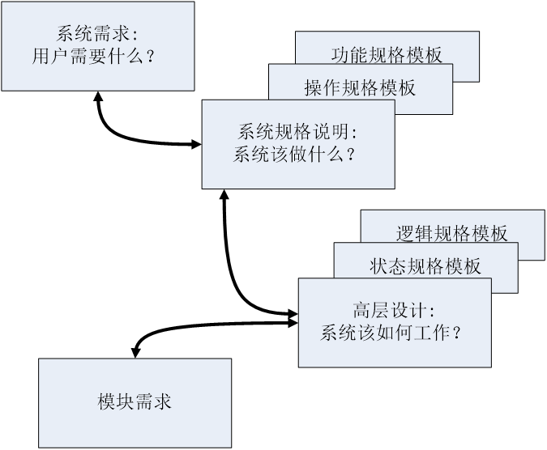
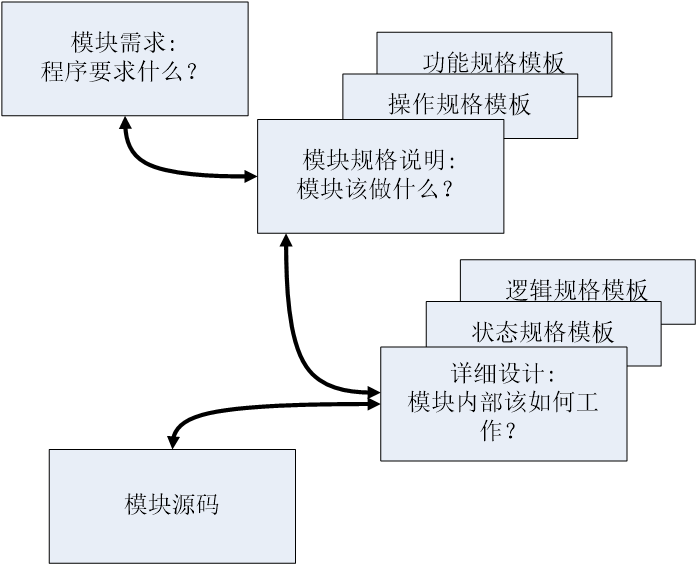

# 5 质量管理

## 5.1 质量策略

### 5.1.1 质量概念

- ANSI/IEEE Std 729 定义：与软件产品满足规定的和隐含的需求能力有关的特征或者特性的全体
- 《代码大全》观点：软件质量分为内部特性和外部特性
- Tom Demarco 观点：软件质量为软件产品可以改变世界，使其更加美好的程度；用户满意度是重要标准
- Gerald Weinberg 观点：软件质量为对人（用户）的价值，强调质量的主观性

### 5.1.2 面向用户的质量观

定义：质量为满足用户需求的程度

需明确的问题：

- 用户是谁？
- 用户需求的优先级是什么？ 
- 用户优先级对开发过程的影响？ 
- 如何度量此种质量观下的质量水平？

**典型用户质量期望**：

- 产品必须能够工作
- 较快的执行速度（期望）
- 在安全性、保密性、可用性、可靠性、兼容性、可维护性、可移植性等方面表现优异（期望）

### 5.1.3 质量管理策略

基本观点：

- 用缺陷管理来替代质量管理
- 高质量产品意味着组成产品的各个组件基本无缺陷

**缺陷消除效率**：

- 图示：不同缺陷消除方式（设计评审、设计检查、代码评审、代码检查、单元测试、系统测试）消除缺陷的时间（分钟）对比，系统测试耗时最长
  

- **测试消除缺陷的典型流程**：发现异常 → 理解工作方式 → 调试定位原因 → 确定修改方案 → 回归测试
- **评审发现缺陷典型流程**：遵循评审者逻辑理解程序 → 发现缺陷同时知道位置和原因 → 修正缺陷

**PSP 质量策略**：

- 各个组件的高质量是通过高质量评审来实现的
- **PSP 评审过程质量**：
  - 评审检查表
  - 质量控制指标
  - 其他因素：环境、评审时机、个人与小组评审
  - 缺陷预防

### 5.1.4 质量控制指标

#### Yield（产出率）

定义：度量每个阶段在消除缺陷方面的效率

- 阶段产出率（Phase Yield）公式为：
  $$
  \text{阶段产出率} = 100 \times \frac{\text{某阶段发现缺陷数}}{\text{某阶段注入缺陷数} + \text{进入该阶段前遗留缺陷数}}
  $$
  

- 过程产出率（Process Yield）公式为：
  $$
  100 \times \frac{\text{首次编译前发现缺陷数}}{\text{首次编译前注入缺陷数}}
  $$

- 缺陷在开发过程中注入和消除的示意图
  

- Yield 示例
  
- 估算交付物缺陷数——过程建模示例
  

#### A/FR（Appraisal to Failure Cost Ratio - 质检成本/失效成本比）

定义：A/FR = PSP质检成本 / PSP失效成本

测试缺陷数/千行代码（Test Defects/KLOC）与 A/FR 的关系：A/FR 越高，测试缺陷越少

A/FR 控制目标：理论上越大质量越高，但过高可能导致效率下降；PSP 中期望值为2.0

#### PQI（Process Quality Index - 过程质量指数）

5 个数据乘积：

- 设计质量：设计时间 > 编码时间
- 设计评审质量：设计评审时间 > 设计时间的 50%
- 代码评审质量：代码评审时间 > 编码时间的 50%
- 代码质量：编译缺陷密度 < 10 个/千行
- 程序质量：单元测试缺陷密度 < 5 个/千行

PQI 与交付后缺陷密度（Post-Development Defects/KLOC）的关系，PQI 越高，交付后缺陷越少

图示：PQI 与集成时缺陷数（Test defects）的关系，展示不同 PQI 值对应的测试缺陷数

#### Review Rate（评审速率）

定义：指导软件工程师开展有效评审的指标

高质量评审需要投入足够时间

PSP 实践标准：代码评审速度 < 200 LOC/小时，文档评审速度 < 4 Page/小时

#### DRL（Defect Removal Leverage - 缺陷消除效率比）

定义：比较不同缺陷消除手段的效率

计算方式：以某个测试阶段（通常为单元测试）每小时发现缺陷数为基础，其他阶段每小时发现缺陷数与该基础的比值

| **阶段** | 缺陷个数/小时 | DRL（UT） |
| -------- | ------------- | --------- |
| 设计评审 | 3.6           | 1.03      |
| 编码评审 | 8             | 2.29      |
| 单元测试 | 3.5           | 1         |

### 5.1.5 评审的其他考虑因素

打印后评审效果更好（屏幕展现有限，注意力问题）
评审时机选择：编译（单元测试）之前 vs. 之后
个人评审和小组评审：小组评审意义，先后顺序

### 5.1.6 质量路径（Quality Journey）

追求极高质量的手段（8 个步骤）：①各种测试；②进入测试之前的产物质量提升；③评审过程度量和稳定；④个体 review 的度量和稳定；⑤质量意识和主人翁态度；⑥诉诸设计；⑦缺陷预防；⑧用户质量观——其他质量属性

## 5.2 设计与质量的关系

### 5.2.1 设计的重要性

- 低劣设计是导致返工、不易维护、用户不满的主要原因
- 充分设计可显著减少程序规模，提升质量
- 设计本身也是一种排错的过程

### 5.2.2 典型设计过程

### 5.2.3 设计什么？

- 目标程序在整个应用系统中的位置
- 目标程序的使用方式
- 目标程序与其他组件及模块间的关系
- 目标程序外部可见的变量和方法
- 目标程序内部运作机制
- 目标程序内部静态逻辑

### 5.2.4 设计的内容

|          | 动态信息                 | 静态信息                     |
| -------- | ------------------------ | ---------------------------- |
| 外部信息 | 交互信息（服务、消息等） | 功能（继承、类结构等）       |
| 内部信息 | 行为信息（状态机）       | 结构信息（属性、业务逻辑等） |

### 5.2.5 PSP 设计模板

操作规格模板（OST - Operational Specification Template）

- 描述系统与外界交互（正常与异常）
- 用于定义测试场景/用例，与用户讨论操作需求

功能规格模板（FST - Functional Specification Template）

- 描述系统对外接口（静态信息），如类、继承关系、外部可见属性和方法
- 强调消除二义性，建议使用形式化符号

状态规格模板（SST - State Specification Template）

- 精确定义程序所有状态、状态间转换及转换伴随动作
- 需描述状态名称/描述、参数/方法、转换条件、转换动作

逻辑规格模板（LST - Logical Specification Template）

- 精确描述系统内部静态逻辑，建议用伪代码配合形式化符号
- 需描述关键方法静态逻辑、调用、外部引用、关键数据类型和定义

**PSP 设计模板展现的信息**：

|          | 动态信息 | 静态信息 |
| -------- | -------- | -------- |
| 外部信息 | OST/FST  | FST      |
| 内部信息 | SST      | LST      |

### 5.2.6 UML 常用图与 PSP 设计模板的关系

**UML 常用图**：用例图、时序图、类图、状态机图

**UML 与 PSP 设计模板的关系**：

- 用例图、时序图提供与 OST 同样信息
- 时序图、类图描述的类间关系及对象交互信息在 PSP 模板中无对应
- 类图记录方法型构但无行为描述，FST 有相应内容
- LST 描述程序静态逻辑，UML 无对应图示
- UML 状态图与 SST 类似，但 SST 描述的状态、转换条件、动作无对应 UML 图示

### 5.2.7 设计的层次

**设计层次与 PSP 模板对应**：

- 系统层面
  

- 模块层面：
  