# 1. 过程线

## 1.1 概念

### 1.1.1 管理是什么？

管理的三大关键要素：目标、状态、纠偏

**软件项目管理**

- 定义：应用方法、工具、技术以及人员能力来完成软件项目，实现项目目标的过程
- 典型的三大目标：成本、质量、工期
- 核心活动：估算、计划、跟踪、风险管理、范围管理、人员管理、沟通管理等

### 1.1.2 管理视角的软件工程

软件工程是一门研究用工程化方法构建和维护有效的、实用的和高质量的软件的学科

核心问题（软件工程的管理视角关注）：“成功是否可以复制？”

管理对象是软件过程

管理的目的：为了让软件过程在开发效率、质量等方面有着更好性能绩效。

与产品生产管理的类比：流水线的设计、建设、维护、优化以及升级改造。

区分：

* 软件项目管理（如 SCRUM，Kanban 等）
* 软件过程管理（如 CMMI，SPICE 等）

### 1.1.3 软件过程 vs. 生命周期模型

**软件过程**：

* 定义：是为了实现一个或者多个事先定义的目标而建立起来的一组实践的集合
* 特点：这组实践之间往往有一定的先后顺序，作为一个整体来实现事先定义的一个或者多个目标

- 广义软件过程

  - 理论基石：软件产品和服务的质量，很大程度上取决于生产和维护该软件或者服务的过程的质量

  - 构成要素：包括技术、人员以及狭义过程

  * 同义词：软件开发方法、软件开发过程

  * 示例：净室 Cleanroom 方法、极限编程方法、SCRUM 方法、Gate 方法；更一般的，敏捷软件过程/方法、轻量型过程/方法以及重型过程/方法等

**生命周期模型**：

- 生命周期模型是对一个软件开发过程的人为划分
- 生命周期模型是软件开发过程的主框架，是对软件开发过程的一种粗粒度划分
- 生命周期模型往往不包括技术实践
- 典型生命周期模型：瀑布模型、迭代式模型、增量模型、螺旋模型、原型法等

#### 迭代式

大型软件系统的开发过程也是一个逐步学习和交流的过程，软件系统的交付不是一次完成，而是通过多个迭代周期，逐步来完成交付

#### 瀑布模型

Royce 的瀑布模型将软件开发过程划分为系统需求、软件需求、分析、程序设计、编码、测试、运行等阶段
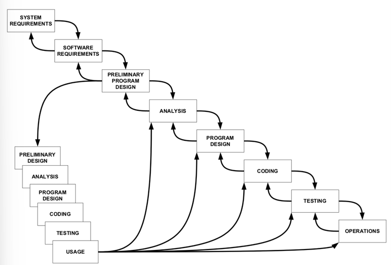

简化的瀑布模型图示（需求、设计、实现、验证、维护）

存在问题：瀑布模型成为一个重文档，慢节奏的过程

适用于需求明确、变更少的项目，但在软件成为独立产品阶段，面对需求多变的市场压力显得不足

## 1.2 软件过程管理

管理对象：软件过程

管理的目的：为了让软件过程在开发效率、质量等方面有着更好性能绩效

与软件项目管理（如SCRUM, Kanban）和产品生产管理（流水线设计等）并列

软件过程管理参考模型 CMM/CMMI, SPICE等

软件过程改进参考元模型 PDCA，IDEAL

### 1.2.1 PDCA 和 IDEAL

**PDCA（Plan-Do-Check-Act）**：
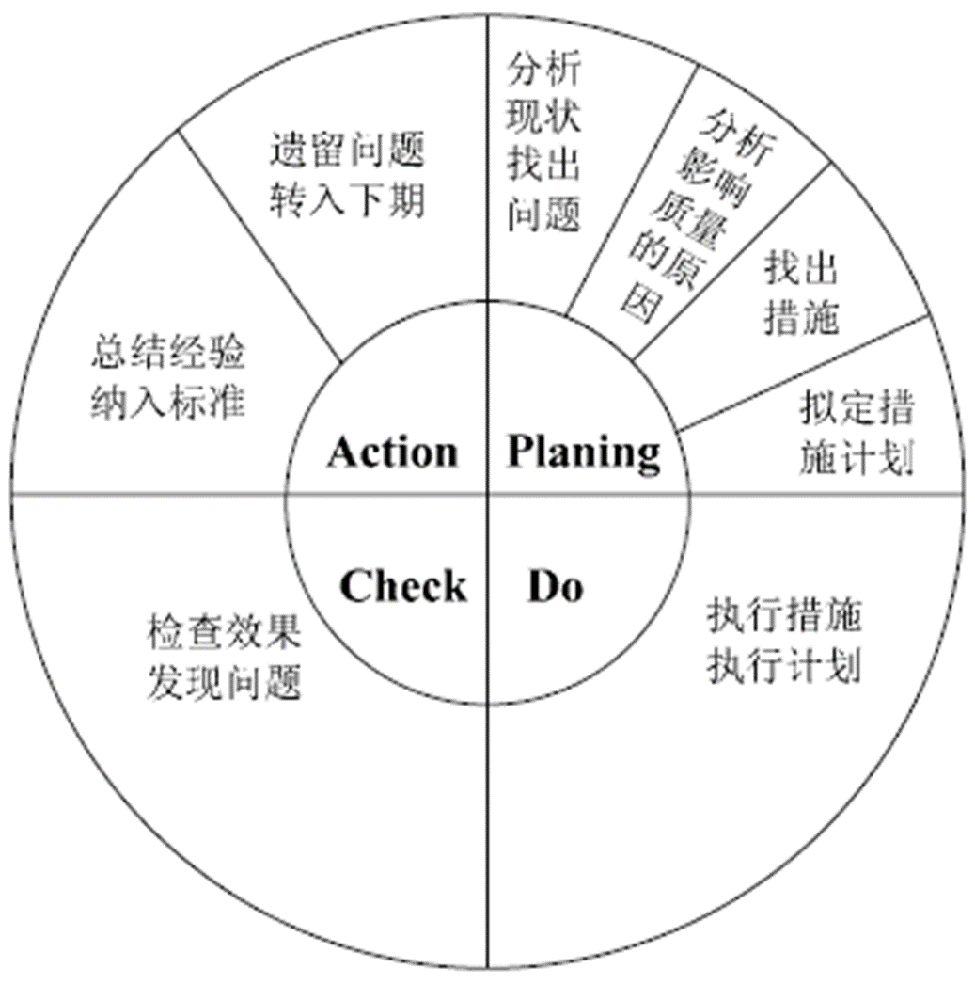

- Plan：拟定措施计划，找出措施，分析原因，分析现状，找出原因
- Do：执行措施，执行计划
- Check：检查效果，发现问题
- Action：总结经验、纳入标准，遗留问题转入下期

**IDEAL**：
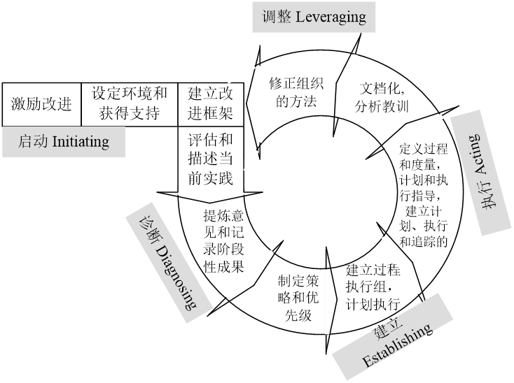

- I（Initiating - 启动）：激励改进，设定环境和获得支持，建立改进框架
- D（Diagnosing - 诊断）：评估和描述当前实践，提炼意见和记录阶段性成果
- E（Establishing - 建立）：制定策略和优先级，建立过程执行组，计划执行
- A（Acting - 执行）：定义过程和度量，计划和执行指导，建立计划、执行和追踪的机制，文档化，分析教训
- L（Leveraging - 调整）：修正组织的方法

### 1.2.2 CMM / CMMI

CMM（成熟度模型 Capability Maturity Model）

* Level 1：Initial（初始级）：过程不可预测，控制不良，被动反应
* Level 2：Managed（管理级）：过程为项目服务，常常是被动反应
* Level 3：Defined（定义级）：过程为组织服务，是主动的（项目从组织标准中定制过程）
* Level 4：Quantitatively Managed（量化管理级）：过程被度量和控制
* Level 5：Optimizing（优化级）：关注过程改进

* 关于 CMMI 的讨论：
  * CMMI 是过程改进模型而非软件过程或者软件过程模型
  * CMMI 不是过程优劣的标准，也不适合用作公司之间的能力比较

## 1.3 软件工程演变的历史视角

### 1.3.1 软件危机和软件工程

**软件危机**：

- 指落后的软件生产方式无法满足迅速增长的计算机软件需求，从而导致软件开发与维护过程中出现一系列严重问题的现象
- "Code and fix" 不适合大型软件项目开发，是导致软件危机的原因之一

**软件工程**：

- 一门研究用工程化方法构建和维护有效的、实用的和高质量的软件的学科
- 提出是为了解决软件危机，引入工程化的思想和方法进行软件开发

软件工程的两大视角：

* 管理视角——能否复制成功？
* 技术视角——是否可以将问题解决得更好？

### 1.3.2 软件发展三大阶段

第一阶段：软硬件一体化阶段（50年代~70年代）

* 软件完全依附于硬件
* 软件作坊

第二阶段：软件成为独立的产品（70年代~90年代）

第三阶段：网络化和服务化（90年代中期迄今）

#### 第一阶段：软硬件一体化

**软件完全依附于硬件时期**：

* 软件应用典型特征：①软件支持硬件完成计算任务；②功能单一；③复杂度有限；④几乎不需要需求变更

* 软件开发典型特征：①硬件昂贵；②团队以硬件工程师和数学家为主

* 典型软件过程和实践：

  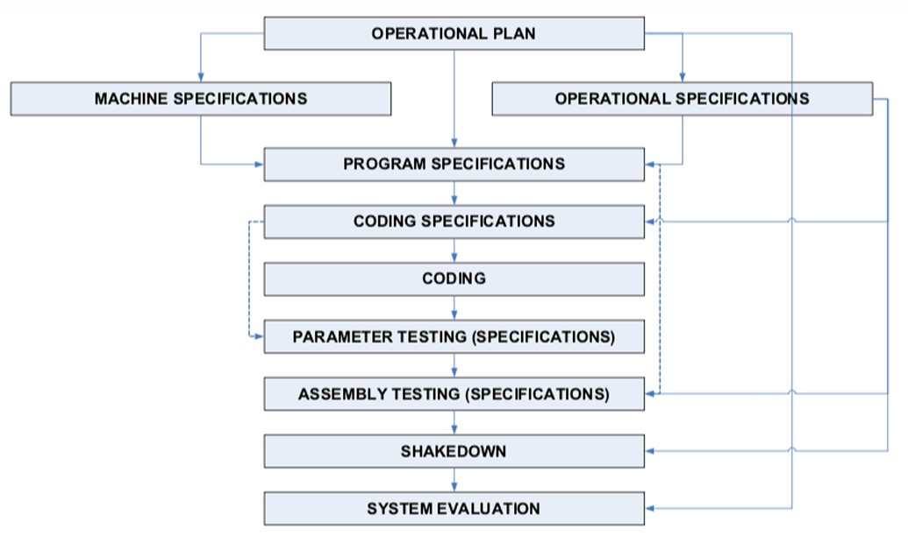

  * SAGE 软件开发过程图示（类似硬件开发过程）
  * 包含操作计划、机器规格、操作规格、程序规格、编码规格、编码、参数测试、汇编测试、振荡期、系统评估等阶段

  * 理念："Measure twice，cut once"（三思而后行）

**软件作坊时期**：

* 软件应用典型特征：①功能简单；②规模小
* 软件开发典型特征：①许多非专业领域的人员涌入软件开发领域；②高级程序语言出现；③质疑权威文化盛行
* 典型软件过程和实践："Code and fix"（编码和修复）

* **软件危机和软件工程的提出**："Code and fix" 不适合大型软件项目开发

#### 第二阶段：软件成为独立产品

软件应用特征：①摆脱了硬件束缚（操作系统出现）；②功能强大；③规模和复杂度剧增；④个人电脑出现→普通人成为软件用户（需求多变、兼容性要求）；⑤来自市场的压力

典型软件过程和实践：

* 方法 1：**形式化方法**

* 方法 2：**结构化程序设计和瀑布模型**

* **面向对象思想**

  

* **成熟度模型（CMM ：Capability Maturity Model）**

#### 第三阶段：网络化和服务化

软件应用特征：①功能更复杂，规模更大；②用户数量急剧增加；③快速演化和需求不确定；④分发方式的变化（SaaS）

典型软件过程和实践：

* **迭代式开发**：逐步学习、交流和交付
* **敏捷方法（雪鸟会议和敏捷宣言）**
* **XP，SCRUM，Kanban**
* **开源软件开发方法**
* **DevOps**
  * 方法论基础是敏捷软件开发、精益思想以及看板Kanban方法
  * 以领域驱动设计为指导的微服务架构方式
  * 大量虚拟化技术的使用
  * 一切皆服务 XaaS（$X$ as a Service）的理念指导
  * 构建了强大的工具链，支持高水平自动化

#### 敏捷宣言

在“网络化和服务化”阶段出现的重要理念

核心价值观：

* 个体和互动 胜过 流程和工具

* 可以工作的软件 胜过 详尽的文档

* 客户合作 胜过 合同谈判

* 响应变化 胜过 遵循计划

* 强调左项比右项更有价值

* 敏捷方法的五个层次图示（价值观、原则、方法、实践、工具）
  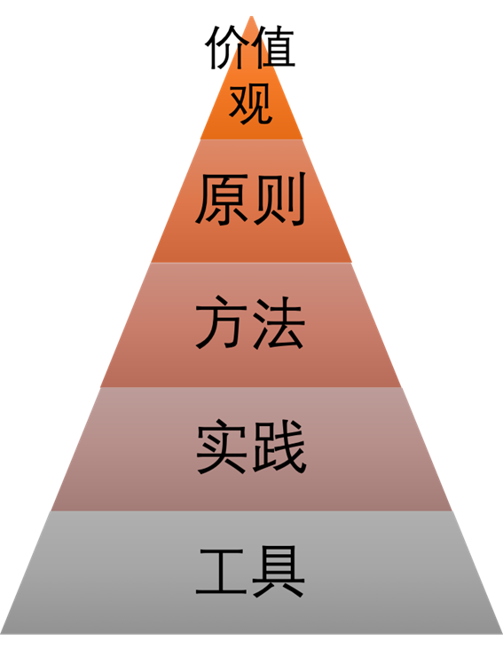
  - **价值观**：对软件开发本质和产业本质的认识；敏捷宣言；简单、反馈、沟通、勇气、尊重等
  
  - **原则**：快速反馈、及早交付有价值的软件、以简洁为本等
  
  - **方法**：Extreme Programming（XP），Scrum，Kanban 等
  
  - **实践**：TDD（测试驱动开发），CI（持续集成），Pair Programming（结对编程），Refactoring（重构） 等
  
  - **工具**：Taskboard（任务板），Bug Tracker（缺陷跟踪系统），Unit test tool（单元测试工具） 等

敏捷方法举例：

* XP（eXtreme Programming）：偏重于一些工程实践的描述
* SCRUM：管理框架和管理实践
* Kanban（看板）：精益生产的具体实现，可视化工作流、限定WIP、管理周期时间

### 1.3.3 驱动力：本质难题

软件开发的本质难题：不可见性（Invisibility）复杂性，（Complexity），可变性（Changeability），一致性（Conformity）

对本质难题的进一步分析：

* 三个本质难题（应指复杂性、可变性、一致性，结合上下文理解，不可见性是另一个维度）因项目而异
* 四大本质难题相互促进
* 本质难题的变化带动软件方法（过程）演变

# 2. 项目管理线

## 2.1 项目管理线

软件项目管理是应用方法、工具、技术以及人员能力来完成软件项目，实现项目目标的过程

软件项目管理的典型**三大目标**：**成本、质量、工期**

## 2.2 团队动力学

### 2.2.1 知识工作特点

**软件开发的特性**：

- 复杂且富有创造性的知识工作
- 智力劳动：处理抽象概念，整合不可见部分为可工作系统

**对工程师的要求**：全身心参与，主观意愿追求卓越

**对管理者的要求**：

- 激励并维持激励
- 激励手段与维持激励手段

#### 知识工作管理

**核心**：管理者无法管理工作者，知识工作者必须实现并学会自我管理

**知识工作者自我管理的前提**：①有积极性；②能做出准确的估算和计划；③懂得协商承诺；④有效跟踪计划；⑤持续按计划交付高质量产物

**对软件工程（SE）带来的改变与思考**：①团队协作模式；②领导者特质与激励方式；③估算、计划、跟踪及敏捷开发中的心理因素；④UML 技术隐含的心理因素等

#### 领导者和特点

知识工作者的管理需要的是领导者，而不是经理

领导者区别于经理：

| 角色经理 | 团队领导者   |
| -------- | ------------ |
| 告知     | 倾听         |
| 指导     | 询问         |
| 说服     | 激励/挑战    |
| 决定     | 促进达成一致 |
| 控制     | 教练         |
| 监控     | 授权         |
| 设定目标 | 挑战         |

#### 不同的激励方式

**领导者激励手段**：威逼、利诱、鼓励承诺

- 交易型领导方式：承诺奖励激励（威逼 & 利诱属于此类）
- 转变型领导方式：用成就激励（鼓励承诺属于此类）
- 转变型领导方式是成功且有创造性团队的首选

**承诺形式的激励**：

- 个人对待承诺的差异：认真 / 轻率
- 当满足以下情况，团队承诺比个人承诺的激励作用更大
  - 所有团队成员共同参与作出承诺
  - 团队依赖于每一位成员履行自己的承诺
- 有效团队承诺的要素：自愿、公开、可信、向团队承诺

**维持激励水平**：

- 需要及时的绩效反馈
- 反馈内容：
  - 根据一个详细计划衡量进度
  - 当前计划不准确时重做计划
  - 为漫长而富有挑战性的项目提供中间反馈，即里程碑

**其他激励相关理论**：

- 海兹伯格的激励理论
  - 激励因素（内在）：成就感、责任感、晋升、被赏识认可
  - 保健因素（外在）：工作环境、薪金、工作关系、安全等

- 麦克勒格的 X 理论和 Y 理论
  - X 理论假设：员工不喜工作、缺进取心、需指导、自我中心（马斯洛底层需求激励）
  - Y 理论假设：员工在适当激励下能达高绩效、有创造力、能自我约束、渴望责任（马斯洛高层需求激励）
- 期望理论：激励公式：$M=V×E$（努力产生成功结果的信念 V，成功获得相应回报的信念 E）

#### 马斯洛需求层次理论

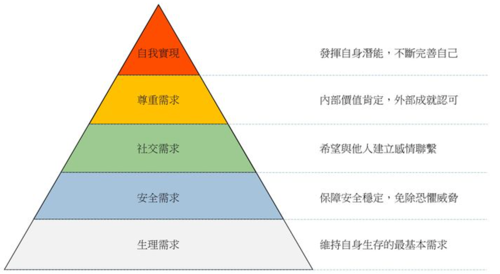

- 一个被满足的需求不再是激励因素
- 自我实现是最高的层次
- 激励来自为没有满足的需求而努力奋斗
- 低层次的需求必须在高层次需求满足之前得到满足
- 满足高层次的需求的途径比满足低层次的途径更为广泛

#### 期望理论

人们在下列情况下能够受到激励并且出大量成果

- 激励公式：$M=V×E$
- 相信他们的努力很可能会产生成功的结果（V - 价值或成功把握）
- 他们也相信自己会因为成功得到相应的回报（E - 期望或回报）

### 2.2.2 自主团队

**自主团队的特点**：

- 自行定义项目目标
- 自行决定团队组成形式及成员角色
- 自行决定项目开发策略
- 自行定义项目开发过程
- 自行制定项目开发计划
- 自行度量、管理和控制项目工作

#### 外部环境

**项目启动阶段**获得管理层支持：

- 体现满足管理层需求的工作态度
- 计划中体现定期向管理层报告的内容
- 向管理层证明工作计划的合理性
- 计划中体现追求高质量的工作
- 计划中允许必要的项目变更
- 向管理层寻求必要的帮助

**项目进展过程中**获得管理层支持 ： 

- 严格遵循定义好的开发过程
- 维护和更新个人计划和团队计划
- 对产品质量进行管理
- 跟踪项目进展，并定期向管理层报告
- 持续地向管理层展现优异的项目表现

#### TSP 角色和职责+TSP 启动过程

**TSP 与 PSP（Personal Software Process）的关系**：

- PSP 关注个人技能培养、个体过程度量、过程规范、估算计划、质量管理
- TSP 通过团队组建（项目目标、角色、过程、计划、平衡）和团队工作（沟通、协作、跟踪、风险、报告）实现自主团队

**TSP Launch（启动阶段会议流程）**：

- 第一次会议：建立产品目标（做什么）和业务目标（做得怎么样）
- 第二次会议：角色分配（怎么安排）和小组目标定义（有无与组织目标冲突）
- 第三次会议：开发流程定义（使用什么过程）与策略选择（迭代划分、组件获取）
- 第四次会议：整体计划（估算+计划，明确产出物、规模、资源需求）
- 第五次会议：质量计划（质量实践、程度、资源投入）
- 第六次会议：个人计划（个人做什么）以及计划平衡（寻求最早完成时间）
- 第七次会议：风险评估（what if?）
- 第八次会议：准备向管理层汇报计划（呼应首次会议要求，体现计划非粗制滥造）
- 第九次会议：向管理层汇报计划内容（汇报和讨论）
- Launch阶段总结：总结得失

**典型 TSP 角色**：

|                            | 目标                                                         | 典型技能                                                     | 工作内容                                                     |
| -------------------------- | ------------------------------------------------------------ | ------------------------------------------------------------ | ------------------------------------------------------------ |
| 项目组长（Team Lead - TL） | ①建设和维持高效率的团队 ②激励团队成员积极工作 ③合理处理团队成员的问题 ④向管理层提供项目进度相关的完整信息 ⑤充当合格的会议组织者和协调者 | ①天生的领导者 ②有能力识别问题的关键并且做出客观的决策 ③不介意偶尔充当“恶人” ④尊敬团队成员 | ①激励团队成员努力工作 ②主持项目周例会 ③每周汇报项目状态 ④分配工作任务 ⑤维护项目资料 ⑥组织项目总结 |
| 计划经理                   | ①开发完整的、准确的团队计划和个人计划 ②每周准确的报告项目小组状态 | ①做事有条理和逻辑 ②对于过程数据非常感兴趣，期待通过每周输入的数据来了解项目当前状况 ③认为计划非常重要，也愿意要求团队成员跟踪和度量他们的工作 | ①带领项目小组开发项目计划 ②带领项目小组平衡计划 ③跟踪项目进度 ④参与项目总结 |
| 开发经理                   | ①开发优秀的软件产品 ②充分利用团队成员的技能             | ①喜欢创造事物 ②愿意成为软件工程师，并且喜欢带领团队开展设计和开发工作 ③具备足够的背景可以胜任设计师的工作，并且可以领导设计团队开展工作 ④熟悉主流的设计工具 ⑤愿意倾听和接受其他人的设计思想 | ①带领团队制定开发策略 ②带领团队开展产品规模估算和所需时间资源的估算 ③带领团队开发需求规格说明 ④带领团队开发高层设计 ⑤带领团队开发设计规格说明 ⑥带领团队实现软件产品 ⑦带领团队开展集成测试和系统测试 ⑧带领团队开发用户支持文档 ⑨参与项目总结 |
| 质量经理                   | ①项目团队严格按照质量计划开展工作，开发出高质量的软件产品 ②所有的小组评审工作都正常开展，并且都形成了评审报告 | ①关注软件产品的质量 ②有评审方面的经验，熟悉各种评审方法 ③有协调组织有效评审的能力 | ①带领团队开发和跟踪质量计划 ②向项目组长警示质量问题 ③软件产品提交配置管理之前，对其进行评审，以消除质量问题 ④项目小组评审的组织者和协调者 ⑤参与项目总结 |
| 过程经理                   | ①所有团队成员准确的记录、报告和跟踪过程数据 ②所有的团队会议都有相应会议记录 | ①对过程定义、过程度量非常感兴趣 ②对过程改进非常感兴趣   | ①带领团队定义和记录开发过程并且支持过程改进 ②建立和维护团队的开发标准 ③记录和维护项目的会议记录 ④参与项目总结 |
| 支持经理                   | ①项目小组在整个开发过程中都有合适的工具和环境 ②对于基线产品，不存在非授权的变更 ③项目小组的风险和问题得到跟踪 ④项目小组在开发过程中满足复用目标 | ①对于各种开发工具很感兴趣，熟悉各类工具的适用场合 ②对版本控制工具很熟悉，也熟悉配置管理流程 ③对于本项目所有工具而言，你都是专家 | ①带领团队识别开发过程中所需要的各类工具和设施 ②主持配置管理委员会，管理配置管理系统 ③维护软件项目的词汇表 ④维护项目风险和问题跟踪系统 ⑤支持软件开发过程中复用策略的应用 ⑥参与项目总结 |

#### SCRUM 角色和职责

**产品负责人（Product Owner）**：

- 将开发团队开发的产品价值最大化
- 唯一负责管理产品待办列表（Product Backlog）的人
  - 清晰表述、排序列表项以实现目标
  - 优化开发团队工作价值
  - 确保列表可见、透明、清晰，显示下一步工作
  - 确保开发团队对列表项有足够理解

**开发团队（Development Team）**：

- 在每个 Sprint 结束时交付潜在可发布且“完成”的产品增量
- 自组织，自己管理工作
- 跨职能，拥有创建产品增量所需的全部技能
- 无特定头衔（均为开发人员） 
- 无子团队（如测试、架构等） 
- 成员可有特长，但责任属于整个团队

**SCRUM Master**：

- 总体职责：促进和支持 SCRUM，帮助理解其理论、实践、规则和价值；服务型领导
- 对外部：帮助外部了解如何与团队交互，改变交互方式以最大化价值
- 服务于产品负责人：确保理解目标范围、有效管理待办列表技巧、理解清晰列表项的必要性、理解经验主义产品规划、确保 PO 懂得最大化价值排序、理解实践敏捷性、引导 Scrum 事件
- 服务于开发团队：指导自组织与跨职能、帮助创造高价值产品、移除障碍、引导 Scrum 事件、在 Scrum 未完全采纳环境中指导
- 服务于组织：带领指导组织采纳 Scrum、规划实施、助员工和干系人理解实施 Scrum 和经验导向开发、引发提升生产率的改变、与其他 Scrum Master 协作增强应用有效性

特点：**跨职能、自组织**

## 2.3 估算和计划

### 2.3.1 估算概述

**估算目的是什么？**：为决策提供依据

**估算的对象**：规模、时间和日程

估算的常见困惑与挑战：①项目交付日期、团队组成等都确定了，估算的意义在哪里？②哪种估算方法好？③哪个估算结果更好（靠谱）？④究竟该如何做好估算？

关于估算的一些事实：①估算是主观猜测；②估算能力很难提升；③无人知晓准确数字；④估算模型的有效性有限

**估算要点**：

- 尽可能划分详细一些
- 目标是建立对结果的信心
- 尽量依赖数据
- 估算要的是过程，而非结果；估算的过程是相关干系人达成一致共识的过程

**怎么做估算？**

- 最终目标是达成共识
- 建立信心：足够详细；依赖数据；最好的猜测（注意检验猜测所依据的假设）

**抽象的、相对的估算**

SCRUM 中的 Story point 是一种抽象的度量，混合了努力、复杂度、风险等

- 抽象性：混合了对于开发特性（feature）所要付出的努力、开发复杂度、个中风险以及类似东西
- 相对性：设定标准之后，考虑其他特性（feature）与标准之间的相对大小关系

### 2.3.2 PROBE 估算方法

规模度量/估算的困境（LOC vs. FP）：

- 精确度量方式往往不便于早期规划/估算
- 有助于早期规划/估算的度量往往难以产生精确度量结果

PROBE 的作用：**精确度量**和**早期规划**之间的桥梁

原理示例：通过房屋中不同用途房间的相对大小（小型、中等、大型）和数量，结合相对大小矩阵（各类房间不同大小对应的具体面积），估算总面积

PROBE 相对大小矩阵

**PROBE 估算流程**：
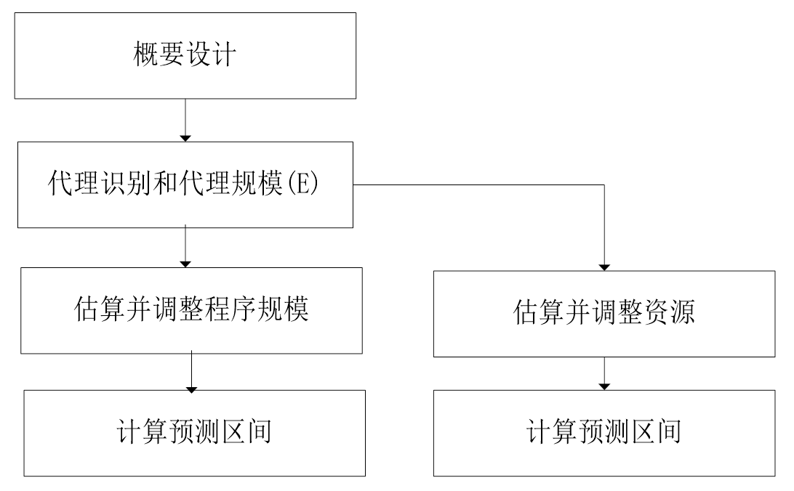

概要设计：是估算第一步。与已有产品/组件关联，定义产品元素，估算构造物的规模。对于大多数的项目，概要设计都应相对较快地完成

- 确定产品功能及所需程序组件/模块
- 与以前编写的程序比较，估算规模
- 综合估算总规模
- “如果你对产品的理解还不足以产出一个概要设计,那么你所知道的还不足以做出一个计划” 

**整合多个估算结果**：

- 整合一个开发人员做的多个估算：
  - 累积各个部分的估算
  - 进行一次线性回归计算
  - 计算一个预测区间
- 多个开发人员可以整合独立进行的估算，通过以下方式：
  - 进行单独的线性回归预测
  - 将计划的规模或者时间相加
  - 将个人范围的平方相加，再对其计算平方根获得预测区间
- **整合多个估算结果之后的估算误差**：当估算多个部件时，总的误差会比各个部件误差的总和要小（①误差趋于抵消了；②假设没有共同的偏差）

### 2.3.3 SCRUM 故事点

定义：度量实现一个故事（Story）需要付出的工作量

特点：

- 抽象性：混合了对于开发特性（feature）所要付出的努力、开发复杂度、个中风险以及类似东西
- 相对性：设定标准之后，考虑其他特性（feature）与标准之间的相对大小关系

对于估算过大的故事点需要进行拆分

### 2.3.4 通用计划框架

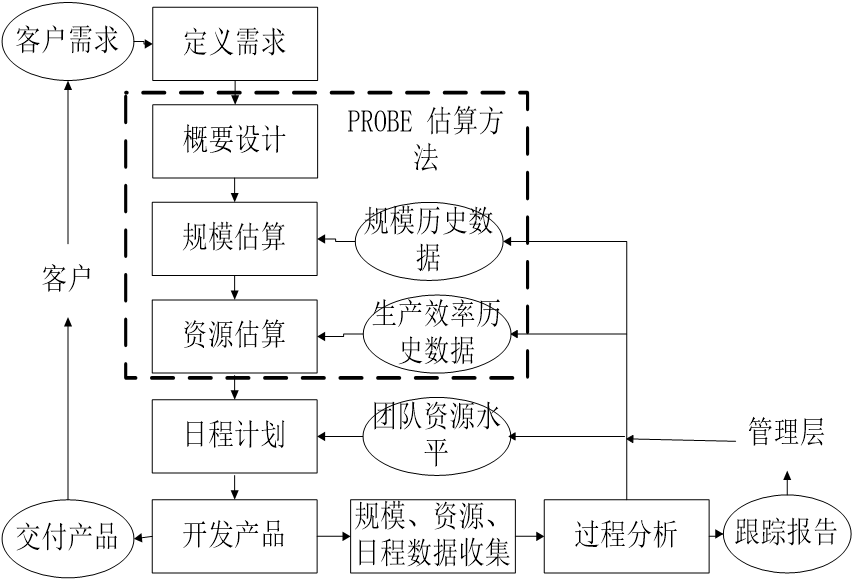

- 从客户需求出发，经过定义需求、概要设计、规模估算（使用PROBE方法，参考历史数据）、资源估算（参考历史数据），到日程计划（考虑团队资源水平），最终开发产品并交付
- 过程中收集规模、资源、日程数据，用于过程分析和跟踪报告，反馈给管理层和用于未来估算

### 2.3.5 各类计划

#### 工作分解结构（WBS - Work Breakdown Structure）

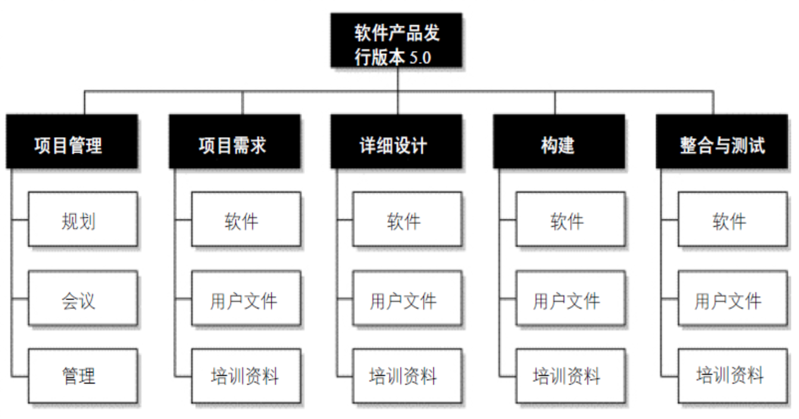

创建 WBS 方法：

- 识别和分析可交付成果及相关工作
- 确定工作分解结构的结构与编排方法
- 自上而下逐层细化分解
- 为工作分解结构组成部分制定和分配标志编码
- 核实工作分解的程度是必要且充分的

好的 WBS 检查标准：

- 最底层要素不能重复，即任何一个工作包应该在WBS中的一个地方且只应该在WBS中的一个地方出现
- 所有要素必须清晰完整定义，即相应的数据词典必须完整定义
- 最底层要素必须有定义清晰的责任人，可以支持成本估算和进度安排
- 最底层的要素是实现目标的成分必要条件，即项目的工作范围得到完整体现

#### 开发策略与计划

明确各产品组件获得方式与顺序，建立团队共识

注意事项：①WBS 使用、②产品组件开发顺序、③获得方式考虑

#### 过程框架

**生命周期模型**：
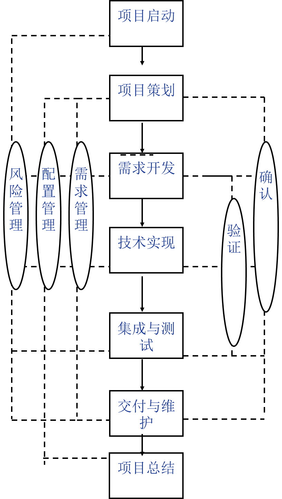

**通用计划框架**：

- 从客户需求出发，经过定义需求、概要设计、规模估算（使用PROBE方法，参考历史数据）、资源估算（参考历史数据），到日程计划（考虑团队资源水平），最终开发产品并交付
- 过程中收集规模、资源、日程数据，用于过程分析和跟踪报告，反馈给管理层和用于未来估算

#### 日程/质量/风险计划等

**日程计划原理和方法**：

- 任务计划和日程计划 
- 典型流程：估算规模 → 估算资源 → 规划日程 
- 示例：任务清单（任务、所需时间、累计时间） ，资源清单（日期、可用时间、累计时间） ，日程计划（任务、所需时间、累计时间、完成日期）

**质量计划原理和方法**：

- 确定质量保证活动（个人/团队评审、单元/集成/系统/验收测试等）
- 关键问题：开展哪些活动，活动程度（时间、人数、目标）

**风险计划**：

- 目的：识别潜在问题，规划实施风险管理活动以消除负面影响
- 主要部分：
  - **风险识别**：
    - 识别成本/进度/绩效风险，审查环境因素，审查WBS组件，审查项目计划组件
    - 记录风险内容/条件/结果，识别干系人，评估风险，分类分组并排列优先级
  - **风险应对**：制定风险管理策略——风险转嫁、风险解决、风险缓解

**计划评审和各方承诺**：

- 与相关干系人评审，解决矛盾不一致，获得各方承诺
- 识别计划所需支持并协商承诺，记录承诺，适时与资深管理层审查承诺

## 2.4 跟踪——挣值管理体系

**项目跟踪意义**：

- 了解项目进度，以便在与计划产生严重偏离时采取纠正措施
- 参照物是项目计划
- 管理针对偏差的纠偏措施

**挣值管理方法（EVM - Earned Value Management）**：客观度量项目进度的方法

基本原理：每项任务附以价值，100%完成获相应价值

采用与进度计划、成本预算、实际成本相关的三个独立变量进行绩效测量

**实现方式：简单实现、中级实现、高级实现**

图示：

常用 EVM 度量：

- $BAC$ 表示按照 PV 值的曲线，当项目完成的时候所需预算或者时间
- 成本差异 $CV = EV-AC$
- 成本差异指数 $CPI = EV/AC$
- 日程偏差 $SV = EV – PV$
- 日程偏差指数 $SPI = EV/PV$
- 预计完成成本 $EAC = AC+(BAC-EV)/CPI = BAC/CPI$

EVM 应用示例（TSPi 周总结表）

EVM 的局限性：

- 一般不能应用软件项目质量管理
- 需定量化管理机制，限制在探索型项目及部分敏捷方法中应用
- 完全依赖项目准确估算，项目早期难准确估算

**里程碑评审**：

- 标记某项工作完成或阶段结束的时间点

- 审查内容：①项目承诺（日期、规格、质量等）；②计划执行状况；③当前状态；④面临风险

- 其他计划跟踪：日程计划、承诺计划、风险计划、数据收集计划、沟通计划跟踪

**纠偏活动管理**：典型活动：偏差原因分析、纠偏措施定义、纠偏措施管理

**另外一种 EVM 的变形——燃尽图**：显示理想剩余任务量和实际剩余任务量随时间的变化
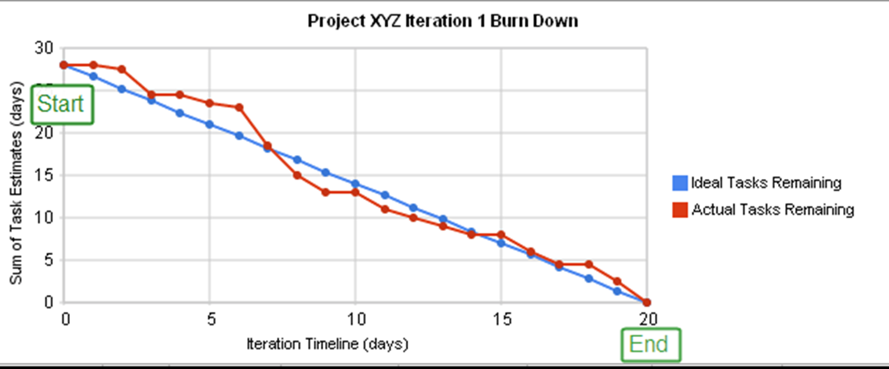

**EVM 为何适应软件项目**：

- EVM 提供了一种客观度量项目进度的方法
- 通过计划值（PV）、挣值（EV）和实际成本（AC）来跟踪项目绩效（进度和成本）
- 尽管有局限性，但其核心思想是通过量化数据来反映项目状态，有助于管理者进行决策和调整。对于有明确任务和价值定义的软件项目阶段或模块，EVM 可以有效应用

# 3. 质量管理线

## 3.1 概念

### 3.1.1 质量管理的挑战：三要素

“管理”的本质是通过 **设定目标（Target）**，**监控状态（State）**，并对目标和状态之间的偏差进行 **纠偏（Correction）**，以确保最终达成目标。将这个框架套用到质量管理上，其挑战也体现在这三个环节中。

1. **质量目标（Target）的挑战：难以定义和量化**

   设定的“目标”必须是清晰、可度量的，但在软件质量领域，这极具挑战性

   * **质量定义的主观性和多维性**：课件中提到，质量的定义多种多样，可以是“满足规定的和隐含的需求”，也可以是主观的“用户满意度”或“对用户的价值”。同时，用户对质量的期望是多维度的，包括功能正确、执行速度快，以及安全性、可靠性、兼容性等一系列非功能属性。为这些复杂、甚至相互冲突的期望设定一个统一、量化的目标非常困难。
   * **用“缺陷”作为目标的代理**：由于质量本身难以度量，课程提出的核心策略是“用缺陷管理来替代质量管理”，将目标简化为“高质量产品……意味着……基本无缺陷”。然而，这里的“基本无缺陷”依然是模糊的。“零缺陷”在现实中几乎不可能，那么允许多少缺陷？什么样的缺陷是致命的？如何量化这个目标，以便团队有明确的奋斗方向，是第一个巨大挑战。

2. **质量状态（State）的挑战：难以测量和观察**

   在明确了目标（即便是代理目标）后，管理者需要实时了解项目当前所处的“状态”，以判断与目标的差距

   * **软件的不可见性**：软件的一大本质困难就是“不可见性”。与物理产品不同，我们无法通过直观观察就判断出一段代码、一个模块或一个系统的质量状态。其内部的逻辑、结构和潜在缺陷都是隐藏的。

   * **依赖间接的度量指标**：为了解决不可见性问题，课程引入了一系列过程度量指标来间接反映质量状态，例如：
       * **Yield**：度量每个阶段的缺陷消除效率
       * **A/FR**：通过评审成本与修复成本的比率来判断投入是否合理
       * **PQI**：综合评估过程多方面质量的指数
       * **DRL**：比较不同缺陷消除活动的效率
       挑战在于，这些指标都是“代理”状态，而非真实状态。它们的准确性完全依赖于团队是否能严格、诚实地记录过程数据（如时间日志和缺陷日志）。建立这样一套定量化的管理机制本身就极具挑战性。

3. **质量纠偏（Correction）的挑战：成本高昂且治标不治本**

   当监控到的“状态”偏离“目标”时，就需要采取纠偏行动

   * **纠偏成本随阶段指数级上升**：课件明确指出，在软件生命周期的后期修复缺陷，其成本远高于在早期阶段。一个在系统测试阶段发现的缺陷，其修复时间可能是设计评审阶段的数百倍。因此，纠偏行动必须尽可能提前。课程提倡的纠偏核心手段是高效的“个人评审”和“小组评审”，因为评审发现并修正缺陷的流程远比测试高效

   * **系统性纠偏的困难**：仅仅修复发现的缺陷是“治标”，而真正的“纠偏”应该是“治本”，即改进过程，防止同类缺陷再次被注入。课件中的“Quality Journey”（质量路径）深刻体现了这一点。它的路径从基础的测试，到前期的评审，再到过程度量和稳定，最终诉诸于“设计”和“缺陷预防”。这表明，最高效的“纠偏”其实是“预防”。然而，推动团队从简单的“救火”（Fix a bug）模式转变为系统性的“防火”（Prevent a bug）模式，需要深刻的质量意识、严谨的过程和文化变革，这是质量管理中最根本的挑战

### 3.1.2 面向用户的质量观

定义：质量为满足用户需求的程度

需明确的问题：

- 用户是谁？
- 用户需求的优先级是什么？ 
- 用户优先级对软件产品的开发过程产生什么样的影响？
- 怎样来度量这种质量观下的质量水平？

**典型用户质量期望**：

- 产品必须能够工作
- 较快的执行速度（期望）
- 在安全性、保密性、可用性、可靠性、兼容性、可维护性、可移植性等方面表现优异（期望）

### 3.1.3 质量管理策略和背后逻辑

**核心策略**：用缺陷管理来替代质量管理

**逻辑基础**：

- 高质量产品意味着组成产品的各个组件基本无缺陷

- 各个组件的高质量是通过高质量评审来实现的

- **评审的高效性**：评审发现缺陷的成本远低于测试发现和消除缺陷的成本
  

  图示：不同缺陷消除方式（设计评审、设计检查、代码评审、代码检查、单元测试、系统测试）消除缺陷的时间（分钟）对比，系统测试耗时最长

- **评审发现缺陷的流程更直接**：

  - **测试消除缺陷的典型流程**：发现异常 → 理解工作方式 → 调试定位原因 → 确定修改方案 → 回归测试
  - **评审发现缺陷典型流程**：遵循评审者逻辑理解程序 → 发现缺陷同时知道位置和原因 → 修正缺陷

## 3.2 评审

### 3.2.1 个人评审

各个组件的高质量是通过高质量评审来实现的

**关键的控制因素**：

- 评审检查表
- 质量控制指标
- 其他因素：环境、评审时机、个人与小组评审
- 缺陷预防

**时机选择**：编译（UT - Unit Test）之前 vs. 之后进行评审。在编译和单元测试之前进行评审，可以更早地发现并修正缺陷，成本更低

### 3.2.2 小组评审

意义：小组评审有助于从不同视角发现个人评审可能遗漏的缺陷，提升整体质量

先后顺序：通常在个人评审之后进行小组评审，以确保评审的效率和效果

过程质量控制方式：

- 使用评审检查表来指导评审过程
- 遵循既定的评审流程和规范
- 明确评审人员的角色和职责
- 记录并跟踪评审中发现的缺陷

## 3.3 质量控制指标

### 3.3.1 Yield（产出率）

定义：度量每个阶段在消除缺陷方面的效率

- 阶段产出率（Phase Yield）公式为：
  $$
  \text{阶段产出率} = 100 \times \frac{\text{某阶段发现缺陷数}}{\text{某阶段注入缺陷数} + \text{进入该阶段前遗留缺陷数}}
  $$

- 过程产出率（Process Yield）公式为：
  $$
  100 \times \frac{\text{首次编译前发现缺陷数}}{\text{首次编译前注入缺陷数}}
  $$

- 缺陷在开发过程中注入和消除的示意图
  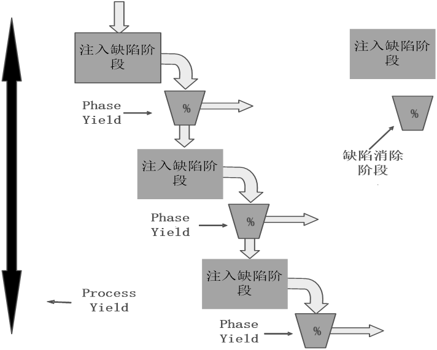

- Yield 示例
  

- 估算交付物缺陷数——过程建模示例
  

### 3.3.2 A/FR（Appraisal to Failure Cost Ratio - 质检成本/失效成本比）

定义：A/FR = PSP质检成本 / PSP失效成本

测试缺陷数/千行代码（Test Defects/KLOC）与 A/FR 的关系：A/FR 越高，测试缺陷越少
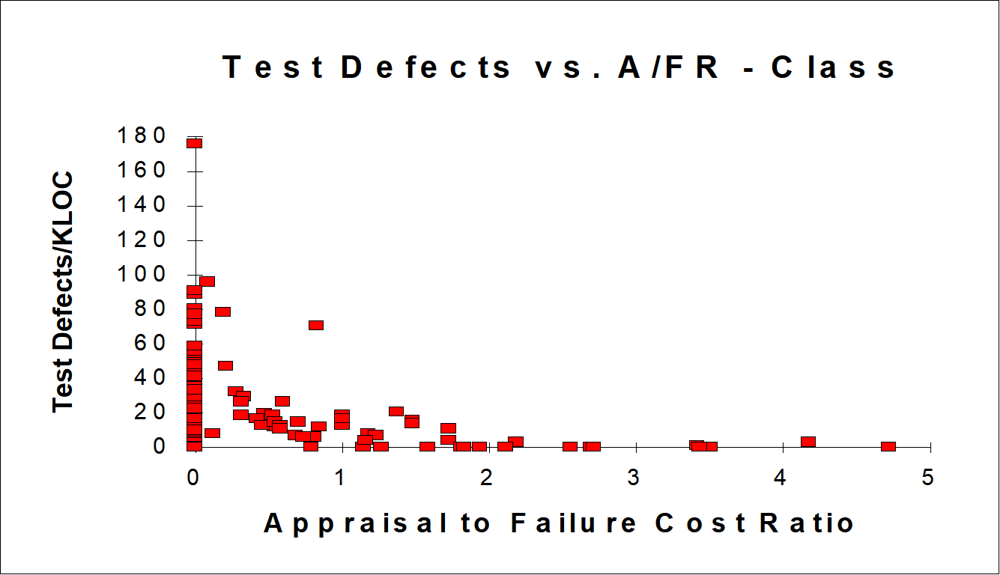

A/FR 控制目标：理论上越大质量越高，但过高可能导致效率下降；PSP 中期望值为2.0

### 3.3.3 PQI（Process Quality Index - 过程质量指数）

5 个数据乘积：

- 设计质量：设计时间 > 编码时间
- 设计评审质量：设计评审时间 > 设计时间的 50%
- 代码评审质量：代码评审时间 > 编码时间的 50%
- 代码质量：编译缺陷密度 < 10 个/千行
- 程序质量：单元测试缺陷密度 < 5 个/千行

PQI 与交付后缺陷密度（Post-Development Defects/KLOC）的关系，PQI 越高，交付后缺陷越少
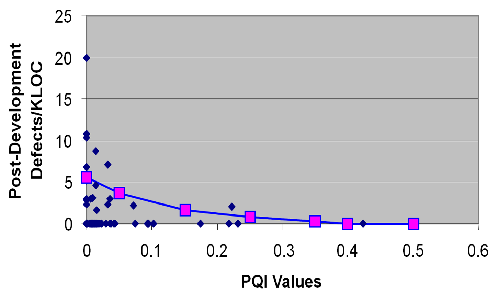

图示：PQI 与集成时缺陷数（Test defects）的关系，展示不同 PQI 值对应的测试缺陷数

### 3.3.4 Review Rate（评审速率）

定义：指导软件工程师开展有效评审的指标

高质量评审需要投入足够时间

PSP 实践标准：代码评审速度 < 200 LOC/小时，文档评审速度 < 4 Page/小时

### 3.3.5 DRL（Defect Removal Leverage - 缺陷消除效率比）

定义：比较不同缺陷消除手段的效率

计算方式：以某个测试阶段（通常为单元测试）每小时发现缺陷数为基础，其他阶段每小时发现缺陷数与该基础的比值

| **阶段** | 缺陷个数/小时 | DRL（UT） |
| -------- | ------------- | --------- |
| 设计评审 | 3.6           | 1.03      |
| 编码评审 | 8             | 2.29      |
| 单元测试 | 3.5           | 1         |

### 3.3.6 特点和用途

- **Yield**：衡量各阶段缺陷消除效率，预测遗留缺陷
- **A/FR**：平衡评审投入和缺陷修复成本，指导评审投入程度
- **PQI**：综合评估开发过程多个方面的质量，预测交付质量
- **Review Rate（评审速度）**：指导评审的有效投入，代码评审速度小于 200 LOC/小时，文档评审速度小于 4 Page/小时
- **DRL**：比较不同缺陷消除活动的相对效率，优化缺陷消除策略。 这些指标共同构成了 PSP 中量化管理质量的基础，帮助工程师理解和改进其个人过程，从而生产更高质量的软件

## 3.4 Quality Journey

Quality Journey（质量路径）：追求极高软件质量所采取的一系列递进的手段和步骤

**步骤**：①各种测试；②进入测试之前的产物质量提升；③评审过程度量和稳定；④个体 review 的度量和稳定；⑤质量意识和主人翁态度；⑥诉诸设计；⑦缺陷预防；⑧用户质量观——其他质量属性

**体现的质量哲学**：

- **预防为主，持续改进**：强调在软件生命周期的早期阶段（如设计、编码前）就关注质量，通过评审等手段预防缺陷，而不是仅仅依赖后期的测试来发现缺陷
- **量化管理，数据驱动**：通过度量评审过程、个体评审效果以及各种质量指标，来稳定和改进过程，提升质量
- **关注个体，赋能团队**：强调提升个体工程师的质量意识和技能，培养主人翁态度
- **设计决定质量**：高质量的设计是构建高质量软件的基础。
- **全面质量观**：从最初的功能正确性，逐步扩展到过程的稳定性、缺陷的预防，最终回归到满足用户全面的质量期望（包括非功能属性）
- **系统性提升**：质量的提升是一个循序渐进、多方面努力的过程，从基础的测试到高级的缺陷预防和设计优化，再到文化层面的建设
