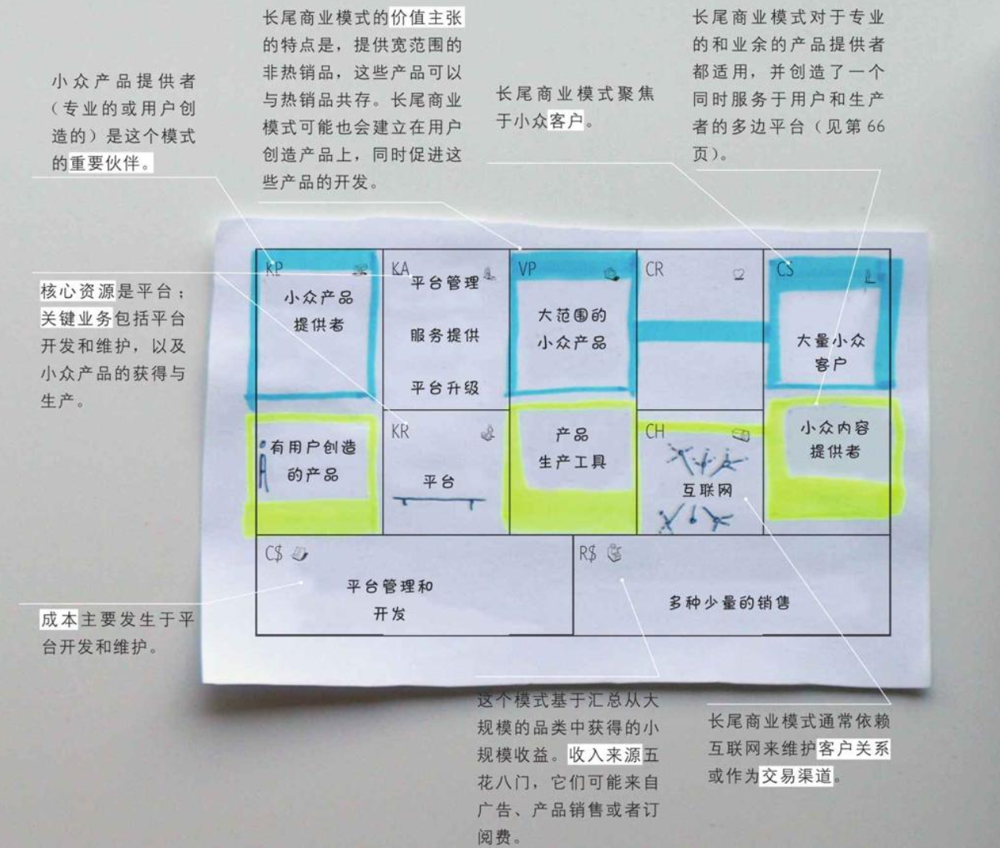
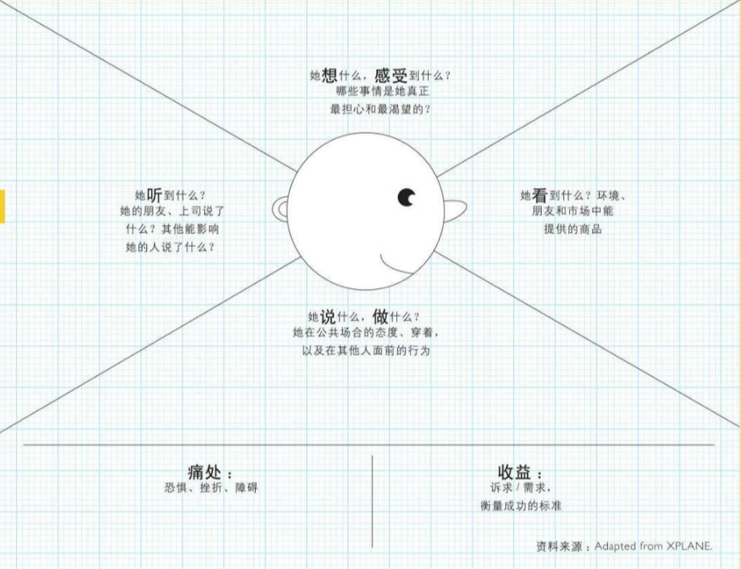

# 2 商业模式类型

## 多边平台商业模式

企业或组织实现价值主张的方式从自己负责（封闭）走向自己主导促进多群体互动（开放，互联成本大幅度降低）

概念：

- 多边平台将两个或更多独立但相互依存的客户群体进行连接
  - 平台对于其中某一客户群体的价值：其它群体的存在
  - 平台通过促进不同群体之间的互动而创造价值
  - 一个多边平台的价值提升在于它所吸引的用户数量的增加

- 单个用户群体的价值本质上取决于平台中另一群体的用户数量
  弄清楚哪一“边”能够更好的吸引其它“边”，从而提供免费服务甚至补贴

谷歌的商业模式：平台推广

- 建立并维护搜索引擎的基础设施
- 将平台推广给新用户、新内容提供商、新广告商

Wii vs. PS/Xbox：平台收益流补贴

总结：

- 价值主张一般体现在如下三方面：吸引用户、群体配对、利用平台交易渠道降低交易成本
- 客户群体相互依存，无法独立
- **核心资源**是平台，成本主要来自于平台的维护和开发
  三项**关键活动**：平台管理、服务实现、平台升级
- 多个收益流，补贴正确的客户群是定价决策的关键

## 免费的商业模式

概念：

- 至少有一个关键的客户群体可以持续免费地享受服务
  - 不付费客户所得到的财务支持来自于另一个客户群体
  - 对价格为0的商品的需求要数倍于定价为1分钱或更高的商品：数字产品与服务的复制传播成本接近于0（海量用户下边界成本也趋向于0）
- 三种可行的免费商业模式
- 共同点：至少一个群体将得到免费的商品
- 广告模式：基于多边平台的免费商品
- 免费增值：免费的基本服务，可选的增值服务
- 诱饵&陷阱：以免费或很便宜的初始价格吸引客户，并引导其重复购买

### 广告

**关键业务**：好的产品和服务以及高流量会吸引广告商，进而补贴产品和服务

- 要考虑广告费能否支撑起产品服务质量
- 吞噬广告费的产品太多，流量红利已见底

成本：平台的开发和维护，以及可能的获客与维系成本

### 免费增值

收入形式：大量用户从免费服务获益，少量用户为增值服务付费

开源：与众不同的免费增值

- 代码免费完整开放（多种许可证）
- 年费换取最新源码使用权、无限制服务支持、产品法律上拥有者联系的保证

保险行业模式：倒转的免费增值

- 大部分客户定期支付小额保费以补贴一小部分产生实际索赔的客户

总结：

- **核心资源**：平台是最重要的资产，产生三部分成本：可观的固定成本、免费账户的低边际成本服务、增值账户成本

- **关键业务**：客户关系自动且低成本，免费用户向增值用户转化率是重要指标
- 收入来源三个重要公式
  - 收入 = 用户数量\*增值用户比重\*增值服务价格\*增长率\*顾客流失率
  - 服务成本 = 免费用户数\*免费服务成本+增值用户数\*增值服务成本
  - 运营利润 = 收入 - 服务成本 - 固定成本 - 获客成本
- 平台发展新趋势：高水平、差异化的产品与服务（为免费增值提供空间）

### 诱饵&陷阱

核心业务：产品与后续产品之间要有紧密连接，从而使得极小收益的初始购买为后续高收益产品或服务的重复购买创造可能

关注后续产品交付，需要强大品牌（专利护城河 + 资源）支撑

重要成本结构：初始产品补贴与后续产品的成本

## 长尾商业模式

长尾商业模式价值主张的特点：提供宽范围非热销品，与热销品共存；也可能基于用户创造，并由平台支持

需要同时找到小众客户和小众产品提供者

依赖于多边平台（互联网）去连接小众客户和产品

收入来源五花八门 - 广告、产品销售、订阅费

## 客户洞察

客户视角是商业模式的指导性原则，客户的观点决定了产品画布的下游

- 透彻的观察，发现情感的源泉，发现内在的内容、意义与本质
- 事实上，企业在市场上重金投入的产品、服务和商业模式往往会忽略客户的观点
- 成功的创新需要深入理解客户的环境、日常工作、担忧和渴望

客户洞察的难点

- 透彻理解客户（ “问题背后的问题” ）；需要人类学、社会学理论（笼统的人），以及与实地调研（具体的人）结合；
- 清楚了解企业当前关注哪些客户（的需要），忽略哪些客户（的需要）- 需要有所取舍

辅助工具：移情图（Empathy Map）

- 构建用户画像的易用工具（“素描”），可导出价值主张、渠道、客户关系、收入来源（画布价值端）
- 使用方式：罗列所有客户群体，挑选三个最有希望的，选择一个作为分析对象
  - 分析前准备：为客户群体命名，标记含收入、婚姻状况等在内的人口统计学特征

### 移情图

- 看：描述该客户在她所处的环境中所看到的东西
- 听：描述环境如何影响到这个客户
- 想&感受：尝试勾勒你的客户思维的过程
- 说&做：想象客户可能的言辞，或公共场合的行为
- 痛点：已遭受的挫折、正遇到的阻碍、怕承担的风险
- 收益：预期成就、成功衡量标准、实现目标所采用的策略

### 变需要为需求（人为核心）

洞察力是设计思维的关键来源之一

从设计到设计思维的演化，本质上是由创造产品演化到分析人与产品的关系，进而演化到人与人的关系

设计思维的任务：观察结果转为洞察，洞察再转为改善人们生活的产品和服务

- 观察：关注人们没有去做和说的，重视边缘地带的表现
- 观察向洞察的转化需要：专业领域知识（笼统的人），深入到具体场景中去观察人的具体行为（具体的人）

### 客户洞察的核心：换位思考

换位思考：一种心理习惯，促使我们体会到每个人的感受，而不是将他们当做小白鼠或实验偏差

- 第一层：功能 - 与观察的用户互换身份
- 第二层：认知 – 体会用户的感受与“潜在需求”
- 第三层：情感 – 寻找能触动和推动目标人群的想法
- 拓展针对个人的换位思考（到群体）

帮助人们发掘未能意识到的潜在需求，是设计思考者面临的挑战

- 将用户引入设计
- 在解决用户痛点之外，进一步引导用户实现（额外的）自我价值

## 分拆商业模式

企业内部的三类规则：经济、竞争与文化。

- 由此可以区分三种活动：客户关系管理、新产品开发、基础设施管理。
- 活动对应三种价值信条：亲近顾客、产品领先、运营卓越

三类活动驱动因素不同，彼此之间冲突，企业内部消长（难共赢）

解决方案：分拆！各自独立

## 开放式的商业模式

企业的研发流程对外敞开

- “由外到内”：将外部的理念、技术或知识产权引入内部
- “由内到外”：将内部的知识产权或技术，特别是闲置资产向外出售

适用于拥有强势品牌、强大分销渠道与良好客户关系的大公司：进一步挖掘客户关系的价值
外部组织能提供有价值的见解、知识、专利、甚至现成的产品
要能有效获取外部特定资源，要有对外协作的专门业务
外来意味着成本，但可以缩短上市时间，提升内部开发效率
帮助企业实现跨越式发展

以研发为核心的组织往往产生许多内部无法实用化的知识、技术、和智力资产
将闲置资产变现，增加收入
因战略或运营原因对内无价值的研发成果可能对其它行业意义重大
帮助企业聚焦核心战略，鼓励内部创新
